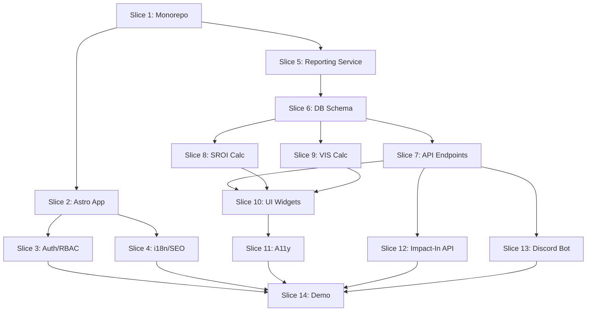
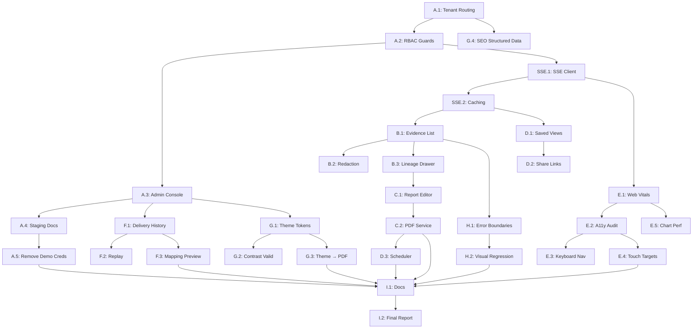

# Multi-Agent Execution Plan - Worker 3

**Mission**: Ship the first working Corporate Cockpit with authenticated partner view, core widgets, SROI/VIS calculators, Impact-In API, and Discord feedback hooks.

**Branch**: `worker3/cockpit-metrics-impactin`

**Timeline**: 14 deliverable slices

---

## Slice 1: Monorepo Foundation
**Owner**: QA Lead (Agent 5.3)
**Dependencies**: None
**Deliverables**:
- [ ] Create `apps/`, `services/`, `packages/`, `docs/`, `reports/` directories
- [ ] Initialize `package.json` with workspace config (pnpm)
- [ ] Create `.gitignore`, `.env.example`
- [ ] Set up ESLint, Prettier, TypeScript configs
- [ ] Add base `tsconfig.json`

**Files Created**:
```
/package.json
/pnpm-workspace.yaml
/.gitignore
/.env.example
/tsconfig.json
/.eslintrc.json
/.prettierrc
```

---

## Slice 2: Astro 5 Corporate Cockpit App
**Owner**: Frontend Lead (Agent 1.1)
**Dependencies**: Slice 1
**Deliverables**:
- [ ] Initialize `apps/corp-cockpit-astro` with Astro 5
- [ ] Add React integration for islands
- [ ] Set up routing structure
- [ ] Create base layout with navigation
- [ ] Add error boundaries (404, 500)
- [ ] Configure SSR/SSG strategy

**Files Created**:
```
/apps/corp-cockpit-astro/package.json
/apps/corp-cockpit-astro/astro.config.mjs
/apps/corp-cockpit-astro/tsconfig.json
/apps/corp-cockpit-astro/src/layouts/BaseLayout.astro
/apps/corp-cockpit-astro/src/pages/index.astro
/apps/corp-cockpit-astro/src/pages/404.astro
/apps/corp-cockpit-astro/src/components/Navigation.astro
```

---

## Slice 3: Authentication & RBAC
**Owner**: Frontend Lead (Agent 1.6)
**Dependencies**: Slice 2
**Deliverables**:
- [ ] Create auth context/provider
- [ ] Add login page (company admin)
- [ ] Implement session management (JWT/cookie)
- [ ] Add role-based access control (RBAC)
- [ ] Protected route wrapper
- [ ] Logout functionality

**Files Created**:
```
/apps/corp-cockpit-astro/src/middleware/auth.ts
/apps/corp-cockpit-astro/src/context/AuthContext.tsx
/apps/corp-cockpit-astro/src/pages/login.astro
/apps/corp-cockpit-astro/src/components/ProtectedRoute.tsx
/apps/corp-cockpit-astro/src/utils/rbac.ts
```

---

## Slice 4: i18n & SEO Scaffolding
**Owner**: Frontend Lead (Agent 1.5)
**Dependencies**: Slice 2
**Deliverables**:
- [ ] Set up i18n library (astro-i18next or similar)
- [ ] Create translation files (en.json, uk.json, no.json)
- [ ] Add language switcher component
- [ ] Implement hreflang SEO component
- [ ] Add locale-aware routing
- [ ] Create `<Head>` SEO wrapper

**Files Created**:
```
/apps/corp-cockpit-astro/src/i18n/en.json
/apps/corp-cockpit-astro/src/i18n/uk.json
/apps/corp-cockpit-astro/src/i18n/no.json
/apps/corp-cockpit-astro/src/components/LanguageSwitcher.tsx
/apps/corp-cockpit-astro/src/components/SEOHead.astro
/apps/corp-cockpit-astro/src/utils/i18n.ts
```

---

## Slice 5: Reporting Service Foundation
**Owner**: Backend Lead (Agent 2.1)
**Dependencies**: Slice 1
**Deliverables**:
- [ ] Initialize `services/reporting` with Fastify
- [ ] Set up TypeScript, build, dev scripts
- [ ] Create database connection utilities (PostgreSQL)
- [ ] Add CORS, helmet, rate limiting middleware
- [ ] Health check endpoint (`/health`)
- [ ] OpenAPI/Swagger docs setup

**Files Created**:
```
/services/reporting/package.json
/services/reporting/tsconfig.json
/services/reporting/src/index.ts
/services/reporting/src/config.ts
/services/reporting/src/db/connection.ts
/services/reporting/src/middleware/rateLimiter.ts
/services/reporting/src/routes/health.ts
/services/reporting/src/swagger.ts
```

---

## Slice 6: Database Schema & Models
**Owner**: Backend Lead (Agent 2.2)
**Dependencies**: Slice 5
**Deliverables**:
- [ ] Create schema files (companies, volunteers, sessions, outcomes)
- [ ] Add migration scripts (Kysely or Drizzle)
- [ ] Create TypeScript types/interfaces
- [ ] Seed script with sample data
- [ ] Document entity relationships

**Files Created**:
```
/services/reporting/src/db/schema/companies.sql
/services/reporting/src/db/schema/volunteers.sql
/services/reporting/src/db/schema/sessions.sql
/services/reporting/src/db/schema/outcomes.sql
/services/reporting/src/db/migrations/001_initial.ts
/services/reporting/src/db/types.ts
/services/reporting/src/db/seed.ts
/docs/Database_Schema.md
```

---

## Slice 7: Reporting API Endpoints
**Owner**: Backend Lead (Agent 2.1)
**Dependencies**: Slice 6
**Deliverables**:
- [ ] `GET /companies/:id/at-a-glance?period=YYYY-QN`
- [ ] `GET /companies/:id/outcomes?dimensions=integration,language,job_readiness`
- [ ] `GET /companies/:id/q2q-feed?limit=50`
- [ ] `GET /companies/:id/sroi` (returns ratio + breakdown)
- [ ] `GET /companies/:id/vis` (returns aggregate VIS + top volunteers)
- [ ] `GET /export/csrd` (CSV/JSON export)
- [ ] Add request validation (Zod)

**Files Created**:
```
/services/reporting/src/routes/companies.ts
/services/reporting/src/controllers/atAGlance.ts
/services/reporting/src/controllers/outcomes.ts
/services/reporting/src/controllers/q2qFeed.ts
/services/reporting/src/controllers/sroi.ts
/services/reporting/src/controllers/vis.ts
/services/reporting/src/controllers/export.ts
/services/reporting/src/validators/company.ts
```

---

## Slice 8: SROI Calculator
**Owner**: Backend Lead (Agent 2.3)
**Dependencies**: Slice 6
**Deliverables**:
- [ ] Implement SROI formula (deterministic)
- [ ] Create configurable weights system
- [ ] Unit tests for all calculation paths
- [ ] Document assumptions and methodology
- [ ] Add breakdown response (inputs, outcomes, ratio)

**Files Created**:
```
/services/reporting/src/calculators/sroi.ts
/services/reporting/src/calculators/sroi.test.ts
/services/reporting/src/config/sroiWeights.ts
/docs/SROI_Calculation.md
```

**Formula Documentation**:
```markdown
# SROI Calculation

## Formula
SROI = (Total Social Value Created) / (Total Investment)

## Components
1. **Total Investment**: Sum of volunteer hours × hourly rate + program costs
2. **Social Value Created**: Weighted sum of outcomes
   - Integration improvement × weight × monetary value
   - Language advancement × weight × monetary value
   - Job readiness increase × weight × monetary value

## Conservative Defaults
- Volunteer hour value: $29.95 (Independent Sector 2023)
- Integration point value: $150
- Language level advancement: $500
- Job readiness point: $300

## Change Control
All weight adjustments require documentation and version tracking.
```

---

## Slice 9: VIS Calculator
**Owner**: Backend Lead (Agent 2.4)
**Dependencies**: Slice 6
**Deliverables**:
- [ ] Implement VIS formula (deterministic)
- [ ] Create scoring algorithm (hours, consistency, impact)
- [ ] Unit tests for edge cases
- [ ] Document model and assumptions
- [ ] Add top volunteer ranking

**Files Created**:
```
/services/reporting/src/calculators/vis.ts
/services/reporting/src/calculators/vis.test.ts
/services/reporting/src/config/visWeights.ts
/docs/VIS_Model.md
```

**Formula Documentation**:
```markdown
# VIS Model (Volunteer Impact Score)

## Formula
VIS = (Hours × 0.3) + (Consistency × 0.3) + (Outcome Impact × 0.4)

## Components
1. **Hours**: Total volunteer hours (normalized 0-100)
2. **Consistency**: Session frequency score (0-100)
3. **Outcome Impact**: Weighted avg of mentee improvements (0-100)

## Scoring Bands
- 0-25: Emerging
- 26-50: Contributing
- 51-75: High Impact
- 76-100: Exceptional

## Use Cases
- Recognition programs
- Volunteer leaderboards
- Impact attribution
```

---

## Slice 10: Dashboard UI Widgets
**Owner**: Frontend Lead (Agent 1.2, 1.3)
**Dependencies**: Slice 7, 8, 9
**Deliverables**:
- [ ] At-a-glance card component (inputs vs outcomes)
- [ ] Trend chart components (Chart.js or Recharts)
- [ ] Q2Q insight feed with lineage links
- [ ] SROI panel with tooltip and docs link
- [ ] VIS panel with top volunteers
- [ ] Export buttons (CSV/JSON/PDF stub)
- [ ] Responsive layouts (mobile, tablet, desktop)

**Files Created**:
```
/apps/corp-cockpit-astro/src/components/widgets/AtAGlance.tsx
/apps/corp-cockpit-astro/src/components/widgets/TrendChart.tsx
/apps/corp-cockpit-astro/src/components/widgets/Q2QFeed.tsx
/apps/corp-cockpit-astro/src/components/widgets/SROIPanel.tsx
/apps/corp-cockpit-astro/src/components/widgets/VISPanel.tsx
/apps/corp-cockpit-astro/src/components/widgets/ExportButtons.tsx
/apps/corp-cockpit-astro/src/styles/dashboard.css
```

---

## Slice 11: A11y & Responsiveness
**Owner**: Frontend Lead (Agent 1.4)
**Dependencies**: Slice 10
**Deliverables**:
- [ ] Audit all widgets for WCAG 2.2 AA
- [ ] Add ARIA labels, roles, live regions
- [ ] Ensure keyboard navigation (focus management)
- [ ] Check color contrast (4.5:1 minimum)
- [ ] Verify touch target sizes (44×44px minimum)
- [ ] Test screen reader compatibility
- [ ] Add skip links and landmarks

**Files Created**:
```
/apps/corp-cockpit-astro/src/components/a11y/SkipLinks.tsx
/apps/corp-cockpit-astro/src/utils/a11y.ts
/docs/Accessibility_Audit.md
```

---

## Slice 12: Impact-In API Service
**Owner**: Integration Lead (Agent 3.1-3.4)
**Dependencies**: Slice 7
**Deliverables**:
- [ ] Initialize `services/reporting/impact-in`
- [ ] Create outbound push endpoint
- [ ] Add API key management (per company)
- [ ] Benevity mapper + payload example (stub)
- [ ] Goodera mapper + payload example (stub)
- [ ] Workday mapper + payload example (stub)
- [ ] Rate limiting per company
- [ ] Document integration flows

**Files Created**:
```
/services/reporting/src/impact-in/index.ts
/services/reporting/src/impact-in/apiKeys.ts
/services/reporting/src/impact-in/mappers/benevity.ts
/services/reporting/src/impact-in/mappers/goodera.ts
/services/reporting/src/impact-in/mappers/workday.ts
/services/reporting/src/impact-in/examples/benevity-payload.json
/services/reporting/src/impact-in/examples/goodera-payload.json
/services/reporting/src/impact-in/examples/workday-payload.json
/docs/Impact_In_API.md
```

---

## Slice 13: Discord Bot & Feedback Hooks
**Owner**: Integration Lead (Agent 3.5, 3.6)
**Dependencies**: Slice 7
**Deliverables**:
- [ ] Initialize `services/discord-bot`
- [ ] Set up Discord.js client
- [ ] Implement `/feedback` slash command (DM micro-survey)
- [ ] POST feedback to Q2Q endpoint
- [ ] Role assignment endpoint (private recognition)
- [ ] Webhook for milestone announcements (toggle per company)
- [ ] Document bot setup and commands

**Files Created**:
```
/services/discord-bot/package.json
/services/discord-bot/src/index.ts
/services/discord-bot/src/commands/feedback.ts
/services/discord-bot/src/commands/recognize.ts
/services/discord-bot/src/webhooks/milestones.ts
/services/discord-bot/src/utils/q2qClient.ts
/services/discord-bot/.env.example
/docs/Discord_Integration.md
```

---

## Slice 14: Sample Data, Demo & Documentation
**Owner**: QA Lead (Agent 5.5, 5.4)
**Dependencies**: All previous slices
**Deliverables**:
- [ ] Seed sample company ("ACME Corp")
- [ ] Create 20+ volunteers with realistic data
- [ ] Generate sessions and outcome scores
- [ ] Build demo page `/demo/acme`
- [ ] Write dashboard design playbook
- [ ] Create `reports/worker3_cockpit.md`
- [ ] Take screenshots of all widgets
- [ ] Document build/run instructions

**Files Created**:
```
/services/reporting/src/db/seed-demo.ts
/apps/corp-cockpit-astro/src/pages/demo/acme.astro
/docs/Dashboard_Design.md
/reports/worker3_cockpit.md
/docs/screenshots/at-a-glance.png
/docs/screenshots/sroi-panel.png
/docs/screenshots/vis-panel.png
/docs/screenshots/q2q-feed.png
```

---

## Execution Order



---

## Success Metrics

| Metric | Target | Status |
|--------|--------|--------|
| Endpoints functional | 6/6 | ⬜ |
| SROI tests passing | 100% | ⬜ |
| VIS tests passing | 100% | ⬜ |
| UI widgets complete | 6/6 | ⬜ |
| A11y audit passing | WCAG 2.2 AA | ⬜ |
| i18n languages | 3/3 (en/uk/no) | ⬜ |
| Discord bot functional | `/feedback` working | ⬜ |
| Demo data seeded | ACME Corp + 20 volunteers | ⬜ |
| Build passes | `pnpm -w dev` | ⬜ |
| Documentation complete | 8 docs | ⬜ |

---

## Risk Register

| Risk | Mitigation | Owner |
|------|------------|-------|
| SROI formula unclear | Start with conservative model, document assumptions | Backend Lead |
| Discord rate limits | Implement queue + backoff | Integration Lead |
| A11y complexity | Audit early, fix incrementally | Frontend Lead |
| Data model changes | Use migrations, version schema | Backend Lead |
| Integration auth unclear | Stub first, document requirements | Integration Lead |

---

## Next Steps

1. ✅ Create branch `worker3/cockpit-metrics-impactin`
2. ⬜ Execute Slice 1-5 (foundation)
3. ⬜ Execute Slice 6-9 (backend core)
4. ⬜ Execute Slice 10-11 (frontend)
5. ⬜ Execute Slice 12-13 (integrations)
6. ⬜ Execute Slice 14 (demo + docs)
7. ⬜ Create PR with report

---

**Last Updated**: 2025-11-13
**Status**: Phase B Complete - Phase C In Progress

---

# PHASE C: PILOT-READY ENTERPRISE COCKPIT

**Branch**: `claude/corp-cockpit-orchestration-011CV5r3NpNKmcL6WnSQbDVZ`
**Timeline**: 7 deliverables (A-G) with 30 specialist agents
**Execution Order**: A → SSE → B → C → D → E → F → G

---

## DELIVERABLE A: PILOT & TENANTIZATION

### A.1: Tenant Routing Architecture
**Owner**: route-architect (Agent S1)
**Lead**: frontend-lead (Agent L1)
**Dependencies**: Phase B Slice 2 (Astro app)
**Status**: 🔴 Not Started

**Tasks**:
- [ ] Implement tenant-scoped routing `/[lang]/cockpit/:companyId/*`
- [ ] Add route parameter validation for `companyId`
- [ ] Create tenant routing middleware
- [ ] Build 404 tenant-aware error page
- [ ] Build 401 tenant-aware access denied page
- [ ] Add route guards with company ID validation

**Files to Create/Edit**:
```
/apps/corp-cockpit-astro/src/middleware/tenantRouting.ts
/apps/corp-cockpit-astro/src/pages/[lang]/cockpit/[companyId]/index.astro
/apps/corp-cockpit-astro/src/pages/[lang]/cockpit/404.astro
/apps/corp-cockpit-astro/src/pages/[lang]/cockpit/401.astro
/apps/corp-cockpit-astro/src/utils/validateCompanyId.ts
```

**Acceptance**:
- ✅ Routes only accessible with valid `companyId`
- ✅ Invalid company IDs show 404
- ✅ Unauthorized access shows 401 with clear messaging

---

### A.2: RBAC Per-Route & Widget Enforcement
**Owner**: auth-guard-specialist (Agent S2)
**Lead**: frontend-lead (Agent L1)
**Dependencies**: A.1, Phase B Slice 3 (Auth)
**Status**: 🔴 Not Started

**Tasks**:
- [ ] Implement per-route RBAC enforcement
- [ ] Add widget-level permission checks
- [ ] Create session validation per company
- [ ] Build permission denial UI components
- [ ] Add role hierarchy (admin > manager > viewer)

**Files to Create/Edit**:
```
/apps/corp-cockpit-astro/src/middleware/rbacGuard.ts
/apps/corp-cockpit-astro/src/utils/widgetPermissions.ts
/apps/corp-cockpit-astro/src/components/PermissionGate.tsx
/apps/corp-cockpit-astro/src/types/roles.ts
```

**Acceptance**:
- ✅ Viewers cannot access admin routes
- ✅ Widgets hidden if user lacks permission
- ✅ Session scoped to company (no cross-tenant access)

---

### A.3: Admin Console UI
**Owner**: route-architect (Agent S1), auth-guard-specialist (Agent S2)
**Lead**: frontend-lead (Agent L1)
**Dependencies**: A.2
**Status**: 🔴 Not Started

**Tasks**:
- [ ] Create admin console page `/[lang]/cockpit/:companyId/admin`
- [ ] Build API key management UI (create, revoke, list)
- [ ] Add Impact-In toggle controls per platform (Benevity/Goodera/Workday)
- [ ] Implement SROI weight override panel
- [ ] Implement VIS weight override panel
- [ ] Add audit log viewer for admin actions

**Files to Create/Edit**:
```
/apps/corp-cockpit-astro/src/pages/[lang]/cockpit/[companyId]/admin/index.astro
/apps/corp-cockpit-astro/src/components/admin/APIKeyManager.tsx
/apps/corp-cockpit-astro/src/components/admin/ImpactInToggles.tsx
/apps/corp-cockpit-astro/src/components/admin/WeightOverrides.tsx
/apps/corp-cockpit-astro/src/components/admin/AuditLog.tsx
```

**Acceptance**:
- ✅ Only admins can access `/admin`
- ✅ API keys visible with masked tokens
- ✅ Weight overrides persist and affect calculations
- ✅ Audit log shows all config changes with timestamps

---

### A.4: Staging Deployment Playbook
**Owner**: docs-scribe (Agent S25)
**Lead**: N/A (Direct to Tech Lead)
**Dependencies**: A.1, A.2, A.3
**Status**: 🔴 Not Started

**Tasks**:
- [ ] Create staging deployment documentation
- [ ] Document environment variable requirements
- [ ] Add database migration runbook
- [ ] Create rollback procedures
- [ ] Add health check verification steps
- [ ] Document smoke test checklist

**Files to Create**:
```
/docs/pilot/staging_rollout.md
/docs/pilot/environment_vars.md
/docs/pilot/migration_runbook.md
/docs/pilot/smoke_tests.md
```

**Acceptance**:
- ✅ Complete step-by-step deployment guide
- ✅ All environment variables documented
- ✅ Rollback procedure tested

---

### A.5: Remove Demo Credentials
**Owner**: auth-guard-specialist (Agent S2)
**Lead**: frontend-lead (Agent L1)
**Dependencies**: A.4
**Status**: 🔴 Not Started

**Tasks**:
- [ ] Audit codebase for hardcoded credentials
- [ ] Remove demo seeds from staging/prod migrations
- [ ] Add environment check to prevent demo data loading
- [ ] Update auth flows to require real credentials
- [ ] Add pre-commit hook to prevent credential commits

**Files to Edit**:
```
/services/reporting/src/db/seed.ts
/services/reporting/src/db/seed-demo.ts
/apps/corp-cockpit-astro/src/middleware/auth.ts
/.husky/pre-commit
```

**Acceptance**:
- ✅ No demo credentials in staging/prod
- ✅ Seed scripts only run in dev environment
- ✅ Pre-commit hooks prevent credential commits

---

## DELIVERABLE SSE: REAL-TIME INFRASTRUCTURE

### SSE.1: SSE Client with Backoff & Resume
**Owner**: sse-client-specialist (Agent S4)
**Lead**: reporting-ui-lead (Agent L2)
**Dependencies**: Phase B Slice 7 (API endpoints)
**Status**: 🔴 Not Started

**Tasks**:
- [ ] Create EventSource wrapper with exponential backoff
- [ ] Implement last-event-id resume logic
- [ ] Add company-scoped channel subscription
- [ ] Build fallback to polling on SSE failure
- [ ] Add connection status indicator UI
- [ ] Implement reconnection logic with max retries

**Files to Create**:
```
/apps/corp-cockpit-astro/src/utils/sseClient.ts
/apps/corp-cockpit-astro/src/hooks/useSSEConnection.ts
/apps/corp-cockpit-astro/src/components/ConnectionStatus.tsx
/services/reporting/src/sse/sseEndpoint.ts
```

**Acceptance**:
- ✅ Reconnects with exponential backoff (2s, 4s, 8s, 16s, 32s)
- ✅ Resumes from last-event-id on reconnect
- ✅ Falls back to polling after 5 failed attempts
- ✅ UI shows connection status (connected/reconnecting/offline)

---

### SSE.2: Dashboard Caching Layer
**Owner**: dashboard-caching (Agent S5)
**Lead**: reporting-ui-lead (Agent L2)
**Dependencies**: SSE.1
**Status**: 🔴 Not Started

**Tasks**:
- [ ] Implement ETag-based conditional requests
- [ ] Add React.memo for expensive widget components
- [ ] Create response caching layer (in-memory)
- [ ] Build cache invalidation on SSE updates
- [ ] Add cache hit/miss metrics

**Files to Create/Edit**:
```
/apps/corp-cockpit-astro/src/utils/httpCache.ts
/apps/corp-cockpit-astro/src/components/widgets/AtAGlance.tsx (wrap with memo)
/apps/corp-cockpit-astro/src/components/widgets/TrendChart.tsx (wrap with memo)
/services/reporting/src/middleware/etag.ts
```

**Acceptance**:
- ✅ ETag headers on all GET endpoints
- ✅ If-None-Match returns 304 when unchanged
- ✅ Widgets re-render only on data change
- ✅ Cache cleared on SSE update events

---

## DELIVERABLE B: EVIDENCE EXPLORER

### B.1: Evidence List UI with Filters
**Owner**: evidence-explorer-ui (Agent S6)
**Lead**: gen-reports-lead (Agent L3)
**Dependencies**: SSE.2
**Status**: 🔴 Not Started

**Tasks**:
- [ ] Create evidence explorer page `/[lang]/cockpit/:companyId/evidence`
- [ ] Build filter panel (program, period, label, cohort)
- [ ] Implement pagination (50 items per page)
- [ ] Add sorting (date, relevance, program)
- [ ] Create anonymized snippet preview cards
- [ ] Add "Load more" infinite scroll

**Files to Create**:
```
/apps/corp-cockpit-astro/src/pages/[lang]/cockpit/[companyId]/evidence/index.astro
/apps/corp-cockpit-astro/src/components/evidence/FilterPanel.tsx
/apps/corp-cockpit-astro/src/components/evidence/EvidenceCard.tsx
/apps/corp-cockpit-astro/src/components/evidence/EvidenceList.tsx
/services/reporting/src/routes/evidence.ts
```

**Acceptance**:
- ✅ Filters update URL query params
- ✅ Pagination loads 50 items at a time
- ✅ Snippets redacted (no PII visible)
- ✅ Keyboard navigable filter controls

---

### B.2: Evidence Redaction & Safe Rendering
**Owner**: evidence-redaction-ui (Agent S7)
**Lead**: gen-reports-lead (Agent L3)
**Dependencies**: B.1
**Status**: 🔴 Not Started

**Tasks**:
- [ ] Implement XSS-safe evidence rendering
- [ ] Add copy/paste guards for PII fields
- [ ] Create redaction markers in UI (`[REDACTED]`)
- [ ] Build sanitization pipeline for evidence text
- [ ] Add warning banners on sensitive evidence

**Files to Create**:
```
/apps/corp-cockpit-astro/src/utils/sanitizeEvidence.ts
/apps/corp-cockpit-astro/src/components/evidence/RedactedText.tsx
/apps/corp-cockpit-astro/src/hooks/useCopyGuard.ts
```

**Acceptance**:
- ✅ HTML tags escaped in evidence previews
- ✅ Copy/paste disabled on redacted fields
- ✅ `[REDACTED]` markers for PII
- ✅ XSS prevention tested with malicious payloads

---

### B.3: Lineage Drawer ("Why this metric?")
**Owner**: lineage-drawer-dev (Agent S8)
**Lead**: gen-reports-lead (Agent L3)
**Dependencies**: B.1
**Status**: 🔴 Not Started

**Tasks**:
- [ ] Add "Why this metric?" button to all widgets
- [ ] Create lineage drawer component (slide-out)
- [ ] Display aggregation → evidence chain with provenance IDs
- [ ] Link to Evidence Explorer with pre-filled filters
- [ ] Show calculation formula and weights used
- [ ] Add "Trace to Source" breadcrumb trail

**Files to Create**:
```
/apps/corp-cockpit-astro/src/components/lineage/LineageDrawer.tsx
/apps/corp-cockpit-astro/src/components/lineage/LineageChain.tsx
/apps/corp-cockpit-astro/src/components/widgets/SROIPanel.tsx (add button)
/apps/corp-cockpit-astro/src/components/widgets/VISPanel.tsx (add button)
/services/reporting/src/routes/lineage.ts
```

**Acceptance**:
- ✅ Lineage drawer opens on button click
- ✅ Shows full provenance chain (metric → aggregation → evidence IDs)
- ✅ Links navigate to Evidence Explorer with filters
- ✅ Calculation formula visible with current weights

---

## DELIVERABLE C: GENERATIVE REPORTING

### C.1: Report Generation Modal & Editor
**Owner**: report-editor-ui (Agent S9)
**Lead**: gen-reports-lead (Agent L3)
**Dependencies**: B.3
**Status**: 🔴 Not Started

**Tasks**:
- [ ] Create "Generate Report" button on dashboard
- [ ] Build report generation modal with period selector
- [ ] Implement in-place editing of generated narratives
- [ ] Add citation preservation during edits
- [ ] Create draft save/load functionality
- [ ] Add "Submit for Final Render" button

**Files to Create**:
```
/apps/corp-cockpit-astro/src/components/reports/GenerateReportModal.tsx
/apps/corp-cockpit-astro/src/components/reports/ReportEditor.tsx
/apps/corp-cockpit-astro/src/components/reports/CitationMarker.tsx
/apps/corp-cockpit-astro/src/pages/[lang]/cockpit/[companyId]/reports/new.astro
```

**Acceptance**:
- ✅ Modal opens with period selector (Q1-Q4, YTD, Custom)
- ✅ Generated narrative editable inline
- ✅ Citations preserved as `[1]`, `[2]` markers
- ✅ Draft auto-saved every 30 seconds

---

### C.2: PDF Rendering Service
**Owner**: pdf-rendering-engineer (Agent S10)
**Lead**: gen-reports-lead (Agent L3)
**Dependencies**: C.1
**Status**: 🔴 Not Started

**Tasks**:
- [ ] Set up Playwright/Puppeteer in Reporting service
- [ ] Create PDF template with themed branding (logo, colors, fonts)
- [ ] Implement citation rendering in PDF footnotes
- [ ] Add page numbers, headers, footers
- [ ] Generate cover page with company logo and period
- [ ] Create PDF download endpoint `GET /reports/:reportId/pdf`

**Files to Create**:
```
/services/reporting/src/pdf/renderer.ts
/services/reporting/src/pdf/templates/report.html
/services/reporting/src/pdf/templates/styles.css
/services/reporting/src/routes/reports.ts
```

**Acceptance**:
- ✅ PDF generated server-side with Playwright
- ✅ Citations appear as footnotes with evidence IDs
- ✅ Company logo and colors applied
- ✅ Page numbers on all pages except cover

---

## DELIVERABLE D: SAVED VIEWS, SHARING, SCHEDULING

### D.1: Saved Views Persistence
**Owner**: saved-views-ui (Agent S12)
**Lead**: integrations-lead (Agent L5)
**Dependencies**: SSE.2
**Status**: 🔴 Not Started

**Tasks**:
- [ ] Create "Save View" button on dashboard
- [ ] Build view manager modal (list/edit/delete saved views)
- [ ] Persist filter state (period, program, cohort)
- [ ] Add per-tenant/user view permissions
- [ ] Implement default view selection

**Files to Create**:
```
/apps/corp-cockpit-astro/src/components/views/SaveViewButton.tsx
/apps/corp-cockpit-astro/src/components/views/ViewManager.tsx
/apps/corp-cockpit-astro/src/pages/[lang]/cockpit/[companyId]/views.astro
/services/reporting/src/routes/views.ts
/services/reporting/src/db/schema/saved_views.sql
```

**Acceptance**:
- ✅ Views saved with name, description, filters
- ✅ User can set default view
- ✅ Views shared within tenant only

---

### D.2: Share Links with TTL & Revocation
**Owner**: share-links-ui (Agent S13)
**Lead**: integrations-lead (Agent L5)
**Dependencies**: D.1
**Status**: 🔴 Not Started

**Tasks**:
- [ ] Create "Share" button on dashboard
- [ ] Generate signed share link (JWT-based, read-only)
- [ ] Add TTL configuration (1 day, 7 days, 30 days, custom)
- [ ] Build link revocation UI
- [ ] Create public share page (no auth required)
- [ ] Add share link analytics (views, last accessed)

**Files to Create**:
```
/apps/corp-cockpit-astro/src/components/sharing/ShareButton.tsx
/apps/corp-cockpit-astro/src/components/sharing/ShareModal.tsx
/apps/corp-cockpit-astro/src/pages/share/[shareToken].astro
/services/reporting/src/routes/sharing.ts
/services/reporting/src/utils/shareTokens.ts
```

**Acceptance**:
- ✅ Share links work without authentication
- ✅ Links expire after TTL
- ✅ Revoked links show "Access Revoked" message
- ✅ Analytics track view count

---

### D.3: Report Scheduler UI
**Owner**: scheduler-ui (Agent S11)
**Lead**: integrations-lead (Agent L5)
**Dependencies**: C.2
**Status**: 🔴 Not Started

**Tasks**:
- [ ] Create schedule panel on reports page
- [ ] Add recurring schedule options (monthly, quarterly)
- [ ] Build email preview rendering
- [ ] Implement delivery log view with status/retry
- [ ] Add recipient management (add/remove emails)
- [ ] Create schedule enable/disable toggle

**Files to Create**:
```
/apps/corp-cockpit-astro/src/components/scheduler/SchedulePanel.tsx
/apps/corp-cockpit-astro/src/components/scheduler/DeliveryLog.tsx
/apps/corp-cockpit-astro/src/pages/[lang]/cockpit/[companyId]/reports/schedule.astro
/services/reporting/src/scheduler/reportScheduler.ts
/services/reporting/src/db/schema/scheduled_reports.sql
```

**Acceptance**:
- ✅ Schedules stored with cron expressions
- ✅ Email preview shows rendered report
- ✅ Delivery log shows success/failure/retry status
- ✅ Failed deliveries auto-retry (max 3 attempts)

---

## DELIVERABLE E: PERFORMANCE & ACCESSIBILITY

### E.1: Web Vitals Collection & OTel
**Owner**: webvitals-rum (Agent S15)
**Lead**: a11y-perf-lead (Agent L4)
**Dependencies**: SSE.1
**Status**: 🔴 Not Started

**Tasks**:
- [ ] Integrate web-vitals library (LCP, INP, CLS, TTFB)
- [ ] Send metrics to Worker 1 OTel collector
- [ ] Add route and tenant labels to metrics
- [ ] Create performance dashboard page
- [ ] Set performance budgets (LCP < 2.5s, INP < 200ms, CLS < 0.1)
- [ ] Add CI performance budget checks

**Files to Create**:
```
/apps/corp-cockpit-astro/src/utils/webVitals.ts
/apps/corp-cockpit-astro/src/utils/otelClient.ts
/apps/corp-cockpit-astro/src/pages/[lang]/cockpit/[companyId]/performance.astro
/.github/workflows/perf-budget.yml
```

**Acceptance**:
- ✅ LCP, INP, CLS, TTFB sent to OTel on every page load
- ✅ Metrics tagged with route and companyId
- ✅ Performance dashboard shows P75 values
- ✅ CI fails if budgets exceeded

---

### E.2: A11y Audit & CI Integration
**Owner**: a11y-audit-engineer (Agent S16)
**Lead**: a11y-perf-lead (Agent L4)
**Dependencies**: Phase B Slice 11
**Status**: 🔴 Not Started

**Tasks**:
- [ ] Integrate axe-core in CI
- [ ] Add Pa11y integration for key routes
- [ ] Fix all WCAG 2.2 AA violations
- [ ] Create a11y report: `reports/a11y_audit_phaseC.md`
- [ ] Add a11y regression tests
- [ ] Document remediation steps

**Files to Create**:
```
/.github/workflows/a11y-audit.yml
/tests/a11y/axe.spec.ts
/tests/a11y/pa11y.config.js
/reports/a11y_audit_phaseC.md
```

**Acceptance**:
- ✅ Zero axe violations on main routes
- ✅ Pa11y passes on all cockpit pages
- ✅ CI fails on new violations
- ✅ Report documents all fixes

---

### E.3: Keyboard Navigation & Focus Management
**Owner**: keyboard-nav-specialist (Agent S17)
**Lead**: a11y-perf-lead (Agent L4)
**Dependencies**: E.2
**Status**: 🔴 Not Started

**Tasks**:
- [ ] Fix focus management in modals/drawers
- [ ] Create keyboard shortcuts documentation
- [ ] Validate tab order on all pages
- [ ] Add skip-to-content links
- [ ] Implement focus trap for modals
- [ ] Test with screen readers (NVDA, JAWS, VoiceOver)

**Files to Edit**:
```
/apps/corp-cockpit-astro/src/components/lineage/LineageDrawer.tsx
/apps/corp-cockpit-astro/src/components/reports/GenerateReportModal.tsx
/apps/corp-cockpit-astro/src/utils/focusTrap.ts
/docs/cockpit/keyboard_shortcuts.md
```

**Acceptance**:
- ✅ Focus trapped in modals (cannot tab out)
- ✅ Tab order logical on all pages
- ✅ Skip links allow bypassing navigation
- ✅ Screen readers announce modal open/close

---

### E.4: Touch Target Sizes (WCAG 2.2)
**Owner**: target-size-specialist (Agent S18)
**Lead**: a11y-perf-lead (Agent L4)
**Dependencies**: E.2
**Status**: 🔴 Not Started

**Tasks**:
- [ ] Audit all interactive elements for size violations
- [ ] Fix targets smaller than 44×44px
- [ ] Add spacing between adjacent targets
- [ ] Validate on mobile devices (iOS, Android)
- [ ] Create touch target validation script

**Files to Edit**:
```
/apps/corp-cockpit-astro/src/styles/dashboard.css
/apps/corp-cockpit-astro/src/components/widgets/*.tsx (button sizes)
/tests/a11y/touchTargets.spec.ts
```

**Acceptance**:
- ✅ All buttons/links minimum 44×44px
- ✅ 8px spacing between adjacent targets
- ✅ Mobile validation passes
- ✅ Automated test prevents regressions

---

### E.5: Chart Performance Optimization
**Owner**: charts-perf (Agent S14)
**Lead**: reporting-ui-lead (Agent L2)
**Dependencies**: E.1
**Status**: 🔴 Not Started

**Tasks**:
- [ ] Implement chart data virtualization for large datasets (>1000 points)
- [ ] Add lazy loading for off-screen charts
- [ ] Convert high-density plots to Canvas rendering
- [ ] Implement data downsampling for trend charts
- [ ] Add loading skeletons for charts

**Files to Edit**:
```
/apps/corp-cockpit-astro/src/components/widgets/TrendChart.tsx
/apps/corp-cockpit-astro/src/utils/chartOptimization.ts
/apps/corp-cockpit-astro/src/components/widgets/ChartSkeleton.tsx
```

**Acceptance**:
- ✅ Charts with >1000 points use virtualization
- ✅ Off-screen charts lazy load on scroll
- ✅ Canvas rendering for scatter plots
- ✅ Loading skeletons prevent layout shift

---

## DELIVERABLE F: IMPACT-IN MONITOR UI

### F.1: Delivery History UI
**Owner**: impactin-monitor-ui (Agent S21)
**Lead**: integrations-lead (Agent L5)
**Dependencies**: Phase B Slice 12
**Status**: 🔴 Not Started

**Tasks**:
- [ ] Create Impact-In monitor page `/[lang]/cockpit/:companyId/impact-in`
- [ ] Build delivery history table (status, attempts, timestamp)
- [ ] Add platform filter (Benevity, Goodera, Workday)
- [ ] Show error messages for failed deliveries
- [ ] Implement pagination (100 records per page)

**Files to Create**:
```
/apps/corp-cockpit-astro/src/pages/[lang]/cockpit/[companyId]/impact-in/index.astro
/apps/corp-cockpit-astro/src/components/impactin/DeliveryHistory.tsx
/apps/corp-cockpit-astro/src/components/impactin/StatusBadge.tsx
/services/reporting/src/routes/impactInHistory.ts
```

**Acceptance**:
- ✅ Table shows last 100 deliveries
- ✅ Status badges (success/failed/retrying)
- ✅ Error messages visible for failures
- ✅ Filterable by platform

---

### F.2: Replay & Retry Functionality
**Owner**: impactin-monitor-ui (Agent S21)
**Lead**: integrations-lead (Agent L5)
**Dependencies**: F.1
**Status**: 🔴 Not Started

**Tasks**:
- [ ] Add "Replay" button on delivery records
- [ ] Implement retry endpoint with same payload
- [ ] Show retry progress (queued → sending → success/failure)
- [ ] Add bulk retry for failed deliveries
- [ ] Create retry confirmation modal

**Files to Create/Edit**:
```
/apps/corp-cockpit-astro/src/components/impactin/ReplayButton.tsx
/apps/corp-cockpit-astro/src/components/impactin/RetryModal.tsx
/services/reporting/src/impact-in/retry.ts
```

**Acceptance**:
- ✅ Replay sends identical payload
- ✅ Retry status updates in real-time
- ✅ Bulk retry available for failed batch
- ✅ Confirmation modal prevents accidental retries

---

### F.3: Mapping Preview
**Owner**: impactin-monitor-ui (Agent S21)
**Lead**: integrations-lead (Agent L5)
**Dependencies**: F.1
**Status**: 🔴 Not Started

**Tasks**:
- [ ] Create "Preview Mapping" button
- [ ] Show side-by-side: TEEI data → Impact-In payload
- [ ] Highlight field transformations
- [ ] Add validation warnings (missing fields, invalid formats)
- [ ] Create downloadable payload JSON

**Files to Create**:
```
/apps/corp-cockpit-astro/src/components/impactin/MappingPreview.tsx
/apps/corp-cockpit-astro/src/components/impactin/FieldMapping.tsx
/services/reporting/src/impact-in/preview.ts
```

**Acceptance**:
- ✅ Preview shows source → destination mapping
- ✅ Validation warnings visible before send
- ✅ JSON payload downloadable
- ✅ Supports all 3 platforms (Benevity/Goodera/Workday)

---

## DELIVERABLE G: THEMING & WHITELABEL

### G.1: Tenant Theming Tokens
**Owner**: theming-whitelabel (Agent S19)
**Lead**: integrations-lead (Agent L5)
**Dependencies**: A.3 (Admin console)
**Status**: 🔴 Not Started

**Tasks**:
- [ ] Create theming token schema (logo, primary colors, typography)
- [ ] Build theme editor in admin console
- [ ] Implement light/dark mode support
- [ ] Add theme preview pane
- [ ] Store themes in database per company
- [ ] Create CSS variable generation pipeline

**Files to Create**:
```
/apps/corp-cockpit-astro/src/components/admin/ThemeEditor.tsx
/apps/corp-cockpit-astro/src/components/admin/ThemePreview.tsx
/apps/corp-cockpit-astro/src/utils/themeGenerator.ts
/services/reporting/src/db/schema/company_themes.sql
/services/reporting/src/routes/themes.ts
```

**Acceptance**:
- ✅ Themes stored with logo URL, primary/secondary colors, fonts
- ✅ Light/dark mode toggle works
- ✅ Preview shows live changes
- ✅ CSS variables generated server-side

---

### G.2: Contrast Validation (WCAG AA)
**Owner**: theming-whitelabel (Agent S19)
**Lead**: a11y-perf-lead (Agent L4)
**Dependencies**: G.1
**Status**: 🔴 Not Started

**Tasks**:
- [ ] Implement WCAG AA contrast checker (4.5:1 for text, 3:1 for large text)
- [ ] Add validation warnings in theme editor
- [ ] Prevent saving themes with contrast violations
- [ ] Auto-suggest compliant color adjustments
- [ ] Create contrast report for existing themes

**Files to Create/Edit**:
```
/apps/corp-cockpit-astro/src/utils/contrastChecker.ts
/apps/corp-cockpit-astro/src/components/admin/ContrastValidator.tsx
/reports/theme_contrast_audit.md
```

**Acceptance**:
- ✅ Contrast checker runs on theme save
- ✅ Violations block save with error message
- ✅ Auto-suggestions provided for fixes
- ✅ All existing themes audited

---

### G.3: Theme Sync to PDFs
**Owner**: pdf-rendering-engineer (Agent S10)
**Lead**: gen-reports-lead (Agent L3)
**Dependencies**: G.1, C.2
**Status**: 🔴 Not Started

**Tasks**:
- [ ] Inject tenant theme into PDF templates
- [ ] Apply logo to cover page and headers
- [ ] Use primary color for headings and accents
- [ ] Apply custom fonts to PDF body text
- [ ] Test theme rendering across all platforms

**Files to Edit**:
```
/services/reporting/src/pdf/templates/report.html
/services/reporting/src/pdf/templates/styles.css
/services/reporting/src/pdf/renderer.ts
```

**Acceptance**:
- ✅ PDF cover page shows tenant logo
- ✅ Primary color applied to headings
- ✅ Custom fonts render correctly
- ✅ Theme sync tested for 3+ tenants

---

### G.4: SEO Structured Data (No PII)
**Owner**: seo-structured-data (Agent S20)
**Lead**: integrations-lead (Agent L5)
**Dependencies**: A.1
**Status**: 🔴 Not Started

**Tasks**:
- [ ] Add JSON-LD structured data for company pages
- [ ] Implement Schema.org Organization markup
- [ ] Ensure no PII in meta tags or structured data
- [ ] Add Open Graph tags for social sharing
- [ ] Create SEO audit script

**Files to Create/Edit**:
```
/apps/corp-cockpit-astro/src/components/SEOHead.astro
/apps/corp-cockpit-astro/src/utils/structuredData.ts
/tests/seo/piiAudit.spec.ts
```

**Acceptance**:
- ✅ JSON-LD includes Organization schema
- ✅ No PII in any meta tags
- ✅ Open Graph tags present
- ✅ SEO audit CI check passes

---

## DELIVERABLE H: ERROR BOUNDARIES & TESTING

### H.1: React Error Boundaries
**Owner**: error-boundaries (Agent S23)
**Lead**: frontend-lead (Agent L1)
**Dependencies**: Phase B Slice 10 (widgets)
**Status**: 🔴 Not Started

**Tasks**:
- [ ] Create error boundary wrapper component
- [ ] Add error boundary per widget
- [ ] Build fallback UI with retry button
- [ ] Integrate error reporting to Sentry (Worker 1)
- [ ] Add error boundary testing utilities

**Files to Create**:
```
/apps/corp-cockpit-astro/src/components/ErrorBoundary.tsx
/apps/corp-cockpit-astro/src/components/ErrorFallback.tsx
/apps/corp-cockpit-astro/src/utils/sentryClient.ts
/tests/components/ErrorBoundary.test.tsx
```

**Acceptance**:
- ✅ Widget errors don't crash entire dashboard
- ✅ Fallback UI shows error message + retry
- ✅ Errors reported to Sentry with context
- ✅ Retry button resets error boundary

---

### H.2: Visual Regression Tests
**Owner**: visual-regression (Agent S24)
**Lead**: frontend-lead (Agent L1)
**Dependencies**: H.1
**Status**: 🔴 Not Started

**Tasks**:
- [ ] Set up Storybook or Ladle for widget stories
- [ ] Configure visual regression tool (Percy/Chromatic)
- [ ] Create baseline images for all widgets
- [ ] Add CI integration for visual diffs
- [ ] Document visual test workflow

**Files to Create**:
```
/.storybook/main.ts
/apps/corp-cockpit-astro/src/stories/*.stories.tsx
/.github/workflows/visual-regression.yml
/docs/visual_regression_testing.md
```

**Acceptance**:
- ✅ Storybook deployed with all widgets
- ✅ Baseline images captured
- ✅ CI fails on visual regressions
- ✅ Team can approve/reject diffs

---

## DELIVERABLE I: DOCUMENTATION & REPORTS

### I.1: Cockpit Documentation
**Owner**: docs-scribe (Agent S25)
**Lead**: N/A (Direct to Tech Lead)
**Dependencies**: All previous deliverables
**Status**: 🔴 Not Started

**Tasks**:
- [ ] Create `/docs/cockpit/gen_reporting.md`
- [ ] Create `/docs/cockpit/branding.md`
- [ ] Create `/docs/cockpit/evidence_explorer.md`
- [ ] Update `/docs/pilot/staging_rollout.md`
- [ ] Create user guide for admins

**Files to Create**:
```
/docs/cockpit/gen_reporting.md
/docs/cockpit/branding.md
/docs/cockpit/evidence_explorer.md
/docs/cockpit/admin_guide.md
```

**Acceptance**:
- ✅ All features documented with screenshots
- ✅ Admin guide covers all console features
- ✅ Code examples included for API usage

---

### I.2: Phase C Final Report
**Owner**: docs-scribe (Agent S25)
**Lead**: N/A (Direct to Tech Lead)
**Dependencies**: I.1, All Phase C deliverables
**Status**: 🔴 Not Started

**Tasks**:
- [ ] Create `/reports/worker3_phaseC_pilot.md`
- [ ] Take screenshots of all new features
- [ ] Document performance metrics (Web Vitals)
- [ ] List open risks and mitigations
- [ ] Add A11y audit summary
- [ ] Include deployment checklist

**Files to Create**:
```
/reports/worker3_phaseC_pilot.md
/docs/screenshots/evidence_explorer.png
/docs/screenshots/gen_report_editor.png
/docs/screenshots/lineage_drawer.png
/docs/screenshots/admin_console.png
/docs/screenshots/theme_editor.png
```

**Acceptance**:
- ✅ Report includes all deliverables A-G
- ✅ Screenshots for every major feature
- ✅ Performance metrics documented
- ✅ Open risks listed with severity

---

## EXECUTION DEPENDENCIES GRAPH



---

## PHASE C SUCCESS CRITERIA

| Criterion | Target | Status |
|-----------|--------|--------|
| **A) Tenantization** | Multi-tenant routes live, admin console functional | 🔴 |
| **B) Evidence Explorer** | Filters working, lineage drawers on all widgets | 🔴 |
| **C) Generative Reporting** | Server-side PDF with citations | 🔴 |
| **D) Views/Share/Schedule** | All 3 features functional | 🔴 |
| **E) Performance & A11y** | Web Vitals < budgets, WCAG 2.2 AA pass | 🔴 |
| **F) Impact-In Monitor** | Delivery history, replay, mapping preview | 🔴 |
| **G) Theming** | Whitelabel tokens, contrast validation, PDF sync | 🔴 |
| **H) Error Handling** | Boundaries on all widgets, visual regression CI | 🔴 |
| **I) Documentation** | All docs + final report with screenshots | 🔴 |
| **CI Passing** | Tests, a11y, perf budgets, visual regression | 🔴 |
| **Staging Deployed** | Pilot environment accessible to stakeholders | 🔴 |

---

## RISK REGISTER - PHASE C

| Risk | Impact | Probability | Mitigation | Owner |
|------|--------|-------------|------------|-------|
| SSE connection drops frequently | High | Medium | Implement exponential backoff + polling fallback | Agent S4 |
| PDF rendering slow (>5s) | Medium | Medium | Optimize template, cache fonts, use headless mode | Agent S10 |
| A11y violations block CI | High | Low | Audit early, fix incrementally, document exemptions | Agent S16 |
| Theming breaks with dark mode | Medium | Medium | Test all themes in both modes, add contrast validation | Agent S19 |
| Evidence contains PII leaks | High | Low | Double redaction, XSS sanitization, copy guards | Agent S7 |
| Performance budgets exceeded | High | Medium | Virtualize charts, lazy load, monitor Web Vitals | Agent S15 |
| Worker 2 API changes break integration | High | Low | Pin API versions, coordinate changes, integration tests | Tech Lead |
| Cross-tenant data leakage | Critical | Low | Route guards, RBAC tests, security audit | Agent S2 |

---

**Phase C Status**: 🔴 **In Progress** (0% Complete)
**Next Milestone**: A.1 Tenant Routing Complete
