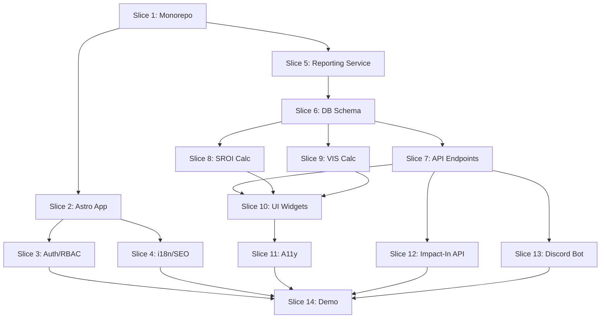

# Multi-Agent Execution Plan - Worker 3

**Mission**: Ship the first working Corporate Cockpit with authenticated partner view, core widgets, SROI/VIS calculators, Impact-In API, and Discord feedback hooks.

**Branch**: `worker3/cockpit-metrics-impactin`

**Timeline**: 14 deliverable slices

---

## Slice 1: Monorepo Foundation
**Owner**: QA Lead (Agent 5.3)
**Dependencies**: None
**Deliverables**:
- [ ] Create `apps/`, `services/`, `packages/`, `docs/`, `reports/` directories
- [ ] Initialize `package.json` with workspace config (pnpm)
- [ ] Create `.gitignore`, `.env.example`
- [ ] Set up ESLint, Prettier, TypeScript configs
- [ ] Add base `tsconfig.json`

**Files Created**:
```
/package.json
/pnpm-workspace.yaml
/.gitignore
/.env.example
/tsconfig.json
/.eslintrc.json
/.prettierrc
```

---

## Slice 2: Astro 5 Corporate Cockpit App
**Owner**: Frontend Lead (Agent 1.1)
**Dependencies**: Slice 1
**Deliverables**:
- [ ] Initialize `apps/corp-cockpit-astro` with Astro 5
- [ ] Add React integration for islands
- [ ] Set up routing structure
- [ ] Create base layout with navigation
- [ ] Add error boundaries (404, 500)
- [ ] Configure SSR/SSG strategy

**Files Created**:
```
/apps/corp-cockpit-astro/package.json
/apps/corp-cockpit-astro/astro.config.mjs
/apps/corp-cockpit-astro/tsconfig.json
/apps/corp-cockpit-astro/src/layouts/BaseLayout.astro
/apps/corp-cockpit-astro/src/pages/index.astro
/apps/corp-cockpit-astro/src/pages/404.astro
/apps/corp-cockpit-astro/src/components/Navigation.astro
```

---

## Slice 3: Authentication & RBAC
**Owner**: Frontend Lead (Agent 1.6)
**Dependencies**: Slice 2
**Deliverables**:
- [ ] Create auth context/provider
- [ ] Add login page (company admin)
- [ ] Implement session management (JWT/cookie)
- [ ] Add role-based access control (RBAC)
- [ ] Protected route wrapper
- [ ] Logout functionality

**Files Created**:
```
/apps/corp-cockpit-astro/src/middleware/auth.ts
/apps/corp-cockpit-astro/src/context/AuthContext.tsx
/apps/corp-cockpit-astro/src/pages/login.astro
/apps/corp-cockpit-astro/src/components/ProtectedRoute.tsx
/apps/corp-cockpit-astro/src/utils/rbac.ts
```

---

## Slice 4: i18n & SEO Scaffolding
**Owner**: Frontend Lead (Agent 1.5)
**Dependencies**: Slice 2
**Deliverables**:
- [ ] Set up i18n library (astro-i18next or similar)
- [ ] Create translation files (en.json, uk.json, no.json)
- [ ] Add language switcher component
- [ ] Implement hreflang SEO component
- [ ] Add locale-aware routing
- [ ] Create `<Head>` SEO wrapper

**Files Created**:
```
/apps/corp-cockpit-astro/src/i18n/en.json
/apps/corp-cockpit-astro/src/i18n/uk.json
/apps/corp-cockpit-astro/src/i18n/no.json
/apps/corp-cockpit-astro/src/components/LanguageSwitcher.tsx
/apps/corp-cockpit-astro/src/components/SEOHead.astro
/apps/corp-cockpit-astro/src/utils/i18n.ts
```

---

## Slice 5: Reporting Service Foundation
**Owner**: Backend Lead (Agent 2.1)
**Dependencies**: Slice 1
**Deliverables**:
- [ ] Initialize `services/reporting` with Fastify
- [ ] Set up TypeScript, build, dev scripts
- [ ] Create database connection utilities (PostgreSQL)
- [ ] Add CORS, helmet, rate limiting middleware
- [ ] Health check endpoint (`/health`)
- [ ] OpenAPI/Swagger docs setup

**Files Created**:
```
/services/reporting/package.json
/services/reporting/tsconfig.json
/services/reporting/src/index.ts
/services/reporting/src/config.ts
/services/reporting/src/db/connection.ts
/services/reporting/src/middleware/rateLimiter.ts
/services/reporting/src/routes/health.ts
/services/reporting/src/swagger.ts
```

---

## Slice 6: Database Schema & Models
**Owner**: Backend Lead (Agent 2.2)
**Dependencies**: Slice 5
**Deliverables**:
- [ ] Create schema files (companies, volunteers, sessions, outcomes)
- [ ] Add migration scripts (Kysely or Drizzle)
- [ ] Create TypeScript types/interfaces
- [ ] Seed script with sample data
- [ ] Document entity relationships

**Files Created**:
```
/services/reporting/src/db/schema/companies.sql
/services/reporting/src/db/schema/volunteers.sql
/services/reporting/src/db/schema/sessions.sql
/services/reporting/src/db/schema/outcomes.sql
/services/reporting/src/db/migrations/001_initial.ts
/services/reporting/src/db/types.ts
/services/reporting/src/db/seed.ts
/docs/Database_Schema.md
```

---

## Slice 7: Reporting API Endpoints
**Owner**: Backend Lead (Agent 2.1)
**Dependencies**: Slice 6
**Deliverables**:
- [ ] `GET /companies/:id/at-a-glance?period=YYYY-QN`
- [ ] `GET /companies/:id/outcomes?dimensions=integration,language,job_readiness`
- [ ] `GET /companies/:id/q2q-feed?limit=50`
- [ ] `GET /companies/:id/sroi` (returns ratio + breakdown)
- [ ] `GET /companies/:id/vis` (returns aggregate VIS + top volunteers)
- [ ] `GET /export/csrd` (CSV/JSON export)
- [ ] Add request validation (Zod)

**Files Created**:
```
/services/reporting/src/routes/companies.ts
/services/reporting/src/controllers/atAGlance.ts
/services/reporting/src/controllers/outcomes.ts
/services/reporting/src/controllers/q2qFeed.ts
/services/reporting/src/controllers/sroi.ts
/services/reporting/src/controllers/vis.ts
/services/reporting/src/controllers/export.ts
/services/reporting/src/validators/company.ts
```

---

## Slice 8: SROI Calculator
**Owner**: Backend Lead (Agent 2.3)
**Dependencies**: Slice 6
**Deliverables**:
- [ ] Implement SROI formula (deterministic)
- [ ] Create configurable weights system
- [ ] Unit tests for all calculation paths
- [ ] Document assumptions and methodology
- [ ] Add breakdown response (inputs, outcomes, ratio)

**Files Created**:
```
/services/reporting/src/calculators/sroi.ts
/services/reporting/src/calculators/sroi.test.ts
/services/reporting/src/config/sroiWeights.ts
/docs/SROI_Calculation.md
```

**Formula Documentation**:
```markdown
# SROI Calculation

## Formula
SROI = (Total Social Value Created) / (Total Investment)

## Components
1. **Total Investment**: Sum of volunteer hours × hourly rate + program costs
2. **Social Value Created**: Weighted sum of outcomes
   - Integration improvement × weight × monetary value
   - Language advancement × weight × monetary value
   - Job readiness increase × weight × monetary value

## Conservative Defaults
- Volunteer hour value: $29.95 (Independent Sector 2023)
- Integration point value: $150
- Language level advancement: $500
- Job readiness point: $300

## Change Control
All weight adjustments require documentation and version tracking.
```

---

## Slice 9: VIS Calculator
**Owner**: Backend Lead (Agent 2.4)
**Dependencies**: Slice 6
**Deliverables**:
- [ ] Implement VIS formula (deterministic)
- [ ] Create scoring algorithm (hours, consistency, impact)
- [ ] Unit tests for edge cases
- [ ] Document model and assumptions
- [ ] Add top volunteer ranking

**Files Created**:
```
/services/reporting/src/calculators/vis.ts
/services/reporting/src/calculators/vis.test.ts
/services/reporting/src/config/visWeights.ts
/docs/VIS_Model.md
```

**Formula Documentation**:
```markdown
# VIS Model (Volunteer Impact Score)

## Formula
VIS = (Hours × 0.3) + (Consistency × 0.3) + (Outcome Impact × 0.4)

## Components
1. **Hours**: Total volunteer hours (normalized 0-100)
2. **Consistency**: Session frequency score (0-100)
3. **Outcome Impact**: Weighted avg of mentee improvements (0-100)

## Scoring Bands
- 0-25: Emerging
- 26-50: Contributing
- 51-75: High Impact
- 76-100: Exceptional

## Use Cases
- Recognition programs
- Volunteer leaderboards
- Impact attribution
```

---

## Slice 10: Dashboard UI Widgets
**Owner**: Frontend Lead (Agent 1.2, 1.3)
**Dependencies**: Slice 7, 8, 9
**Deliverables**:
- [ ] At-a-glance card component (inputs vs outcomes)
- [ ] Trend chart components (Chart.js or Recharts)
- [ ] Q2Q insight feed with lineage links
- [ ] SROI panel with tooltip and docs link
- [ ] VIS panel with top volunteers
- [ ] Export buttons (CSV/JSON/PDF stub)
- [ ] Responsive layouts (mobile, tablet, desktop)

**Files Created**:
```
/apps/corp-cockpit-astro/src/components/widgets/AtAGlance.tsx
/apps/corp-cockpit-astro/src/components/widgets/TrendChart.tsx
/apps/corp-cockpit-astro/src/components/widgets/Q2QFeed.tsx
/apps/corp-cockpit-astro/src/components/widgets/SROIPanel.tsx
/apps/corp-cockpit-astro/src/components/widgets/VISPanel.tsx
/apps/corp-cockpit-astro/src/components/widgets/ExportButtons.tsx
/apps/corp-cockpit-astro/src/styles/dashboard.css
```

---

## Slice 11: A11y & Responsiveness
**Owner**: Frontend Lead (Agent 1.4)
**Dependencies**: Slice 10
**Deliverables**:
- [ ] Audit all widgets for WCAG 2.2 AA
- [ ] Add ARIA labels, roles, live regions
- [ ] Ensure keyboard navigation (focus management)
- [ ] Check color contrast (4.5:1 minimum)
- [ ] Verify touch target sizes (44×44px minimum)
- [ ] Test screen reader compatibility
- [ ] Add skip links and landmarks

**Files Created**:
```
/apps/corp-cockpit-astro/src/components/a11y/SkipLinks.tsx
/apps/corp-cockpit-astro/src/utils/a11y.ts
/docs/Accessibility_Audit.md
```

---

## Slice 12: Impact-In API Service
**Owner**: Integration Lead (Agent 3.1-3.4)
**Dependencies**: Slice 7
**Deliverables**:
- [ ] Initialize `services/reporting/impact-in`
- [ ] Create outbound push endpoint
- [ ] Add API key management (per company)
- [ ] Benevity mapper + payload example (stub)
- [ ] Goodera mapper + payload example (stub)
- [ ] Workday mapper + payload example (stub)
- [ ] Rate limiting per company
- [ ] Document integration flows

**Files Created**:
```
/services/reporting/src/impact-in/index.ts
/services/reporting/src/impact-in/apiKeys.ts
/services/reporting/src/impact-in/mappers/benevity.ts
/services/reporting/src/impact-in/mappers/goodera.ts
/services/reporting/src/impact-in/mappers/workday.ts
/services/reporting/src/impact-in/examples/benevity-payload.json
/services/reporting/src/impact-in/examples/goodera-payload.json
/services/reporting/src/impact-in/examples/workday-payload.json
/docs/Impact_In_API.md
```

---

## Slice 13: Discord Bot & Feedback Hooks
**Owner**: Integration Lead (Agent 3.5, 3.6)
**Dependencies**: Slice 7
**Deliverables**:
- [ ] Initialize `services/discord-bot`
- [ ] Set up Discord.js client
- [ ] Implement `/feedback` slash command (DM micro-survey)
- [ ] POST feedback to Q2Q endpoint
- [ ] Role assignment endpoint (private recognition)
- [ ] Webhook for milestone announcements (toggle per company)
- [ ] Document bot setup and commands

**Files Created**:
```
/services/discord-bot/package.json
/services/discord-bot/src/index.ts
/services/discord-bot/src/commands/feedback.ts
/services/discord-bot/src/commands/recognize.ts
/services/discord-bot/src/webhooks/milestones.ts
/services/discord-bot/src/utils/q2qClient.ts
/services/discord-bot/.env.example
/docs/Discord_Integration.md
```

---

## Slice 14: Sample Data, Demo & Documentation
**Owner**: QA Lead (Agent 5.5, 5.4)
**Dependencies**: All previous slices
**Deliverables**:
- [ ] Seed sample company ("ACME Corp")
- [ ] Create 20+ volunteers with realistic data
- [ ] Generate sessions and outcome scores
- [ ] Build demo page `/demo/acme`
- [ ] Write dashboard design playbook
- [ ] Create `reports/worker3_cockpit.md`
- [ ] Take screenshots of all widgets
- [ ] Document build/run instructions

**Files Created**:
```
/services/reporting/src/db/seed-demo.ts
/apps/corp-cockpit-astro/src/pages/demo/acme.astro
/docs/Dashboard_Design.md
/reports/worker3_cockpit.md
/docs/screenshots/at-a-glance.png
/docs/screenshots/sroi-panel.png
/docs/screenshots/vis-panel.png
/docs/screenshots/q2q-feed.png
```

---

## Execution Order



---

## Success Metrics

| Metric | Target | Status |
|--------|--------|--------|
| Endpoints functional | 6/6 | ⬜ |
| SROI tests passing | 100% | ⬜ |
| VIS tests passing | 100% | ⬜ |
| UI widgets complete | 6/6 | ⬜ |
| A11y audit passing | WCAG 2.2 AA | ⬜ |
| i18n languages | 3/3 (en/uk/no) | ⬜ |
| Discord bot functional | `/feedback` working | ⬜ |
| Demo data seeded | ACME Corp + 20 volunteers | ⬜ |
| Build passes | `pnpm -w dev` | ⬜ |
| Documentation complete | 8 docs | ⬜ |

---

## Risk Register

| Risk | Mitigation | Owner |
|------|------------|-------|
| SROI formula unclear | Start with conservative model, document assumptions | Backend Lead |
| Discord rate limits | Implement queue + backoff | Integration Lead |
| A11y complexity | Audit early, fix incrementally | Frontend Lead |
| Data model changes | Use migrations, version schema | Backend Lead |
| Integration auth unclear | Stub first, document requirements | Integration Lead |

---

## Next Steps

1. ✅ Create branch `worker3/cockpit-metrics-impactin`
2. ⬜ Execute Slice 1-5 (foundation)
3. ⬜ Execute Slice 6-9 (backend core)
4. ⬜ Execute Slice 10-11 (frontend)
5. ⬜ Execute Slice 12-13 (integrations)
6. ⬜ Execute Slice 14 (demo + docs)
7. ⬜ Create PR with report

---

**Last Updated**: 2025-11-13
**Status**: Planning Complete - Ready for Execution
