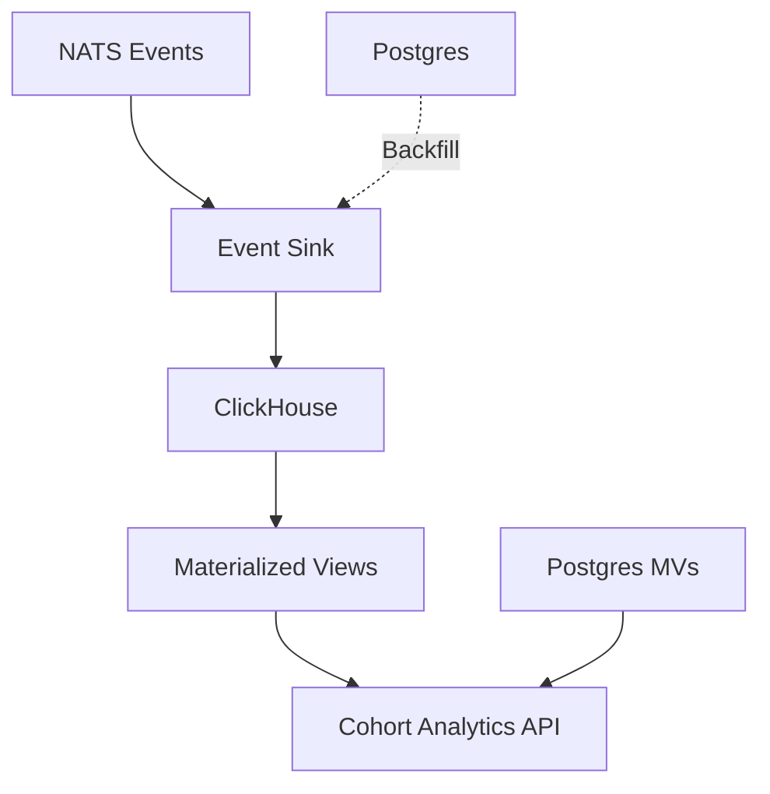
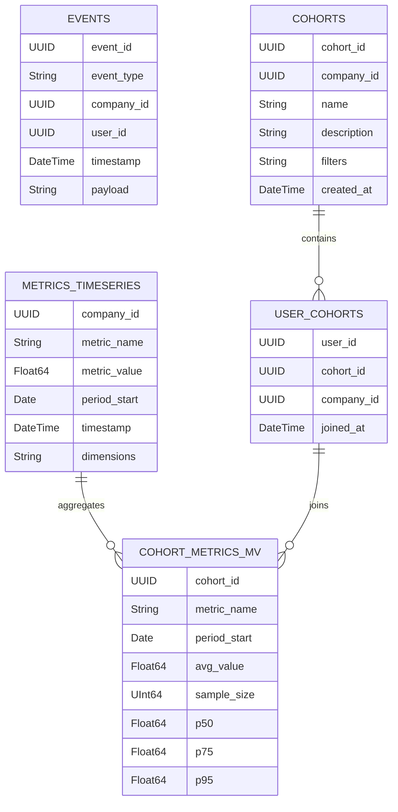

# Analytics Data Warehouse (ClickHouse)

ClickHouse-based analytics data warehouse for time-series event storage and cohort analysis in the TEEI CSR Platform.

## Overview

The Analytics DW provides fast analytical queries over historical event data and cohort metrics. It complements the operational Postgres database with optimized columnar storage for analytics workloads.

## Architecture



### Components

1. **ClickHouse Server**
   - Columnar storage engine
   - Time-series partitioning (by month)
   - Materialized views for aggregations

2. **Event Sink**
   - NATS subscriber
   - Batch inserts (1000 events or 10 seconds)
   - Retry logic with dead letter queue

3. **Incremental Loader**
   - Durable NATS consumer
   - Checkpoint tracking
   - Backfill support (Postgres → ClickHouse)

4. **Postgres Materialized Views**
   - Hot query optimization
   - 5-minute refresh cycle
   - Company dashboard, program performance, language groups

## Schema Reference

### Events Table

Universal event storage for all platform events.

```sql
CREATE TABLE events (
    event_id UUID,
    event_type String,
    company_id UUID,
    user_id Nullable(UUID),
    timestamp DateTime,
    payload String, -- JSON

    INDEX idx_company_id company_id TYPE minmax GRANULARITY 3,
    INDEX idx_timestamp timestamp TYPE minmax GRANULARITY 3,
    INDEX idx_event_type event_type TYPE bloom_filter(0.01) GRANULARITY 1
) ENGINE = MergeTree()
PARTITION BY toYYYYMM(timestamp)
ORDER BY (company_id, timestamp);
```

**Usage:**
- All NATS events are stored here
- Partitioned by month for efficient querying
- Indexed for fast filtering by company, time, and event type

### Metrics Time-Series Table

Time-series storage for metric values.

```sql
CREATE TABLE metrics_timeseries (
    company_id UUID,
    metric_name String,
    metric_value Float64,
    period_start Date,
    timestamp DateTime,
    dimensions String, -- JSON

    INDEX idx_company company_id TYPE minmax GRANULARITY 3,
    INDEX idx_metric metric_name TYPE set(100) GRANULARITY 1
) ENGINE = MergeTree()
PARTITION BY toYYYYMM(period_start)
ORDER BY (company_id, metric_name, timestamp);
```

**Usage:**
- Stores calculated metric values over time
- Supports additional dimensions (cohort_id, program_type, etc.)
- Optimized for time-range queries

### Cohorts Table

Cohort definitions synchronized from Postgres.

```sql
CREATE TABLE cohorts (
    cohort_id UUID,
    company_id UUID,
    name String,
    description String,
    filters String, -- JSON filter criteria
    created_at DateTime,
    updated_at DateTime
) ENGINE = ReplacingMergeTree(updated_at)
ORDER BY (company_id, cohort_id);
```

**Usage:**
- Replicated from Postgres cohorts table
- Used for cohort name lookups in queries
- ReplacingMergeTree handles updates

### User Cohort Membership

Many-to-many relationship between users and cohorts.

```sql
CREATE TABLE user_cohorts (
    user_id UUID,
    cohort_id UUID,
    company_id UUID,
    joined_at DateTime,

    INDEX idx_cohort cohort_id TYPE minmax GRANULARITY 3
) ENGINE = ReplacingMergeTree(joined_at)
ORDER BY (company_id, user_id, cohort_id);
```

### Materialized Views

#### Cohort Metrics Aggregations

Pre-aggregated cohort metrics with statistical measures.

```sql
CREATE MATERIALIZED VIEW cohort_metrics_mv
ENGINE = SummingMergeTree()
PARTITION BY toYYYYMM(period_start)
ORDER BY (cohort_id, metric_name, period_start)
AS SELECT
    uc.cohort_id,
    mt.metric_name,
    mt.period_start,
    avg(mt.metric_value) as avg_value,
    count() as sample_size,
    quantile(0.5)(mt.metric_value) as p50,
    quantile(0.75)(mt.metric_value) as p75,
    quantile(0.95)(mt.metric_value) as p95,
    min(mt.metric_value) as min_value,
    max(mt.metric_value) as max_value,
    stddevPop(mt.metric_value) as std_dev
FROM metrics_timeseries mt
INNER JOIN user_cohorts uc
    ON mt.company_id = uc.company_id
    AND JSONExtractString(mt.dimensions, 'user_id') = toString(uc.user_id)
GROUP BY cohort_id, metric_name, period_start;
```

**Metrics Available:**
- Average, median (p50), p75, p95
- Min, max, standard deviation
- Sample size

#### Daily Event Counts

Event count rollups by type and company.

```sql
CREATE MATERIALIZED VIEW daily_event_counts_mv
ENGINE = SummingMergeTree()
PARTITION BY toYYYYMM(event_date)
ORDER BY (company_id, event_type, event_date)
AS SELECT
    company_id,
    event_type,
    toDate(timestamp) as event_date,
    count() as event_count,
    uniq(user_id) as unique_users
FROM events
GROUP BY company_id, event_type, event_date;
```

#### Hourly Metrics Rollup

Hourly aggregations for near-real-time dashboards.

```sql
CREATE MATERIALIZED VIEW hourly_metrics_mv
ENGINE = SummingMergeTree()
PARTITION BY toYYYYMM(hour_start)
ORDER BY (company_id, metric_name, hour_start)
AS SELECT
    company_id,
    metric_name,
    toStartOfHour(timestamp) as hour_start,
    avg(metric_value) as avg_value,
    max(metric_value) as max_value,
    min(metric_value) as min_value,
    count() as sample_count
FROM metrics_timeseries
GROUP BY company_id, metric_name, hour_start;
```

## API Reference

### Get Cohort Metrics

```http
GET /cohort/:id/metrics?metric={metricName}&startDate={date}&endDate={date}
```

**Example:**
```bash
curl "http://localhost:3007/cohort/cohort-123/metrics?metric=integration_score&startDate=2025-01-01&endDate=2025-11-13"
```

**Response:**
```json
{
  "cohortId": "cohort-123",
  "metricName": "integration_score",
  "data": [
    {
      "periodStart": "2025-01-01",
      "avgValue": 0.75,
      "sampleSize": 150,
      "p50": 0.72,
      "p75": 0.85,
      "p95": 0.95,
      "minValue": 0.20,
      "maxValue": 1.00,
      "stdDev": 0.15
    }
  ],
  "count": 12
}
```

### Get Cohort Trends

```http
GET /cohort/:id/trends?metric={metricName}&periods={number}
```

**Example:**
```bash
curl "http://localhost:3007/cohort/cohort-123/trends?metric=integration_score&periods=6"
```

**Response:**
```json
{
  "cohortId": "cohort-123",
  "metricName": "integration_score",
  "trends": [
    {
      "periodStart": "2025-06-01",
      "value": 0.70,
      "trend": "up",
      "changePercent": 5.2
    },
    {
      "periodStart": "2025-07-01",
      "value": 0.75,
      "trend": "up",
      "changePercent": 7.1
    }
  ],
  "count": 6
}
```

### Get Cohort Overview

```http
GET /cohort/:id/overview?periodStart={date}
```

**Example:**
```bash
curl "http://localhost:3007/cohort/cohort-123/overview?periodStart=2025-11-01"
```

**Response:**
```json
{
  "cohortId": "cohort-123",
  "periodStart": "2025-11-01",
  "metrics": {
    "integration_score": 0.75,
    "social_capital_score": 0.68,
    "match_quality": 0.82,
    "interaction_frequency": 3.5
  }
}
```

### Compare Cohorts

```http
POST /cohort/compare
Content-Type: application/json

{
  "cohortIds": ["cohort-a", "cohort-b", "cohort-c"],
  "metric": "integration_score",
  "periodStart": "2025-11-01"
}
```

**Response:**
```json
{
  "comparison": {
    "metricName": "integration_score",
    "cohorts": [
      {
        "cohortId": "cohort-c",
        "cohortName": "Ukrainian Mentorship",
        "value": 0.85,
        "rank": 1
      },
      {
        "cohortId": "cohort-a",
        "cohortName": "General Program",
        "value": 0.75,
        "rank": 2
      },
      {
        "cohortId": "cohort-b",
        "cohortName": "Buddy System",
        "value": 0.68,
        "rank": 3
      }
    ]
  },
  "cohortCount": 3
}
```

### Get Top Cohorts

```http
GET /cohort/top?metric={metricName}&limit={number}&periodStart={date}
```

**Example:**
```bash
curl "http://localhost:3007/cohort/top?metric=integration_score&limit=5"
```

**Response:**
```json
{
  "metricName": "integration_score",
  "cohorts": [
    {
      "cohortId": "cohort-xyz",
      "cohortName": "Ukrainian Mentorship",
      "value": 0.85,
      "rank": 1
    }
  ],
  "count": 5
}
```

## Query Patterns

### Time-Range Queries

```sql
-- Get metrics for a date range
SELECT
    metric_name,
    period_start,
    avg_value,
    sample_size
FROM metrics_timeseries
WHERE company_id = '{companyId}'
    AND metric_name = 'integration_score'
    AND period_start >= '2025-01-01'
    AND period_start <= '2025-11-13'
ORDER BY period_start ASC;
```

### Cohort Comparison

```sql
-- Compare multiple cohorts
SELECT
    cm.cohort_id,
    c.name as cohort_name,
    cm.avg_value,
    cm.sample_size
FROM cohort_metrics_mv cm
INNER JOIN cohorts c ON cm.cohort_id = c.cohort_id
WHERE cm.cohort_id IN ('cohort-a', 'cohort-b', 'cohort-c')
    AND cm.metric_name = 'integration_score'
    AND cm.period_start = (SELECT MAX(period_start) FROM cohort_metrics_mv)
ORDER BY cm.avg_value DESC;
```

### Event Aggregation

```sql
-- Count events by type for a company
SELECT
    event_type,
    count() as event_count,
    uniqExact(user_id) as unique_users
FROM events
WHERE company_id = '{companyId}'
    AND timestamp >= now() - INTERVAL 30 DAY
GROUP BY event_type
ORDER BY event_count DESC;
```

### Percentile Analysis

```sql
-- Get metric distribution
SELECT
    metric_name,
    quantile(0.25)(metric_value) as p25,
    quantile(0.5)(metric_value) as p50,
    quantile(0.75)(metric_value) as p75,
    quantile(0.95)(metric_value) as p95
FROM metrics_timeseries
WHERE company_id = '{companyId}'
    AND period_start >= '2025-11-01'
GROUP BY metric_name;
```

## Performance Optimization

### Partitioning Strategy

Data is partitioned by month for efficient querying:
- Old partitions can be dropped easily
- Queries on recent data only scan relevant partitions
- Storage costs reduced by dropping old partitions

### Indexing

1. **Primary Index** (ORDER BY)
   - Most important columns first
   - Matches common query patterns

2. **Secondary Indexes**
   - MinMax indexes for range queries
   - Bloom filters for exact matches
   - Set indexes for categorical data

### Materialized Views

Pre-aggregate data for fast queries:
- Cohort metrics calculated incrementally
- Hourly/daily rollups reduce scan size
- SummingMergeTree for automatic aggregation

### Query Tips

1. **Always filter by company_id first**
   ```sql
   WHERE company_id = '{id}' AND ...
   ```

2. **Use time-range filters**
   ```sql
   WHERE period_start >= '2025-01-01'
   ```

3. **Limit result sets**
   ```sql
   LIMIT 1000
   ```

4. **Use materialized views when available**
   ```sql
   SELECT * FROM cohort_metrics_mv  -- Pre-aggregated
   -- Instead of aggregating metrics_timeseries
   ```

## Postgres Materialized Views

For hot queries that require frequent access, use Postgres MVs:

### Company Dashboard MV

```sql
CREATE MATERIALIZED VIEW company_dashboard_mv AS
SELECT
    company_id,
    MAX(period_start) as last_period,
    SUM(participants_count) as total_participants,
    AVG(avg_integration_score) as overall_integration_score,
    AVG(sroi_ratio) as overall_sroi
FROM metrics_company_period
GROUP BY company_id;

CREATE UNIQUE INDEX ON company_dashboard_mv (company_id);
```

**Refresh Schedule:**
```sql
-- Refresh every 5 minutes
REFRESH MATERIALIZED VIEW CONCURRENTLY company_dashboard_mv;
```

**Query:**
```sql
SELECT * FROM company_dashboard_mv WHERE company_id = '{id}';
```

### Program Performance MV

```sql
CREATE MATERIALIZED VIEW program_performance_mv AS
SELECT
    company_id,
    program_type,
    MAX(period_start) as last_period,
    SUM(total_participants) as total_participants,
    AVG(avg_match_quality) as avg_match_quality
FROM metrics_program_period
GROUP BY company_id, program_type;
```

## Cost Analysis

### Storage Costs

**ClickHouse:**
- Columnar compression: ~10x better than row storage
- Partitioning: Drop old partitions to reduce storage
- Estimated: ~100 GB for 1 year of events (1M events/day)

**Postgres MVs:**
- Row storage, but much smaller than full dataset
- Estimated: ~5 GB for all MVs

### Query Costs

**ClickHouse:**
- Fast analytical queries (< 1 second for most queries)
- Scan only necessary columns (columnar)
- Partitioning reduces scan size

**Postgres MVs:**
- Near-instant queries (< 100ms)
- Pre-aggregated data
- Trade-off: Stale data (5-minute refresh)

## Monitoring

### Key Metrics

- **Ingestion Rate**: Events/second written to ClickHouse
- **Query Latency**: p95, p99 latency for analytical queries
- **Storage Size**: Total ClickHouse storage usage
- **Partition Count**: Number of active partitions
- **MV Lag**: Time since last materialized view refresh

### Health Checks

```bash
# ClickHouse health
curl http://localhost:8123/ping

# Check table sizes
clickhouse-client --query "SELECT table, formatReadableSize(sum(bytes)) as size FROM system.parts WHERE active GROUP BY table"

# Check partition count
clickhouse-client --query "SELECT table, count() as partitions FROM system.parts WHERE active GROUP BY table"
```

## Troubleshooting

### Slow Queries

1. Check query execution plan: `EXPLAIN SELECT ...`
2. Verify indexes are being used
3. Reduce scan size with time-range filters
4. Use materialized views

### High Storage Usage

1. Check partition sizes
2. Drop old partitions: `ALTER TABLE events DROP PARTITION '202401'`
3. Optimize tables: `OPTIMIZE TABLE events`
4. Review retention policy

### Ingestion Lag

1. Check event sink batch size
2. Verify ClickHouse write performance
3. Review NATS consumer lag
4. Check dead letter queue

### MV Not Updating

1. Verify data is being inserted to source table
2. Check MV definition
3. Manually refresh: `SYSTEM FLUSH LOGS`
4. Review ClickHouse logs

## ERD Diagram



## Roadmap

- [ ] Automated partition management (drop old partitions)
- [ ] Cross-region replication for global deployments
- [ ] Real-time aggregations with materialized views
- [ ] Machine learning feature extraction from events
- [ ] Cost optimization with tiered storage
- [ ] Query result caching layer
