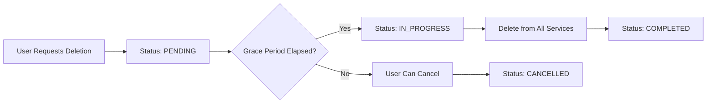

# DSAR & Consent Operations Guide

## Overview

The TEEI CSR Platform provides comprehensive GDPR compliance features including Data Subject Access Requests (DSAR) and consent management.

## GDPR Rights Supported

| Right | Article | Implementation | Endpoint |
|-------|---------|---------------|----------|
| Right to Access | Article 15 | Full data export | `GET /v1/privacy/export` |
| Right to Erasure | Article 17 | 30-day grace period deletion | `POST /v1/privacy/delete` |
| Right to Portability | Article 20 | JSON/CSV export | `GET /v1/privacy/export?format=json` |
| Right to Rectification | Article 16 | Profile update endpoints | `PATCH /v1/users/:id` |

## Architecture

```
┌──────────────────────────────────────┐
│ API Gateway (Privacy Routes)         │
└──────────┬───────────────────────────┘
           │
┌──────────▼───────────────────────────┐
│ Compliance Package                   │
│ ┌──────────────────────────────────┐ │
│ │ DSR Orchestrator                 │ │
│ │ - Export user data               │ │
│ │ - Schedule deletion              │ │
│ │ - Multi-service coordination     │ │
│ └──────────────────────────────────┘ │
│                                      │
│ ┌──────────────────────────────────┐ │
│ │ Consent Manager                  │ │
│ │ - Track consent versions         │ │
│ │ - Withdrawal handling            │ │
│ └──────────────────────────────────┘ │
│                                      │
│ ┌──────────────────────────────────┐ │
│ │ Audit Logger                     │ │
│ │ - Immutable audit trail          │ │
│ │ - GDPR compliance tracking       │ │
│ └──────────────────────────────────┘ │
└──────────────────────────────────────┘
```

## Data Subject Access Requests (DSAR)

### Request Types

1. **Export (Article 15)**: Complete data export
2. **Delete (Article 17)**: Right to be forgotten
3. **Rectify (Article 16)**: Correct inaccurate data
4. **Portability (Article 20)**: Export in machine-readable format

### Export Request

#### API Endpoint

**GET `/v1/privacy/export`**

Returns all user data in JSON format.

**Authentication**: Required (user must be authenticated)

**Example**:
```bash
curl -X GET "https://api.teei.com/v1/privacy/export" \
  -H "Authorization: Bearer USER_JWT_TOKEN"
```

**Response**:
```json
{
  "success": true,
  "message": "Data export completed",
  "data": {
    "userId": "user_123",
    "exportDate": "2025-01-15T10:30:00Z",
    "data": {
      "profile": {
        "id": "user_123",
        "email": "user@example.com",
        "firstName": "John",
        "lastName": "Doe",
        "role": "company_user",
        "createdAt": "2024-01-01T00:00:00Z"
      },
      "pii": {
        "phoneNumber": "+1234567890",
        "dateOfBirth": "1990-01-01",
        "address": "123 Main St"
      },
      "externalIds": [
        {
          "provider": "kintell",
          "externalId": "kintell_456",
          "createdAt": "2024-01-01T00:00:00Z"
        }
      ],
      "programs": [
        {
          "programType": "buddy",
          "enrolledAt": "2024-02-01T00:00:00Z",
          "status": "active"
        }
      ],
      "activities": [
        {
          "type": "volunteer_hours",
          "value": 10,
          "date": "2024-03-01"
        }
      ]
    },
    "metadata": {
      "sources": ["users", "encrypted_user_pii", "external_id_mappings", "program_enrollments"],
      "recordCount": 15,
      "gdprArticle": "Article 15 - Right to Access"
    }
  }
}
```

### Deletion Request

#### API Endpoint

**POST `/v1/privacy/delete`**

Schedules user data for deletion with a 30-day grace period.

**Request Body**:
```json
{
  "userId": "user_123",
  "reason": "User requested account deletion",
  "confirmEmail": "user@example.com"
}
```

**Response**:
```json
{
  "success": true,
  "message": "Deletion request accepted",
  "data": {
    "deletionId": "dsar_abc_123",
    "userId": "user_123",
    "status": "PENDING",
    "scheduledFor": "2025-02-14T10:30:00Z",
    "gracePeriodDays": 30,
    "cancellationEndpoint": "/v1/privacy/delete/dsar_abc_123/cancel",
    "note": "Your data will be permanently deleted after the grace period. You can cancel this request before that time."
  }
}
```

### Cancel Deletion

**POST `/v1/privacy/delete/:deletionId/cancel`**

Allows users to cancel their deletion request within the grace period.

**Example**:
```bash
curl -X POST "https://api.teei.com/v1/privacy/delete/dsar_abc_123/cancel" \
  -H "Authorization: Bearer USER_JWT_TOKEN"
```

**Response**:
```json
{
  "success": true,
  "message": "Deletion request cancelled",
  "data": {
    "deletionId": "dsar_abc_123",
    "status": "CANCELLED",
    "cancelledAt": "2025-01-16T14:20:00Z"
  }
}
```

### Check Deletion Status

**GET `/v1/privacy/delete/:deletionId`**

Get the current status of a deletion request.

**Response**:
```json
{
  "success": true,
  "data": {
    "deletionId": "dsar_abc_123",
    "status": "PENDING",
    "scheduledFor": "2025-02-14T10:30:00Z",
    "requestedAt": "2025-01-15T10:30:00Z",
    "completedAt": null
  }
}
```

## Deletion Workflow

### Grace Period (30 Days)



### Data Sources Deleted

1. **encrypted_user_pii**: All PII data (name, phone, address, etc.)
2. **external_id_mappings**: External system IDs (Kintell, Discord, etc.)
3. **program_enrollments**: Program participation records
4. **kintell_events**: Kintell interactions
5. **buddy_matches**: Buddy program data
6. **course_completions**: Upskilling data
7. **q2q_tags**: Q2Q classifications
8. **users**: Profile anonymized (email → `deleted_<uuid>@anonymized.local`)

### Deletion Verification

Each deletion generates a verification hash:

```typescript
const verificationHash = SHA256(
  `${userId}:${deletedSources.sort().join(',')}:${completedAt}`
);
```

Stored in `dsar_requests.verification_hash` for audit purposes.

## Consent Management

### Consent Types

| Type | Description | Required | Default |
|------|-------------|----------|---------|
| `necessary` | Essential platform functionality | Yes | Granted |
| `analytics` | Usage analytics and reporting | No | Not granted |
| `marketing` | Marketing communications | No | Not granted |
| `data_processing` | AI/ML processing of user data | No | Not granted |
| `data_sharing` | Sharing data with partners | No | Not granted |
| `data_retention` | Extended data retention | No | Not granted |

### Get Consent Status

**GET `/v1/privacy/consent`**

Returns user's current consent status.

**Response**:
```json
{
  "success": true,
  "data": {
    "userId": "user_123",
    "consents": [
      {
        "consentType": "necessary",
        "granted": true,
        "version": "1.0",
        "grantedAt": "2024-01-01T00:00:00Z"
      },
      {
        "consentType": "analytics",
        "granted": true,
        "version": "1.0",
        "grantedAt": "2024-01-01T00:00:00Z"
      },
      {
        "consentType": "marketing",
        "granted": false,
        "version": "1.0",
        "withdrawnAt": "2024-06-01T00:00:00Z"
      }
    ]
  }
}
```

### Update Consent

**POST `/v1/privacy/consent`**

Update user's consent preferences.

**Request Body**:
```json
{
  "consentType": "analytics",
  "granted": false,
  "reason": "User opted out"
}
```

**Response**:
```json
{
  "success": true,
  "message": "Consent updated",
  "data": {
    "userId": "user_123",
    "consentType": "analytics",
    "granted": false,
    "version": "1.0",
    "updatedAt": "2025-01-15T10:30:00Z"
  }
}
```

### Consent Versioning

Consent records include version tracking:

```sql
CREATE TABLE consent_records (
  id UUID PRIMARY KEY,
  user_id UUID NOT NULL,
  consent_type VARCHAR(100) NOT NULL,
  granted BOOLEAN NOT NULL,
  version VARCHAR(20) NOT NULL,  -- "1.0", "2.0", etc.
  consent_text TEXT,             -- Snapshot of consent text
  granted_at TIMESTAMP,
  withdrawn_at TIMESTAMP,
  created_at TIMESTAMP DEFAULT NOW()
);
```

When consent terms change, increment the version and re-request consent.

## Database Schema

### DSAR Requests Table

```sql
CREATE TABLE dsar_requests (
  id UUID PRIMARY KEY,
  user_id UUID NOT NULL,
  company_id UUID,
  request_type VARCHAR(50) NOT NULL,  -- 'export', 'delete', 'rectify', 'portability'
  status VARCHAR(50) NOT NULL,         -- 'pending', 'in_progress', 'completed', 'failed', 'cancelled'

  -- Scheduling
  requested_at TIMESTAMP NOT NULL,
  started_at TIMESTAMP,
  completed_at TIMESTAMP,

  -- Export fields
  export_url TEXT,
  export_size_bytes BIGINT,
  export_expires_at TIMESTAMP,
  encryption_key_id VARCHAR(100),

  -- Delete fields
  cancellation_deadline TIMESTAMP,
  deletion_scheduled_at TIMESTAMP,

  -- Progress tracking
  services_total INTEGER,
  services_completed INTEGER,
  services_failed INTEGER,

  -- Verification
  verification_hash VARCHAR(64),

  -- Error handling
  error_message TEXT,
  retry_count INTEGER DEFAULT 0,

  metadata JSONB,
  created_at TIMESTAMP DEFAULT NOW(),
  updated_at TIMESTAMP DEFAULT NOW()
);
```

### Consent Records Table

```sql
CREATE TABLE consent_records (
  id UUID PRIMARY KEY,
  user_id UUID NOT NULL,
  company_id UUID,
  consent_type VARCHAR(100) NOT NULL,
  granted BOOLEAN NOT NULL,
  version VARCHAR(20) NOT NULL,
  consent_text TEXT,
  ip_address INET,
  user_agent TEXT,
  metadata JSONB,
  granted_at TIMESTAMP,
  withdrawn_at TIMESTAMP,
  created_at TIMESTAMP DEFAULT NOW()
);

CREATE INDEX idx_consent_user_type ON consent_records(user_id, consent_type, granted);
```

### Audit Logs Table

```sql
CREATE TABLE audit_logs (
  id UUID PRIMARY KEY,
  company_id UUID,
  user_id UUID,
  api_key_id UUID,

  -- Action details
  action VARCHAR(255) NOT NULL,
  resource_type VARCHAR(100) NOT NULL,
  resource_id UUID,

  -- Request context
  ip_address INET,
  user_agent TEXT,
  request_method VARCHAR(10),
  request_path TEXT,
  request_id VARCHAR(100),

  -- Result
  success BOOLEAN NOT NULL,
  error_code VARCHAR(50),
  error_message TEXT,

  metadata JSONB,
  duration_ms INTEGER,
  created_at TIMESTAMP DEFAULT NOW()
);

-- Prevent updates/deletes (append-only)
CREATE TRIGGER audit_logs_immutable_trigger
  BEFORE UPDATE OR DELETE ON audit_logs
  FOR EACH ROW
  EXECUTE FUNCTION prevent_audit_log_modification();
```

## Audit Trail

All privacy operations are logged:

```typescript
{
  "action": "EXPORT_DATA",
  "resourceType": "user_data",
  "resourceId": "user_123",
  "actorId": "user_123",
  "actorEmail": "user@example.com",
  "actorRole": "company_user",
  "ipAddress": "192.168.1.1",
  "requestId": "req_abc_123",
  "success": true,
  "metadata": {
    "exportFormat": "json",
    "recordCount": 15
  },
  "timestamp": "2025-01-15T10:30:00Z"
}
```

## Monitoring

### Prometheus Metrics

```promql
# Total DSAR requests
dsar_requests_total{request_type="export",status="completed"}

# Processing duration
dsar_processing_duration_seconds{request_type="delete",quantile="0.95"}

# Data sources processed
dsar_data_sources_processed_total{request_type="export",source="users",status="success"}

# Consent updates
consent_updates_total{consent_type="analytics",granted="false"}
```

### Alerts

**High DSAR Failure Rate**:
```promql
rate(dsar_requests_total{status="failed"}[5m]) > 0.05
```

**Long Processing Time**:
```promql
histogram_quantile(0.95, dsar_processing_duration_seconds_bucket{request_type="delete"}) > 1800
```

## Compliance Checklist

- [x] GDPR Article 15: Right to Access (data export)
- [x] GDPR Article 17: Right to Erasure (deletion with grace period)
- [x] GDPR Article 20: Right to Data Portability (JSON/CSV export)
- [x] GDPR Article 30: Record of processing activities (audit logs)
- [x] Consent versioning and tracking
- [x] Immutable audit trail
- [x] 30-day deletion grace period
- [x] Multi-service deletion coordination
- [x] Verification hashes for deletions
- [x] Encrypted PII storage

## Runbook

### Manual Deletion Execution

For urgent deletions (e.g., legal order):

```bash
# 1. Create deletion request
curl -X POST "https://api.teei.com/v1/privacy/delete" \
  -H "Authorization: Bearer ADMIN_TOKEN" \
  -d '{"userId": "user_123", "reason": "Legal order"}'

# 2. Get deletion ID from response
DELETION_ID="dsar_abc_123"

# 3. Execute immediately (bypass grace period)
psql -c "UPDATE dsar_requests SET scheduled_for = NOW() WHERE id = '$DELETION_ID';"

# 4. Trigger deletion job
curl -X POST "https://api.teei.com/admin/execute-deletion/$DELETION_ID" \
  -H "Authorization: Bearer ADMIN_TOKEN"
```

### Data Breach Response

In case of data breach:

```bash
# 1. Export affected user data for investigation
curl -X GET "https://api.teei.com/admin/bulk-export?userIds=user_1,user_2,user_3" \
  -H "Authorization: Bearer ADMIN_TOKEN" \
  > breach_export.json

# 2. Notify affected users via notifications service
curl -X POST "https://api.teei.com/notifications/breach-notification" \
  -H "Authorization: Bearer ADMIN_TOKEN" \
  -d '{"userIds": ["user_1", "user_2"], "breachType": "..."}'

# 3. Audit trail review
psql -c "SELECT * FROM audit_logs WHERE created_at > '2025-01-15' ORDER BY created_at DESC;"
```

## Support

For GDPR/privacy questions:
- **DPO Email**: dpo@teei.com
- **Privacy Policy**: https://teei.com/privacy
- **Documentation**: https://docs.teei.com/privacy
