# Database Entity-Relationship Diagram

**Generated:** 2025-11-13
**Schema Version:** 1.0
**Database:** PostgreSQL 14+

## Overview

This document provides a comprehensive Entity-Relationship (ER) diagram for the TEEI CSR Platform database schema. The schema supports multi-tenant CSR program management with integration across Kintell (language/mentorship), Buddy (peer support), and Upskilling (learning platforms) systems.

## Full ER Diagram

```mermaid
erDiagram
    %% Core User Management
    users ||--o{ company_users : "belongs to"
    users ||--o{ program_enrollments : "enrolled in"
    users ||--o{ external_id_mappings : "mapped to"
    companies ||--o{ company_users : "has"
    companies ||--o{ metrics_company_period : "has metrics"

    %% Kintell Sessions
    users ||--o{ kintell_sessions : "participates as participant"
    users ||--o{ kintell_sessions : "participates as volunteer"

    %% Buddy System
    users ||--o{ buddy_matches : "matched as participant"
    users ||--o{ buddy_matches : "matched as buddy"
    buddy_matches ||--o{ buddy_events : "has"
    buddy_matches ||--o{ buddy_checkins : "has"
    buddy_matches ||--o{ buddy_feedback : "receives"

    %% Upskilling
    users ||--o{ learning_progress : "tracks"

    %% Q2Q Outcomes
    outcome_scores ||--o{ evidence_snippets : "contains"

    %% Safety
    users ||--o{ safety_flags : "reviews"

    %% Idempotency
    event_deduplication }o--|| webhook_deduplication : "related"
    api_request_deduplication }o--|| users : "scoped to"

    users {
        uuid id PK
        varchar email UK "Unique email address"
        varchar role "admin | company_user | participant | volunteer"
        varchar first_name
        varchar last_name
        timestamp created_at
        timestamp updated_at
    }

    companies {
        uuid id PK
        varchar name "Company name"
        varchar industry
        varchar country
        timestamp created_at
    }

    company_users {
        uuid id PK
        uuid company_id FK
        uuid user_id FK
        timestamp joined_at
    }

    program_enrollments {
        uuid id PK
        uuid user_id FK
        varchar program_type "buddy | language | mentorship | upskilling"
        timestamp enrolled_at
        varchar status "active | completed | dropped"
        timestamp completed_at
    }

    external_id_mappings {
        uuid id PK
        uuid user_id FK
        varchar external_system "kintell | discord | buddy | etc"
        varchar external_id "External system identifier"
        timestamp created_at
    }

    kintell_sessions {
        uuid id PK
        varchar external_session_id
        varchar session_type "language | mentorship"
        uuid participant_id FK
        uuid volunteer_id FK
        timestamp scheduled_at
        timestamp completed_at
        integer duration_minutes
        decimal rating "0.00 - 1.00"
        text feedback_text
        varchar language_level "CEFR: A1, A2, B1, B2, C1, C2"
        jsonb topics "Array of topics discussed"
        jsonb metadata
        timestamp created_at
    }

    buddy_matches {
        uuid id PK
        uuid participant_id FK
        uuid buddy_id FK
        timestamp matched_at
        varchar status "active | inactive | ended"
        timestamp ended_at
    }

    buddy_events {
        uuid id PK
        uuid match_id FK
        varchar event_type "hangout | activity | workshop"
        timestamp event_date
        text description
        varchar location
        timestamp created_at
    }

    buddy_checkins {
        uuid id PK
        uuid match_id FK
        timestamp checkin_date
        varchar mood "great | good | okay | struggling | difficult"
        text notes
    }

    buddy_feedback {
        uuid id PK
        uuid match_id FK
        varchar from_role "participant | buddy"
        decimal rating "0.00 - 1.00"
        text feedback_text
        timestamp submitted_at
    }

    learning_progress {
        uuid id PK
        uuid user_id FK
        varchar provider "ecornell | itslearning | etc"
        varchar course_id
        varchar course_name
        varchar status "enrolled | in_progress | completed | dropped"
        integer progress_percent "0-100"
        timestamp started_at
        timestamp completed_at
        varchar credential_ref
        jsonb metadata
        timestamp created_at
        timestamp updated_at
    }

    outcome_scores {
        uuid id PK
        uuid text_id "Reference to source feedback/checkin"
        varchar text_type "buddy_feedback | kintell_feedback | checkin_note"
        varchar dimension "confidence | belonging | lang_level_proxy | job_readiness | well_being"
        decimal score "0.000 - 1.000"
        decimal confidence "Model confidence 0.000 - 1.000"
        varchar model_version
        timestamp created_at
    }

    evidence_snippets {
        uuid id PK
        uuid outcome_score_id FK
        text snippet_text
        varchar snippet_hash UK "SHA-256 hash for dedup"
        varchar embedding_ref "Vector DB reference"
        timestamp created_at
    }

    metrics_company_period {
        uuid id PK
        uuid company_id FK
        date period_start
        date period_end
        integer participants_count
        integer volunteers_count
        integer sessions_count
        decimal avg_integration_score
        decimal avg_language_level
        decimal avg_job_readiness
        decimal sroi_ratio "SROI ratio e.g., 5.23:1"
        decimal vis_score "VIS score"
        timestamp created_at
    }

    safety_flags {
        uuid id PK
        uuid content_id "Reference to flagged content"
        varchar content_type "feedback_text | checkin_note | message"
        varchar flag_reason "profanity | pii_leakage | hate_speech"
        decimal confidence "0.000 - 1.000"
        boolean requires_human_review
        varchar review_status "pending | approved | rejected | escalated"
        uuid reviewed_by FK
        text review_notes
        timestamp reviewed_at
        timestamp raised_at
    }

    event_deduplication {
        uuid id PK
        varchar event_id "NATS event ID"
        varchar event_type
        varchar consumer_id "Service/subscriber ID"
        timestamp processed_at
        boolean success
        text error_message
        text metadata "JSON string"
        timestamp created_at
    }

    webhook_deduplication {
        uuid id PK
        varchar delivery_id "Webhook delivery ID"
        varchar webhook_source "kintell | upskilling"
        varchar webhook_type
        timestamp received_at
        timestamp processed_at
        boolean success
        varchar status_code
        text error_message
        varchar retry_count
        text payload "JSON string"
        timestamp created_at
    }

    api_request_deduplication {
        uuid id PK
        varchar idempotency_key UK "Client-provided key"
        uuid user_id FK
        varchar endpoint
        varchar method "GET | POST | PUT | DELETE"
        timestamp requested_at
        timestamp completed_at
        varchar status_code
        text response_body "Cached response"
        text error_message
        timestamp expires_at "TTL for cleanup"
        timestamp created_at
    }
```



## Schema Sections

### 1. Core User Management
- **users**: Central user table (participants, volunteers, company admins)
- **companies**: Corporate clients (employers, NGOs)
- **company_users**: Many-to-many join between companies and users
- **program_enrollments**: Tracks user participation across programs
- **external_id_mappings**: Surrogate key mapping for external systems (Kintell, Discord, Buddy, etc.)

### 2. Kintell Integration
- **kintell_sessions**: Language and mentorship sessions from Kintell platform
  - Tracks participant-volunteer pairings
  - Captures session feedback, ratings, and language level assessments (CEFR)

### 3. Buddy System
- **buddy_matches**: Peer support matches between participants and buddies
- **buddy_events**: Activities and meetups organized by buddy pairs
- **buddy_checkins**: Regular mood and wellness check-ins
- **buddy_feedback**: Ratings and feedback from both participants and buddies

### 4. Upskilling Integration
- **learning_progress**: Course enrollments and completions from eCornell, itslearning, and other LMS platforms
  - Tracks progress percentage, credentials, and completion status

### 5. Q2Q Outcome Analytics
- **outcome_scores**: AI-generated outcome dimensions (confidence, belonging, job readiness, well-being)
  - Scores range from 0.000 to 1.000 with model confidence
- **evidence_snippets**: Text snippets supporting outcome scores
  - Deduplicated via SHA-256 hash
  - References to vector embeddings for semantic search

### 6. Metrics & Reporting
- **metrics_company_period**: Aggregated company-level metrics by time period
  - SROI (Social Return on Investment) ratios
  - VIS (Value of Impact Scores)
  - Average language levels and job readiness

### 7. Safety & Moderation
- **safety_flags**: Content moderation flags for profanity, PII leakage, hate speech
  - Supports human review workflows
  - Reviewed by admin users

### 8. Idempotency & Reliability
- **event_deduplication**: Prevents duplicate NATS event processing
  - Composite unique index on (event_id, consumer_id)
- **webhook_deduplication**: Handles webhook retry delivery deduplication
  - Unique index on (delivery_id, webhook_source)
- **api_request_deduplication**: API-level idempotency key tracking
  - Caches responses for safe retries
  - TTL-based cleanup via expires_at

## Indexes

### Performance-Critical Indexes

#### Users
- `users(email)` - Unique index for authentication
- `users(role, created_at)` - Query by role with sorting

#### External ID Mappings
- `external_id_mappings(external_system, external_id)` - Unique index for lookups

#### Kintell Sessions
- `kintell_sessions(participant_id, completed_at)` - Participant session history
- `kintell_sessions(volunteer_id, completed_at)` - Volunteer session history
- `kintell_sessions(session_type, completed_at)` - Type-based queries

#### Buddy System
- `buddy_matches(participant_id, status)` - Active matches for participant
- `buddy_matches(buddy_id, status)` - Active matches for buddy
- `buddy_events(match_id, event_date)` - Event timeline
- `buddy_checkins(match_id, checkin_date)` - Checkin timeline
- `buddy_feedback(match_id, submitted_at)` - Feedback timeline

#### Learning Progress
- `learning_progress(user_id, status)` - User course enrollments
- `learning_progress(provider, status)` - Provider-based queries

#### Outcome Scores
- `outcome_scores(text_id, text_type)` - Lookup scores by source
- `outcome_scores(dimension, created_at)` - Dimension-based analytics

#### Safety Flags
- `safety_flags(review_status, raised_at)` - Pending reviews queue
- `safety_flags(content_id, content_type)` - Content moderation history

#### Idempotency
- `event_deduplication(event_id, consumer_id)` - Unique constraint
- `event_deduplication(processed_at)` - Cleanup queries
- `webhook_deduplication(delivery_id, webhook_source)` - Unique constraint
- `api_request_deduplication(idempotency_key)` - Unique constraint
- `api_request_deduplication(expires_at)` - TTL cleanup

## Data Privacy & Security

### Surrogate Keys
- All tables use UUID primary keys
- External system IDs mapped via `external_id_mappings` to prevent PII exposure

### PII Fields
The following fields contain Personally Identifiable Information (PII):
- `users.email`
- `users.first_name`
- `users.last_name`
- `kintell_sessions.feedback_text`
- `buddy_checkins.notes`
- `buddy_feedback.feedback_text`
- `evidence_snippets.snippet_text`

**Recommendation**: Implement field-level encryption for PII fields (see Phase B Compliance deliverables).

### Multi-Tenancy
- Companies are isolated via `company_id` foreign keys
- All company-scoped queries must filter by `company_id` to enforce tenant isolation

## Migration Strategy

See `/docs/Migration_Playbook.md` for detailed migration execution guide.

### Rollback Support
All migrations have corresponding rollback scripts in:
```
/packages/shared-schema/migrations/rollback/
```

## Backup & Restore

See `/docs/DB_Backup_Restore.md` for comprehensive backup/restore procedures.

## Query Optimization

See `/packages/db/src/optimizer.ts` for:
- Connection pooling configuration
- Query performance monitoring
- Circuit breaker patterns
- Index suggestion tools

---

**Version History**

| Version | Date | Author | Changes |
|---------|------|--------|---------|
| 1.0 | 2025-11-13 | Data Lead Team | Initial ER diagram with all schema entities |

**Related Documents**
- [Migration Playbook](/docs/Migration_Playbook.md)
- [Backup & Restore Guide](/docs/DB_Backup_Restore.md)
- [Schema Source Code](/packages/shared-schema/src/schema/)
