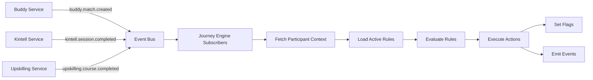
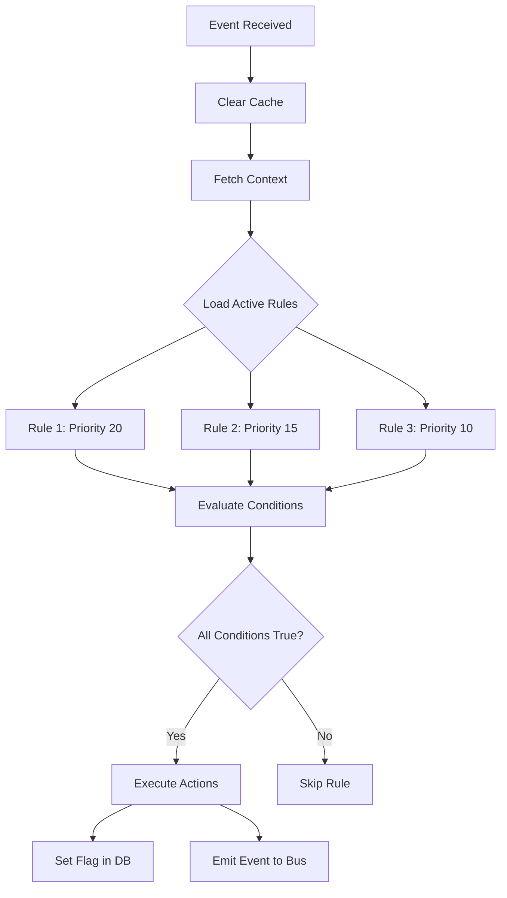

# Journey Orchestration Engine

## Overview

The Journey Orchestration Engine is a declarative rules-based system that automatically computes participant journey flags and orchestrates cross-program workflows. It listens to events from Buddy, Kintell, and Upskilling programs and evaluates configurable rules to set journey readiness flags like `mentor_ready`, `followup_needed`, and `language_support_needed`.

## Architecture

### Components

1. **Rule Engine** - Core logic for evaluating conditions and executing actions
2. **Event Subscribers** - Listen to events from all programs (buddy.*, kintell.*, upskilling.*)
3. **Profile Context** - Aggregates participant data for rule evaluation
4. **API Routes** - RESTful endpoints for flags, milestones, and rules management
5. **Database Schema** - Stores journey flags, rules, and milestones

### Event Flow



### Data Flow



## Rule Schema

### Rule Structure

A rule consists of:

- **id**: Unique identifier (e.g., `mentor_ready_001`)
- **name**: Human-readable name
- **description**: What the rule does
- **flag**: Primary flag this rule manages
- **conditions**: Array of conditions (all must be true)
- **actions**: Array of actions to execute
- **priority**: Higher number = higher priority
- **active**: Whether the rule is enabled

### Condition Types

#### 1. Count Condition

Check if count of entities meets criteria.

```yaml
type: count
entity: kintell_sessions
field: session_type  # Optional filter
value: language      # Optional filter value
count: '>='         # Comparison operator
count_value: 3      # Expected count
```

**Example**: User has at least 3 language sessions.

#### 2. Exists Condition

Check if entity exists with optional field filtering.

```yaml
type: exists
entity: program_enrollments
field: status        # Optional
operator: '='        # Optional
value: active        # Optional
```

**Example**: User has an active program enrollment.

#### 3. Value Condition

Check specific field value.

```yaml
type: value
entity: kintell_sessions
field: avg_rating
operator: '>='
value: 4.0
```

**Example**: Average Kintell rating is at least 4.0.

#### 4. Time Since Condition

Check time elapsed since last activity.

```yaml
type: time_since
entity: buddy_events
field: last_activity
duration: '14 days'  # Supports: days, weeks, months, hours
```

**Example**: No activity in the last 14 days.

#### 5. Logical Conditions (all_of / any_of)

Combine multiple conditions.

```yaml
type: all_of  # Or any_of
conditions:
  - type: count
    entity: buddy_matches
    count: '>='
    count_value: 1
  - type: exists
    entity: program_enrollments
```

**Example**: User has at least 1 buddy match AND has program enrollment.

### Action Types

#### 1. Set Flag

Set a journey flag to true/false.

```yaml
type: set_flag
flag: mentor_ready
value: true
```

#### 2. Emit Event

Publish an event to the event bus.

```yaml
type: emit_event
event: orchestration.milestone.reached
payload:
  milestone: mentor_ready
  reason: Completed 3+ language sessions
```

#### 3. Clear Flag

Remove a journey flag.

```yaml
type: clear_flag
flag: mentor_ready
```

## API Reference

### Journey Flags API

#### GET `/journey/flags/:userId`

Get all journey flags for a user.

**Response**:
```json
{
  "userId": "uuid",
  "flags": [
    {
      "flag": "mentor_ready",
      "value": true,
      "setByRule": "mentor_ready_001",
      "setAt": "2025-01-15T10:30:00Z",
      "expiresAt": null
    }
  ],
  "count": 1
}
```

#### POST `/journey/flags/:userId/evaluate`

Manually trigger rule evaluation for a user.

**Response**:
```json
{
  "userId": "uuid",
  "evaluatedRules": ["mentor_ready_001", "followup_needed_001"],
  "triggeredRules": ["mentor_ready_001"],
  "timestamp": "2025-01-15T10:30:00Z"
}
```

#### GET `/journey/flags/:userId/history`

Get flag change history for a user.

**Response**:
```json
{
  "userId": "uuid",
  "history": [
    {
      "flag": "mentor_ready",
      "value": true,
      "setByRule": "mentor_ready_001",
      "changedAt": "2025-01-15T10:30:00Z"
    }
  ],
  "count": 1
}
```

### Journey Milestones API

#### GET `/journey/milestones/:userId`

Get all reached milestones for a user.

**Response**:
```json
{
  "userId": "uuid",
  "milestones": [
    {
      "milestone": "mentor_ready",
      "reachedAt": "2025-01-15T10:30:00Z",
      "triggeredByRule": "mentor_ready_001",
      "metadata": { "reason": "Completed 3+ language sessions" }
    }
  ],
  "count": 1
}
```

#### POST `/journey/milestones/:userId/:milestone`

Manually trigger a milestone for a user.

**Request Body**:
```json
{
  "metadata": {
    "reason": "Manual override",
    "triggeredBy": "admin@example.com"
  }
}
```

**Response**:
```json
{
  "success": true,
  "milestone": {
    "milestone": "mentor_ready",
    "reachedAt": "2025-01-15T10:30:00Z",
    "triggeredByRule": "manual",
    "metadata": { ... }
  }
}
```

### Rules Management API (Admin)

#### GET `/journey/rules`

List all rules.

#### GET `/journey/rules/:id`

Get a specific rule by ID.

#### POST `/journey/rules`

Create a new rule.

**Request Body**: Complete rule object (see Rule Schema).

#### PUT `/journey/rules/:id`

Update an existing rule.

**Request Body**: Partial rule object with fields to update.

#### DELETE `/journey/rules/:id`

Delete a rule.

#### POST `/journey/rules/:id/activate`

Activate a rule.

#### POST `/journey/rules/:id/deactivate`

Deactivate a rule.

## Default Rules

The system comes with 3 pre-configured rules:

1. **mentor_ready_001** - Participant has completed 3+ language sessions with avg rating >= 4.0
2. **followup_needed_001** - No activity in last 14 days despite active enrollment
3. **language_support_needed_001** - Low language comfort detected by Q2Q (score < 0.5)

## Creating Custom Rules

### Step 1: Define the Rule

Create a YAML file with your rule definition:

```yaml
id: custom_rule_001
name: Custom Rule
description: Description of what triggers this rule
flag: custom_flag
priority: 10
active: true
conditions:
  - type: count
    entity: buddy_matches
    count: '>='
    count_value: 5
actions:
  - type: set_flag
    flag: custom_flag
    value: true
  - type: emit_event
    event: orchestration.custom.event
    payload:
      message: Custom event triggered
```

### Step 2: Load the Rule

Use the Rules Management API to create the rule:

```bash
curl -X POST http://localhost:3009/journey/rules \
  -H "Content-Type: application/json" \
  -d @custom_rule.json
```

### Step 3: Test the Rule

Manually trigger evaluation for a test user:

```bash
curl -X POST http://localhost:3009/journey/flags/USER_ID/evaluate
```

## Performance Considerations

1. **Rule Caching** - Rules are cached for 1 minute to reduce database queries
2. **Context Caching** - Participant context is cached for 5 minutes
3. **Rule Priority** - Higher priority rules are evaluated first
4. **Idempotency** - Rule evaluation is idempotent (same inputs → same outputs)

## Troubleshooting

### Rules not triggering

1. Check if rule is active: `GET /journey/rules/:id`
2. Verify conditions are met by inspecting participant context
3. Check logs for rule evaluation errors
4. Manually trigger evaluation: `POST /journey/flags/:userId/evaluate`

### Incorrect flag values

1. Check rule priority - higher priority rules may override lower priority
2. Verify condition logic (all conditions must be true)
3. Check for conflicting rules setting the same flag

### Performance issues

1. Increase cache TTL if context data doesn't change frequently
2. Reduce number of active rules
3. Optimize condition evaluation (use count conditions instead of complex queries)

## Best Practices

1. **Use descriptive rule IDs** - Include version number (e.g., `mentor_ready_001`)
2. **Set appropriate priorities** - Critical flags should have higher priority
3. **Test rules thoroughly** - Use manual evaluation endpoint
4. **Document custom rules** - Add clear descriptions
5. **Monitor rule performance** - Check logs for evaluation times
6. **Use version control** - Store rule definitions in YAML files

## Event Emissions

The Journey Engine emits the following events:

- `orchestration.milestone.reached` - When a milestone is achieved
- `orchestration.flag.updated` - When a flag changes value
- Custom events defined in rule actions

## Database Tables

### journey_flags

Stores computed journey flags for participants.

| Column | Type | Description |
|--------|------|-------------|
| id | uuid | Primary key |
| user_id | uuid | Participant ID |
| flag | varchar(100) | Flag name |
| value | boolean | Flag value |
| set_by_rule | varchar(100) | Rule ID that set this flag |
| set_at | timestamp | When flag was set |
| expires_at | timestamp | Optional expiration |

### journey_rules

Stores rule definitions.

| Column | Type | Description |
|--------|------|-------------|
| id | uuid | Primary key |
| rule_id | varchar(100) | Business ID (unique) |
| name | varchar(200) | Rule name |
| description | text | Rule description |
| rule_config | jsonb | Full rule definition |
| active | boolean | Whether rule is enabled |
| priority | integer | Evaluation priority |
| created_at | timestamp | Creation timestamp |
| updated_at | timestamp | Last update timestamp |

### journey_milestones

Tracks when participants reach milestones.

| Column | Type | Description |
|--------|------|-------------|
| id | uuid | Primary key |
| user_id | uuid | Participant ID |
| milestone | varchar(100) | Milestone name |
| reached_at | timestamp | When milestone was reached |
| triggered_by_rule | varchar(100) | Rule ID that triggered |
| metadata | jsonb | Additional context |

## Integration Examples

### Example 1: Trigger evaluation after Kintell session

The Journey Engine automatically subscribes to `kintell.session.completed` events and evaluates all rules.

### Example 2: Check if user is ready for mentorship

```javascript
const response = await fetch(`/journey/flags/${userId}`);
const { flags } = await response.json();
const mentorReady = flags.find(f => f.flag === 'mentor_ready' && f.value === true);
if (mentorReady) {
  console.log('User is ready to be a mentor!');
}
```

### Example 3: Create a custom rule for high engagement

```yaml
id: high_engagement_001
name: High Engagement
description: User has high activity across all programs
flag: high_engagement
priority: 25
active: true
conditions:
  - type: all_of
    conditions:
      - type: count
        entity: buddy_events
        count: '>='
        count_value: 10
      - type: count
        entity: kintell_sessions
        count: '>='
        count_value: 5
      - type: count
        entity: learning_progress
        count: '>='
        count_value: 3
actions:
  - type: set_flag
    flag: high_engagement
    value: true
  - type: emit_event
    event: orchestration.milestone.reached
    payload:
      milestone: high_engagement
      tier: gold
```
