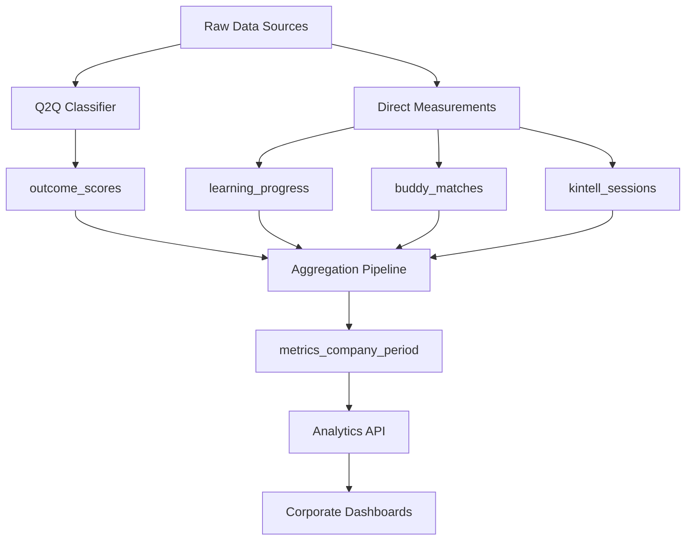

# Metrics Catalog

**Last Updated:** 2025-11-13
**Version:** 1.0

## Table of Contents

- [Overview](#overview)
- [Metric Categories](#metric-categories)
- [Core Metrics](#core-metrics)
  - [Integration Score](#integration-score)
  - [Language Level Proxy](#language-level-proxy)
  - [Job Readiness](#job-readiness)
  - [SROI (Social Return on Investment)](#sroi-social-return-on-investment)
  - [VIS (Volunteer Impact Score)](#vis-volunteer-impact-score)
- [Supporting Metrics](#supporting-metrics)
  - [Participants Count](#participants-count)
  - [Volunteers Count](#volunteers-count)
  - [Sessions Count](#sessions-count)
  - [Confidence Score](#confidence-score)
  - [Belonging Score](#belonging-score)
  - [Well-Being Score](#well-being-score)
- [Data Sources](#data-sources)
- [Update Frequency](#update-frequency)
- [Limitations and Caveats](#limitations-and-caveats)
- [API Access](#api-access)

---

## Overview

The **Metrics Catalog** defines all canonical metrics used in the TEEI CSR Platform. Each metric has a precise definition, calculation methodology, data sources, and interpretation guidelines. These metrics enable corporate partners and program operators to measure the effectiveness of integration programs.

Metrics are organized into four categories:
- **Input Metrics**: Resources invested (volunteer hours, program costs)
- **Output Metrics**: Direct program deliverables (sessions, participants)
- **Outcome Metrics**: Participant changes (integration, language, job readiness)
- **Impact Metrics**: Long-term social value (SROI, VIS)

---

## Metric Categories

| Category | Description | Examples | Time Horizon |
|----------|-------------|----------|--------------|
| **Input** | Resources invested in the program | Volunteer hours, program costs | Immediate |
| **Output** | Direct program deliverables | Number of sessions, participants | Short-term (days-weeks) |
| **Outcome** | Changes in participant status | Integration score, language level | Medium-term (weeks-months) |
| **Impact** | Long-term social and economic value | SROI, VIS, employment rates | Long-term (months-years) |

---

## Core Metrics

### Integration Score

**Category:** Outcome
**Scale:** 0-100
**Unit:** Points

#### Definition

The **Integration Score** measures a participant's overall integration progress across three key dimensions: language comfort, social belonging, and job access. It provides a holistic view of how well a participant is integrating into their host community.

#### Formula

```
Integration Score = (Language × 0.40) + (Social × 0.30) + (Job Access × 0.30)
```

Where:
- **Language** = Language comfort score (0-100)
- **Social** = Social belonging score (0-100)
- **Job Access** = Job access score (0-100)

#### Components Breakdown

| Component | Weight | Data Source | Calculation Method |
|-----------|--------|-------------|-------------------|
| **Language Comfort** | 40% | Q2Q language_comfort label, CEFR assessments | CEFR to 0-1 scale mapping, then × 100 |
| **Social Belonging** | 30% | Buddy matches, event attendance, check-ins | Engagement metrics formula |
| **Job Access** | 30% | Employment status, courses completed/in-progress | Job access formula |

#### Interpretation

| Score Range | Level | Description | Support Needed |
|-------------|-------|-------------|----------------|
| **0-33** | Low | Early stage, significant barriers | High-touch support, intensive resources |
| **34-66** | Medium | Progressing, some challenges remain | Ongoing support, targeted interventions |
| **67-100** | High | Well-integrated, self-sufficient | Minimal support, peer mentoring opportunities |

#### Example Calculation

**Scenario:** Participant with B1 language level, active buddy match, 3 events attended, completed 2 courses

```
Language: CEFR B1 = 0.5 → 50 points
Social: (1 match = 0.4) + (3/5 events = 0.18) + (3/10 check-ins = 0.09) = 0.67 → 67 points
Job Access: (2 completed × 0.15) + (1 in-progress × 0.1) = 0.40 → 40 points

Integration Score = (50 × 0.40) + (67 × 0.30) + (40 × 0.30)
                  = 20 + 20.1 + 12
                  = 52.1 points (Medium integration)
```

#### Data Sources
- `learning_progress.cefr_level`
- `buddy_matches` (active matches)
- `kintell_sessions` (event attendance)
- `kintell_feedback` (check-ins)
- `learning_progress.courses_completed`
- Q2Q outcome scores (language_comfort, belonging)

#### Update Frequency
- **Real-time**: When new Q2Q scores are generated
- **Batch aggregation**: Daily at midnight UTC
- **Reporting periods**: Monthly and quarterly rollups

---

### Language Level Proxy

**Category:** Outcome
**Scale:** 0-10 or CEFR (A1-C2)
**Unit:** Level

#### Definition

The **Language Level Proxy** estimates a participant's language proficiency based on multiple signals including text complexity analysis (Q2Q), formal assessments (CEFR), and course completion data.

#### CEFR Mapping

| CEFR Level | Numeric Score (0-1) | Numeric Score (0-10) | Description |
|------------|--------------------|--------------------|-------------|
| **A1** | 0.17 | 1.7 | Beginner |
| **A2** | 0.33 | 3.3 | Elementary |
| **B1** | 0.50 | 5.0 | Intermediate |
| **B2** | 0.67 | 6.7 | Upper Intermediate |
| **C1** | 0.83 | 8.3 | Advanced |
| **C2** | 1.00 | 10.0 | Proficiency |

#### Q2Q Language Comfort Correlation

| Q2Q Label | Typical CEFR Range | Numeric Score (0-1) |
|-----------|-------------------|-------------------|
| **low** | A1-A2 | 0.3 |
| **medium** | B1-B2 | 0.6 |
| **high** | C1-C2 | 0.9 |

#### Calculation Priority

1. **Formal CEFR assessment** (if available within 90 days)
2. **Q2Q language_comfort** average (last 10 feedback items)
3. **Course level completed** (fallback estimate)

#### Data Sources
- `learning_progress.cefr_level`
- `outcome_scores` (dimension = 'lang_level_proxy')
- `learning_progress.courses_completed`

#### Update Frequency
- **Q2Q**: Real-time with each feedback classification
- **Formal assessment**: Quarterly or semi-annually
- **Aggregated metric**: Daily rollup

---

### Job Readiness

**Category:** Outcome
**Scale:** 0-100
**Unit:** Points

#### Definition

The **Job Readiness** score measures a participant's preparedness for employment based on employability signals detected in feedback, course completion, and employment status.

#### Formula

```
Job Readiness = min(0.30 + (employability_signals_count × 0.15), 1.00) × 100
```

#### Component Scores

| Component | Score Contribution | Examples |
|-----------|-------------------|----------|
| **Baseline** | 30 points | All participants start at 30 |
| **Each employability signal** | +15 points | job_search, skills_gained, networking, etc. |
| **Maximum cap** | 100 points | Achievable with 5+ signals |
| **Employment achieved** | 100 points | Automatic full score |

#### Employability Signals

See [Q2Q Label Taxonomy](./Q2Q_Label_Taxonomy.md) for full list of 8 signals:
- job_search
- skills_gained
- networking
- resume_improvement
- interview_prep
- certification
- portfolio_building
- career_goal_setting

#### Interpretation

| Score Range | Readiness Level | Typical Profile |
|-------------|----------------|-----------------|
| **0-40** | Early Stage | Exploring options, basic skill building |
| **41-70** | Developing | Active skill development, some job search activity |
| **71-90** | Ready | Actively applying, strong skills, interview-ready |
| **91-100** | Employed or Highly Ready | Employed or imminent employment |

#### Data Sources
- `outcome_scores` (dimension = 'job_readiness')
- Q2Q employability_signals
- `learning_progress.employment_status`
- `learning_progress.courses_completed`

#### Update Frequency
- Real-time with Q2Q classifications
- Daily aggregation

---

### SROI (Social Return on Investment)

**Category:** Impact
**Scale:** Ratio (e.g., 5.2:1)
**Unit:** Currency return per currency invested

#### Definition

The **Social Return on Investment (SROI)** quantifies the economic value generated by the program relative to its cost. It estimates the discounted present value of economic benefits (wage increases, employment) divided by program costs.

#### Formula

```
SROI Ratio = (NPV of Economic Benefits - Program Cost) / Program Cost

NPV of Benefits = Σ (participants_with_outcome × avg_wage_lift × employment_multiplier) / (1 + discount_rate)^year
                  for year = 1 to years_of_benefit
```

#### Parameters

| Parameter | Description | Default Value | Range |
|-----------|-------------|--------------|-------|
| **program_cost** | Total program investment | Varies | $10K - $1M+ |
| **participants_with_outcome** | Participants achieving employment/wage lift | Measured | 0 - participant_count |
| **avg_wage_lift** | Average annual wage increase per participant | $15,000 | $5K - $50K |
| **years_of_benefit** | Years to consider for benefit calculation | 3 | 1 - 10 |
| **employment_multiplier** | Indirect economic benefit multiplier | 1.5 | 1.0 - 3.0 |
| **discount_rate** | Annual discount rate for future benefits | 3% | 0% - 10% |

#### Example Calculation

**Scenario:** Program cost $100K, 25 participants employed with $15K avg wage lift

```
Year 1: 25 × $15,000 × 1.5 / (1.03)^1 = $364,078
Year 2: 25 × $15,000 × 1.5 / (1.03)^2 = $353,475
Year 3: 25 × $15,000 × 1.5 / (1.03)^3 = $343,179

NPV of Benefits = $1,060,732

SROI Ratio = ($1,060,732 - $100,000) / $100,000
          = 9.61:1

Interpretation: Every $1 invested returns $9.61 in economic value
```

#### Interpretation Guidelines

| SROI Ratio | Assessment | Benchmark |
|------------|------------|-----------|
| **< 1.0:1** | Below break-even | Program costs exceed benefits |
| **1.0-3.0:1** | Modest return | Typical for early-stage programs |
| **3.0-7.0:1** | Strong return | Competitive with peer programs |
| **> 7.0:1** | Exceptional return | Top-tier program performance |

#### Assumptions and Limitations

**Assumptions:**
- Wage lift persists for full benefit period
- Employment multiplier accounts for indirect economic effects
- Benefits accrue uniformly over time

**Limitations:**
- Does not capture non-economic benefits (social cohesion, well-being)
- Discount rate choice significantly affects results
- Attribution challenge (how much credit goes to program vs. other factors)
- Wage lift estimates may vary by region and industry

#### Data Sources
- `metricsCompanyPeriod.sroiRatio`
- `learning_progress.employment_status`
- Program cost data (finance systems)
- Regional wage data (labor market statistics)

#### Update Frequency
- Quarterly or semi-annually
- On-demand for reporting purposes

---

### VIS (Volunteer Impact Score)

**Category:** Impact
**Scale:** 0-100
**Unit:** Points

#### Definition

The **Volunteer Impact Score (VIS)** measures the effectiveness of volunteer engagement by combining quantity (hours), quality (feedback ratings), and outcomes (participant improvement, placement success).

#### Formula

```
VIS = (weighted_hours × 0.30) + (quality_score × 0.30) + (outcome_lift × 0.25) + (placement_impact × 0.15)
```

All components are normalized to 0-100 scale before applying weights.

#### Components

| Component | Weight | Description | Data Source |
|-----------|--------|-------------|-------------|
| **Weighted Hours** | 30% | Volunteer time invested (log scale, capped at 1000 hours = 100) | Volunteer activity logs |
| **Quality Score** | 30% | Average Q2Q dimension scores from participant feedback | Q2Q outcome scores |
| **Outcome Lift** | 25% | % of participants showing measurable improvement | Pre/post assessments |
| **Placement Impact** | 15% | Job placement success rate | Employment tracking |

#### Detailed Component Calculations

**1. Weighted Hours Score**
```
hours_score = min((total_hours / 1000) × 100, 100)
```

**2. Quality Score**
```
quality_score = avg(confidence, belonging, well_being, job_readiness) × 100
```

**3. Outcome Lift**
```
outcome_lift = (participants_with_improvement / total_participants) × 100
```

**4. Placement Impact**
```
placement_impact = (participants_employed / participants_job_ready) × 100
```

#### Example Calculation

**Scenario:** 150 volunteer hours, avg quality 0.75, 65% improved, 40% placement rate

```
Weighted Hours: (150 / 1000) × 100 = 15.0 points
Quality Score: 0.75 × 100 = 75.0 points
Outcome Lift: 0.65 × 100 = 65.0 points
Placement Impact: 0.40 × 100 = 40.0 points

VIS = (15.0 × 0.30) + (75.0 × 0.30) + (65.0 × 0.25) + (40.0 × 0.15)
    = 4.5 + 22.5 + 16.25 + 6.0
    = 49.25 points
```

#### Interpretation

| VIS Range | Rating | Description | Recognition Level |
|-----------|--------|-------------|-------------------|
| **0-30** | Developing | Early stage or limited data | Participation certificate |
| **31-50** | Good | Solid contribution | Recognition award |
| **51-70** | Excellent | Strong impact | Impact award + public recognition |
| **71-85** | Outstanding | Exceptional performance | Excellence award + case study |
| **86-100** | Transformational | Top-tier impact | Distinguished service award |

#### Use Cases

1. **Volunteer Recognition**: Identify top performers for awards
2. **Program Evaluation**: Compare effectiveness across volunteer cohorts
3. **Resource Allocation**: Direct resources to high-impact volunteers
4. **Benchmarking**: Compare against peer programs
5. **Continuous Improvement**: Track VIS trends over time

#### Data Sources
- Volunteer activity tracking systems
- `outcome_scores` (Q2Q dimensions)
- Pre/post participant assessments
- `learning_progress.employment_status`

#### Update Frequency
- Monthly for volunteer recognition programs
- Quarterly for program reporting

**See:** [VIS Model Documentation](./VIS_Model.md) for detailed methodology

---

## Supporting Metrics

### Participants Count

**Definition:** Number of unique participants active in a reporting period
**Data Source:** `participants` table filtered by activity dates
**Update Frequency:** Real-time

---

### Volunteers Count

**Definition:** Number of unique volunteers active in a reporting period
**Data Source:** `volunteers` table filtered by activity dates
**Update Frequency:** Real-time

---

### Sessions Count

**Definition:** Total number of buddy sessions, check-ins, or program sessions conducted
**Data Source:** `kintell_sessions`, `buddy_matches` activity logs
**Update Frequency:** Real-time

---

### Confidence Score

**Definition:** Average confidence outcome score from Q2Q classifications
**Scale:** 0-1 (stored), 0-100 (displayed)
**Data Source:** `outcome_scores` where dimension = 'confidence'
**Update Frequency:** Real-time

---

### Belonging Score

**Definition:** Average belonging outcome score from Q2Q classifications
**Scale:** 0-1 (stored), 0-100 (displayed)
**Data Source:** `outcome_scores` where dimension = 'belonging'
**Update Frequency:** Real-time

---

### Well-Being Score

**Definition:** Average well-being score (inverse of risk cues)
**Scale:** 0-1 (stored), 0-100 (displayed)
**Data Source:** `outcome_scores` where dimension = 'well_being'
**Update Frequency:** Real-time

---

## Data Sources



### Data Lineage

| Metric | Primary Source | Secondary Sources | Evidence Trail |
|--------|---------------|-------------------|----------------|
| Integration Score | Q2Q outcome_scores | learning_progress, buddy_matches | Evidence snippets available |
| Language Level | CEFR assessments | Q2Q language_comfort | Test results + feedback text |
| Job Readiness | Q2Q employability_signals | learning_progress.courses | Feedback text with signals |
| SROI | Program finance + employment data | Regional wage statistics | Financial records + employment verification |
| VIS | Volunteer logs + Q2Q scores | Participant feedback | Activity logs + satisfaction surveys |

---

## Update Frequency

| Metric | Real-Time | Batch (Daily) | Periodic (Monthly/Quarterly) |
|--------|-----------|---------------|------------------------------|
| Integration Score | ✓ | ✓ | ✓ |
| Language Level | ✓ | ✓ | ✓ (formal assessments) |
| Job Readiness | ✓ | ✓ | - |
| SROI | - | - | ✓ |
| VIS | - | ✓ | ✓ |
| Participants/Volunteers/Sessions | ✓ | - | - |
| Q2Q Scores (all dimensions) | ✓ | ✓ | - |

**Aggregation Schedule:**
- **Real-time:** Triggered by events (new feedback, new Q2Q score)
- **Daily batch:** 00:00 UTC, processes previous 24 hours
- **Monthly:** 1st of month at 02:00 UTC
- **Quarterly:** 1st of Jan/Apr/Jul/Oct at 03:00 UTC

---

## Limitations and Caveats

### General

1. **Time Lag**: Some metrics require weeks/months of data to be meaningful
2. **Data Quality**: Metrics are only as good as underlying data quality
3. **Attribution**: Difficult to isolate program effects from external factors
4. **Self-Selection Bias**: Voluntary programs may attract more motivated participants
5. **Small Sample Sizes**: Low participant counts increase statistical uncertainty

### Metric-Specific

**Integration Score:**
- Cultural variations in expressing confidence and belonging
- Self-reported data may have response bias
- Weights (40/30/30) are based on research but may need regional adjustment

**Language Level Proxy:**
- Q2Q estimates are approximations, not formal assessments
- Text complexity doesn't capture speaking/listening skills
- Formal assessments are infrequent and may be outdated

**Job Readiness:**
- Employability signals don't guarantee employment
- Regional labor market conditions heavily influence outcomes
- Counts of signals may not reflect quality

**SROI:**
- Highly sensitive to assumptions (multiplier, discount rate, benefit years)
- Attribution challenge (what % of wage lift is due to program?)
- Non-economic benefits not captured
- Requires long-term tracking for accuracy

**VIS:**
- Hours alone don't indicate quality
- Volunteer impact depends on many factors beyond control
- Placement rates affected by external labor market
- Normalization assumes 1000 hours = max value (may need adjustment)

### Data Quality Indicators

Monitor these flags for data quality issues:

| Issue | Indicator | Action |
|-------|-----------|--------|
| **Missing data** | >20% of expected records absent | Investigate data pipeline |
| **Low Q2Q confidence** | Avg model confidence <0.7 | Review classifications, retrain model |
| **Outliers** | Values >3 std dev from mean | Manual review, possible data error |
| **Stale data** | No updates >7 days | Check data ingestion services |
| **Inconsistent aggregates** | Sum of parts ≠ total | Re-run aggregation pipeline |

---

## API Access

### Get Period Metrics

```http
GET /metrics/company/:companyId/period/:period
```

**Example:**
```bash
curl http://localhost:3007/metrics/company/{companyId}/period/2024-11
```

**Response:**
```json
{
  "companyId": "uuid",
  "period": "2024-11",
  "metrics": [{
    "avgIntegrationScore": 65.3,
    "avgLanguageLevel": 0.56,
    "avgJobReadiness": 0.48,
    "sroiRatio": 4.5,
    "visScore": 72.3,
    "participantsCount": 120,
    "volunteersCount": 45,
    "sessionsCount": 380
  }]
}
```

### Get SROI Report

```http
GET /metrics/sroi/:companyId?startDate={date}&endDate={date}
```

### Get VIS Report

```http
GET /metrics/vis/:companyId?startDate={date}&endDate={date}
```

**See:** [Evidence Lineage Documentation](./Evidence_Lineage.md) for evidence endpoints

---

## Related Documentation

- [Q2Q Label Taxonomy](./Q2Q_Label_Taxonomy.md) - Labels that feed into outcome metrics
- [VIS Model](./VIS_Model.md) - Detailed VIS calculation methodology
- [Evidence Lineage](./Evidence_Lineage.md) - Tracing metrics to source evidence
- [Database Optimization](./Database_Optimization.md) - Query performance for metrics

---

## Support

For questions about metrics:
- **Definitions**: Review this catalog and related docs
- **Calculations**: Contact Analytics team
- **Data Quality**: Check data pipeline logs and quality indicators
- **API Access**: See API documentation or contact backend team

---

**Document Maintained By:** Worker 2 - Data Modeling Lead & Analytics Team
**Review Cadence:** Quarterly or with metric definition changes
