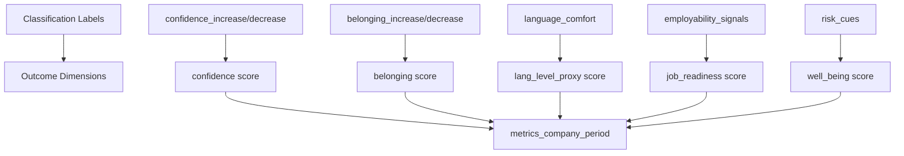

# Q2Q Label Taxonomy

**Last Updated:** 2025-11-13
**Version:** 1.0

## Table of Contents

- [Overview](#overview)
- [Production Label Set](#production-label-set)
  - [Confidence Labels](#confidence-labels)
  - [Belonging Labels](#belonging-labels)
  - [Language Comfort](#language-comfort)
  - [Employability Signals](#employability-signals)
  - [Risk Cues](#risk-cues)
- [Mapping to Outcome Dimensions](#mapping-to-outcome-dimensions)
- [Classification Output Schema](#classification-output-schema)
- [Example Classifications](#example-classifications)
- [Best Practices for Interpretation](#best-practices-for-interpretation)
- [Version History](#version-history)

## Overview

The **Q2Q (Qualitative-to-Quantitative) Label Taxonomy** defines the set of labels used by the AI classifier to extract structured outcome indicators from unstructured text data such as learner feedback, check-in notes, and volunteer observations.

The taxonomy is designed to capture key integration outcomes across five dimensions:
- **Confidence**: Self-assurance and belief in abilities
- **Belonging**: Sense of connection and community
- **Language Level Proxy**: Estimated language proficiency
- **Job Readiness**: Employment preparedness indicators
- **Well-Being**: Overall emotional and mental wellness

This system enables the platform to transform qualitative feedback into quantitative metrics while maintaining evidence lineage and traceability.

## Production Label Set

### Confidence Labels

#### `confidence_increase`

**Type:** Boolean
**Definition:** Indicates increased self-confidence, self-efficacy, or positive self-assessment.

**Examples:**
- "I feel more confident about my abilities now"
- "I can do this"
- "I'm proud of my progress"
- "I believe I can succeed"
- "Today I realized I'm capable of more than I thought"

**Score Mapping:** 0.8 (high confidence)

---

#### `confidence_decrease`

**Type:** Boolean
**Definition:** Indicates self-doubt, decreased confidence, or negative self-assessment.

**Examples:**
- "I don't think I can do this"
- "I'm not good enough"
- "I feel like I'm falling behind"
- "Maybe this isn't for me"
- "Everyone else seems to understand better than me"

**Score Mapping:** 0.2 (low confidence)

---

### Belonging Labels

#### `belonging_increase`

**Type:** Boolean
**Definition:** Indicates feeling connected, supported, or part of a community.

**Examples:**
- "My buddy has been so helpful"
- "I feel like I belong here"
- "The group is very supportive"
- "I enjoy working with my peers"
- "I finally found people who understand my journey"

**Score Mapping:** 0.8 (high belonging)

---

#### `belonging_decrease`

**Type:** Boolean
**Definition:** Indicates isolation, disconnection, or lack of support.

**Examples:**
- "I feel alone in this"
- "Nobody understands my situation"
- "I don't have anyone to help me"
- "I feel excluded"
- "It's hard to connect with others in the program"

**Score Mapping:** 0.2 (low belonging)

---

### Language Comfort

#### `language_comfort`

**Type:** Enum (`low`, `medium`, `high`)
**Definition:** Estimated language comfort level based on text complexity, vocabulary richness, grammar accuracy, and expressiveness.

**Indicators:**

| Level | Characteristics | Examples | Score |
|-------|----------------|----------|-------|
| **low** | Simple sentences, basic vocabulary, frequent errors, limited expression | "I go shop. Is good." | 0.3 |
| **medium** | Moderate complexity, some advanced vocabulary, occasional errors | "I went to the store yesterday and bought some groceries." | 0.6 |
| **high** | Complex sentences, rich vocabulary, few errors, nuanced expression | "I've been exploring different neighborhoods to find the best markets for fresh produce." | 0.9 |

**CEFR Correlation:**
- **low** ≈ A1-A2 (Beginner to Elementary)
- **medium** ≈ B1-B2 (Intermediate)
- **high** ≈ C1-C2 (Advanced to Proficiency)

---

### Employability Signals

#### `employability_signals`

**Type:** Array of enums
**Definition:** Indicators of job readiness and career development activities. Multiple signals can be present in a single text.

**Signal Types:**

| Signal | Description | Examples |
|--------|-------------|----------|
| **job_search** | Actively looking for employment, submitting applications | "I applied to three positions this week", "I'm looking for data analyst jobs" |
| **skills_gained** | Learning new skills, completing courses, gaining competencies | "I finished the Excel course", "I learned Python basics" |
| **networking** | Building professional connections, attending events | "I went to a networking event", "I connected with professionals on LinkedIn" |
| **resume_improvement** | Working on CV/resume, application materials | "I updated my resume", "My buddy helped me rewrite my cover letter" |
| **interview_prep** | Preparing for interviews, practicing responses | "We practiced interview questions", "I'm preparing for my interview next week" |
| **certification** | Pursuing certifications or credentials | "I'm studying for my AWS certification", "I got my project management certificate" |
| **portfolio_building** | Creating portfolio, work samples, projects | "I'm building a portfolio website", "I completed a project for my portfolio" |
| **career_goal_setting** | Defining career objectives, planning next steps | "I decided to focus on software engineering", "I have a clear career path now" |

**Score Calculation:**
```
job_readiness_score = min(0.3 + (count * 0.15), 1.0)
```

Where `count` is the number of signals detected (0-5+).

---

### Risk Cues

#### `risk_cues`

**Type:** Array of enums
**Definition:** Warning signs of potential disengagement, distress, or barriers to success. Multiple cues can be present.

**Risk Types:**

| Risk Cue | Description | Examples |
|----------|-------------|----------|
| **isolation** | Feeling alone, disconnected from peers or support | "I have no one to talk to", "I'm doing this completely on my own" |
| **frustration** | Expressing anger, irritation, or exasperation | "This is so frustrating", "Nothing is working", "I'm fed up with this" |
| **disengagement** | Losing interest, motivation, or participation | "I don't feel like participating anymore", "I skipped the last few sessions" |
| **anxiety** | Expressing worry, stress, or overwhelm | "I'm so stressed about this", "I feel overwhelmed", "I'm anxious about the future" |
| **dropout_indication** | Considering leaving program or giving up | "I'm thinking about quitting", "Maybe I should stop", "This isn't worth it" |
| **confusion** | Expressing lack of understanding or direction | "I don't understand what I'm supposed to do", "I'm lost", "Nothing makes sense" |
| **negative_self_talk** | Self-criticism, negative self-perception | "I'm terrible at this", "I always fail", "I'm stupid" |
| **lack_of_support** | Perceiving insufficient help or resources | "There's no help available", "I need more support", "Nobody is helping me" |

**Well-Being Score Calculation:**
```
well_being_score = max(0.9 - (count * 0.15), 0.1)
```

Where `count` is the number of risk cues detected (0-5+).

---

## Mapping to Outcome Dimensions

The Q2Q labels map to five outcome dimensions stored in the `outcome_scores` table:



### Conversion Logic

```typescript
// Confidence score (0-1)
let confidenceScore = 0.5; // neutral baseline
if (confidence_increase) confidenceScore = 0.8;
if (confidence_decrease) confidenceScore = 0.2;

// Belonging score (0-1)
let belongingScore = 0.5; // neutral baseline
if (belonging_increase) belongingScore = 0.8;
if (belonging_decrease) belongingScore = 0.2;

// Language level proxy (0-1)
const langScores = {
  low: 0.3,
  medium: 0.6,
  high: 0.9
};
const langLevelScore = langScores[language_comfort];

// Job readiness (0-1)
const jobReadinessScore = Math.min(
  employability_signals.length * 0.15 + 0.3,
  1.0
);

// Well-being (0-1)
const wellBeingScore = Math.max(
  0.9 - (risk_cues.length * 0.15),
  0.1
);
```

---

## Classification Output Schema

The AI classifier returns structured JSON conforming to this schema:

```typescript
interface ClassificationOutput {
  // Boolean indicators
  confidence_increase: boolean;
  confidence_decrease: boolean;
  belonging_increase: boolean;
  belonging_decrease: boolean;

  // Language assessment
  language_comfort: 'low' | 'medium' | 'high';

  // Arrays of signals
  employability_signals: EmployabilitySignal[];
  risk_cues: RiskCue[];

  // Evidence snippets
  evidence: Array<{
    snippet: string;           // Text excerpt
    label_type: string;        // Which label this supports
    reasoning: string;         // Why this snippet is relevant
    position_start?: number;   // Character position start
    position_end?: number;     // Character position end
  }>;
}
```

---

## Example Classifications

### Example 1: Positive Progress

**Input Text:**
```
"I'm really happy with my progress this week. I completed the Python course
and even applied to two software developer positions. My buddy Sarah has been
amazing - she helped me polish my resume and we practiced interview questions.
I feel like I finally belong in this community."
```

**Classification Output:**
```json
{
  "confidence_increase": true,
  "confidence_decrease": false,
  "belonging_increase": true,
  "belonging_decrease": false,
  "language_comfort": "high",
  "employability_signals": [
    "skills_gained",
    "job_search",
    "resume_improvement",
    "interview_prep"
  ],
  "risk_cues": [],
  "evidence": [
    {
      "snippet": "I'm really happy with my progress this week",
      "label_type": "confidence_increase",
      "reasoning": "Expresses satisfaction and positive self-assessment"
    },
    {
      "snippet": "I feel like I finally belong in this community",
      "label_type": "belonging_increase",
      "reasoning": "Explicit statement of belonging and connection"
    },
    {
      "snippet": "completed the Python course",
      "label_type": "skills_gained",
      "reasoning": "Evidence of completing training"
    }
  ]
}
```

**Outcome Scores:**
- confidence: 0.8
- belonging: 0.8
- lang_level_proxy: 0.9
- job_readiness: 0.9
- well_being: 0.9

---

### Example 2: Struggling Learner

**Input Text:**
```
"I don't know if I can do this anymore. Everything is so confusing and I feel
like I'm not making any progress. I tried to attend the last session but I
felt so lost. Maybe this program isn't for me."
```

**Classification Output:**
```json
{
  "confidence_increase": false,
  "confidence_decrease": true,
  "belonging_increase": false,
  "belonging_decrease": false,
  "language_comfort": "medium",
  "employability_signals": [],
  "risk_cues": [
    "confusion",
    "dropout_indication",
    "disengagement",
    "negative_self_talk"
  ],
  "evidence": [
    {
      "snippet": "I don't know if I can do this anymore",
      "label_type": "confidence_decrease",
      "reasoning": "Expresses self-doubt and decreased confidence"
    },
    {
      "snippet": "Maybe this program isn't for me",
      "label_type": "dropout_indication",
      "reasoning": "Considering leaving the program"
    }
  ]
}
```

**Outcome Scores:**
- confidence: 0.2
- belonging: 0.5
- lang_level_proxy: 0.6
- job_readiness: 0.3
- well_being: 0.3

---

### Example 3: Beginner Language Level

**Input Text:**
```
"I go to store. Buy food. Is good. I like."
```

**Classification Output:**
```json
{
  "confidence_increase": false,
  "confidence_decrease": false,
  "belonging_increase": false,
  "belonging_decrease": false,
  "language_comfort": "low",
  "employability_signals": [],
  "risk_cues": [],
  "evidence": [
    {
      "snippet": "I go to store. Buy food. Is good.",
      "label_type": "language_comfort",
      "reasoning": "Simple sentences, basic vocabulary, limited grammatical structures"
    }
  ]
}
```

**Outcome Scores:**
- confidence: 0.5
- belonging: 0.5
- lang_level_proxy: 0.3
- job_readiness: 0.3
- well_being: 0.9

---

## Best Practices for Interpretation

### For Program Operators

1. **Context Matters**: Always consider the full context of feedback, not just individual labels
2. **Trends Over Time**: Track changes in label distributions over time to identify patterns
3. **Evidence Review**: Use the evidence lineage system to investigate unexpected scores
4. **Multiple Sources**: Combine signals from multiple feedback sources for more reliable assessment
5. **Cultural Sensitivity**: Be aware that expressions of confidence and belonging vary across cultures

### For Data Scientists

1. **Model Calibration**: Regularly evaluate classifier accuracy using the calibration endpoint
2. **Confidence Thresholds**: Set appropriate thresholds for model confidence (recommend 0.7+)
3. **Label Balance**: Monitor label distribution to detect classifier bias
4. **A/B Testing**: Compare different AI providers (Claude, OpenAI, Gemini) for accuracy
5. **Human-in-the-Loop**: Flag low-confidence classifications for manual review

### For Developers

1. **Version Tracking**: Always log `model_version` in `outcome_scores` table
2. **Provider Logging**: Track which AI provider was used for each classification
3. **Error Handling**: Handle cases where classification fails or returns invalid structure
4. **Rate Limiting**: Respect AI provider rate limits and implement exponential backoff
5. **Cost Monitoring**: Track API costs per classification across providers

---

## Version History

### v1.0 (2025-11-13)

**Initial Production Release**

- Defined 5 outcome dimensions (confidence, belonging, language, job readiness, well-being)
- Established 2 confidence labels (increase/decrease)
- Established 2 belonging labels (increase/decrease)
- Defined 3-level language comfort scale (low, medium, high)
- Defined 8 employability signal types
- Defined 8 risk cue types
- Implemented evidence snippet extraction with reasoning
- Integrated with Claude, OpenAI, and Gemini AI providers
- Created score conversion formulas for backward compatibility

**Breaking Changes:** None (initial release)

**Migration Notes:** None (initial release)

---

## Related Documentation

- [Evidence Lineage System](./Evidence_Lineage.md) - How Q2Q scores link to evidence snippets
- [Metrics Catalog](./Metrics_Catalog.md) - How Q2Q scores aggregate into metrics
- [Platform Architecture](./Platform_Architecture.md) - Overall system architecture
- [Database Optimization](./Database_Optimization.md) - Schema and indexing for Q2Q tables

---

## Support

For questions about the Q2Q taxonomy:
- **Technical Issues**: Contact Q2Q AI service team
- **Label Definitions**: Review this document and classifier prompts
- **Accuracy Concerns**: Run calibration tests and review confusion matrix
- **Feature Requests**: Submit proposals to Worker 2 team lead

---

**Document Maintained By:** Worker 2 - Q2Q AI Architect
**Review Cadence:** Quarterly or with major label taxonomy changes
