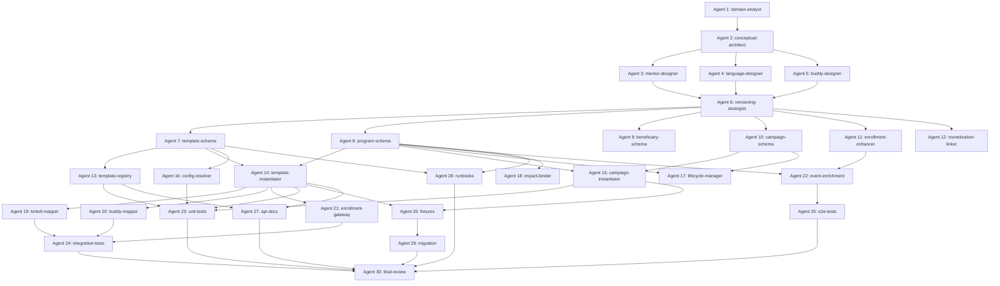

# SWARM 3: Program Template System
## 30-Agent Orchestration Plan

**Status**: 🔍 AWAITING APPROVAL
**Created**: 2025-11-22
**Branch**: `claude/program-template-system-01FDQRZk75bdeHEHrt3ASCm7`

---

## Table of Contents

1. [Agent Roster](#1-agent-roster)
2. [Dependency Graph](#2-dependency-graph)
3. [Execution Batches](#3-execution-batches)
4. [Agent Specifications](#4-agent-specifications)
5. [File/Module Structure](#5-filemodule-structure)
6. [Quality Gates](#6-quality-gates)
7. [Communication Protocol](#7-communication-protocol)

---

## 1. Agent Roster

### Domain & Template Design (Agents 1–6)

| # | Agent Name | Role | Phase |
|---|------------|------|-------|
| 1 | **program-domain-analyst** | Analyze existing program entities and document gaps | Plan |
| 2 | **template-conceptual-architect** | Define template vs instance vs campaign concepts | Plan |
| 3 | **mentor-template-designer** | Design mentorship template schema and defaults | Plan |
| 4 | **language-template-designer** | Design language practice template schema and defaults | Plan |
| 5 | **buddy-template-designer** | Design buddy integration template schema and defaults | Plan |
| 6 | **template-versioning-strategist** | Define versioning, deprecation, and migration strategy | Plan |

### Data Model & Schema Implementation (Agents 7–12)

| # | Agent Name | Role | Phase |
|---|------------|------|-------|
| 7 | **template-schema-engineer** | Implement `program_templates` table and types | Schema |
| 8 | **program-instance-modeler** | Implement `programs` table and types | Schema |
| 9 | **beneficiary-group-modeler** | Implement `beneficiary_groups` table and types | Schema |
| 10 | **company-program-linker** | Implement `program_campaigns` table and types | Schema |
| 11 | **enrollment-schema-enhancer** | Add new columns to `program_enrollments` | Schema |
| 12 | **monetization-metadata-modeler** | Add L2I program allocation linking | Schema |

### Template Engine & Instantiation Logic (Agents 13–18)

| # | Agent Name | Role | Phase |
|---|------------|------|-------|
| 13 | **template-registry-implementer** | Create Template Registry service | Engine |
| 14 | **template-instantiator** | Implement template → program instantiation | Engine |
| 15 | **campaign-instantiator** | Implement program → campaign instantiation | Engine |
| 16 | **config-resolver** | Implement config merging and validation logic | Engine |
| 17 | **lifecycle-state-manager** | Implement state machine for programs/campaigns | Engine |
| 18 | **template-impact-config-binder** | Link templates to SROI/VIS config hooks | Engine |

### Integration with Ingested Data (Agents 19–22)

| # | Agent Name | Role | Phase |
|---|------------|------|-------|
| 19 | **kintell-program-mapper** | Update Kintell connector to associate programs | Integration |
| 20 | **buddy-program-mapper** | Update Buddy connector to associate programs | Integration |
| 21 | **enrollment-gateway-updater** | Update enrollment creation to use program_id | Integration |
| 22 | **event-enrichment-engineer** | Add program context to all relevant events | Integration |

### Testing, Validation & Docs (Agents 23–28)

| # | Agent Name | Role | Phase |
|---|------------|------|-------|
| 23 | **unit-test-writer** | Write unit tests for schemas, engine, validation | Testing |
| 24 | **integration-test-writer** | Write integration tests for workflows | Testing |
| 25 | **e2e-test-writer** | Write E2E tests for full lifecycle | Testing |
| 26 | **fixture-builder** | Create seed data and test fixtures | Testing |
| 27 | **api-doc-writer** | Write OpenAPI spec and API docs | Docs |
| 28 | **runbook-writer** | Write operational runbooks and guides | Docs |

### Governance, Safety & Final Review (Agents 29–30)

| # | Agent Name | Role | Phase |
|---|------------|------|-------|
| 29 | **migration-engineer** | Create backfill migrations and rollback scripts | Migration |
| 30 | **final-integration-reviewer** | Perform end-to-end review and validation | Review |

---

## 2. Dependency Graph



---

## 3. Execution Batches

### Batch 0: Planning Phase (Sequential)
**Agents**: 1, 2, 3, 4, 5, 6
**Duration**: ~2 hours
**Deliverables**: Design documents, schema definitions, template defaults

**Sequence**:
1. **Agent 1** (domain-analyst) - 20 min
2. **Agent 2** (conceptual-architect) - 30 min
3. **Agents 3, 4, 5** (template designers) - 45 min PARALLEL
4. **Agent 6** (versioning-strategist) - 25 min

**Output**: Complete architecture design, template specs approved

---

### Batch 1: Schema Implementation (Parallel)
**Agents**: 7, 8, 9, 10, 11, 12
**Duration**: ~1 hour
**Deliverables**: Database migrations, Drizzle schemas, TypeScript types

**Parallel Execution** (all 6 agents run simultaneously):
- Agent 7: `program_templates` table
- Agent 8: `programs` table
- Agent 9: `beneficiary_groups` table
- Agent 10: `program_campaigns` table
- Agent 11: Alter `program_enrollments` table
- Agent 12: `l2i_program_allocations` table

**Quality Gate**:
- [ ] All migrations up/down tested
- [ ] Schema linting passes
- [ ] No breaking changes to existing tables
- [ ] Indexes created for query patterns

---

### Batch 2: Engine Core (Parallel)
**Agents**: 13, 14, 15, 16, 17, 18
**Duration**: ~1.5 hours
**Deliverables**: program-service implementation, instantiation logic

**Parallel Execution** (all 6 agents run simultaneously):
- Agent 13: Template Registry + CRUD
- Agent 14: Template → Program instantiation
- Agent 15: Program → Campaign instantiation
- Agent 16: Config resolution logic
- Agent 17: Lifecycle state machine
- Agent 18: Impact config binding

**Quality Gate**:
- [ ] Service starts successfully
- [ ] Health check passes
- [ ] Unit tests ≥80% coverage
- [ ] Config merging is deterministic

---

### Batch 3: Integration Hooks (Parallel)
**Agents**: 19, 20, 21, 22
**Duration**: ~1 hour
**Deliverables**: Updated connectors, event enrichment

**Parallel Execution** (all 4 agents run simultaneously):
- Agent 19: Kintell connector updates
- Agent 20: Buddy connector updates
- Agent 21: Enrollment gateway updates
- Agent 22: Event contract extensions

**Quality Gate**:
- [ ] Existing connectors still work
- [ ] New program_id fields populated
- [ ] Events include program context
- [ ] Backward compatibility maintained

---

### Batch 4: Testing Suite (Parallel)
**Agents**: 23, 24, 25, 26
**Duration**: ~1.5 hours
**Deliverables**: Comprehensive test coverage, seed data

**Parallel Execution** (all 4 agents run simultaneously):
- Agent 23: Unit tests (schemas, engine, validation)
- Agent 24: Integration tests (workflows, API)
- Agent 25: E2E tests (full lifecycle)
- Agent 26: Fixtures and seed data

**Quality Gate**:
- [ ] Unit tests ≥80% coverage
- [ ] Integration tests ≥60% coverage
- [ ] E2E tests cover happy path + error cases
- [ ] Seed data includes 3 templates + 5 programs

---

### Batch 5: Documentation & Migration (Parallel)
**Agents**: 27, 28, 29
**Duration**: ~1 hour
**Deliverables**: API docs, runbooks, migration scripts

**Parallel Execution** (all 3 agents run simultaneously):
- Agent 27: OpenAPI spec + API reference
- Agent 28: Runbooks + operational guides
- Agent 29: Backfill migration scripts

**Quality Gate**:
- [ ] OpenAPI spec validates
- [ ] All endpoints documented
- [ ] Runbooks cover common ops tasks
- [ ] Migration tested on staging data

---

### Batch 6: Final Review (Sequential)
**Agents**: 30
**Duration**: ~30 min
**Deliverables**: Final validation, PR readiness checklist

**Agent 30 Tasks**:
1. Run full test suite
2. Verify all quality gates passed
3. Check documentation completeness
4. Validate migration scripts
5. Generate coverage reports
6. Create PR description with screenshots
7. Flag any blockers or risks

**Quality Gate**:
- [ ] All previous gates passed
- [ ] No blocking issues
- [ ] PR ready for review

---

## 4. Agent Specifications

### Agent 1: program-domain-analyst

**Role**: Analyze existing program-related entities in the CSR Platform

**Dependencies**: None (first agent)

**Tools**: Read, Grep, Glob

**Deliverables**:
1. `/reports/swarm3/domain-analysis.md` - Current state of program entities
2. Gap analysis document
3. Entity relationship diagram

**Success Criteria**:
- [ ] Documented all current uses of `programType`
- [ ] Identified all tables referencing programs
- [ ] Listed all event contracts with program fields
- [ ] Flagged breaking change risks

**Execution**:
```bash
# Search for all program references
grep -r "programType\|program_type" packages/shared-schema/src/schema/
grep -r "programType" packages/event-contracts/src/
grep -r "ProgramType" packages/shared-types/src/
```

---

### Agent 2: template-conceptual-architect

**Role**: Define template vs instance vs campaign concepts

**Dependencies**: Agent 1

**Tools**: Read, Write

**Deliverables**:
1. `/docs/PROGRAM_CONCEPTS.md` - Conceptual model
2. Example use cases
3. Data flow diagrams

**Success Criteria**:
- [ ] Clear distinction between template/program/campaign
- [ ] Inheritance model defined
- [ ] Lifecycle states documented
- [ ] Configuration precedence rules specified

**Key Decisions**:
- Template = reusable blueprint
- Program = global instance of template
- Campaign = company-specific instance of program
- Enrollment = user participation in campaign or program

---

### Agent 3: mentor-template-designer

**Role**: Design mentorship template schema and defaults

**Dependencies**: Agent 2

**Tools**: Write

**Deliverables**:
1. `/packages/program-templates/src/schemas/mentorship-template.ts` - Zod schema
2. `/packages/program-templates/src/defaults/mentorship.json` - Default config
3. `/docs/templates/MENTORSHIP_TEMPLATE.md` - Documentation

**Success Criteria**:
- [ ] Zod schema validates correctly
- [ ] Default config covers all required fields
- [ ] Session configuration options defined
- [ ] Matching criteria configurable
- [ ] Impact weights specified

**Schema Outline**:
```typescript
MentorshipTemplateConfigSchema = z.object({
  session: { defaultDurationMinutes, recommendedFrequency, minSessionsForCompletion },
  matching: { autoMatch, criteria: { skills, interests, languages, location } },
  progression: { trackCEFR, milestones },
  impact: { sroiWeights, visMultipliers },
  sdgGoals: [4, 8, 10]
});
```

---

### Agent 4: language-template-designer

**Role**: Design language practice template schema and defaults

**Dependencies**: Agent 2

**Tools**: Write

**Deliverables**:
1. `/packages/program-templates/src/schemas/language-template.ts` - Zod schema
2. `/packages/program-templates/src/defaults/language.json` - Default config
3. `/docs/templates/LANGUAGE_TEMPLATE.md` - Documentation

**Success Criteria**:
- [ ] CEFR level tracking defined
- [ ] Conversation topics library structure
- [ ] Assessment intervals configurable
- [ ] Language pair support specified

**Schema Outline**:
```typescript
LanguageTemplateConfigSchema = z.object({
  cefr: { targetLevels, assessmentIntervals, progressionThresholds },
  session: { defaultDurationMinutes, recommendedFrequency, topicLibrary },
  matching: { languagePairs, proficiencyGap },
  impact: { sroiWeights, visMultipliers },
  sdgGoals: [4, 10, 16]
});
```

---

### Agent 5: buddy-template-designer

**Role**: Design buddy integration template schema and defaults

**Dependencies**: Agent 2

**Tools**: Write

**Deliverables**:
1. `/packages/program-templates/src/schemas/buddy-template.ts` - Zod schema
2. `/packages/program-templates/src/defaults/buddy.json` - Default config
3. `/docs/templates/BUDDY_TEMPLATE.md` - Documentation

**Success Criteria**:
- [ ] Matching algorithm parameters defined
- [ ] Event types categorized
- [ ] Check-in cadence configurable
- [ ] Skill exchange topics specified

**Schema Outline**:
```typescript
BuddyTemplateConfigSchema = z.object({
  matching: { criteria, algorithmWeights },
  checkins: { frequency, moodTracking },
  events: { types, categories, impactWeights },
  skillSharing: { topics, validationRules },
  milestones: { integrationStages },
  impact: { sroiWeights, visMultipliers },
  sdgGoals: [1, 10, 16, 17]
});
```

---

### Agent 6: template-versioning-strategist

**Role**: Define versioning, deprecation, and migration strategy

**Dependencies**: Agents 3, 4, 5

**Tools**: Write

**Deliverables**:
1. `/docs/TEMPLATE_VERSIONING.md` - Versioning strategy
2. `/docs/TEMPLATE_MIGRATION.md` - Migration guide
3. `/packages/program-templates/src/versioning/` - Version comparison utilities

**Success Criteria**:
- [ ] Semantic versioning rules defined
- [ ] Deprecation workflow documented
- [ ] Breaking change detection logic
- [ ] Migration script templates

**Key Decisions**:
- Version stored as integer (1, 2, 3, ...)
- deprecated_by field points to newer version
- Programs stay on original template version by default
- Opt-in migration with validation warnings

---

### Agent 7: template-schema-engineer

**Role**: Implement `program_templates` table and Drizzle schema

**Dependencies**: Agent 6

**Tools**: Write, Edit, Bash

**Deliverables**:
1. `/packages/shared-schema/src/schema/program-templates.ts` - Drizzle schema
2. `/packages/shared-schema/migrations/00XX_create_program_templates.sql` - Migration
3. `/packages/shared-types/src/program-templates.ts` - TypeScript types

**Success Criteria**:
- [ ] Migration up/down tested
- [ ] Indexes created for query patterns
- [ ] Constraints validated (UNIQUE, NOT NULL, CHECK)
- [ ] TypeScript types exported

**Migration SQL**:
```sql
CREATE TABLE program_templates (
  id UUID PRIMARY KEY DEFAULT gen_random_uuid(),
  template_key VARCHAR(100) UNIQUE NOT NULL,
  name VARCHAR(255) NOT NULL,
  description TEXT,
  category VARCHAR(50) NOT NULL,
  config_schema JSONB NOT NULL,
  default_config JSONB NOT NULL,
  ui_schema JSONB,
  version INTEGER DEFAULT 1,
  status VARCHAR(20) DEFAULT 'active',
  deprecated_by UUID REFERENCES program_templates(id),
  tags TEXT[],
  sdg_goals INTEGER[],
  owner_id UUID REFERENCES users(id),
  tenant_id UUID REFERENCES companies(id),
  default_sroi_weights JSONB,
  default_vis_multipliers JSONB,
  created_at TIMESTAMPTZ DEFAULT NOW() NOT NULL,
  updated_at TIMESTAMPTZ DEFAULT NOW() NOT NULL,
  created_by UUID REFERENCES users(id)
);

CREATE INDEX idx_program_templates_category ON program_templates(category);
CREATE INDEX idx_program_templates_status ON program_templates(status);
CREATE INDEX idx_program_templates_tenant ON program_templates(tenant_id);
```

---

### Agent 8: program-instance-modeler

**Role**: Implement `programs` table and Drizzle schema

**Dependencies**: Agent 6

**Tools**: Write, Edit, Bash

**Deliverables**:
1. `/packages/shared-schema/src/schema/programs.ts` - Drizzle schema
2. `/packages/shared-schema/migrations/00XX_create_programs.sql` - Migration
3. `/packages/shared-types/src/programs.ts` - TypeScript types

**Success Criteria**:
- [ ] Foreign keys to templates and beneficiary groups
- [ ] Config JSONB validation
- [ ] Lifecycle status enum validated
- [ ] Metric columns for aggregates

**Migration SQL**:
```sql
CREATE TABLE programs (
  id UUID PRIMARY KEY DEFAULT gen_random_uuid(),
  program_key VARCHAR(100) UNIQUE NOT NULL,
  template_id UUID NOT NULL REFERENCES program_templates(id),
  name VARCHAR(255) NOT NULL,
  description TEXT,
  program_type VARCHAR(50) NOT NULL,
  config JSONB NOT NULL,
  config_overrides JSONB,
  beneficiary_group_id UUID REFERENCES beneficiary_groups(id),
  status VARCHAR(20) DEFAULT 'draft',
  start_date DATE,
  end_date DATE,
  owner_id UUID REFERENCES users(id),
  visibility VARCHAR(20) DEFAULT 'public',
  enrollment_count INTEGER DEFAULT 0,
  active_enrollment_count INTEGER DEFAULT 0,
  completion_count INTEGER DEFAULT 0,
  average_completion_rate DECIMAL(5,4),
  tags TEXT[],
  sdg_goals INTEGER[],
  external_id VARCHAR(255),
  created_at TIMESTAMPTZ DEFAULT NOW() NOT NULL,
  updated_at TIMESTAMPTZ DEFAULT NOW() NOT NULL,
  created_by UUID REFERENCES users(id)
);

CREATE INDEX idx_programs_template ON programs(template_id);
CREATE INDEX idx_programs_status ON programs(status);
CREATE INDEX idx_programs_beneficiary_group ON programs(beneficiary_group_id);
CREATE INDEX idx_programs_type ON programs(program_type);
```

---

### Agent 9: beneficiary-group-modeler

**Role**: Implement `beneficiary_groups` table

**Dependencies**: Agent 6

**Tools**: Write, Edit, Bash

**Deliverables**:
1. `/packages/shared-schema/src/schema/beneficiary-groups.ts` - Drizzle schema
2. `/packages/shared-schema/migrations/00XX_create_beneficiary_groups.sql` - Migration
3. `/packages/shared-types/src/beneficiary-groups.ts` - TypeScript types

**Success Criteria**:
- [ ] Demographics JSONB flexible
- [ ] Eligibility criteria configurable
- [ ] Geographic filtering supported

**Migration SQL**:
```sql
CREATE TABLE beneficiary_groups (
  id UUID PRIMARY KEY DEFAULT gen_random_uuid(),
  group_key VARCHAR(100) UNIQUE NOT NULL,
  name VARCHAR(255) NOT NULL,
  description TEXT,
  demographics JSONB,
  primary_region VARCHAR(100),
  countries TEXT[],
  cities TEXT[],
  eligibility_criteria JSONB,
  status VARCHAR(20) DEFAULT 'active',
  active_from DATE,
  active_until DATE,
  tags TEXT[],
  external_id VARCHAR(255),
  created_at TIMESTAMPTZ DEFAULT NOW() NOT NULL,
  updated_at TIMESTAMPTZ DEFAULT NOW() NOT NULL,
  created_by UUID REFERENCES users(id)
);

CREATE INDEX idx_beneficiary_groups_status ON beneficiary_groups(status);
CREATE INDEX idx_beneficiary_groups_region ON beneficiary_groups(primary_region);
```

---

### Agent 10: company-program-linker

**Role**: Implement `program_campaigns` table

**Dependencies**: Agent 8

**Tools**: Write, Edit, Bash

**Deliverables**:
1. `/packages/shared-schema/src/schema/program-campaigns.ts` - Drizzle schema
2. `/packages/shared-schema/migrations/00XX_create_program_campaigns.sql` - Migration
3. `/packages/shared-types/src/program-campaigns.ts` - TypeScript types

**Success Criteria**:
- [ ] Foreign keys to programs and companies
- [ ] Capacity management fields
- [ ] L2I subscription linking
- [ ] Budget tracking columns

**Migration SQL**:
```sql
CREATE TABLE program_campaigns (
  id UUID PRIMARY KEY DEFAULT gen_random_uuid(),
  campaign_key VARCHAR(100) UNIQUE NOT NULL,
  program_id UUID NOT NULL REFERENCES programs(id),
  company_id UUID NOT NULL REFERENCES companies(id),
  name VARCHAR(255) NOT NULL,
  description TEXT,
  config_overrides JSONB,
  status VARCHAR(20) DEFAULT 'draft',
  start_date DATE NOT NULL,
  end_date DATE,
  target_enrollment INTEGER,
  max_enrollment INTEGER,
  current_enrollment INTEGER DEFAULT 0,
  l2i_subscription_id UUID REFERENCES l2i_subscriptions(id),
  budget_allocated INTEGER,
  budget_spent INTEGER DEFAULT 0,
  completion_count INTEGER DEFAULT 0,
  average_sroi DECIMAL(10,2),
  average_vis DECIMAL(10,2),
  tags TEXT[],
  internal_code VARCHAR(100),
  created_at TIMESTAMPTZ DEFAULT NOW() NOT NULL,
  updated_at TIMESTAMPTZ DEFAULT NOW() NOT NULL,
  created_by UUID REFERENCES users(id)
);

CREATE INDEX idx_campaigns_program ON program_campaigns(program_id);
CREATE INDEX idx_campaigns_company ON program_campaigns(company_id);
CREATE INDEX idx_campaigns_status ON program_campaigns(status);
CREATE INDEX idx_campaigns_l2i_subscription ON program_campaigns(l2i_subscription_id);
```

---

### Agent 11: enrollment-schema-enhancer

**Role**: Add new columns to `program_enrollments` table

**Dependencies**: Agents 8, 10

**Tools**: Edit, Bash

**Deliverables**:
1. Updated `/packages/shared-schema/src/schema/users.ts` (program_enrollments)
2. `/packages/shared-schema/migrations/00XX_alter_program_enrollments.sql` - Migration

**Success Criteria**:
- [ ] New columns added without breaking existing code
- [ ] Indexes created for new foreign keys
- [ ] Backward compatibility maintained

**Migration SQL**:
```sql
ALTER TABLE program_enrollments
  ADD COLUMN program_id UUID REFERENCES programs(id),
  ADD COLUMN campaign_id UUID REFERENCES program_campaigns(id),
  ADD COLUMN beneficiary_group_id UUID REFERENCES beneficiary_groups(id),
  ADD COLUMN enrollment_metadata JSONB DEFAULT '{}',
  ADD COLUMN source_system VARCHAR(50),
  ADD COLUMN source_id VARCHAR(255);

CREATE INDEX idx_program_enrollments_program ON program_enrollments(program_id);
CREATE INDEX idx_program_enrollments_campaign ON program_enrollments(campaign_id);
CREATE INDEX idx_program_enrollments_beneficiary_group ON program_enrollments(beneficiary_group_id);

-- Backfill programType from program.program_type (run by Agent 29)
```

---

### Agent 12: monetization-metadata-modeler

**Role**: Create L2I program allocation linking table

**Dependencies**: Agent 10

**Tools**: Write, Edit, Bash

**Deliverables**:
1. `/packages/shared-schema/src/schema/l2i-program-allocations.ts` - Drizzle schema
2. `/packages/shared-schema/migrations/00XX_create_l2i_program_allocations.sql` - Migration

**Success Criteria**:
- [ ] Links L2I subscriptions to specific programs
- [ ] Tracks budget allocation per program
- [ ] Supports campaign-level tracking

**Migration SQL**:
```sql
CREATE TABLE l2i_program_allocations (
  id UUID PRIMARY KEY DEFAULT gen_random_uuid(),
  l2i_subscription_id UUID NOT NULL REFERENCES l2i_subscriptions(id) ON DELETE CASCADE,
  program_id UUID REFERENCES programs(id),
  campaign_id UUID REFERENCES program_campaigns(id),
  company_id UUID NOT NULL REFERENCES companies(id) ON DELETE CASCADE,
  allocation_percentage DECIMAL(5,4) NOT NULL,
  allocation_amount_usd INTEGER NOT NULL,
  learners_served INTEGER DEFAULT 0,
  average_sroi DECIMAL(10,2),
  average_vis DECIMAL(10,2),
  engagement_rate DECIMAL(5,4),
  evidence_snippets JSONB,
  period_start TIMESTAMPTZ NOT NULL,
  period_end TIMESTAMPTZ NOT NULL,
  last_calculated_at TIMESTAMPTZ,
  created_at TIMESTAMPTZ DEFAULT NOW() NOT NULL,
  updated_at TIMESTAMPTZ DEFAULT NOW() NOT NULL
);

CREATE INDEX idx_l2i_prog_alloc_subscription ON l2i_program_allocations(l2i_subscription_id);
CREATE INDEX idx_l2i_prog_alloc_program ON l2i_program_allocations(program_id);
CREATE INDEX idx_l2i_prog_alloc_campaign ON l2i_program_allocations(campaign_id);
```

---

### Agent 13: template-registry-implementer

**Role**: Create program-service with Template Registry

**Dependencies**: Agent 7

**Tools**: Write, Bash

**Deliverables**:
1. `/services/program-service/` - New service directory
2. `/services/program-service/src/routes/templates.ts` - Template CRUD endpoints
3. `/services/program-service/src/lib/template-registry.ts` - Registry logic
4. `/services/program-service/package.json` - Service dependencies

**Success Criteria**:
- [ ] Service starts on port 3021
- [ ] Health check endpoint responds
- [ ] Template CRUD endpoints functional
- [ ] Zod validation integrated

**Endpoints**:
```typescript
POST   /templates                    // Create template
GET    /templates                    // List templates (with filters)
GET    /templates/:id                // Get template by ID
PUT    /templates/:id                // Update template
POST   /templates/:id/deprecate      // Deprecate template
DELETE /templates/:id                // Soft delete template
```

**Service Structure**:
```
services/program-service/
├── src/
│   ├── index.ts
│   ├── app.ts
│   ├── routes/
│   │   ├── templates.ts
│   │   ├── programs.ts
│   │   ├── campaigns.ts
│   │   └── health.ts
│   ├── lib/
│   │   ├── template-registry.ts
│   │   ├── config-resolver.ts
│   │   └── validators.ts
│   └── __tests__/
├── package.json
├── tsconfig.json
└── README.md
```

---

### Agent 14: template-instantiator

**Role**: Implement template → program instantiation

**Dependencies**: Agents 7, 8

**Tools**: Write, Edit

**Deliverables**:
1. `/services/program-service/src/routes/programs.ts` - Program CRUD endpoints
2. `/services/program-service/src/lib/instantiator.ts` - Instantiation logic
3. `/services/program-service/src/lib/config-validator.ts` - Config validation

**Success Criteria**:
- [ ] Template → Program workflow functional
- [ ] Config merging tested
- [ ] Validation against template schema
- [ ] Event emission on creation

**Endpoints**:
```typescript
POST   /programs                     // Create program from template
GET    /programs                     // List programs
GET    /programs/:id                 // Get program
PUT    /programs/:id                 // Update program
PUT    /programs/:id/status          // Change status
GET    /programs/:id/config          // Get effective config
PUT    /programs/:id/config          // Update config
```

**Instantiation Logic**:
```typescript
async function instantiateProgram(req: {
  templateId: string;
  name: string;
  beneficiaryGroupId?: string;
  configOverrides?: object;
}): Promise<Program> {
  // 1. Fetch template
  const template = await db.query.programTemplates.findFirst({
    where: eq(programTemplates.id, req.templateId)
  });

  // 2. Validate configOverrides against template.config_schema
  const ConfigSchema = zodFromJson(template.config_schema);
  const mergedConfig = { ...template.default_config, ...req.configOverrides };
  ConfigSchema.parse(mergedConfig);

  // 3. Create program
  const program = await db.insert(programs).values({
    templateId: req.templateId,
    name: req.name,
    programType: template.category,
    config: mergedConfig,
    configOverrides: req.configOverrides,
    beneficiaryGroupId: req.beneficiaryGroupId,
    // ...
  });

  // 4. Emit event
  await eventBus.publish('program.created', { programId: program.id, ... });

  return program;
}
```

---

### Agent 15: campaign-instantiator

**Role**: Implement program → campaign instantiation

**Dependencies**: Agents 8, 10

**Tools**: Write, Edit

**Deliverables**:
1. `/services/program-service/src/routes/campaigns.ts` - Campaign CRUD endpoints
2. `/services/program-service/src/lib/campaign-instantiator.ts` - Campaign creation logic

**Success Criteria**:
- [ ] Program → Campaign workflow functional
- [ ] Capacity checks enforced
- [ ] Budget allocation tracked
- [ ] L2I subscription linking

**Endpoints**:
```typescript
POST   /programs/:programId/campaigns         // Create campaign
GET    /programs/:programId/campaigns         // List campaigns for program
GET    /campaigns/:id                         // Get campaign
PUT    /campaigns/:id                         // Update campaign
PUT    /campaigns/:id/status                  // Change status
GET    /campaigns/:id/enrollments             // List enrollments
POST   /campaigns/:id/enrollments             // Create enrollment
```

---

### Agent 16: config-resolver

**Role**: Implement config merging and validation logic

**Dependencies**: Agent 7

**Tools**: Write

**Deliverables**:
1. `/services/program-service/src/lib/config-resolver.ts` - Config resolution
2. `/packages/program-templates/src/config-utils.ts` - Shared utilities
3. Unit tests for config merging

**Success Criteria**:
- [ ] Deep merge algorithm tested
- [ ] Precedence rules enforced (template < program < campaign)
- [ ] Override tracking implemented
- [ ] Validation errors user-friendly

**Config Resolution**:
```typescript
function resolveConfig(
  templateDefaults: object,
  programConfig: object,
  campaignOverrides: object
): { effective: object; overrides: string[] } {
  const effective = deepMerge(templateDefaults, programConfig, campaignOverrides);
  const overrides = findOverriddenKeys(templateDefaults, effective);
  return { effective, overrides };
}
```

---

### Agent 17: lifecycle-state-manager

**Role**: Implement state machine for programs and campaigns

**Dependencies**: Agents 8, 10

**Tools**: Write

**Deliverables**:
1. `/services/program-service/src/lib/lifecycle.ts` - State machine
2. `/services/program-service/src/lib/transitions.ts` - Transition validations

**Success Criteria**:
- [ ] Valid state transitions defined
- [ ] Invalid transitions blocked
- [ ] Events emitted on state changes
- [ ] Audit log of transitions

**State Machine**:
```typescript
// Programs & Campaigns: draft → active → paused → completed → archived
const transitions = {
  draft: ['active', 'archived'],
  active: ['paused', 'completed', 'archived'],
  paused: ['active', 'completed', 'archived'],
  completed: ['archived'],
  archived: []
};

async function transitionStatus(
  entityType: 'program' | 'campaign',
  id: string,
  toStatus: string
): Promise<void> {
  const entity = await fetchEntity(entityType, id);
  if (!transitions[entity.status].includes(toStatus)) {
    throw new Error(`Invalid transition: ${entity.status} → ${toStatus}`);
  }

  await updateStatus(entityType, id, toStatus);
  await eventBus.publish(`${entityType}.${toStatus}`, { id, ... });
}
```

---

### Agent 18: template-impact-config-binder

**Role**: Link templates to SROI/VIS configuration

**Dependencies**: Agent 8

**Tools**: Write, Edit

**Deliverables**:
1. `/services/program-service/src/lib/impact-config.ts` - Impact config builder
2. Updated SROI/VIS calculators to read from program config

**Success Criteria**:
- [ ] Template default SROI weights used
- [ ] Program/campaign can override weights
- [ ] VIS multipliers configurable
- [ ] Impact calculations use program-specific config

**Impact Config Structure**:
```typescript
interface ImpactConfig {
  sroiWeights: Record<string, number>; // activity_type → value_points
  visMultipliers: Record<string, number>; // activity_type → points
  decayFactor?: number;
  confidenceThresholds?: object;
}

// Example from mentorship template
{
  sroiWeights: {
    'session_completed': 10.0,
    'milestone_reached': 25.0,
    'program_completed': 100.0
  },
  visMultipliers: {
    'session_completed': 5.0,
    'feedback_positive': 2.0
  }
}
```

---

### Agent 19: kintell-program-mapper

**Role**: Update Kintell connector to associate programs

**Dependencies**: Agent 14

**Tools**: Edit

**Deliverables**:
1. Updated `/services/kintell-connector/src/processors/session-processor.ts`
2. Program lookup logic
3. Enriched event emission

**Success Criteria**:
- [ ] Sessions linked to program_id
- [ ] Company campaigns detected and linked
- [ ] Backward compatibility maintained

**Mapping Logic**:
```typescript
// In kintell session processor
async function processSessionCompleted(event: KintellSessionCompleted) {
  // 1. Lookup program by external_id or beneficiary group
  const program = await db.query.programs.findFirst({
    where: and(
      eq(programs.programType, event.sessionType === 'language' ? 'language' : 'mentorship'),
      or(
        eq(programs.externalId, `kintell:${event.tenantId}`),
        // ... other lookup strategies
      )
    )
  });

  // 2. If company known, lookup campaign
  let campaignId = null;
  if (event.companyId && program) {
    const campaign = await db.query.programCampaigns.findFirst({
      where: and(
        eq(programCampaigns.programId, program.id),
        eq(programCampaigns.companyId, event.companyId),
        eq(programCampaigns.status, 'active')
      )
    });
    campaignId = campaign?.id;
  }

  // 3. Create/update enrollment
  await db.insert(programEnrollments).values({
    userId: event.participantId,
    programType: program.programType, // LEGACY
    programId: program.id,
    campaignId,
    sourceSystem: 'kintell',
    sourceId: event.sessionId,
    // ...
  });

  // 4. Emit enriched event
  await eventBus.publish('kintell.session.completed', {
    ...event,
    programId: program.id,
    campaignId,
    templateId: program.templateId
  });
}
```

---

### Agent 20: buddy-program-mapper

**Role**: Update Buddy connector to associate programs

**Dependencies**: Agent 14

**Tools**: Edit

**Deliverables**:
1. Updated `/services/buddy-connector/src/processors/event-processor.ts`
2. Beneficiary group detection logic
3. Enriched event emission

**Success Criteria**:
- [ ] Matches linked to program_id
- [ ] Beneficiary group inferred from participant profile
- [ ] Campaign linking functional

**Mapping Logic**:
```typescript
// In buddy match processor
async function processMatchCreated(event: BuddyMatchCreated) {
  // 1. Lookup participant's beneficiary group (from profile or external system)
  const participantProfile = await db.query.users.findFirst({
    where: eq(users.id, event.participantId)
  });

  const beneficiaryGroupId = participantProfile.metadata?.beneficiaryGroupId;

  // 2. Lookup buddy program for this beneficiary group
  const program = await db.query.programs.findFirst({
    where: and(
      eq(programs.programType, 'buddy'),
      eq(programs.beneficiaryGroupId, beneficiaryGroupId),
      eq(programs.status, 'active')
    )
  });

  // 3. Detect company campaign (if buddy is company volunteer)
  let campaignId = null;
  const buddyProfile = await db.query.users.findFirst({
    where: eq(users.id, event.buddyId)
  });

  if (buddyProfile.companyId && program) {
    const campaign = await db.query.programCampaigns.findFirst({
      where: and(
        eq(programCampaigns.programId, program.id),
        eq(programCampaigns.companyId, buddyProfile.companyId),
        eq(programCampaigns.status, 'active')
      )
    });
    campaignId = campaign?.id;
  }

  // 4. Create enrollment
  await db.insert(programEnrollments).values({
    userId: event.participantId,
    programType: 'buddy', // LEGACY
    programId: program.id,
    campaignId,
    beneficiaryGroupId,
    sourceSystem: 'buddy',
    sourceId: event.matchId,
    // ...
  });

  // 5. Store program context in match metadata
  await db.update(buddyMatches)
    .set({
      metadata: {
        programId: program.id,
        campaignId,
        templateId: program.templateId
      }
    })
    .where(eq(buddyMatches.id, event.matchId));
}
```

---

### Agent 21: enrollment-gateway-updater

**Role**: Update enrollment creation to use program_id

**Dependencies**: Agent 14

**Tools**: Edit, Grep

**Deliverables**:
1. Updated enrollment creation logic across all services
2. Program lookup utilities
3. Dual-write implementation

**Success Criteria**:
- [ ] All enrollment creation uses program_id
- [ ] programType still populated (denormalized)
- [ ] No breaking changes to existing code

**Files to Update**:
```bash
# Find all enrollment creation calls
grep -r "programEnrollments" services/*/src/
grep -r "program_enrollments" services/*/src/
```

**Dual-Write Pattern**:
```typescript
// Before
await db.insert(programEnrollments).values({
  userId,
  programType: 'language',
  enrolledAt: new Date(),
  status: 'active'
});

// After
const program = await lookupProgram({ type: 'language', beneficiaryGroupId });
await db.insert(programEnrollments).values({
  userId,
  programType: 'language', // LEGACY (derived from program.programType)
  programId: program.id, // NEW
  campaignId: campaign?.id, // NEW (if company-sponsored)
  beneficiaryGroupId: program.beneficiaryGroupId, // NEW
  enrolledAt: new Date(),
  status: 'active'
});
```

---

### Agent 22: event-enrichment-engineer

**Role**: Add program context to all relevant events

**Dependencies**: Agents 8, 11

**Tools**: Edit

**Deliverables**:
1. Updated event contracts with program fields
2. Event enrichment middleware
3. Documentation of changed events

**Success Criteria**:
- [ ] All enrollment events include program_id
- [ ] Session/match/event completions include program context
- [ ] Backward compatibility maintained (optional fields)

**Events to Update**:
```typescript
// packages/event-contracts/src/

// Enrollment events (NEW)
'program.enrollment.created' - Add programId, campaignId, templateId
'program.enrollment.completed' - Add programId, campaignId

// Buddy events (UPDATE)
'buddy.match.created' - Add programId?, campaignId?
'buddy.event.attended' - Add programId?, campaignId?
'buddy.checkin.completed' - Add programId?, campaignId?

// Kintell events (UPDATE)
'kintell.session.completed' - Add programId?, campaignId?
'kintell.rating.created' - Add programId?, campaignId?

// Upskilling events (UPDATE)
'upskilling.course.completed' - Add programId?, campaignId?
'upskilling.progress.updated' - Add programId?, campaignId?
```

**Enrichment Middleware**:
```typescript
// In event bus publish
async function publishEnrichedEvent(type: string, data: object) {
  // Auto-enrich with program context if user/enrollment present
  if (data.enrollmentId) {
    const enrollment = await db.query.programEnrollments.findFirst({
      where: eq(programEnrollments.id, data.enrollmentId)
    });
    data.programId = enrollment.programId;
    data.campaignId = enrollment.campaignId;
    data.templateId = enrollment.program?.templateId;
  }

  await eventBus.publish(type, data);
}
```

---

### Agent 23: unit-test-writer

**Role**: Write unit tests for schemas, engine, validation

**Dependencies**: Agents 13, 14, 15, 16

**Tools**: Write

**Deliverables**:
1. `/services/program-service/src/__tests__/template-registry.test.ts`
2. `/services/program-service/src/__tests__/instantiator.test.ts`
3. `/services/program-service/src/__tests__/config-resolver.test.ts`
4. `/packages/program-templates/src/__tests__/schemas.test.ts`

**Success Criteria**:
- [ ] Unit test coverage ≥80%
- [ ] All Zod schemas validated
- [ ] Config merging edge cases covered
- [ ] State machine transitions tested

**Test Coverage**:
```typescript
// Template Registry
- Create template
- Update template
- Deprecate template
- Version comparison
- Schema validation errors

// Instantiator
- Template → Program
- Program → Campaign
- Config override merging
- Invalid config rejection
- Beneficiary group validation

// Config Resolver
- Deep merge correctness
- Precedence rules
- Override tracking
- Null/undefined handling
- Circular reference protection
```

---

### Agent 24: integration-test-writer

**Role**: Write integration tests for workflows

**Dependencies**: Agents 19, 20, 21

**Tools**: Write, Bash

**Deliverables**:
1. `/services/program-service/src/__tests__/integration/workflows.test.ts`
2. `/tests/integration/program-system/` - Cross-service tests

**Success Criteria**:
- [ ] Integration test coverage ≥60%
- [ ] End-to-end workflows tested
- [ ] Database transactions validated
- [ ] Event emission verified

**Test Scenarios**:
```typescript
// Workflow Tests
1. Create template → Instantiate program → Create campaign → Enroll user
2. Kintell session → Lookup program → Update enrollment → Emit event
3. Buddy match → Detect campaign → Link to program → Update metrics
4. L2I subscription → Create campaign → Track allocation → Calculate impact
5. Update template config → Validate existing programs unaffected
6. Deprecate template → Block new program creation → Allow existing to continue
```

---

### Agent 25: e2e-test-writer

**Role**: Write E2E tests for full lifecycle

**Dependencies**: Agent 22

**Tools**: Write, Bash

**Deliverables**:
1. `/tests/e2e/program-lifecycle.spec.ts` - Playwright tests
2. Test fixtures and seed data

**Success Criteria**:
- [ ] Happy path tested end-to-end
- [ ] Error scenarios covered
- [ ] UI interactions validated (if UI built)
- [ ] API responses verified

**E2E Scenarios**:
```typescript
// E2E Test Cases
1. Admin creates mentorship template
2. Admin creates program "Mentors for Syrians"
3. Company creates campaign from program
4. Volunteer enrolls in campaign
5. Kintell session completed → Enrollment updated
6. Dashboard shows program metrics
7. L2I allocation updated
8. Report generated with program attribution
```

---

### Agent 26: fixture-builder

**Role**: Create seed data and test fixtures

**Dependencies**: Agents 14, 15

**Tools**: Write

**Deliverables**:
1. `/scripts/seed/program-templates.ts` - Seed 3 templates
2. `/scripts/seed/programs.ts` - Seed 5 programs
3. `/scripts/seed/beneficiary-groups.ts` - Seed groups
4. `/tests/fixtures/program-system/` - Test fixtures

**Success Criteria**:
- [ ] 3 master templates seeded
- [ ] 5 programs created (covering all templates)
- [ ] 3 beneficiary groups defined
- [ ] 2 campaigns created
- [ ] 50 enrollments generated

**Seed Data**:
```typescript
// Templates
1. Mentorship Standard v1
2. Language Practice A1-C2 v1
3. Buddy Integration v1

// Beneficiary Groups
1. Ukrainian Refugees in Europe
2. Syrian Refugees Global
3. Afghan Refugees in US

// Programs
1. Mentors for Ukraine (template: mentorship, group: ukrainian)
2. Language for Ukraine (template: language, group: ukrainian)
3. Buddy for Ukraine (template: buddy, group: ukrainian)
4. Mentors for Syrian Refugees (template: mentorship, group: syrian)
5. Language for Afghan Refugees (template: language, group: afghan)

// Campaigns
1. Acme Corp - Language for Ukrainians Q1 2025
2. TechCo - Buddy for Syrians 2025
```

---

### Agent 27: api-doc-writer

**Role**: Write OpenAPI spec and API documentation

**Dependencies**: Agents 13, 14, 15

**Tools**: Write

**Deliverables**:
1. `/services/program-service/openapi.yaml` - OpenAPI 3.1 spec
2. `/docs/API_REFERENCE_PROGRAM_SERVICE.md` - API documentation
3. Postman collection (optional)

**Success Criteria**:
- [ ] OpenAPI spec validates
- [ ] All endpoints documented
- [ ] Request/response examples included
- [ ] Authentication documented

**OpenAPI Structure**:
```yaml
openapi: 3.1.0
info:
  title: Program Template System API
  version: 1.0.0
servers:
  - url: http://localhost:3021
paths:
  /templates:
    get: ...
    post: ...
  /templates/{id}:
    get: ...
    put: ...
    delete: ...
  /programs:
    get: ...
    post: ...
  # ... (all endpoints)
components:
  schemas:
    ProgramTemplate: ...
    Program: ...
    Campaign: ...
    # ...
```

---

### Agent 28: runbook-writer

**Role**: Write operational runbooks and guides

**Dependencies**: Agents 7, 8

**Tools**: Write

**Deliverables**:
1. `/docs/RUNBOOK_PROGRAM_TEMPLATES.md` - Operational guide
2. `/docs/TEMPLATE_AUTHORING_GUIDE.md` - Template creation guide
3. `/docs/CONFIG_SCHEMA_GUIDE.md` - Zod schema authoring
4. `/docs/TROUBLESHOOTING_PROGRAM_SYSTEM.md` - Common issues

**Success Criteria**:
- [ ] Common ops tasks documented
- [ ] Template creation walkthrough
- [ ] Troubleshooting guide complete
- [ ] Disaster recovery procedures

**Runbook Topics**:
```markdown
# Operations Runbook

## Common Tasks
- Create a new template
- Instantiate a program
- Create a company campaign
- Migrate enrollments to new program
- Deprecate a template version
- Rollback a bad config change

## Monitoring
- Health check endpoints
- Metrics to watch
- Alert thresholds
- Log locations

## Troubleshooting
- Enrollment not linking to program
- Config validation errors
- Template schema migration failures
- Event delivery issues

## Disaster Recovery
- Database backup/restore
- Rollback migrations
- Emergency config revert
```

---

### Agent 29: migration-engineer

**Role**: Create backfill migrations and rollback scripts

**Dependencies**: Agent 26

**Tools**: Write, Bash

**Deliverables**:
1. `/scripts/migrations/backfill-programs.ts` - Historical data migration
2. `/scripts/migrations/rollback-program-system.ts` - Rollback script
3. `/docs/MIGRATION_GUIDE.md` - Migration documentation

**Success Criteria**:
- [ ] Backfill script tested on staging data
- [ ] Rollback script functional
- [ ] Data validation checks pass
- [ ] Zero downtime migration plan

**Migration Steps**:
```typescript
// Backfill Migration

// Step 1: Create beneficiary groups for existing cohorts
await db.insert(beneficiaryGroups).values([
  { groupKey: 'ukrainian-refugees-2024', name: 'Ukrainian Refugees in Europe', ... },
  // ...
]);

// Step 2: Create programs from historical data
const languageProgram = await db.insert(programs).values({
  programKey: 'language-ukrainian-2024',
  templateId: languageTemplateId,
  name: 'Language for Ukrainian Refugees',
  programType: 'language',
  beneficiaryGroupId: ukrainianGroupId,
  config: { /* ... */ },
  status: 'active',
  startDate: '2024-01-01',
});

// Step 3: Backfill program_enrollments.program_id
await db.execute(sql`
  UPDATE program_enrollments pe
  SET program_id = p.id,
      beneficiary_group_id = p.beneficiary_group_id
  FROM programs p
  WHERE pe.program_type = p.program_type
    AND pe.program_id IS NULL;
`);

// Step 4: Validate backfill
const orphanedEnrollments = await db.query.programEnrollments.findMany({
  where: isNull(programEnrollments.programId)
});
if (orphanedEnrollments.length > 0) {
  throw new Error(`Found ${orphanedEnrollments.length} orphaned enrollments`);
}
```

**Rollback Script**:
```sql
-- Rollback: Remove new columns (keep old programType)
ALTER TABLE program_enrollments
  DROP COLUMN IF EXISTS program_id,
  DROP COLUMN IF EXISTS campaign_id,
  DROP COLUMN IF EXISTS beneficiary_group_id,
  DROP COLUMN IF EXISTS enrollment_metadata,
  DROP COLUMN IF EXISTS source_system,
  DROP COLUMN IF EXISTS source_id;

-- Drop new tables (in reverse dependency order)
DROP TABLE IF EXISTS l2i_program_allocations;
DROP TABLE IF EXISTS program_campaigns;
DROP TABLE IF EXISTS programs;
DROP TABLE IF EXISTS beneficiary_groups;
DROP TABLE IF EXISTS program_templates;
```

---

### Agent 30: final-integration-reviewer

**Role**: Perform end-to-end review and validation

**Dependencies**: Agents 23, 24, 25, 27, 28, 29

**Tools**: Read, Bash

**Deliverables**:
1. `/reports/swarm3/final-review-report.md` - Comprehensive review
2. `/reports/swarm3/coverage-report.md` - Test coverage analysis
3. `/reports/swarm3/pr-checklist.md` - PR readiness checklist

**Success Criteria**:
- [ ] All quality gates passed
- [ ] No blocking issues
- [ ] Test coverage thresholds met
- [ ] Documentation complete
- [ ] PR ready for review

**Review Checklist**:
```markdown
## Code Quality
- [ ] TypeScript strict mode enabled
- [ ] No `any` types used
- [ ] Linting passes (ESLint)
- [ ] Formatting passes (Prettier)
- [ ] No security vulnerabilities (npm audit)

## Testing
- [ ] Unit tests ≥80% coverage
- [ ] Integration tests ≥60% coverage
- [ ] E2E tests cover happy path
- [ ] Golden tests for config resolution
- [ ] All tests passing

## Database
- [ ] Migrations up/down tested
- [ ] Indexes created for query patterns
- [ ] Foreign keys validated
- [ ] Constraints enforced
- [ ] Backfill script tested

## API
- [ ] OpenAPI spec validates
- [ ] All endpoints documented
- [ ] Authentication/authorization implemented
- [ ] Rate limiting considered
- [ ] Error responses standardized

## Events
- [ ] Event contracts defined
- [ ] Backward compatibility maintained
- [ ] Idempotency guaranteed
- [ ] Correlation IDs propagated

## Documentation
- [ ] README updated
- [ ] API reference complete
- [ ] Runbooks written
- [ ] Migration guide published
- [ ] Architecture diagrams included

## Deployment
- [ ] Service deploys successfully
- [ ] Health checks pass
- [ ] Environment variables documented
- [ ] Rollback tested
- [ ] Monitoring configured

## Integration
- [ ] Kintell connector updated
- [ ] Buddy connector updated
- [ ] Event enrichment functional
- [ ] L2I allocation tracking works
- [ ] No breaking changes to existing services
```

---

## 5. File/Module Structure

```
TEEI-CSR-Platform/
├── docs/
│   ├── PROGRAM_TEMPLATE_SYSTEM_DESIGN.md ✅ (Created)
│   ├── SWARM_3_AGENT_ORCHESTRATION.md ✅ (This file)
│   ├── PROGRAM_CONCEPTS.md (Agent 2)
│   ├── TEMPLATE_VERSIONING.md (Agent 6)
│   ├── TEMPLATE_MIGRATION.md (Agent 6)
│   ├── API_REFERENCE_PROGRAM_SERVICE.md (Agent 27)
│   ├── RUNBOOK_PROGRAM_TEMPLATES.md (Agent 28)
│   ├── TEMPLATE_AUTHORING_GUIDE.md (Agent 28)
│   ├── CONFIG_SCHEMA_GUIDE.md (Agent 28)
│   ├── MIGRATION_GUIDE.md (Agent 29)
│   ├── TROUBLESHOOTING_PROGRAM_SYSTEM.md (Agent 28)
│   └── templates/
│       ├── MENTORSHIP_TEMPLATE.md (Agent 3)
│       ├── LANGUAGE_TEMPLATE.md (Agent 4)
│       └── BUDDY_TEMPLATE.md (Agent 5)
├── packages/
│   ├── shared-schema/
│   │   ├── src/schema/
│   │   │   ├── program-templates.ts (Agent 7)
│   │   │   ├── programs.ts (Agent 8)
│   │   │   ├── beneficiary-groups.ts (Agent 9)
│   │   │   ├── program-campaigns.ts (Agent 10)
│   │   │   ├── l2i-program-allocations.ts (Agent 12)
│   │   │   └── users.ts (UPDATED by Agent 11)
│   │   └── migrations/
│   │       ├── 00XX_create_program_templates.sql (Agent 7)
│   │       ├── 00XX_create_programs.sql (Agent 8)
│   │       ├── 00XX_create_beneficiary_groups.sql (Agent 9)
│   │       ├── 00XX_create_program_campaigns.sql (Agent 10)
│   │       ├── 00XX_alter_program_enrollments.sql (Agent 11)
│   │       └── 00XX_create_l2i_program_allocations.sql (Agent 12)
│   ├── shared-types/
│   │   └── src/
│   │       ├── program-templates.ts (Agent 7)
│   │       ├── programs.ts (Agent 8)
│   │       ├── beneficiary-groups.ts (Agent 9)
│   │       └── program-campaigns.ts (Agent 10)
│   ├── event-contracts/
│   │   └── src/
│   │       └── programs/
│   │           ├── template-created.ts (Agent 22)
│   │           ├── template-updated.ts (Agent 22)
│   │           ├── template-deprecated.ts (Agent 22)
│   │           ├── program-created.ts (Agent 22)
│   │           ├── program-updated.ts (Agent 22)
│   │           ├── program-status-changed.ts (Agent 22)
│   │           ├── campaign-created.ts (Agent 22)
│   │           ├── enrollment-created.ts (Agent 22)
│   │           └── index.ts (Agent 22)
│   └── program-templates/
│       ├── src/
│       │   ├── schemas/
│       │   │   ├── mentorship-template.ts (Agent 3)
│       │   │   ├── language-template.ts (Agent 4)
│       │   │   ├── buddy-template.ts (Agent 5)
│       │   │   └── index.ts
│       │   ├── defaults/
│       │   │   ├── mentorship.json (Agent 3)
│       │   │   ├── language.json (Agent 4)
│       │   │   └── buddy.json (Agent 5)
│       │   ├── config-utils.ts (Agent 16)
│       │   ├── versioning/
│       │   │   └── version-compare.ts (Agent 6)
│       │   └── __tests__/
│       │       └── schemas.test.ts (Agent 23)
│       ├── package.json
│       └── README.md
├── services/
│   ├── program-service/ (NEW by Agent 13)
│   │   ├── src/
│   │   │   ├── index.ts
│   │   │   ├── app.ts
│   │   │   ├── routes/
│   │   │   │   ├── health.ts (Agent 13)
│   │   │   │   ├── templates.ts (Agent 13)
│   │   │   │   ├── programs.ts (Agent 14)
│   │   │   │   ├── campaigns.ts (Agent 15)
│   │   │   │   └── beneficiary-groups.ts (Agent 9)
│   │   │   ├── lib/
│   │   │   │   ├── template-registry.ts (Agent 13)
│   │   │   │   ├── instantiator.ts (Agent 14)
│   │   │   │   ├── campaign-instantiator.ts (Agent 15)
│   │   │   │   ├── config-resolver.ts (Agent 16)
│   │   │   │   ├── config-validator.ts (Agent 14)
│   │   │   │   ├── lifecycle.ts (Agent 17)
│   │   │   │   ├── transitions.ts (Agent 17)
│   │   │   │   ├── impact-config.ts (Agent 18)
│   │   │   │   └── validators.ts (Agent 13)
│   │   │   └── __tests__/
│   │   │       ├── template-registry.test.ts (Agent 23)
│   │   │       ├── instantiator.test.ts (Agent 23)
│   │   │       ├── config-resolver.test.ts (Agent 23)
│   │   │       └── integration/
│   │   │           └── workflows.test.ts (Agent 24)
│   │   ├── openapi.yaml (Agent 27)
│   │   ├── package.json
│   │   ├── tsconfig.json
│   │   └── README.md
│   ├── kintell-connector/
│   │   └── src/
│   │       └── processors/
│   │           └── session-processor.ts (UPDATED by Agent 19)
│   ├── buddy-connector/
│   │   └── src/
│   │       └── processors/
│   │           └── event-processor.ts (UPDATED by Agent 20)
│   ├── analytics/
│   │   └── src/
│   │       └── calculators/
│   │           ├── sroi-calculator.ts (UPDATED by Agent 18)
│   │           └── vis-calculator.ts (UPDATED by Agent 18)
│   └── reporting/
│       └── src/
│           └── routes/
│               └── program-reports.ts (NEW by future swarm)
├── scripts/
│   ├── seed/
│   │   ├── program-templates.ts (Agent 26)
│   │   ├── programs.ts (Agent 26)
│   │   └── beneficiary-groups.ts (Agent 26)
│   └── migrations/
│       ├── backfill-programs.ts (Agent 29)
│       └── rollback-program-system.ts (Agent 29)
├── tests/
│   ├── e2e/
│   │   └── program-lifecycle.spec.ts (Agent 25)
│   ├── integration/
│   │   └── program-system/
│   │       └── workflows.test.ts (Agent 24)
│   └── fixtures/
│       └── program-system/
│           ├── templates.json (Agent 26)
│           ├── programs.json (Agent 26)
│           └── campaigns.json (Agent 26)
└── reports/
    └── swarm3/
        ├── domain-analysis.md (Agent 1)
        ├── final-review-report.md (Agent 30)
        ├── coverage-report.md (Agent 30)
        └── pr-checklist.md (Agent 30)
```

---

## 6. Quality Gates

### Per-Agent Gates

**Schema Agents (7-12)**:
- [ ] Migration up/down tested
- [ ] No breaking changes
- [ ] Indexes optimized
- [ ] Foreign keys validated

**Engine Agents (13-18)**:
- [ ] Service starts successfully
- [ ] Unit tests ≥80%
- [ ] Config validation works
- [ ] Events emitted correctly

**Integration Agents (19-22)**:
- [ ] Backward compatibility maintained
- [ ] Existing tests still pass
- [ ] New tests added
- [ ] Event enrichment functional

**Testing Agents (23-26)**:
- [ ] Coverage thresholds met
- [ ] All tests passing
- [ ] Fixtures representative
- [ ] Golden tests included

**Documentation Agents (27-28)**:
- [ ] OpenAPI validates
- [ ] All endpoints documented
- [ ] Runbooks complete
- [ ] Examples included

**Migration Agent (29)**:
- [ ] Backfill tested on staging
- [ ] Rollback functional
- [ ] Data validation passes
- [ ] Zero downtime plan

**Final Review (30)**:
- [ ] All previous gates passed
- [ ] No blocking issues
- [ ] PR ready

### Global Gates

**Before Merge**:
- [ ] All unit tests pass (≥80% coverage)
- [ ] All integration tests pass (≥60% coverage)
- [ ] All E2E tests pass
- [ ] Linting passes (ESLint)
- [ ] Type checking passes (TypeScript strict)
- [ ] Security audit passes (npm audit)
- [ ] No secrets in repo
- [ ] Documentation complete
- [ ] Migration tested
- [ ] Rollback tested
- [ ] PR approved by 2+ reviewers

---

## 7. Communication Protocol

### Daily Standups

**Time**: Start of each batch
**Duration**: 5 minutes
**Participants**: All agents in current batch + orchestrator

**Format**:
1. What I'm working on
2. Blockers (if any)
3. Dependencies needed

### Blocker Escalation

**Process**:
1. Agent detects blocker
2. Logs in `/reports/swarm3/blockers.md`
3. Notifies orchestrator immediately
4. Orchestrator resolves or reassigns

### Documentation

**Continuous**:
- Every agent updates `/reports/swarm3/progress.md` after completing tasks
- Decisions logged in `/reports/swarm3/decisions.md`
- Risks logged in `/reports/swarm3/risks.md`

### Artifacts

**Per-Agent**:
- Code changes committed with descriptive messages
- Tests included in same commit
- Documentation updated atomically

**Per-Batch**:
- Batch summary in `/reports/swarm3/batch-N-summary.md`
- Coverage reports generated
- Demo recordings (if UI changes)

---

## 8. Execution Timeline

| Phase | Batch | Duration | Agents | Deliverables |
|-------|-------|----------|--------|-------------|
| **Plan** | 0 | 2h | 1-6 | Architecture design, template specs |
| **Schema** | 1 | 1h | 7-12 | Database migrations, types |
| **Engine** | 2 | 1.5h | 13-18 | program-service, instantiation logic |
| **Integration** | 3 | 1h | 19-22 | Connector updates, event enrichment |
| **Testing** | 4 | 1.5h | 23-26 | Test suite, fixtures |
| **Docs** | 5 | 1h | 27-29 | API docs, runbooks, migrations |
| **Review** | 6 | 0.5h | 30 | Final validation, PR |
| **TOTAL** | - | **8.5h** | 30 | Complete Program Template System |

---

## 9. Risk Mitigation

### Risk 1: Breaking Changes
**Mitigation**: Dual-write strategy, keep `programType` denormalized, extensive testing

### Risk 2: Performance Degradation
**Mitigation**: Indexes on all foreign keys, caching resolved configs, query optimization

### Risk 3: Data Migration Errors
**Mitigation**: Dry-run on staging, rollback scripts, validation checks

### Risk 4: Complexity Overwhelms Users
**Mitigation**: Sensible defaults, wizard UIs, comprehensive docs

### Risk 5: Event Ordering Issues
**Mitigation**: Correlation IDs, idempotency keys, event versioning

---

## 10. Success Metrics

**Code Quality**:
- ✅ TypeScript strict mode
- ✅ Unit tests ≥80%
- ✅ Integration tests ≥60%
- ✅ Zero linting errors
- ✅ Zero security vulnerabilities

**Functionality**:
- ✅ 3 master templates created
- ✅ Template → Program → Campaign workflow functional
- ✅ Backward compatibility maintained
- ✅ Event enrichment working
- ✅ L2I integration functional

**Documentation**:
- ✅ API reference complete
- ✅ Runbooks published
- ✅ Migration guide ready
- ✅ Troubleshooting docs

**Deployment**:
- ✅ Service deploys successfully
- ✅ Health checks pass
- ✅ Monitoring configured
- ✅ Rollback tested

---

## Next Steps

1. **Approve this orchestration plan**
2. **Begin Batch 0 (Planning Phase)** - Agents 1-6
3. **Review agent outputs** after each batch
4. **Proceed to implementation** sequentially through batches

---

**Document Version**: 1.0
**Last Updated**: 2025-11-22
**Status**: Awaiting Approval
