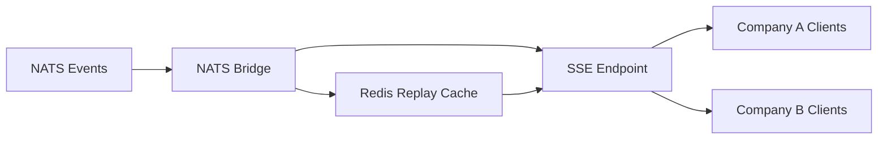

# Streaming Updates (SSE)

Server-Sent Events (SSE) implementation for real-time cockpit widget updates in the TEEI CSR Platform.

## Overview

The streaming updates system provides one-way server-to-client communication for real-time dashboard updates. Events from NATS are bridged to SSE streams, filtered by company scope for security.

## Architecture



### Components

1. **SSE Endpoint** (`/stream/updates`)
   - Handles EventSource connections
   - Company-scoped filtering
   - Heartbeat every 30 seconds
   - Auto-reconnection with replay

2. **NATS Bridge**
   - Subscribes to NATS subjects: `metrics.*`, `journey.*`, `q2q.*`
   - Transforms NATS events to SSE format
   - Routes events to appropriate companies
   - Handles backpressure (buffer limit: 100 events)

3. **Replay Cache**
   - Redis-backed event storage
   - 24-hour retention
   - Supports `lastEventId` parameter for reconnection

4. **Connection Registry**
   - Tracks active SSE connections per company
   - Automatic cleanup of stale connections (15 min idle timeout)
   - Statistics and monitoring

## API Reference

### Establish SSE Connection

```http
GET /stream/updates?companyId={companyId}&lastEventId={eventId}
```

**Query Parameters:**
- `companyId` (required): Company ID for scoping events
- `lastEventId` (optional): Last received event ID for replay

**Response Headers:**
```
Content-Type: text/event-stream
Cache-Control: no-cache
Connection: keep-alive
```

**Response Format:**
```
event: metric_updated
data: {"companyId":"...", "metricName":"integration_score", "value":0.85}
id: metrics.calculated-12345-1699999999999

event: journey_flag_updated
data: {"companyId":"...", "userId":"...", "flag":"struggling"}
id: journey.flag_updated-12346-1699999999999

:heartbeat
```

### Event Types

- `metric_updated`: Metric calculation completed
- `sroi_updated`: SROI calculation updated
- `vis_updated`: Q2Q analysis completed
- `journey_flag_updated`: User journey stage changed

### Get Streaming Statistics

```http
GET /stream/stats
```

**Response:**
```json
{
  "connections": {
    "totalConnections": 42,
    "activeCompanies": 5,
    "connectionsByCompany": {
      "company-a": 10,
      "company-b": 15,
      "company-c": 17
    }
  },
  "replayCache": {
    "companies": 5,
    "totalEvents": 1234,
    "eventsByCompany": {
      "company-a": 250,
      "company-b": 484,
      "company-c": 500
    }
  },
  "timestamp": "2025-11-13T12:00:00.000Z"
}
```

### Health Check

```http
GET /stream/health
```

**Response:**
```json
{
  "status": "ok",
  "streaming": {
    "enabled": true,
    "activeConnections": 42,
    "activeCompanies": 5
  },
  "timestamp": "2025-11-13T12:00:00.000Z"
}
```

## Client Implementation

### JavaScript (Browser)

```javascript
// Establish SSE connection
const companyId = 'your-company-id';
let lastEventId = localStorage.getItem('lastEventId');

const eventSource = new EventSource(
  `http://localhost:3007/stream/updates?companyId=${companyId}` +
  (lastEventId ? `&lastEventId=${lastEventId}` : '')
);

// Listen for metric updates
eventSource.addEventListener('metric_updated', (event) => {
  const data = JSON.parse(event.data);
  console.log('Metric updated:', data);

  // Store event ID for reconnection
  localStorage.setItem('lastEventId', event.lastEventId);

  // Update UI
  updateDashboardWidget(data);
});

// Listen for journey updates
eventSource.addEventListener('journey_flag_updated', (event) => {
  const data = JSON.parse(event.data);
  console.log('Journey flag updated:', data);

  // Update journey visualization
  updateJourneyMap(data);
});

// Handle connection errors
eventSource.onerror = (error) => {
  console.error('SSE connection error:', error);

  // EventSource will automatically reconnect
  // with lastEventId if we've set it
};

// Close connection when leaving page
window.addEventListener('beforeunload', () => {
  eventSource.close();
});
```

### React Hook

```javascript
import { useEffect, useState } from 'react';

function useSSEStream(companyId) {
  const [lastEvent, setLastEvent] = useState(null);
  const [connected, setConnected] = useState(false);

  useEffect(() => {
    const lastEventId = localStorage.getItem('lastEventId');
    const url = `http://localhost:3007/stream/updates?companyId=${companyId}` +
      (lastEventId ? `&lastEventId=${lastEventId}` : '');

    const eventSource = new EventSource(url);

    eventSource.onopen = () => {
      console.log('SSE connected');
      setConnected(true);
    };

    // Listen for all event types
    ['metric_updated', 'sroi_updated', 'vis_updated', 'journey_flag_updated'].forEach(
      (eventType) => {
        eventSource.addEventListener(eventType, (event) => {
          const data = JSON.parse(event.data);
          localStorage.setItem('lastEventId', event.lastEventId);
          setLastEvent({ type: eventType, data });
        });
      }
    );

    eventSource.onerror = () => {
      console.error('SSE error');
      setConnected(false);
    };

    return () => {
      eventSource.close();
    };
  }, [companyId]);

  return { lastEvent, connected };
}

// Usage
function DashboardWidget() {
  const { lastEvent, connected } = useSSEStream('your-company-id');

  useEffect(() => {
    if (lastEvent?.type === 'metric_updated') {
      console.log('New metric:', lastEvent.data);
      // Update widget
    }
  }, [lastEvent]);

  return (
    <div>
      <div>Status: {connected ? 'Connected' : 'Disconnected'}</div>
      {/* Widget content */}
    </div>
  );
}
```

## Configuration

### Environment Variables

```bash
# Enable streaming
STREAMING_ENABLED=true

# Analytics service port
PORT_ANALYTICS=3007

# NATS connection
NATS_URL=nats://localhost:4222

# Redis (for replay cache)
REDIS_URL=redis://localhost:6379
```

### Feature Flags

**Company-Level Feature Flag** (TODO):
```sql
-- Enable streaming for a specific company
UPDATE companies
SET features = jsonb_set(features, '{streaming}', 'true')
WHERE id = 'company-id';
```

## Security

### Company Scoping

All events are filtered by company ID. Clients can only receive events for their own company.

**Implementation:**
1. Extract `companyId` from query parameter
2. Verify user has access to that company (TODO: JWT verification)
3. Only route events matching the company ID

**TODO: JWT Verification**
```javascript
// Extract company ID from JWT token
const userCompanyId = request.user?.companyId;

// Verify it matches query parameter
if (userCompanyId !== companyId) {
  return reply.code(403).send({
    error: 'Forbidden',
    message: 'You can only stream events for your own company',
  });
}
```

## Performance

### Targets

- **Latency**: < 500ms end-to-end (NATS publish → SSE receive)
- **Throughput**: 1000 events/second
- **Concurrent Connections**: 100+ per company

### Optimizations

1. **Backpressure Handling**
   - Buffer limit: 100 events per connection
   - Drop oldest events if client is slow
   - Prevents memory exhaustion

2. **Replay Cache**
   - Redis-backed for fast access
   - 24-hour TTL
   - Automatic cleanup

3. **Connection Pooling**
   - Reuse NATS connections
   - Single event bus subscription per subject

4. **Heartbeat**
   - 30-second interval
   - Keeps connection alive
   - Detects disconnections

## Monitoring

### Metrics

Monitor these key metrics:
- Active connections per company
- Event delivery latency
- Replay cache hit rate
- Connection errors

### Logs

```javascript
// Connection established
logger.info({ companyId, lastEventId }, 'SSE connection established');

// Event broadcast
logger.debug({ companyId, eventType, recipients }, 'Broadcast complete');

// Connection closed
logger.info({ connectionId, companyId }, 'SSE connection closed');
```

## Troubleshooting

### Client Not Receiving Events

1. Check streaming is enabled: `GET /stream/health`
2. Verify company ID is correct
3. Check NATS bridge is running
4. Verify events are being published to NATS

### High Latency

1. Check NATS performance
2. Verify Redis is healthy
3. Check network between services
4. Review connection count (too many connections?)

### Connection Drops

1. Check idle timeout (default: 15 minutes)
2. Verify heartbeat is working
3. Check client reconnection logic
4. Review server logs for errors

### Memory Issues

1. Check connection count
2. Verify buffer limits are enforced
3. Review replay cache size
4. Check for connection leaks

## Testing

### Unit Tests

```bash
cd services/analytics
pnpm test src/__tests__/sse.test.ts
```

### Load Test

```bash
cd tests/k6
k6 run streaming-load.js
```

**Expected Results:**
- 95% of events arrive in < 500ms
- 95%+ connection success rate
- < 10 connection errors

### Manual Testing

```bash
# Test SSE connection with curl
curl -N -H "Accept: text/event-stream" \
  "http://localhost:3007/stream/updates?companyId=test-company"

# Publish test event to NATS
nats pub metrics.calculated '{"companyId":"test-company","metricName":"test","value":1}'
```

## Roadmap

- [ ] JWT authentication and company verification
- [ ] Per-company feature flags in database
- [ ] Enhanced replay with persistent storage
- [ ] Compression for high-volume streams
- [ ] WebSocket fallback for older browsers
- [ ] Multi-region support with edge caching
