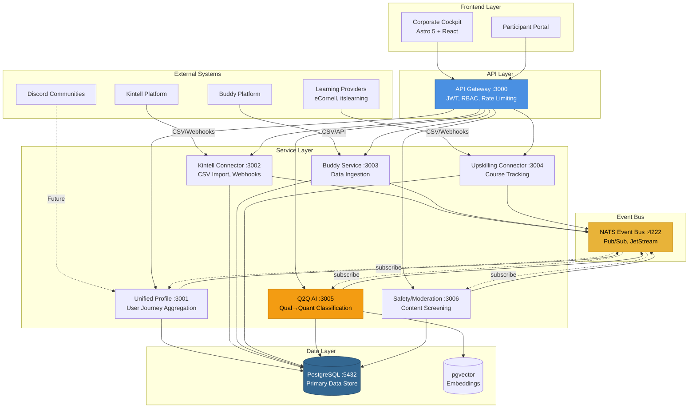
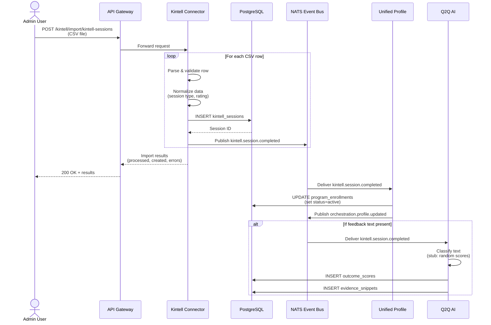
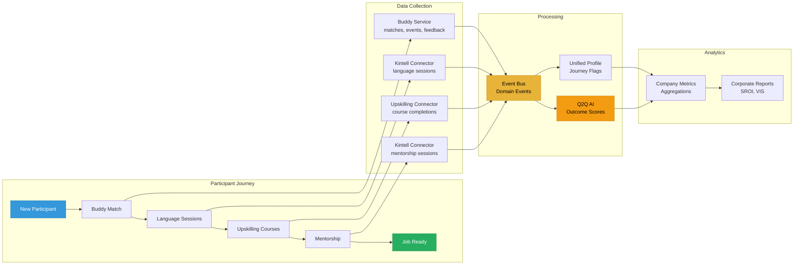
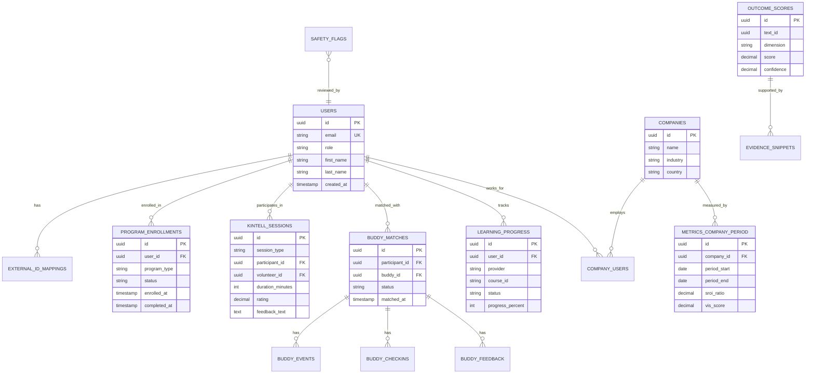
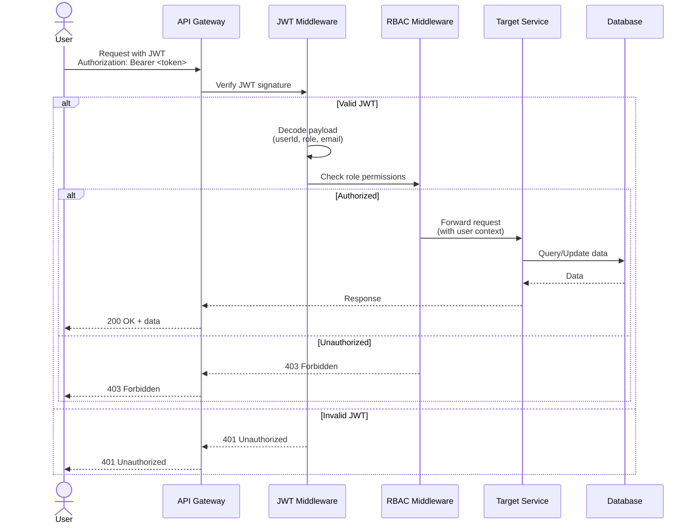
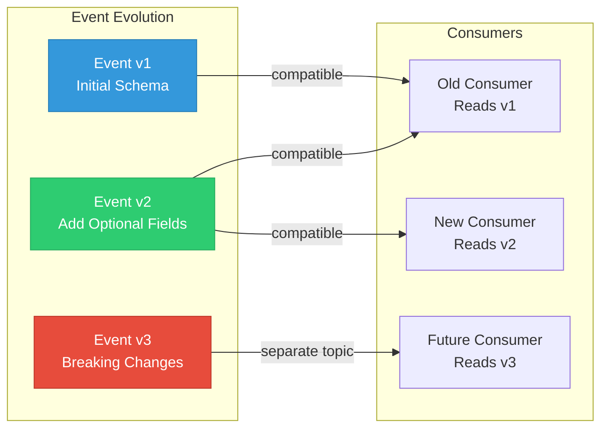

# TEEI CSR Platform - System Diagram

## High-Level System Architecture



## Event Flow: CSV Import to Profile Update



## Data Flow: Multi-Program Journey



## Database Schema Overview



## Deployment Architecture (Future)

```mermaid
graph TB
    subgraph "External"
        Users[Users/Clients]
        Admin[Admin Users]
    end

    subgraph "CDN / Load Balancer"
        LB[Load Balancer<br/>ALB/CloudFlare]
    end

    subgraph "Kubernetes Cluster"
        subgraph "Ingress"
            Ingress[NGINX Ingress]
        end

        subgraph "Services Namespace"
            GW1[API Gateway Pod 1]
            GW2[API Gateway Pod 2]
            Prof1[Profile Pod 1]
            Prof2[Profile Pod 2]
            Kint[Kintell Pod]
            Bud[Buddy Pod]
            Upsk[Upskilling Pod]
            Q2QPod[Q2Q AI Pod]
            Safe[Safety Pod]
        end

        subgraph "Event Bus"
            NATS1[NATS Pod 1]
            NATS2[NATS Pod 2]
            NATS3[NATS Pod 3]
        end
    end

    subgraph "Managed Services"
        RDS[(RDS PostgreSQL<br/>Multi-AZ)]
        Redis[(Redis Cache)]
        S3[S3 Bucket<br/>CSV Storage]
    end

    subgraph "Observability"
        Grafana[Grafana<br/>Dashboards]
        Prom[Prometheus<br/>Metrics]
        Loki[Loki<br/>Logs]
    end

    Users --> LB
    Admin --> LB
    LB --> Ingress

    Ingress --> GW1
    Ingress --> GW2

    GW1 --> Prof1
    GW1 --> Prof2
    GW1 --> Kint
    GW1 --> Bud
    GW2 --> Prof1
    GW2 --> Prof2
    GW2 --> Upsk
    GW2 --> Q2QPod

    Prof1 --> RDS
    Prof2 --> RDS
    Kint --> RDS
    Bud --> RDS
    Upsk --> RDS
    Q2QPod --> RDS
    Safe --> RDS

    Prof1 --> Redis
    Prof2 --> Redis

    Kint --> NATS1
    Bud --> NATS2
    Upsk --> NATS3
    Prof1 --> NATS1
    Q2QPod --> NATS2

    NATS1 <--> NATS2
    NATS2 <--> NATS3
    NATS1 <--> NATS3

    GW1 -.->|metrics| Prom
    Prof1 -.->|metrics| Prom
    Kint -.->|logs| Loki
    Prom --> Grafana
    Loki --> Grafana

    style LB fill:#4A90E2,stroke:#2E5C8A,color:#fff
    style RDS fill:#336791,stroke:#244564,color:#fff
    style NATS1 fill:#E8B339,stroke:#C99729,color:#000
    style NATS2 fill:#E8B339,stroke:#C99729,color:#000
    style NATS3 fill:#E8B339,stroke:#C99729,color:#000
```

## Security Flow: Authentication & Authorization



## Event Versioning Strategy



---

**Diagram Format**: Mermaid (render with GitHub, GitLab, or Mermaid Live Editor)
**Last Updated**: 2025-11-13
**Document Owner**: TEEI Platform Team
