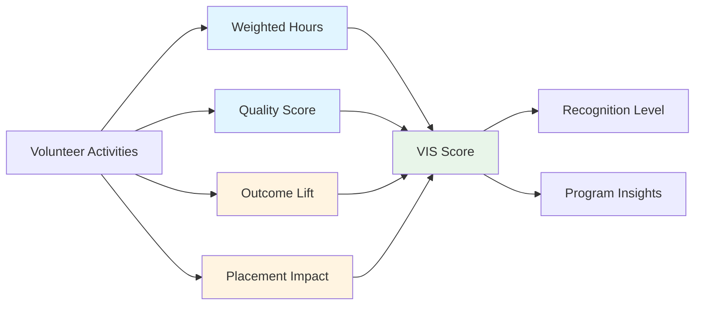

# VIS Model Documentation

**Last Updated:** 2025-11-13
**Version:** 1.0

## Table of Contents

- [Overview](#overview)
- [VIS Formula](#vis-formula)
- [Component Definitions](#component-definitions)
  - [Weighted Hours](#weighted-hours)
  - [Quality Score](#quality-score)
  - [Outcome Lift](#outcome-lift)
  - [Placement Impact](#placement-impact)
- [Weight Rationale](#weight-rationale)
- [Calculation Examples](#calculation-examples)
- [Normalization to 0-100 Scale](#normalization-to-0-100-scale)
- [Use Cases](#use-cases)
- [Comparison with Industry Standards](#comparison-with-industry-standards)
- [Implementation Guide](#implementation-guide)
- [Frequently Asked Questions](#frequently-asked-questions)

---

## Overview

The **Volunteer Impact Score (VIS)** is a composite metric designed to quantify the effectiveness and impact of volunteer engagement in integration programs. Unlike simple volunteer hour tracking, VIS combines multiple dimensions to provide a holistic assessment of volunteer contribution quality and outcomes.

**Key Principles:**
1. **Multi-dimensional**: Combines quantity (hours), quality (satisfaction), and outcomes (impact)
2. **Evidence-based**: Relies on measurable data from multiple sources
3. **Actionable**: Provides clear signals for volunteer recognition and program improvement
4. **Fair**: Accounts for different volunteer roles and engagement patterns

**Score Range:** 0-100 points
- **0-30**: Developing (early stage or limited data)
- **31-50**: Good (solid contribution)
- **51-70**: Excellent (strong impact)
- **71-85**: Outstanding (exceptional performance)
- **86-100**: Transformational (top-tier impact)

---

## VIS Formula

### Core Formula

```
VIS = (weighted_hours × 0.30) + (quality_score × 0.30) + (outcome_lift × 0.25) + (placement_impact × 0.15)
```

Where all components are normalized to a 0-100 scale before weighting.

### Visual Representation



### Component Weights Summary

| Component | Weight | Rationale |
|-----------|--------|-----------|
| **Weighted Hours** | 30% | Quantity matters, but with diminishing returns |
| **Quality Score** | 30% | Participant satisfaction is crucial |
| **Outcome Lift** | 25% | Measurable improvement is the core goal |
| **Placement Impact** | 15% | Ultimate success metric, but longer timeframe |

**Total:** 100% (weights sum to 1.0)

---

## Component Definitions

### Weighted Hours

#### Definition

The **Weighted Hours** component measures the quantity of volunteer time invested, using a logarithmic scale to reflect diminishing marginal returns of additional hours.

#### Formula

```
weighted_hours_score = min((total_hours / MAX_HOURS_FOR_FULL_SCORE) × 100, 100)
```

Where:
- `total_hours` = Sum of all volunteer hours in the evaluation period
- `MAX_HOURS_FOR_FULL_SCORE` = 1000 hours (configurable)

#### Rationale

**Why logarithmic scaling?**
- Prevents hours-only gaming (more hours ≠ automatically better)
- Reflects reality: 100 hours of high-quality mentoring > 500 hours of low-quality engagement
- Encourages quality over quantity
- Caps at 1000 hours = 100 points (1% per 10 hours)

#### Examples

| Total Hours | Weighted Hours Score | Notes |
|-------------|---------------------|-------|
| 0 | 0.0 | No activity |
| 50 | 5.0 | Early stage volunteer |
| 100 | 10.0 | Regular volunteer |
| 250 | 25.0 | Active volunteer |
| 500 | 50.0 | Highly active volunteer |
| 750 | 75.0 | Very committed volunteer |
| 1000 | 100.0 | Maximum hours score |
| 1500 | 100.0 | Capped at 100 |

#### Hour Type Weighting (Optional Enhancement)

Some programs may differentiate hour types:

| Activity Type | Weight Multiplier | Examples |
|--------------|------------------|----------|
| Direct mentoring | 1.0x | 1-on-1 buddy sessions |
| Group facilitation | 1.2x | Workshop leading (higher skill) |
| Administrative | 0.8x | Coordination, planning |
| Event support | 0.9x | Event logistics |

**Example with weighting:**
- 100 hours direct mentoring: 100 × 1.0 = 100 weighted hours
- 50 hours group facilitation: 50 × 1.2 = 60 weighted hours
- 30 hours admin: 30 × 0.8 = 24 weighted hours
- **Total:** 184 weighted hours → 18.4 points

---

### Quality Score

#### Definition

The **Quality Score** measures participant satisfaction and engagement quality through Q2Q-derived outcome dimensions.

#### Formula

```
quality_score = avg(confidence, belonging, well_being, job_readiness) × 100
```

Where:
- `confidence` = Average confidence dimension score from Q2Q (0-1)
- `belonging` = Average belonging dimension score from Q2Q (0-1)
- `well_being` = Average well-being dimension score from Q2Q (0-1)
- `job_readiness` = Average job readiness dimension score from Q2Q (0-1)

#### Data Source

Quality scores are derived from participant feedback that mentions the volunteer, classified by the Q2Q AI system:

```sql
SELECT AVG(score) as dimension_avg
FROM outcome_scores
WHERE text_type IN ('buddy_feedback', 'kintell_feedback', 'checkin_note')
  AND dimension IN ('confidence', 'belonging', 'well_being', 'job_readiness')
  AND text_id IN (
    SELECT feedback_id
    FROM feedback_mentions
    WHERE volunteer_id = :volunteer_id
  )
  AND created_at BETWEEN :start_date AND :end_date
GROUP BY dimension;
```

#### Interpretation

| Quality Score | Rating | Participant Experience |
|--------------|--------|----------------------|
| **0-40** | Poor | Participants express dissatisfaction, frustration, or disengagement |
| **41-60** | Fair | Mixed feedback, some positive indicators |
| **61-75** | Good | Generally positive, participants feel supported |
| **76-85** | Very Good | Strong positive feedback, high satisfaction |
| **86-100** | Exceptional | Outstanding feedback, transformative experience |

#### Example Calculation

**Scenario:** Volunteer with 20 feedback mentions over 3 months

Q2Q dimension averages:
- Confidence: 0.78
- Belonging: 0.82
- Well-being: 0.75
- Job readiness: 0.70

```
quality_score = ((0.78 + 0.82 + 0.75 + 0.70) / 4) × 100
              = (3.05 / 4) × 100
              = 0.7625 × 100
              = 76.25 points
```

**Rating:** Very Good

---

### Outcome Lift

#### Definition

The **Outcome Lift** measures the percentage of participants showing measurable improvement in their integration journey during or after volunteer engagement.

#### Formula

```
outcome_lift = (participants_with_improvement / total_participants) × 100
```

Where:
- `participants_with_improvement` = Count of participants with positive change in any outcome dimension
- `total_participants` = Total participants engaged by the volunteer

#### Improvement Criteria

A participant shows "improvement" if any of the following occur:

| Dimension | Improvement Criteria | Measurement Method |
|-----------|---------------------|-------------------|
| **Integration Score** | +10 points increase | Pre/post comparison over 3 months |
| **Language Level** | +1 CEFR level or Q2Q upgrade | Formal assessment or Q2Q trend |
| **Employment Status** | Job obtained or advanced | Employment tracking |
| **Engagement** | Increased participation | Attendance rates, check-ins |
| **Q2Q Dimensions** | +0.15 increase in any dimension | Average score comparison |

#### Time Windows

- **Short-term (1-3 months)**: Language improvement, engagement increase
- **Medium-term (3-6 months)**: Integration score, course completion
- **Long-term (6-12 months)**: Employment outcomes

#### Example Calculation

**Scenario:** Volunteer mentored 15 participants over 6 months

Outcomes:
- 5 participants: Language level improved (A2 → B1)
- 3 participants: Got employed
- 2 participants: Significant confidence increase
- 5 participants: No measurable change (yet)

```
participants_with_improvement = 5 + 3 + 2 = 10
total_participants = 15

outcome_lift = (10 / 15) × 100
             = 0.6667 × 100
             = 66.67 points
```

**Interpretation:** 67% of participants showed measurable improvement

---

### Placement Impact

#### Definition

The **Placement Impact** measures the volunteer's contribution to participant employment success, weighted by the participant's job readiness level.

#### Formula

```
placement_impact = (participants_employed / participants_job_ready) × 100
```

Where:
- `participants_employed` = Count of participants who obtained employment
- `participants_job_ready` = Count of participants who reached job-ready status (job_readiness ≥ 0.7)

#### Rationale for Job-Ready Denominator

Using job-ready participants (not all participants) as the denominator ensures fairness:
- Volunteers working with early-stage participants aren't penalized
- Focuses on realistic employment conversion rate
- Recognizes that employment is appropriate only when participant is ready

#### Attribution Logic

Employment is attributed to a volunteer if:
1. Volunteer engaged with participant in the 6 months before employment
2. Participant mentioned volunteer in feedback during job search period
3. Volunteer provided job-related support (resume, interview prep, networking)

Multiple volunteers can receive partial credit for the same placement.

#### Example Calculation

**Scenario:** Volunteer worked with 20 participants

Readiness and outcomes:
- 12 participants reached job-ready status (job_readiness ≥ 0.7)
- 8 participants still developing (job_readiness < 0.7)
- Of the 12 job-ready:
  - 5 obtained employment
  - 3 actively job searching
  - 4 not yet job searching

```
participants_employed = 5
participants_job_ready = 12

placement_impact = (5 / 12) × 100
                 = 0.4167 × 100
                 = 41.67 points
```

**Interpretation:** 42% placement rate among job-ready participants

---

## Weight Rationale

### Why 30% / 30% / 25% / 15%?

The weight distribution reflects the relative importance and reliability of each component:

#### Weighted Hours (30%)

**Why 30%?**
- Significant but not dominant
- Recognizes time commitment
- Balanced with quality measures

**Why not higher?**
- Prevents "quantity over quality" gaming
- Hours alone don't indicate impact
- Diminishing returns after threshold

**Why not lower?**
- Time commitment is a real and measurable contribution
- Volunteers invest significant personal resources
- Some roles legitimately require more hours

---

#### Quality Score (30%)

**Why 30%?**
- Equal to hours, emphasizing quality parity
- Direct participant feedback is highly credible
- Q2Q scores are objective and evidence-based

**Why not higher?**
- Feedback can be biased (positive skew)
- Sample size issues with few mentions
- Cultural variations in expressing satisfaction

**Why not lower?**
- Participant experience is paramount
- Quality feedback strongly predicts retention
- Direct measure of program success

---

#### Outcome Lift (25%)

**Why 25%?**
- Core measure of actual impact
- Balances short-term and long-term outcomes
- More meaningful than satisfaction alone

**Why not higher?**
- Longer time lag for measurement
- External factors influence outcomes
- Attribution is complex

**Why not lower?**
- Measurable improvement is the program goal
- Most direct impact indicator
- Avoids focusing only on inputs

---

#### Placement Impact (15%)

**Why 15%?**
- Ultimate success metric
- Recognizes importance of employment outcomes
- Accounts for longer time horizon

**Why not higher?**
- Longest time lag (6-12 months)
- Most affected by external labor market
- Not all volunteers focus on job placement

**Why not lower?**
- Employment is a critical integration milestone
- Economic outcomes have lasting impact
- Should be rewarded even if minority focus

---

### Alternative Weighting Scenarios

Different programs may adjust weights based on goals:

| Program Focus | Hours | Quality | Outcome | Placement | Notes |
|--------------|-------|---------|---------|-----------|-------|
| **Standard** | 30% | 30% | 25% | 15% | Balanced approach |
| **Quality-first** | 20% | 40% | 25% | 15% | Emphasizes participant experience |
| **Outcome-driven** | 20% | 25% | 35% | 20% | Focuses on measurable results |
| **Employment-focused** | 20% | 25% | 25% | 30% | Job placement priority |
| **Volume-scaled** | 40% | 25% | 20% | 15% | Large-scale volunteer programs |

**Implementation:**
```typescript
const visResult = calculateVIS({
  totalHours: 150,
  avgQualityScore: 0.75,
  outcomeLift: 0.65,
  placementRate: 0.40,
  // Custom weights
  hoursWeight: 0.20,
  qualityWeight: 0.40,
  outcomeWeight: 0.25,
  placementWeight: 0.15
});
```

---

## Calculation Examples

### Example 1: Early-Stage Volunteer

**Profile:**
- New volunteer, 3 months in program
- 50 hours committed
- Very positive participant feedback
- Working with beginners (no placements yet)

**Data:**
- `total_hours`: 50
- `avg_quality_score`: 0.85 (very positive feedback)
- `outcome_lift`: 0.60 (60% showing improvement)
- `placement_rate`: 0.00 (too early)

**Calculation:**

```
1. Weighted Hours: (50 / 1000) × 100 = 5.0 points
2. Quality Score: 0.85 × 100 = 85.0 points
3. Outcome Lift: 0.60 × 100 = 60.0 points
4. Placement Impact: 0.00 × 100 = 0.0 points

VIS = (5.0 × 0.30) + (85.0 × 0.30) + (60.0 × 0.25) + (0.0 × 0.15)
    = 1.5 + 25.5 + 15.0 + 0.0
    = 42.0 points
```

**Result:** 42.0 points → **Good** rating

**Interpretation:** Strong start with excellent quality, but limited hours and no placements yet (expected for new volunteer).

---

### Example 2: Experienced High-Impact Volunteer

**Profile:**
- 2 years in program
- 300 hours over 12 months
- Consistently positive feedback
- Strong employment outcomes

**Data:**
- `total_hours`: 300
- `avg_quality_score`: 0.80
- `outcome_lift`: 0.75 (75% improvement)
- `placement_rate`: 0.50 (50% of job-ready got employed)

**Calculation:**

```
1. Weighted Hours: (300 / 1000) × 100 = 30.0 points
2. Quality Score: 0.80 × 100 = 80.0 points
3. Outcome Lift: 0.75 × 100 = 75.0 points
4. Placement Impact: 0.50 × 100 = 50.0 points

VIS = (30.0 × 0.30) + (80.0 × 0.30) + (75.0 × 0.25) + (50.0 × 0.15)
    = 9.0 + 24.0 + 18.75 + 7.5
    = 59.25 points
```

**Result:** 59.25 points → **Excellent** rating

**Interpretation:** Well-rounded high performer with strong outcomes across all dimensions.

---

### Example 3: Volume Volunteer with Mixed Results

**Profile:**
- Very active volunteer, high hours
- Mixed feedback (some struggles)
- Large cohort, variable outcomes

**Data:**
- `total_hours`: 800
- `avg_quality_score`: 0.60 (mixed feedback)
- `outcome_lift`: 0.45 (45% improvement)
- `placement_rate`: 0.25 (25% placement)

**Calculation:**

```
1. Weighted Hours: (800 / 1000) × 100 = 80.0 points
2. Quality Score: 0.60 × 100 = 60.0 points
3. Outcome Lift: 0.45 × 100 = 45.0 points
4. Placement Impact: 0.25 × 100 = 25.0 points

VIS = (80.0 × 0.30) + (60.0 × 0.30) + (45.0 × 0.25) + (25.0 × 0.15)
    = 24.0 + 18.0 + 11.25 + 3.75
    = 57.0 points
```

**Result:** 57.0 points → **Excellent** rating

**Interpretation:** High commitment (hours) compensates for lower quality and outcomes. May benefit from coaching or smaller cohorts.

---

### Example 4: Transformational Volunteer

**Profile:**
- Long-term volunteer (3+ years)
- Moderate hours, exceptional quality
- Outstanding outcomes

**Data:**
- `total_hours`: 400
- `avg_quality_score`: 0.92 (outstanding feedback)
- `outcome_lift`: 0.85 (85% improvement)
- `placement_rate`: 0.70 (70% placement!)

**Calculation:**

```
1. Weighted Hours: (400 / 1000) × 100 = 40.0 points
2. Quality Score: 0.92 × 100 = 92.0 points
3. Outcome Lift: 0.85 × 100 = 85.0 points
4. Placement Impact: 0.70 × 100 = 70.0 points

VIS = (40.0 × 0.30) + (92.0 × 0.30) + (85.0 × 0.25) + (70.0 × 0.15)
    = 12.0 + 27.6 + 21.25 + 10.5
    = 71.35 points
```

**Result:** 71.35 points → **Outstanding** rating

**Interpretation:** Top-tier volunteer. Excellent candidate for case study, mentor training, or leadership role.

---

## Normalization to 0-100 Scale

All components are normalized to 0-100 before weighting to ensure fair comparison:

### Component Normalization Summary

| Component | Raw Range | Normalization | Result Range |
|-----------|-----------|---------------|--------------|
| **Weighted Hours** | 0 - 1000+ hours | (hours / 1000) × 100, cap at 100 | 0 - 100 |
| **Quality Score** | 0.0 - 1.0 | score × 100 | 0 - 100 |
| **Outcome Lift** | 0.0 - 1.0 | rate × 100 | 0 - 100 |
| **Placement Impact** | 0.0 - 1.0 | rate × 100 | 0 - 100 |

### Why Normalize?

1. **Comparability**: Different units (hours vs. rates) made comparable
2. **Interpretability**: 0-100 scale is intuitive
3. **Weighting**: Enables percentage-based weights
4. **Consistency**: All components contribute proportionally

### Implementation

```typescript
function calculateVIS(inputs: VISInputs): VISResult {
  // Normalize hours (0-100)
  const hoursScore = Math.min(
    (inputs.totalHours / 1000) * 100,
    100
  );

  // Normalize quality (0-100)
  const qualityScore = inputs.avgQualityScore * 100;

  // Normalize outcome (0-100)
  const outcomeScore = inputs.outcomeLift * 100;

  // Normalize placement (0-100)
  const placementScore = inputs.placementRate * 100;

  // Apply weights
  const visScore =
    hoursScore * 0.30 +
    qualityScore * 0.30 +
    outcomeScore * 0.25 +
    placementScore * 0.15;

  return {
    score: parseFloat(visScore.toFixed(2)),
    components: {
      hours: parseFloat(hoursScore.toFixed(2)),
      quality: parseFloat(qualityScore.toFixed(2)),
      outcome: parseFloat(outcomeScore.toFixed(2)),
      placement: parseFloat(placementScore.toFixed(2))
    },
    weights: { hours: 0.30, quality: 0.30, outcome: 0.25, placement: 0.15 }
  };
}
```

---

## Use Cases

### 1. Volunteer Recognition Programs

**Objective:** Identify top volunteers for awards and public recognition

**Implementation:**
- Calculate VIS for all volunteers monthly/quarterly
- Rank by VIS score
- Award tiers based on thresholds

**Recognition Tiers:**
```
71-100: Distinguished Service Award + spotlight feature
51-70:  Excellence Award + certificate
31-50:  Recognition Award
0-30:   Participation Certificate
```

---

### 2. Program Evaluation

**Objective:** Assess overall volunteer program effectiveness

**Implementation:**
- Track average VIS across all volunteers
- Monitor VIS trends over time
- Identify high/low performing cohorts

**Success Metrics:**
```
Target average VIS: 55+ (Excellent)
Minimum acceptable: 40+ (Good)
Below 40: Intervention needed
```

---

### 3. Resource Allocation

**Objective:** Direct training and support to where it's most needed

**Implementation:**
- Identify volunteers with high hours but low quality → coaching needed
- Identify volunteers with high quality but low outcomes → matching improvement
- Identify volunteers with low placement → job search support training

**Decision Matrix:**

| VIS Component | Score | Action |
|--------------|-------|--------|
| Hours: High, Quality: Low | <60 quality | Provide mentoring skills training |
| Hours: High, Outcome: Low | <50 outcome | Review participant matching |
| Quality: High, Placement: Low | <30 placement | Job readiness workshop |
| All components low | VIS <30 | One-on-one support meeting |

---

### 4. Benchmarking

**Objective:** Compare performance against peer programs

**Implementation:**
- Share anonymized VIS distributions with partner organizations
- Compare median VIS across programs
- Identify best practices from top performers

**Industry Benchmarks (Estimated):**
```
Top 10%: VIS 70+
Top 25%: VIS 60+
Median:  VIS 50
Bottom 25%: VIS 40-
Bottom 10%: VIS 30-
```

---

### 5. Continuous Improvement

**Objective:** Track volunteer impact trends and optimize program design

**Implementation:**
- Calculate VIS monthly for trend analysis
- A/B test program changes (training, matching algorithms)
- Identify correlation between volunteer characteristics and VIS

**Trend Analysis:**
```
+10% VIS in 6 months: Successful program improvements
±5% VIS: Stable, maintain current approach
-10% VIS: Investigate issues (burnout, matching problems, training gaps)
```

---

## Comparison with Industry Standards

### Common Volunteer Metrics

| Metric | Advantages | Disadvantages | TEEI VIS Approach |
|--------|------------|---------------|-------------------|
| **Total Hours** | Simple, easy to track | Ignores quality, quantity ≠ impact | 30% weight, diminishing returns |
| **Satisfaction Surveys** | Direct participant feedback | Subjective, response bias | 30% weight, Q2Q-derived, evidence-based |
| **Retention Rate** | Indicates program health | Doesn't measure individual impact | Not in VIS, tracked separately |
| **Cost per Volunteer Hour** | Efficiency metric | Focuses on cost, not value | Not in VIS, see SROI metric |
| **Placement Rate** | Concrete outcome | Long time lag, external factors | 15% weight, job-ready denominator |

### VIS Unique Value Propositions

1. **Multi-dimensional**: Combines quantity, quality, and outcomes
2. **Evidence-based**: Q2Q AI provides objective quality assessment
3. **Fair**: Normalizes for different volunteer roles and timeframes
4. **Actionable**: Component breakdown guides improvement
5. **Scalable**: Automated calculation from existing data

### Similar Models in Other Sectors

**Education (Teacher Effectiveness):**
- Multi-measure models combine test scores, observations, student surveys
- VIS similarly combines hours, quality feedback, outcomes

**Healthcare (Provider Quality Scores):**
- Combines volume, patient satisfaction, clinical outcomes
- VIS parallel: hours, quality, outcome lift

**Non-Profit (Social Impact Scores):**
- Points for Humanity, Catchafire use composite scores
- VIS adds evidence-based Q2Q layer

---

## Implementation Guide

### Data Requirements

**Minimum data for VIS calculation:**

```typescript
interface VISInputs {
  totalHours: number;          // Required: Volunteer hours tracked
  avgQualityScore: number;     // Required: Q2Q dimension average (0-1)
  outcomeLift: number;         // Required: % participants improved (0-1)
  placementRate: number;       // Required: % job-ready employed (0-1)

  // Optional: Custom weights
  hoursWeight?: number;
  qualityWeight?: number;
  outcomeWeight?: number;
  placementWeight?: number;
}
```

### Data Collection Strategy

**Phase 1: Basic VIS (Minimum Viable)**
- Track volunteer hours (manual or automated)
- Collect participant feedback (simple surveys)
- Track employment outcomes (self-reported)
- Calculate simple outcome lift (employed vs. not)

**Phase 2: Enhanced VIS (Q2Q Integration)**
- Implement Q2Q classifier for feedback
- Track multiple outcome dimensions
- Use evidence lineage for quality verification
- Implement automated aggregation pipeline

**Phase 3: Advanced VIS (Full Analytics)**
- Real-time VIS dashboards
- Predictive analytics (identify at-risk volunteers)
- A/B testing framework
- Benchmark against peer programs

### API Integration

```typescript
// Calculate VIS for a volunteer
import { calculateVIS } from '@teei/metrics';

const visResult = calculateVIS({
  totalHours: 150,
  avgQualityScore: 0.75,
  outcomeLift: 0.65,
  placementRate: 0.40
});

console.log(visResult);
// Output:
// {
//   score: 49.25,
//   components: {
//     hours: 15.0,
//     quality: 75.0,
//     outcome: 65.0,
//     placement: 40.0
//   },
//   weights: { hours: 0.30, quality: 0.30, outcome: 0.25, placement: 0.15 }
// }
```

### Database Queries

**Get VIS data for a volunteer:**

```sql
WITH volunteer_hours AS (
  SELECT SUM(hours) as total_hours
  FROM volunteer_activity_log
  WHERE volunteer_id = :volunteer_id
    AND activity_date BETWEEN :start_date AND :end_date
),
quality_scores AS (
  SELECT AVG(score) as avg_score
  FROM outcome_scores os
  JOIN feedback_mentions fm ON os.text_id = fm.feedback_id
  WHERE fm.volunteer_id = :volunteer_id
    AND os.dimension IN ('confidence', 'belonging', 'well_being', 'job_readiness')
    AND os.created_at BETWEEN :start_date AND :end_date
),
outcome_data AS (
  SELECT
    COUNT(DISTINCT p.id) as total_participants,
    COUNT(DISTINCT CASE WHEN p.improvement_flag = true THEN p.id END) as improved_count,
    COUNT(DISTINCT CASE WHEN p.job_readiness >= 0.7 THEN p.id END) as job_ready_count,
    COUNT(DISTINCT CASE WHEN p.employment_status = 'employed' THEN p.id END) as employed_count
  FROM participants p
  JOIN volunteer_participant_mapping vpm ON p.id = vpm.participant_id
  WHERE vpm.volunteer_id = :volunteer_id
    AND vpm.engagement_period OVERLAPS (date_range(:start_date, :end_date))
)
SELECT
  vh.total_hours,
  qs.avg_score as avg_quality_score,
  od.improved_count::float / NULLIF(od.total_participants, 0) as outcome_lift,
  od.employed_count::float / NULLIF(od.job_ready_count, 0) as placement_rate
FROM volunteer_hours vh
CROSS JOIN quality_scores qs
CROSS JOIN outcome_data od;
```

---

## Frequently Asked Questions

### Q: What if a volunteer has no placement data yet?

**A:** Use `placement_rate = 0.0`. Early-stage volunteers naturally score lower on this component, but can still achieve "Good" or "Excellent" ratings through hours, quality, and outcome lift.

### Q: How often should VIS be calculated?

**A:**
- **Monthly:** For active volunteer recognition programs
- **Quarterly:** For program evaluation and reporting
- **Annually:** For comprehensive impact assessment

### Q: Can VIS be gamed?

**A:** Safeguards against gaming:
1. **Hours cap:** Diminishing returns after 1000 hours
2. **Quality from participants:** Not self-reported
3. **Evidence-based:** Q2Q provides objective quality assessment
4. **Multiple dimensions:** Can't optimize one component alone

### Q: What's a "good" VIS score?

**A:**
- **40+**: Solid contribution (70th percentile)
- **55+**: Excellent performance (85th percentile)
- **70+**: Outstanding impact (95th percentile)

Context matters: New volunteers naturally score lower than experienced ones.

### Q: How do cultural differences affect VIS?

**A:** Q2Q language_comfort component may be affected by:
- Non-native English speakers using simpler language (doesn't mean lower quality)
- Cultural variations in expressing emotions

**Mitigation:** Quality score uses multiple dimensions, not just language.

### Q: Can VIS compare volunteers across different programs?

**A:** Yes, if:
1. Programs use same VIS formula and weights
2. Data collection methods are consistent
3. Q2Q classifier is calibrated across contexts

However, external factors (participant populations, resources) should be considered.

---

## Related Documentation

- [Metrics Catalog](./Metrics_Catalog.md) - VIS in context of all TEEI metrics
- [Q2Q Label Taxonomy](./Q2Q_Label_Taxonomy.md) - Labels that feed into quality score
- [Evidence Lineage](./Evidence_Lineage.md) - Tracing VIS components to source data
- [Platform Architecture](./Platform_Architecture.md) - System implementation

---

## Support

For VIS-related questions:
- **Formula questions**: Review this document
- **Implementation**: Contact Analytics team
- **Data issues**: Check volunteer activity logs and Q2Q pipeline
- **Custom weights**: Consult with program evaluation team

---

**Document Maintained By:** Worker 2 - Core Services Lead & Analytics Architect
**Review Cadence:** Quarterly or with VIS methodology changes
