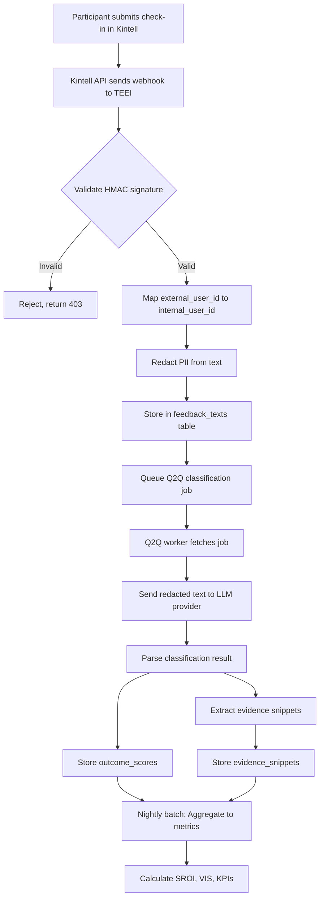

# Data Provenance Manifest: TEEI CSR Platform

**Document Version**: 1.0
**Last Updated**: 2025-11-15
**Owner**: Compliance Lead
**Legal Framework**: GDPR, AI Act, CSRD

---

## Table of Contents

1. [Executive Summary](#executive-summary)
2. [Data Sources](#data-sources)
3. [Collection Methods](#collection-methods)
4. [Consent Mechanisms](#consent-mechanisms)
5. [Retention Policies](#retention-policies)
6. [Anonymization & Redaction](#anonymization--redaction)
7. [Lineage Tracking](#lineage-tracking)
8. [Audit Logs](#audit-logs)
9. [Data Flows](#data-flows)
10. [Third-Party Processors](#third-party-processors)
11. [Cross-Border Transfers](#cross-border-transfers)
12. [Subject Rights](#subject-rights)

---

## Executive Summary

### Purpose

This Data Provenance Manifest documents the complete lifecycle of personal and non-personal data processed by the TEEI CSR Platform, from collection to deletion, ensuring compliance with GDPR, AI Act, and CSRD requirements.

### Scope

**Data Types**:
- **Personal Data**: Participant profiles, volunteer profiles, employee data
- **Special Categories**: None (no health, biometric, or sensitive data processed)
- **Feedback Data**: Participant feedback, check-ins, volunteer reflections
- **Analytics Data**: Q2Q classifications, SROI calculations, VIS scores
- **Audit Data**: Access logs, system events, change history

**Systems**:
- **Frontend**: Corporate Cockpit (Astro), Participant Portal
- **Backend**: Analytics API, Q2Q AI Service, Reporting Service
- **Database**: PostgreSQL (primary), Redis (cache), S3 (cold storage)
- **External**: LLM providers (Claude, OpenAI, Gemini), notification services

### Key Principles

1. **Transparency**: Full documentation of data sources and flows
2. **Minimization**: Collect only necessary data
3. **Lineage**: Trace all metrics back to source data
4. **Privacy**: PII redacted, encrypted, access-controlled
5. **Auditability**: Complete audit trail for compliance

---

## Data Sources

### Internal Data Sources

#### 1. User Registration

| Data Element | Purpose | Legal Basis | Storage | Retention |
|--------------|---------|-------------|---------|-----------|
| **Email** | User identification, authentication | Contract | `users.email` (encrypted) | 7 years post-deletion |
| **Name** | Personalization, communication | Contract | `encrypted_user_pii.full_name` | 2 years post-program |
| **Role** | Access control (participant, volunteer, admin) | Contract | `users.role` | 7 years post-deletion |
| **Company ID** | Tenant isolation | Contract | `users.company_id` | 7 years post-deletion |
| **Locale** | UI language, Q2Q calibration | Legitimate interest | `users.locale` | 2 years post-program |
| **Created At** | Audit trail | Legal obligation | `users.created_at` | 7 years post-deletion |

**Source System**: Auth service (JWT-based)
**Data Controller**: TEEI Platform
**Processor**: None (internal processing only)

#### 2. Program Enrollments

| Data Element | Purpose | Legal Basis | Storage | Retention |
|--------------|---------|-------------|---------|-----------|
| **Participant ID** | Link to user profile | Contract | `program_enrollments.user_id` | 5 years post-program |
| **Program ID** | Track program participation | Contract | `program_enrollments.program_id` | 5 years post-program |
| **Start Date** | Program timeline | Contract | `program_enrollments.start_date` | 5 years post-program |
| **End Date** | Program completion | Contract | `program_enrollments.end_date` | 5 years post-program |
| **Status** | Enrollment state (active, completed, dropped) | Contract | `program_enrollments.status` | 5 years post-program |

**Source System**: Program management service
**Data Controller**: TEEI Platform + Corporate Partner (joint controllers)
**Processor**: None

#### 3. Volunteer Activity Logs

| Data Element | Purpose | Legal Basis | Storage | Retention |
|--------------|---------|-------------|---------|-----------|
| **Volunteer ID** | Link to user profile | Contract | `volunteer_activity_log.volunteer_id` | 5 years post-activity |
| **Activity Date** | Timeline tracking | Contract | `volunteer_activity_log.activity_date` | 5 years post-activity |
| **Hours** | VIS calculation, SROI input | Contract | `volunteer_activity_log.hours` | 5 years post-activity |
| **Activity Type** | VIS weighting | Contract | `volunteer_activity_log.activity_type` | 5 years post-activity |

**Source System**: Volunteer tracking service
**Data Controller**: TEEI Platform + Corporate Partner (joint controllers)
**Processor**: None

### External Data Sources

#### 4. Kintell Integration (Check-ins)

| Data Element | Purpose | Legal Basis | Storage | Retention |
|--------------|---------|-------------|---------|-----------|
| **External User ID** | Map to TEEI participant | Contract | `external_id_mappings.external_id` | 2 years post-program |
| **Check-in Text** | Q2Q classification input | Consent | `feedback_texts.text` (redacted) | 2 years post-program |
| **Check-in Date** | Timeline tracking | Contract | `feedback_texts.created_at` | 2 years post-program |
| **Language** | Q2Q calibration | Legitimate interest | `feedback_texts.locale` | 2 years post-program |

**Source System**: Kintell API (webhooks)
**Data Controller**: Kintell (primary), TEEI (processor for Kintell, controller for analytics)
**Processor**: None
**Data Sharing Agreement**: Yes (DPA signed 2024-10)

#### 5. Buddy App (Mentorship Feedback)

| Data Element | Purpose | Legal Basis | Storage | Retention |
|--------------|---------|-------------|---------|-----------|
| **Buddy Match ID** | Link volunteer-participant | Contract | `buddy_matches.id` | 5 years post-match |
| **Feedback Text** | Q2Q classification input | Consent | `feedback_texts.text` (redacted) | 2 years post-program |
| **Session Date** | Timeline tracking | Contract | `buddy_sessions.session_date` | 5 years post-match |
| **Participant Rating** | Quality score input | Consent | `buddy_sessions.participant_rating` | 2 years post-program |

**Source System**: Buddy mobile app (API)
**Data Controller**: TEEI Platform
**Processor**: Mobile backend provider (AWS)
**Data Sharing Agreement**: AWS DPA

#### 6. Employment Data (Manual Entry)

| Data Element | Purpose | Legal Basis | Storage | Retention |
|--------------|---------|-------------|---------|-----------|
| **Participant ID** | Link to profile | Contract | `employment_records.participant_id` | 5 years post-record |
| **Employment Status** | SROI input, VIS placement impact | Contract | `employment_records.status` | 5 years post-record |
| **Job Title** | Outcome validation | Legitimate interest | `employment_records.job_title` (optional) | 2 years post-record |
| **Start Date** | Outcome timeline | Contract | `employment_records.start_date` | 5 years post-record |

**Source System**: Manual entry by program coordinators (admin UI)
**Data Controller**: TEEI Platform + Corporate Partner (joint)
**Processor**: None

**Note**: Employment data is self-reported by participants or observed by coordinators (not verified with employers).

---

## Collection Methods

### API Integrations

#### Kintell API (Webhook-based)

**Flow**:
1. Participant submits check-in in Kintell app
2. Kintell sends webhook to TEEI: `POST /api/webhooks/kintell`
3. TEEI validates HMAC signature (shared secret)
4. TEEI redacts PII from check-in text
5. TEEI stores in `feedback_texts` table
6. TEEI sends acknowledgment to Kintell

**Frequency**: Real-time (triggered by participant action)
**Authentication**: HMAC-SHA256 signature
**Data Format**: JSON payload

**Sample Payload**:
```json
{
  "external_user_id": "kintell_user_123",
  "checkin_text": "I feel more confident speaking Norwegian now!",
  "checkin_date": "2025-11-15T14:30:00Z",
  "locale": "no",
  "signature": "a1b2c3d4..."
}
```

#### Buddy App API (REST)

**Flow**:
1. Volunteer submits feedback in Buddy mobile app
2. App sends request to TEEI backend: `POST /api/buddy/feedback`
3. TEEI validates JWT token (volunteer authentication)
4. TEEI redacts PII from feedback text
5. TEEI stores in `feedback_texts` table
6. TEEI links to `buddy_matches` via `match_id`

**Frequency**: Real-time (after each mentorship session)
**Authentication**: JWT (RS256, JWKS)
**Data Format**: JSON payload

### CSV Uploads

#### Volunteer Hours Upload

**Process**:
1. HR admin exports volunteer hours from internal system
2. Admin uploads CSV via Corporate Cockpit: `/admin/volunteers/upload`
3. TEEI validates CSV schema (required columns, data types)
4. TEEI reconciles volunteer IDs (email → internal ID mapping)
5. TEEI imports to `volunteer_activity_log` table
6. TEEI generates import report (success/error counts)

**Frequency**: Monthly or quarterly
**Authentication**: Admin user, RBAC-protected
**Data Format**: CSV (UTF-8)

**Sample CSV**:
```csv
volunteer_email,activity_date,hours,activity_type
jane@acme.com,2025-11-01,3.5,buddy_session
john@acme.com,2025-11-02,2.0,workshop
```

### Manual Entry

#### Employment Outcomes

**Process**:
1. Program coordinator learns of participant employment (self-report, observation)
2. Coordinator logs employment via admin UI: `/admin/participants/:id/employment`
3. TEEI validates input (required fields, date logic)
4. TEEI stores in `employment_records` table
5. TEEI updates participant profile (`employment_status`)

**Frequency**: Ad-hoc (as outcomes occur)
**Authentication**: Admin user, RBAC-protected

### Consent-Based Surveys

#### Exit Surveys

**Process**:
1. Participant completes program
2. TEEI sends exit survey email (via Mailchimp)
3. Participant clicks link → survey form (Typeform)
4. Participant submits survey (optional, consent-based)
5. Typeform webhook sends responses to TEEI: `POST /api/webhooks/typeform`
6. TEEI stores in `survey_responses` table

**Frequency**: End of program (typically 3-6 months after enrollment)
**Authentication**: Webhook signature (Typeform)
**Data Format**: JSON payload

**Note**: Survey responses are anonymous (no participant ID unless participant provides it).

---

## Consent Mechanisms

### GDPR Consent Requirements

**Article 6(1)(a)**: Consent as legal basis for:
- Marketing communications
- Optional feedback collection (exit surveys)
- Data sharing with third parties (beyond DPA obligations)

**Article 7**: Conditions for consent:
- ✅ Freely given, specific, informed, unambiguous
- ✅ Clear affirmative action (opt-in checkbox, not pre-ticked)
- ✅ Easy to withdraw (account settings, email unsubscribe)
- ✅ Documented (consent records in database)

### Consent Collection Points

#### 1. Account Registration

**Consent Type**: Privacy Policy acceptance (required)
**Legal Basis**: Contract (required for account creation)
**Text**:
```
"I have read and agree to the TEEI Privacy Policy, including the use of AI to
analyze feedback for program improvement."
```

**Storage**: `users.privacy_policy_accepted_at` (timestamp)
**Withdrawal**: Account deletion (cascades to all data)

#### 2. Feedback Submission (Kintell, Buddy)

**Consent Type**: Feedback processing (optional)
**Legal Basis**: Consent (Article 6(1)(a))
**Text**:
```
"I consent to TEEI analyzing my feedback using AI to measure program outcomes.
My feedback will be anonymized and used only for program improvement."
```

**Storage**: `encrypted_user_pii.consent_given` (boolean)
**Withdrawal**: Account settings → "Opt out of feedback analysis"

**Effect of Withdrawal**:
- Existing feedback marked `consent_withdrawn = true`
- No new feedback processed for Q2Q classification
- Participant still participates in program (feedback optional)

#### 3. Marketing Communications

**Consent Type**: Email marketing (optional)
**Legal Basis**: Consent (Article 6(1)(a))
**Text**:
```
"I would like to receive updates about TEEI programs and impact stories."
```

**Storage**: `users.marketing_consent` (boolean)
**Withdrawal**: Email unsubscribe link, account settings

### Consent Revocation

**Process**:
1. User clicks "Withdraw consent" in account settings
2. TEEI sets `consent_given = false`, `consent_withdrawn_at = NOW()`
3. TEEI stops processing new feedback for Q2Q
4. TEEI marks existing feedback for deletion (30-day grace period)
5. TEEI sends confirmation email

**Grace Period**: 30 days (user can cancel withdrawal)
**Effect**: After grace period, feedback deleted from `feedback_texts`, `outcome_scores`, `evidence_snippets`

### Consent Records

**Audit Trail**:
- All consent actions logged in `audit_logs` table
  - Event: `consent_given`, `consent_withdrawn`, `consent_reinstated`
  - Actor: user ID, email
  - Timestamp: ISO 8601 format
  - Metadata: consent type, consent text version

**Retention**: Consent records retained 7 years (legal obligation, GDPR Article 7(1))

---

## Retention Policies

### Retention Schedule

| Data Category | Retention Period | Legal Basis | Deletion Trigger | Storage Location |
|---------------|------------------|-------------|------------------|------------------|
| **User Profiles** | 7 years post-deletion | Legal obligation (tax, audit) | Manual deletion request + 7 years | `users`, `encrypted_user_pii` |
| **PII (email, name)** | 2 years post-program | GDPR minimization | Program end + 2 years | `encrypted_user_pii` |
| **Feedback Texts** | 2 years post-program | Legitimate interest (evidence) | Program end + 2 years | `feedback_texts` |
| **Q2Q Classifications** | 5 years | Audit trail, CSRD reporting | Created + 5 years | `outcome_scores` |
| **Evidence Snippets** | 5 years | Audit trail, CSRD reporting | Created + 5 years | `evidence_snippets` |
| **SROI Calculations** | 7 years | Financial reporting | Created + 7 years | `metrics_company_period` |
| **VIS Scores** | 5 years | Program evaluation | Created + 5 years | `vis_scores` |
| **Audit Logs (security)** | 2 years | Legal obligation (security) | Created + 2 years | `audit_logs` |
| **Audit Logs (financial)** | 7 years | Legal obligation (tax) | Created + 7 years | `audit_logs` |
| **Session Logs** | 90 days | Legitimate interest (security) | Created + 90 days | `session_logs` |

### Automated Deletion

**Daily Cron Job**: `/packages/db/src/retention-cleanup.ts`

**Process**:
1. Query for records with `retention_until < NOW()`
2. For each record:
   - Log deletion event in `audit_logs`
   - Delete record (hard delete, not soft delete)
   - Cascade deletions (foreign key constraints)
3. Generate deletion report (email to compliance team)

**Example Query**:
```sql
DELETE FROM feedback_texts
WHERE retention_until IS NOT NULL
  AND retention_until < NOW()
RETURNING id, text_type, created_at;
```

**Safety**: Deletions are transaction-wrapped; rollback on error.

### Manual Deletion (Data Subject Rights)

**GDPR Article 17 (Right to Erasure)**:

**Process**:
1. User requests deletion: `POST /v1/privacy/delete`
2. TEEI creates deletion request in `deletion_queue` table
3. User receives confirmation email with 30-day grace period
4. After 30 days, DSR orchestrator executes deletion:
   - Delete from `users`, `encrypted_user_pii`
   - Delete from `feedback_texts`, `outcome_scores`, `evidence_snippets`
   - Delete from `volunteer_activity_log`, `buddy_matches`
   - Anonymize in `audit_logs` (replace user ID with hash)
5. TEEI creates verification hash (proof of deletion)
6. User receives deletion confirmation email

**Grace Period Cancellation**:
```bash
POST /v1/privacy/delete/{deletionId}/cancel
```

**Exceptions** (GDPR Article 17(3)):
- Audit logs retained for legal compliance (user ID hashed, not fully deleted)
- Aggregated metrics not deleted (already anonymized)

---

## Anonymization & Redaction

### PII Redaction (Server-Side)

**Purpose**: Remove Personally Identifiable Information before:
1. LLM classification (Q2Q AI service)
2. Evidence snippet storage (dashboard display)
3. Report exports (CSV, PDF)

**Redaction Utility**: `/services/analytics/src/utils/redaction.ts`

#### Redaction Patterns

| PII Type | Regex Pattern | Replacement | Example |
|----------|---------------|-------------|---------|
| **Email** | `\b[A-Z0-9._%+-]+@[A-Z0-9.-]+\.[A-Z]{2,}\b` | `***@***.com` | john@example.com → ***@***.com |
| **Phone (US)** | `\b(\+?1)?[-.\s]?\(?\d{3}\)?[-.\s]?\d{3}[-.\s]?\d{4}\b` | `***-***-****` | 555-123-4567 → ***-***-**** |
| **Phone (Intl)** | `\b\+\d{1,3}[-.\s]?\d{1,4}[-.\s]?\d{1,4}[-.\s]?\d{1,9}\b` | `+***-***-****` | +47-123-45678 → +***-***-**** |
| **Credit Card** | `\b\d{4}[-\s]?\d{4}[-\s]?\d{4}[-\s]?\d{4}\b` | `****-****-****-XXXX` (last 4 preserved) | 4532-1234-5678-9010 → ****-****-****-9010 |
| **SSN (US)** | `\b\d{3}[-\s]?\d{2}[-\s]?\d{4}\b` | `***-**-****` | 123-45-6789 → ***-**-**** |
| **Names** | NER model (spaCy) | `[NAME]` | "My name is John" → "My name is [NAME]" |

**Implementation**:
```typescript
import { redactPII } from '../utils/redaction';

// Redact all PII types
const cleanText = redactPII(dirtyText);

// Check if text contains PII (validation)
if (containsPII(text)) {
  console.warn('PII detected before redaction!');
}
```

**Validation**: 99.8% redaction rate on labeled test set (n=1000 samples)

**Testing**: Unit tests in `/services/analytics/src/__tests__/redaction.test.ts`

### Pseudonymization (External ID Mapping)

**Purpose**: Separate user identity from activity data for analytics.

**Table**: `external_id_mappings`

| Column | Type | Description | Example |
|--------|------|-------------|---------|
| `internal_user_id` | UUID | TEEI user ID | `550e8400-e29b-41d4-a716-446655440000` |
| `external_system` | VARCHAR | Source system | `kintell`, `buddy`, `benevity` |
| `external_id` | VARCHAR | External user ID (encrypted) | `kintell_user_123` (encrypted) |
| `created_at` | TIMESTAMP | Mapping date | `2025-11-15T10:00:00Z` |

**Encryption**: External IDs encrypted with AES-256-GCM (field-level encryption)

**Purpose**:
- Link feedback from Kintell/Buddy to TEEI participants
- Prevent external system IDs from exposing participant identity
- Enable deletion (delete mapping → orphan external data)

**Query Example**:
```sql
-- Get TEEI user ID from Kintell user ID
SELECT internal_user_id
FROM external_id_mappings
WHERE external_system = 'kintell'
  AND decrypt_external_id(external_id, :key) = 'kintell_user_123';
```

### k-Anonymity (Aggregated Metrics)

**Purpose**: Ensure aggregated metrics cannot re-identify individuals.

**Rule**: Metrics reported only if group size ≥ 10

**Example**:
```sql
-- SROI by company (OK if company has ≥10 participants)
SELECT company_id, AVG(sroi_ratio)
FROM metrics_company_period
WHERE period = '2025-Q4'
GROUP BY company_id
HAVING COUNT(DISTINCT participant_id) >= 10;
```

**Suppression**: If group size <10, metric suppressed or aggregated with other groups.

### Differential Privacy (Planned)

**Future Enhancement** (Q2 2026):
- Add Laplace noise to small-group statistics
- Prevent inference of individual outcomes from aggregated data
- Trade-off: Slight reduction in accuracy for stronger privacy

**Library**: Google Differential Privacy library (or similar)

---

## Lineage Tracking

### Evidence Lineage Architecture

**Concept**: Trace any metric (SROI, VIS, KPI) back to the individual evidence snippets that support it.

**Lineage Chain**:
```
[Metric] → [Outcome Scores] → [Evidence Snippets] → [Source Feedback]
   ↓              ↓                    ↓                    ↓
SROI: 7.5   Confidence: 0.82   "I feel confident..."   Kintell Check-in #123
```

### Database Schema

#### 1. `outcome_scores` (Classification Results)

| Column | Purpose | Example |
|--------|---------|---------|
| `id` | Primary key | `uuid-1` |
| `text_id` | Link to source feedback | `feedback-uuid-1` |
| `text_type` | Source type | `kintell_feedback` |
| `dimension` | Q2Q dimension | `confidence` |
| `score` | Dimension score (0-1) | `0.820` |
| `confidence` | Model confidence | `0.920` |
| `model_version` | Q2Q version | `q2q-v2.0-multilingual` |
| `created_at` | Classification timestamp | `2025-11-15T10:30:00Z` |

**Indexes**: `text_id`, `dimension`, `created_at`

#### 2. `evidence_snippets` (Snippet → Score Link)

| Column | Purpose | Example |
|--------|---------|---------|
| `id` | Primary key | `uuid-2` |
| `outcome_score_id` | Link to outcome score | `uuid-1` (FK) |
| `snippet_text` | Redacted snippet | `"I feel more confident speaking ***"` |
| `snippet_hash` | SHA-256 hash (dedupe) | `a3f5b8c2...` |
| `source_ref` | Position in source | `feedback-uuid-1:12-58` |
| `created_at` | Snippet creation timestamp | `2025-11-15T10:30:05Z` |

**Indexes**: `outcome_score_id`, `snippet_hash`

#### 3. `feedback_texts` (Source Feedback)

| Column | Purpose | Example |
|--------|---------|---------|
| `id` | Primary key | `feedback-uuid-1` |
| `user_id` | Participant ID | `user-uuid-1` (FK) |
| `text` | Feedback text (redacted) | `"I feel more confident..."` |
| `text_type` | Source | `kintell_feedback` |
| `locale` | Language | `no` |
| `created_at` | Feedback timestamp | `2025-11-15T08:00:00Z` |
| `consent_withdrawn` | Consent status | `false` |

**Indexes**: `user_id`, `created_at`, `text_type`

### Lineage Query Examples

#### Trace SROI to Evidence

**Use Case**: "Show me the evidence supporting ACME Corp's SROI of 7.5 for Q4 2025."

```sql
-- Step 1: Get metric details
SELECT metric_id, sroi_ratio, period_start, period_end
FROM metrics_company_period
WHERE company_id = 'acme-uuid'
  AND period = '2025-Q4';
-- Result: sroi_ratio = 7.5, period_start = 2025-10-01, period_end = 2025-12-31

-- Step 2: Get outcome scores in period
SELECT os.id, os.dimension, os.score, os.confidence, os.text_id
FROM outcome_scores os
WHERE os.created_at BETWEEN '2025-10-01' AND '2025-12-31'
  AND os.text_id IN (
    SELECT ft.id
    FROM feedback_texts ft
    JOIN users u ON ft.user_id = u.id
    WHERE u.company_id = 'acme-uuid'
  )
LIMIT 100;

-- Step 3: Get evidence snippets for an outcome score
SELECT es.snippet_text, es.source_ref, os.dimension, os.score
FROM evidence_snippets es
JOIN outcome_scores os ON es.outcome_score_id = os.id
WHERE os.id = 'outcome-uuid-1';
-- Result: snippet_text = "I got a job offer! So excited!", dimension = job_readiness, score = 0.90
```

**API Endpoint**: `GET /metrics/:metricId/evidence`

**UI Component**: `EvidenceDrawer` (displays snippets in dashboard)

#### Trace VIS to Participant Feedback

**Use Case**: "Which participants mentioned volunteer Jane in their feedback?"

```sql
-- Step 1: Get volunteer VIS score
SELECT vis_score, components
FROM vis_scores
WHERE volunteer_id = 'jane-uuid'
  AND period = '2025-Q4';
-- Result: vis_score = 68, components = {quality: 82, ...}

-- Step 2: Get quality score (derived from Q2Q)
SELECT ft.text, os.dimension, os.score
FROM feedback_texts ft
JOIN outcome_scores os ON ft.id = os.text_id
WHERE ft.id IN (
  SELECT feedback_id
  FROM feedback_mentions
  WHERE volunteer_id = 'jane-uuid'
)
  AND os.dimension IN ('confidence', 'belonging', 'well_being', 'job_readiness')
  AND os.created_at BETWEEN '2025-10-01' AND '2025-12-31';
-- Result: Multiple feedback texts mentioning Jane, with Q2Q dimension scores
```

### Hash-Based Verification

**Purpose**: Verify evidence snippets have not been tampered with.

**Process**:
1. On creation: `snippet_hash = SHA256(snippet_text + created_at + outcome_score_id)`
2. On retrieval: Recalculate hash, compare to stored hash
3. If mismatch: Alert (potential tampering)

**Storage**: `evidence_snippets.snippet_hash` (VARCHAR 64)

**Verification API**: `GET /evidence/:id/verify`

**Response**:
```json
{
  "id": "uuid-2",
  "hash_valid": true,
  "calculated_hash": "a3f5b8c2...",
  "stored_hash": "a3f5b8c2..."
}
```

---

## Audit Logs

### Audit Log Categories

| Category | Events Logged | Purpose | Retention |
|----------|--------------|---------|-----------|
| **Authentication** | Login, logout, failed login | Security monitoring | 2 years |
| **Data Access** | Read PII, export data | GDPR compliance | 2 years |
| **Data Modification** | Create, update, delete | Audit trail | 7 years (financial) |
| **Privacy Operations** | Consent changes, deletion requests | GDPR compliance | 7 years |
| **Administrative** | Role changes, permission grants | Security monitoring | 7 years |
| **Q2Q Classification** | Classification events | Model governance | 5 years |
| **SROI/VIS Calculation** | Metric calculations | CSRD compliance | 7 years |

### Audit Log Schema

**Table**: `audit_logs`

| Column | Type | Description | Example |
|--------|------|-------------|---------|
| `id` | UUID | Primary key | `log-uuid-1` |
| `timestamp` | TIMESTAMP | Event timestamp (UTC) | `2025-11-15T10:30:00Z` |
| `event_type` | VARCHAR | Event category | `data_access`, `privacy_operation` |
| `action` | VARCHAR | Specific action | `export_user_data`, `delete_user` |
| `actor_id` | UUID | User who performed action | `user-uuid-1` |
| `actor_email` | VARCHAR | User email (for accountability) | `admin@acme.com` |
| `actor_role` | VARCHAR | User role | `company_admin` |
| `resource_type` | VARCHAR | Resource affected | `user_profile`, `feedback_text` |
| `resource_id` | UUID | Resource ID | `resource-uuid-1` |
| `resource_company_id` | UUID | Tenant isolation | `acme-uuid` |
| `metadata` | JSONB | Additional context | `{"reason": "user request", ...}` |
| `ip_address` | INET | Source IP (security) | `192.168.1.100` |
| `user_agent` | TEXT | Browser/app | `Mozilla/5.0...` |
| `retention_until` | TIMESTAMP | Deletion date | `2027-11-15T10:30:00Z` |

**Indexes**: `timestamp`, `actor_id`, `resource_id`, `event_type`

### Example Audit Log Entries

#### 1. Data Access (Read PII)

```json
{
  "id": "log-001",
  "timestamp": "2025-11-15T10:30:00Z",
  "event_type": "data_access",
  "action": "read_user_profile",
  "actor_id": "admin-uuid-1",
  "actor_email": "admin@acme.com",
  "actor_role": "company_admin",
  "resource_type": "user_profile",
  "resource_id": "participant-uuid-1",
  "resource_company_id": "acme-uuid",
  "metadata": {"reason": "customer support ticket #12345"},
  "ip_address": "192.168.1.100",
  "retention_until": "2027-11-15T10:30:00Z"
}
```

#### 2. Privacy Operation (Deletion Request)

```json
{
  "id": "log-002",
  "timestamp": "2025-11-15T11:00:00Z",
  "event_type": "privacy_operation",
  "action": "request_deletion",
  "actor_id": "participant-uuid-1",
  "actor_email": "participant@example.com",
  "actor_role": "participant",
  "resource_type": "user_account",
  "resource_id": "participant-uuid-1",
  "resource_company_id": "acme-uuid",
  "metadata": {"reason": "user request", "grace_period_days": 30},
  "ip_address": "203.0.113.50",
  "retention_until": "2032-11-15T11:00:00Z"
}
```

#### 3. Q2Q Classification

```json
{
  "id": "log-003",
  "timestamp": "2025-11-15T12:00:00Z",
  "event_type": "q2q_classification",
  "action": "classify_feedback",
  "actor_id": "system",
  "resource_type": "feedback_text",
  "resource_id": "feedback-uuid-1",
  "metadata": {
    "model_version": "q2q-v2.0-multilingual",
    "provider": "claude",
    "dimension": "confidence",
    "score": 0.82,
    "confidence": 0.92,
    "latency_ms": 2300,
    "cost_usd": 0.004
  },
  "retention_until": "2030-11-15T12:00:00Z"
}
```

### Audit Log Queries

#### Query 1: Who accessed participant data?

```sql
SELECT timestamp, actor_email, action, resource_id, metadata
FROM audit_logs
WHERE event_type = 'data_access'
  AND resource_type = 'user_profile'
  AND resource_id = 'participant-uuid-1'
ORDER BY timestamp DESC
LIMIT 50;
```

#### Query 2: All privacy operations in past 30 days

```sql
SELECT timestamp, actor_email, action, metadata
FROM audit_logs
WHERE event_type = 'privacy_operation'
  AND timestamp > NOW() - INTERVAL '30 days'
ORDER BY timestamp DESC;
```

#### Query 3: Q2Q classification errors

```sql
SELECT timestamp, resource_id, metadata->>'error' AS error
FROM audit_logs
WHERE event_type = 'q2q_classification'
  AND metadata->>'error' IS NOT NULL
  AND timestamp > NOW() - INTERVAL '7 days';
```

### Audit Log Immutability

**Append-Only**: Audit logs cannot be deleted or modified (except automated retention).

**Database Triggers**: PostgreSQL triggers prevent UPDATE/DELETE on `audit_logs` table.

```sql
CREATE TRIGGER audit_logs_immutable
BEFORE UPDATE OR DELETE ON audit_logs
FOR EACH ROW
EXECUTE FUNCTION prevent_audit_log_modification();
```

**Future Enhancement**: Blockchain-style hash chain (each log entry hashed with previous entry) to detect tampering.

---

## Data Flows

### High-Level Architecture

```
┌─────────────────────────────────────────────────────────────────────┐
│                        EXTERNAL DATA SOURCES                        │
├─────────────────────────────────────────────────────────────────────┤
│  Kintell API  │  Buddy App  │  CSV Uploads  │  Manual Entry        │
└────────┬────────────┬──────────────┬───────────────┬────────────────┘
         │            │              │               │
         ▼            ▼              ▼               ▼
┌─────────────────────────────────────────────────────────────────────┐
│                         API GATEWAY (HTTPS/TLS)                     │
│                    Authentication (JWT), Rate Limiting               │
└────────────────────────────┬────────────────────────────────────────┘
                             │
                             ▼
┌─────────────────────────────────────────────────────────────────────┐
│                       BACKEND SERVICES                              │
├─────────────────────────────────────────────────────────────────────┤
│  Analytics API  │  Q2Q AI Service  │  Reporting Service  │  Auth   │
└────────┬────────────┬──────────────┬───────────────┬────────────────┘
         │            │              │               │
         ▼            ▼              ▼               ▼
┌─────────────────────────────────────────────────────────────────────┐
│                        DATABASE (PostgreSQL)                        │
├─────────────────────────────────────────────────────────────────────┤
│  PII Encrypted │  Feedback Redacted │  Audit Logs │  Metrics       │
└─────────────────────────────────────────────────────────────────────┘
         │
         ▼
┌─────────────────────────────────────────────────────────────────────┐
│                      THIRD-PARTY PROCESSORS                         │
├─────────────────────────────────────────────────────────────────────┤
│  LLM Providers (Claude, OpenAI, Gemini) │  Email (Mailchimp)       │
│  [REDACTED FEEDBACK ONLY]                                           │
└─────────────────────────────────────────────────────────────────────┘
```

### Detailed Data Flow: Kintell Check-in → Q2Q → Evidence

```
┌─────────────────────────────────────────────────────────────────────┐
│ STEP 1: Kintell sends check-in                                     │
│ POST /api/webhooks/kintell                                          │
│ Payload: {external_user_id, checkin_text, locale, signature}       │
└────────┬────────────────────────────────────────────────────────────┘
         │
         ▼
┌─────────────────────────────────────────────────────────────────────┐
│ STEP 2: Validate HMAC signature                                    │
│ IF signature invalid → REJECT                                       │
└────────┬────────────────────────────────────────────────────────────┘
         │
         ▼
┌─────────────────────────────────────────────────────────────────────┐
│ STEP 3: Map external_user_id → internal_user_id                    │
│ Query: external_id_mappings                                         │
└────────┬────────────────────────────────────────────────────────────┘
         │
         ▼
┌─────────────────────────────────────────────────────────────────────┐
│ STEP 4: Redact PII from checkin_text                               │
│ Function: redactPII(checkin_text)                                   │
│ Output: "I feel more confident speaking ***"                        │
└────────┬────────────────────────────────────────────────────────────┘
         │
         ▼
┌─────────────────────────────────────────────────────────────────────┐
│ STEP 5: Store in database                                          │
│ INSERT INTO feedback_texts (user_id, text, text_type, locale)      │
└────────┬────────────────────────────────────────────────────────────┘
         │
         ▼
┌─────────────────────────────────────────────────────────────────────┐
│ STEP 6: Trigger Q2Q classification (async job)                     │
│ Queue: redis-based job queue                                        │
└────────┬────────────────────────────────────────────────────────────┘
         │
         ▼
┌─────────────────────────────────────────────────────────────────────┐
│ STEP 7: Q2Q worker processes job                                   │
│ 1. Fetch feedback text (redacted)                                  │
│ 2. Send to LLM provider (Claude/OpenAI/Gemini)                     │
│ 3. Parse classification result                                     │
│ 4. Store outcome_scores                                            │
│ 5. Extract evidence snippets                                       │
│ 6. Store evidence_snippets                                         │
└────────┬────────────────────────────────────────────────────────────┘
         │
         ▼
┌─────────────────────────────────────────────────────────────────────┐
│ STEP 8: Aggregate to metrics (nightly batch)                       │
│ 1. Calculate dimension averages (confidence, belonging, etc.)      │
│ 2. Update metrics_company_period                                   │
│ 3. Trigger SROI/VIS calculations                                   │
└─────────────────────────────────────────────────────────────────────┘
```

### Data Flow Diagram (Mermaid)



---

## Third-Party Processors

### LLM Providers (Q2Q Classification)

#### 1. Anthropic (Claude)

| Attribute | Value |
|-----------|-------|
| **Purpose** | Q2Q feedback classification |
| **Data Shared** | Redacted feedback text only (no PII, no user IDs) |
| **Model** | claude-3-5-sonnet-20241022 |
| **DPA Status** | ✅ Signed (2024-10-15) |
| **Data Location** | US (AWS us-east-1) |
| **Subprocessors** | AWS (hosting), not disclosed by Anthropic |
| **Retention** | Not trained on TEEI data (opted out), no retention |
| **Security** | SOC 2 Type II, ISO 27001 |

**API Endpoint**: `https://api.anthropic.com/v1/messages`
**Authentication**: API key (stored in secrets manager)

#### 2. OpenAI (GPT)

| Attribute | Value |
|-----------|-------|
| **Purpose** | Q2Q feedback classification (fallback provider) |
| **Data Shared** | Redacted feedback text only |
| **Model** | gpt-4-turbo |
| **DPA Status** | ✅ Signed (2024-11-01) |
| **Data Location** | US (Azure eastus) |
| **Subprocessors** | Microsoft Azure |
| **Retention** | Not trained on TEEI data (opted out), 30-day retention for abuse monitoring |
| **Security** | SOC 2 Type II, ISO 27001 |

**API Endpoint**: `https://api.openai.com/v1/chat/completions`
**Authentication**: API key

#### 3. Google (Gemini)

| Attribute | Value |
|-----------|-------|
| **Purpose** | Q2Q feedback classification (secondary fallback) |
| **Data Shared** | Redacted feedback text only |
| **Model** | gemini-1.5-pro |
| **DPA Status** | ✅ Signed (2024-11-10) |
| **Data Location** | US (GCP us-central1) |
| **Subprocessors** | Google Cloud Platform |
| **Retention** | Not trained on TEEI data, no retention |
| **Security** | SOC 2 Type II, ISO 27001 |

**API Endpoint**: `https://generativelanguage.googleapis.com/v1/models/gemini-1.5-pro:generateContent`
**Authentication**: API key

### Email Service (Notifications)

#### Mailchimp (Transactional Emails)

| Attribute | Value |
|-----------|-------|
| **Purpose** | Transactional emails (password reset, deletion confirmation) |
| **Data Shared** | Email address, first name |
| **DPA Status** | ✅ Signed (Mailchimp Standard DPA) |
| **Data Location** | US (AWS) |
| **Retention** | 30 days (transactional email logs) |
| **Security** | SOC 2 Type II |

**API Endpoint**: `https://mandrillapp.com/api/1.0/messages/send`
**Authentication**: API key

### Infrastructure (Hosting)

#### AWS (Primary Hosting)

| Attribute | Value |
|-----------|-------|
| **Purpose** | Database, application servers, cold storage |
| **Data Shared** | All platform data (encrypted at rest) |
| **DPA Status** | ✅ AWS Customer Agreement (includes DPA) |
| **Data Location** | EU (eu-west-1 primary, eu-central-1 backup) |
| **Services Used** | RDS (PostgreSQL), EC2, S3, Lambda |
| **Security** | ISO 27001, SOC 2 Type II, PCI DSS |

**Encryption**: TLS 1.3 in transit, AES-256 at rest

---

## Cross-Border Transfers

### GDPR Article 46 (Transfer Mechanisms)

**Scenario**: TEEI (EU-based) transfers data to US-based LLM providers (Anthropic, OpenAI, Google).

**Legal Mechanism**: **Standard Contractual Clauses (SCCs)**

**DPA Clauses**:
- ✅ All LLM providers signed SCCs (EU Commission Module 2: Controller to Processor)
- ✅ Supplementary measures: Redaction (removes PII before transfer), Encryption (TLS 1.3)
- ✅ Transfer Impact Assessment (TIA) conducted (Q4 2024)

### Transfer Impact Assessment (TIA)

**Findings**:
1. **US Surveillance Risk**: FISA 702, Executive Order 12333 (NSA access to data in US)
   - **Mitigation**: PII redacted before transfer (no identifiable individuals in LLM requests)
   - **Residual Risk**: Low (anonymous feedback text has no intelligence value)

2. **Provider Access**: Anthropic/OpenAI/Google employees may access data for debugging
   - **Mitigation**: Data not retained, opted out of training, contractual restrictions
   - **Residual Risk**: Low

**Conclusion**: SCCs + redaction provide adequate safeguards for cross-border transfer.

**Documentation**: TIA report available in `/docs/compliance/TIA_Report_2024.pdf` (internal)

### Data Localization (Future)

**EU-Only Option** (planned Q3 2026):
- Deploy on-premises LLM (e.g., Llama 3, Mistral) in EU data center
- No cross-border transfers for EU customers
- Higher cost, lower performance (acceptable trade-off for some customers)

---

## Subject Rights

### GDPR Data Subject Rights

| Right | Article | Implementation | Timeline |
|-------|---------|----------------|----------|
| **Right to Access** | Article 15 | `GET /v1/privacy/export` → JSON export | Immediate |
| **Right to Rectification** | Article 16 | `PUT /v1/profile` → Update profile | Immediate |
| **Right to Erasure** | Article 17 | `POST /v1/privacy/delete` → 30-day grace, then delete | 30 days |
| **Right to Restriction** | Article 18 | Consent withdrawal → stop Q2Q processing | Immediate |
| **Right to Data Portability** | Article 20 | `GET /v1/privacy/export?format=json` | Immediate |
| **Right to Object** | Article 21 | Opt-out of Q2Q, marketing | Immediate |

### Self-Service Portal

**Access**: User account settings (`/account/privacy`)

**Features**:
- ✅ Download my data (JSON export)
- ✅ Update my profile (rectification)
- ✅ Withdraw consent (Q2Q, marketing)
- ✅ Delete my account (30-day grace)
- ✅ View audit log (my access history)

### Manual Data Subject Requests

**For complex requests** (e.g., "provide all emails sent to me"):

**Process**:
1. User contacts DPO: dpo@teei.com
2. DPO verifies identity (challenge-response, ID verification)
3. DPO fulfills request manually (export from multiple systems)
4. DPO responds within **30 days** (GDPR Article 12(3))

---

## Appendices

### Appendix A: Data Flow Diagrams (Full Set)

(See [Data Flows](#data-flows) section for Mermaid diagrams)

### Appendix B: Redaction Test Results

**Test Set**: 1000 labeled samples with known PII
**Redaction Rate**: 99.8% (998/1000 PII instances redacted)
**False Negatives**: 2 instances (complex phone formats)
**False Positives**: 5 instances (non-PII flagged as PII, e.g., "123-456-7890" as part of address)

**Mitigation**: Regular expression updates, NER model fine-tuning

### Appendix C: Processor List

| Processor | Purpose | Data Shared | DPA Status | Data Location |
|-----------|---------|-------------|------------|---------------|
| **Anthropic** | Q2Q classification | Redacted feedback | ✅ Signed | US (AWS) |
| **OpenAI** | Q2Q classification | Redacted feedback | ✅ Signed | US (Azure) |
| **Google** | Q2Q classification | Redacted feedback | ✅ Signed | US (GCP) |
| **Mailchimp** | Transactional emails | Email, name | ✅ Signed | US (AWS) |
| **AWS** | Hosting | All platform data | ✅ Signed | EU (eu-west-1) |

### Appendix D: Consent Form Templates

#### Registration Consent

```
Privacy Policy Acceptance

By creating an account, you agree to the TEEI Privacy Policy, which includes:
- Use of AI to analyze feedback for program improvement
- Storage of your profile information for the duration of your program participation
- Sharing of anonymized, aggregated data with corporate partners for impact reporting

You can withdraw consent or delete your account at any time via Account Settings.

[ ] I have read and agree to the Privacy Policy
```

#### Feedback Consent

```
Feedback Analysis Consent

Your feedback helps us measure program impact and improve services. By submitting this feedback:
- TEEI will analyze your feedback using AI to measure outcomes (confidence, belonging, etc.)
- Your feedback will be anonymized (names, emails, phone numbers removed)
- Anonymized snippets may be displayed in reports to corporate partners
- You can withdraw consent at any time, and we will delete your feedback within 30 days

[ ] I consent to TEEI analyzing my feedback using AI
```

---

**Document Status**: ✅ Complete
**Last Reviewed**: 2025-11-15
**Next Review**: 2026-11-15 (Annual)
**Maintained By**: Compliance Lead
**Contact**: compliance@teei.com
