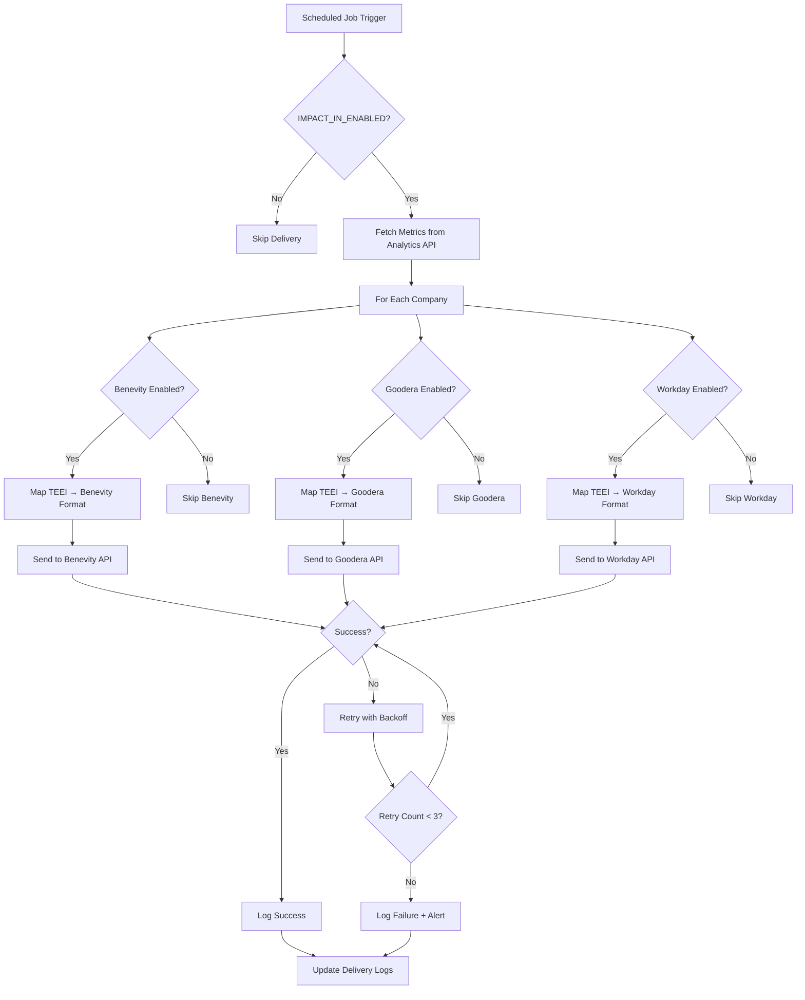

# Impact-In Service Overview

**Last Updated:** 2025-11-13
**Version:** 1.0

## Table of Contents

- [Overview](#overview)
- [Supported Platforms](#supported-platforms)
- [Feature Flag System](#feature-flag-system)
- [Delivery Flow](#delivery-flow)
- [Authentication Requirements](#authentication-requirements)
- [Rate Limiting Policies](#rate-limiting-policies)
- [Configuration Guide](#configuration-guide)
- [Troubleshooting Guide](#troubleshooting-guide)
- [API Specifications](#api-specifications)

---

## Overview

The **Impact-In Service** is a middleware connector that delivers TEEI program impact metrics to external Corporate Social Responsibility (CSR) platforms. It enables corporate partners to view TEEI metrics (volunteer hours, participant outcomes, SROI, VIS) directly within their existing CSR management tools such as Benevity, Goodera, and Workday.

**Key Features:**
- Multi-platform support (Benevity, Goodera, Workday)
- Feature flags for platform-specific enablement
- Automated metric aggregation and delivery
- Retry logic with exponential backoff
- Rate limiting and error handling
- Mock mode for testing

**Architecture Role:**
```
┌─────────────────┐
│  TEEI Platform  │
│                 │
│  - Metrics DB   │
│  - Analytics    │
│    Service      │
└────────┬────────┘
         │
         ▼
┌─────────────────┐
│   Impact-In     │
│    Service      │
│                 │
│  - Mappers      │
│  - Schedulers   │
│  - Connectors   │
└────────┬────────┘
         │
         ├──────────────┬──────────────┐
         ▼              ▼              ▼
┌──────────┐    ┌──────────┐    ┌──────────┐
│ Benevity │    │ Goodera  │    │ Workday  │
│   API    │    │   API    │    │   API    │
└──────────┘    └──────────┘    └──────────┘
```

---

## Supported Platforms

### Benevity

**Description:** Benevity is a leading corporate purpose software platform that enables employee volunteering, donation matching, and impact tracking.

**Integration Type:** REST API with Bearer Token authentication

**Data Sent:**
- Volunteer hours
- Participant count
- Volunteer count
- Outcome scores (integration, language, job readiness)

**Update Frequency:** Daily batch (configurable)

**Documentation:** [Benevity API Specification](./benevity_spec.md)

**Status:** ✅ Implemented

---

### Goodera

**Description:** Goodera provides impact measurement and CSR management tools for companies to track and report social impact.

**Integration Type:** REST API with API Key authentication

**Data Sent:**
- Volunteer engagement metrics
- Volunteer hours
- Participant reach
- Session count
- Impact dimensions (integration outcomes, language proficiency, employability)

**Update Frequency:** Daily batch (configurable)

**Batch Support:** Yes, up to 100 records per request

**Documentation:** [Goodera API Specification](./goodera_spec.md)

**Status:** ✅ Implemented

---

### Workday Volunteer Management

**Description:** Workday's Volunteer Management module integrates volunteer activities with HR systems for employee engagement tracking.

**Integration Type:** REST API with OAuth 2.0 Client Credentials

**Data Sent:**
- Volunteer activities (sessions, mentorship, training)
- Volunteer hours by activity type
- Program enrollments
- Participant counts

**Update Frequency:** Daily batch (configurable)

**Special Features:** OAuth token auto-refresh, activity type categorization

**Documentation:** [Workday API Specification](./workday_spec.md)

**Status:** ✅ Implemented

---

## Feature Flag System

The Impact-In service uses feature flags to enable/disable platform integrations at runtime without code changes.

### Configuration

**Environment Variables:**
```bash
# Master switch (enables/disables all Impact-In)
IMPACT_IN_ENABLED=true

# Platform-specific flags
BENEVITY_ENABLED=true
GOODERA_ENABLED=true
WORKDAY_ENABLED=false

# Mock mode (for testing)
BENEVITY_MOCK_MODE=false
GOODERA_MOCK_MODE=false
WORKDAY_MOCK_MODE=false
```

### Feature Flag Behavior

| Flag | Value | Behavior |
|------|-------|----------|
| `IMPACT_IN_ENABLED` | `true` | Impact-In service runs delivery jobs |
| `IMPACT_IN_ENABLED` | `false` | All platform deliveries disabled |
| `BENEVITY_ENABLED` | `true` | Benevity connector active |
| `BENEVITY_ENABLED` | `false` | Benevity deliveries skipped |
| `BENEVITY_MOCK_MODE` | `true` | Simulate Benevity API responses (no network calls) |
| `BENEVITY_MOCK_MODE` | `false` | Real API calls to Benevity |

### Runtime Flag Checks

```typescript
// Example: Check if Benevity delivery should run
if (process.env.IMPACT_IN_ENABLED === 'true' &&
    process.env.BENEVITY_ENABLED === 'true') {
  await deliverToBenevity(metrics);
} else {
  console.log('Benevity delivery skipped (feature flag disabled)');
}
```

### Flag Management Best Practices

1. **Master switch first**: Always check `IMPACT_IN_ENABLED` before platform-specific flags
2. **Gradual rollout**: Enable one platform at a time for testing
3. **Mock mode for development**: Use mock mode in dev/staging environments
4. **Production flags**: Disable mock mode in production
5. **Logging**: Always log when deliveries are skipped due to flags

---

## Delivery Flow

### High-Level Flow



### Detailed Steps

#### 1. Scheduled Trigger

**Frequency:** Daily at 02:00 UTC (configurable via cron)

**Trigger Mechanism:** Node-cron or external scheduler (e.g., Kubernetes CronJob)

```typescript
import cron from 'node-cron';

// Run daily at 2 AM UTC
cron.schedule('0 2 * * *', async () => {
  console.log('Starting Impact-In delivery job');
  await runImpactInDelivery();
});
```

---

#### 2. Fetch Metrics

**Source:** Analytics Service API (`GET /metrics/company/:companyId/period/:period`)

**Data Retrieved:**
- Participants count
- Volunteers count
- Sessions count
- Average integration score
- Average language level
- Average job readiness
- SROI ratio
- VIS score

**Example:**
```typescript
const metrics = await fetch(
  `${ANALYTICS_API_URL}/metrics/company/${companyId}/period/${period}`
).then(res => res.json());
```

---

#### 3. Platform Mapping

Each platform has a custom mapper that transforms TEEI metrics into the platform's expected format.

**Benevity Mapper:**
```typescript
function mapToBenevity(teeiMetrics: TEEIMetrics): BenevityPayload {
  return {
    organizationId: teeiMetrics.companyId,
    programId: 'teei-integration',
    reportingPeriod: {
      startDate: teeiMetrics.periodStart,
      endDate: teeiMetrics.periodEnd
    },
    metrics: [
      {
        metricType: 'volunteer_hours',
        metricValue: teeiMetrics.volunteersCount * 5, // Avg 5 hrs/volunteer
        metricUnit: 'hours'
      },
      {
        metricType: 'outcome_score',
        metricValue: teeiMetrics.avgIntegrationScore,
        metricUnit: 'score',
        category: 'integration'
      }
      // ... more metrics
    ]
  };
}
```

---

#### 4. API Delivery

**Authentication:** Platform-specific (Bearer token, API key, OAuth)

**Retry Logic:** Exponential backoff
- Attempt 1: Immediate
- Attempt 2: 1 second delay
- Attempt 3: 2 seconds delay
- Attempt 4: 4 seconds delay

**Error Handling:**
```typescript
async function deliverWithRetry(
  deliveryFn: () => Promise<any>,
  maxRetries = 3
): Promise<void> {
  let attempt = 0;
  while (attempt < maxRetries) {
    try {
      await deliveryFn();
      console.log(`Delivery succeeded on attempt ${attempt + 1}`);
      return;
    } catch (error) {
      attempt++;
      if (attempt >= maxRetries) {
        console.error('Delivery failed after max retries', error);
        // Alert operations team
        throw error;
      }
      const delay = Math.pow(2, attempt - 1) * 1000;
      await sleep(delay);
    }
  }
}
```

---

#### 5. Delivery Logging

**Purpose:** Track delivery status for auditing and troubleshooting

**Schema:**
```typescript
interface DeliveryLog {
  id: string;
  companyId: string;
  platform: 'benevity' | 'goodera' | 'workday';
  deliveryDate: Date;
  status: 'success' | 'failure' | 'retry';
  attemptCount: number;
  error?: string;
  responsePayload?: any;
}
```

**Storage:** Database table or structured logs

---

## Authentication Requirements

### Benevity

**Method:** Bearer Token

**Setup:**
1. Obtain API key from Benevity (via company CSR admin)
2. Store in environment variable: `BENEVITY_API_KEY`
3. Include in request headers: `Authorization: Bearer {API_KEY}`

**Token Expiry:** None (static token)

**Security:** Store in secrets manager (e.g., AWS Secrets Manager, HashiCorp Vault)

---

### Goodera

**Method:** API Key

**Setup:**
1. Obtain API key from Goodera (via company CSR admin)
2. Store in environment variable: `GOODERA_API_KEY`
3. Include in request headers: `X-API-Key: {API_KEY}`

**Token Expiry:** None (static key)

**Security:** Store in secrets manager

---

### Workday

**Method:** OAuth 2.0 Client Credentials

**Setup:**
1. Register application in Workday
2. Obtain client ID and client secret
3. Store in environment variables:
   - `WORKDAY_CLIENT_ID`
   - `WORKDAY_CLIENT_SECRET`
   - `WORKDAY_TENANT_ID`

**Token Expiry:** 1 hour

**Token Refresh:** Automatic (service refreshes before expiry)

**OAuth Flow:**
```
1. Service requests token: POST /oauth2/token
2. Workday returns access token (expires in 3600s)
3. Service uses token for API calls
4. Service refreshes token after 50 minutes
```

**Implementation:**
```typescript
class WorkdayAuthClient {
  private token: string | null = null;
  private tokenExpiry: Date | null = null;

  async getAccessToken(): Promise<string> {
    if (this.token && this.tokenExpiry && this.tokenExpiry > new Date()) {
      return this.token; // Use cached token
    }

    // Fetch new token
    const response = await fetch(`${WORKDAY_API_URL}/oauth2/token`, {
      method: 'POST',
      headers: { 'Content-Type': 'application/x-www-form-urlencoded' },
      body: new URLSearchParams({
        grant_type: 'client_credentials',
        client_id: process.env.WORKDAY_CLIENT_ID,
        client_secret: process.env.WORKDAY_CLIENT_SECRET,
        scope: 'volunteer_management'
      })
    });

    const data = await response.json();
    this.token = data.access_token;
    this.tokenExpiry = new Date(Date.now() + (data.expires_in - 600) * 1000); // Refresh 10 min early

    return this.token;
  }
}
```

---

## Rate Limiting Policies

### Benevity

**Limit:** 100 requests per minute per organization

**Daily Limit:** 10,000 requests per day

**Handling:**
- Service enforces client-side rate limiting (max 50 req/min)
- If 429 (Too Many Requests) received, exponential backoff

**Best Practice:** Batch metrics by company to minimize requests

---

### Goodera

**Limit:** 100 requests per minute

**Batch Size:** Up to 100 records per request

**Handling:**
- Service enforces 600ms delay between requests
- Use batch endpoint when sending data for multiple periods

**Best Practice:** Always use batch endpoint when sending data for 2+ periods

---

### Workday

**Limit:** No explicit documented limit (best practice: 10 req/sec)

**OAuth Rate Limit:** Token endpoint limited (exact limit unknown)

**Handling:**
- Service enforces 100ms delay between requests
- Cache OAuth tokens to minimize token requests

**Best Practice:** Reuse OAuth tokens for entire batch job

---

## Configuration Guide

### Environment Variables

**File:** `.env` or environment-specific config

```bash
# ===== Master Switch =====
IMPACT_IN_ENABLED=true

# ===== Benevity Configuration =====
BENEVITY_ENABLED=true
BENEVITY_API_KEY=your-benevity-api-key
BENEVITY_WEBHOOK_URL=https://api.benevity.com/v1/impact
BENEVITY_MOCK_MODE=false

# ===== Goodera Configuration =====
GOODERA_ENABLED=true
GOODERA_API_KEY=your-goodera-api-key
GOODERA_API_URL=https://api.goodera.com/v1
GOODERA_MOCK_MODE=false

# ===== Workday Configuration =====
WORKDAY_ENABLED=false
WORKDAY_CLIENT_ID=your-workday-client-id
WORKDAY_CLIENT_SECRET=your-workday-client-secret
WORKDAY_TENANT_ID=your-tenant-id
WORKDAY_API_URL=https://api.workday.com
WORKDAY_MOCK_MODE=false

# ===== Analytics API Configuration =====
ANALYTICS_API_URL=http://localhost:3007

# ===== Delivery Schedule =====
DELIVERY_CRON_SCHEDULE=0 2 * * *  # Daily at 2 AM UTC

# ===== Retry Configuration =====
MAX_RETRY_ATTEMPTS=3
RETRY_BASE_DELAY_MS=1000
```

### Service Startup

**Development:**
```bash
cd /home/user/TEEI-CSR-Platform/services/impact-in
pnpm install
pnpm dev
```

**Production:**
```bash
pnpm build
pnpm start
```

**Docker:**
```bash
docker-compose up impact-in
```

---

## Troubleshooting Guide

### Issue: Delivery Job Not Running

**Symptoms:** No delivery logs, no API calls to external platforms

**Diagnosis:**
1. Check `IMPACT_IN_ENABLED` flag
2. Check cron schedule syntax
3. Review service logs for errors

**Solution:**
```bash
# Check environment variables
echo $IMPACT_IN_ENABLED

# Verify cron schedule (run in node REPL)
node -e "const cron = require('node-cron'); console.log(cron.validate('0 2 * * *'));"

# Check service logs
docker logs teei-impact-in
```

---

### Issue: Authentication Failures

**Symptoms:** 401 Unauthorized or 403 Forbidden responses

**Platform: Benevity**
- Verify API key is correct: `echo $BENEVITY_API_KEY`
- Check authorization header format: `Authorization: Bearer {KEY}`
- Confirm API key has not expired (contact Benevity support)

**Platform: Goodera**
- Verify API key: `echo $GOODERA_API_KEY`
- Check header format: `X-API-Key: {KEY}`
- Confirm organization ID matches Goodera project

**Platform: Workday**
- Verify OAuth credentials: `echo $WORKDAY_CLIENT_ID`
- Check token expiry (should auto-refresh)
- Test OAuth flow manually:
  ```bash
  curl -X POST https://api.workday.com/oauth2/token \
    -H "Content-Type: application/x-www-form-urlencoded" \
    -d "grant_type=client_credentials" \
    -d "client_id=$WORKDAY_CLIENT_ID" \
    -d "client_secret=$WORKDAY_CLIENT_SECRET" \
    -d "scope=volunteer_management"
  ```

---

### Issue: Rate Limiting (429 Responses)

**Symptoms:** 429 Too Many Requests errors in logs

**Diagnosis:**
- Check request rate in logs
- Verify rate limiting configuration
- Review platform-specific limits

**Solution:**
```typescript
// Increase delay between requests (example for Goodera)
const GOODERA_REQUEST_DELAY_MS = 1000; // Increase from 600ms to 1000ms

// Reduce batch size
const MAX_BATCH_SIZE = 50; // Reduce from 100 to 50
```

---

### Issue: Data Format Errors

**Symptoms:** 400 Bad Request with validation errors

**Diagnosis:**
- Review API response error details
- Check mapper output against platform spec
- Verify required fields are present

**Solution:**
```typescript
// Add validation before sending
function validateBenevityPayload(payload: BenevityPayload): boolean {
  if (!payload.organizationId) {
    throw new Error('Missing organizationId');
  }
  if (!payload.metrics || payload.metrics.length === 0) {
    throw new Error('No metrics provided');
  }
  // ... more validation
  return true;
}
```

---

### Issue: Missing Metrics

**Symptoms:** No data sent for certain companies or periods

**Diagnosis:**
1. Verify metrics exist in Analytics API:
   ```bash
   curl http://localhost:3007/metrics/company/{companyId}/period/2024-11
   ```
2. Check feature flags for specific platforms
3. Review delivery logs for errors

**Solution:**
- Ensure metrics aggregation job has run
- Verify company has opted into platform integration
- Check date range is correct

---

### Issue: Mock Mode Still Active in Production

**Symptoms:** No real API calls, but logs show "mock mode" messages

**Diagnosis:**
```bash
# Check mock mode flags
echo $BENEVITY_MOCK_MODE
echo $GOODERA_MOCK_MODE
echo $WORKDAY_MOCK_MODE
```

**Solution:**
```bash
# Disable mock mode in production environment
export BENEVITY_MOCK_MODE=false
export GOODERA_MOCK_MODE=false
export WORKDAY_MOCK_MODE=false

# Restart service
docker-compose restart impact-in
```

---

## API Specifications

Detailed API specifications for each platform:

- **[Benevity API Specification](./benevity_spec.md)** - Request/response formats, authentication, error codes
- **[Goodera API Specification](./goodera_spec.md)** - Single and batch endpoints, impact dimensions mapping
- **[Workday API Specification](./workday_spec.md)** - OAuth flow, activity types, enrollment tracking

---

## Monitoring and Alerts

### Key Metrics to Track

| Metric | Target | Alert Threshold |
|--------|--------|-----------------|
| **Delivery Success Rate** | >95% | <90% |
| **Average Delivery Time** | <5s per company | >10s |
| **API Error Rate** | <1% | >5% |
| **Retry Rate** | <10% | >20% |
| **Auth Failures** | 0 per day | >3 per day |

### Alert Configuration (Example: Datadog)

```yaml
# Benevity delivery failures
- alert: BenevityDeliveryFailure
  expr: impact_in_delivery_failures{platform="benevity"} > 5
  for: 15m
  labels:
    severity: warning
  annotations:
    summary: "Benevity delivery failing repeatedly"

# OAuth token refresh failures
- alert: WorkdayOAuthFailure
  expr: impact_in_oauth_failures{platform="workday"} > 3
  for: 5m
  labels:
    severity: critical
  annotations:
    summary: "Workday OAuth token refresh failing"
```

---

## Future Enhancements

### Planned Features (Phase C)

1. **Real-time Delivery** - Push metrics immediately after aggregation (vs. daily batch)
2. **Webhook Support** - Allow platforms to pull data via webhook callbacks
3. **Custom Metric Mapping** - Let companies define custom field mappings per platform
4. **Delivery Dashboard** - UI to view delivery status, retry history, and logs
5. **Multi-tenancy** - Support multiple companies with different platform configurations

### Additional Platforms (Under Consideration)

- **Salesforce Philanthropy Cloud**
- **YourCause**
- **Millie**
- **Realized Worth**

---

## Support

For Impact-In service issues:
- **Configuration**: Review this README and platform specs
- **Authentication**: Check credentials and OAuth flow
- **Rate Limiting**: Review rate limit policies and request logs
- **Data Mapping**: Consult platform API specifications
- **Service Errors**: Check service logs and contact backend team

---

## Related Documentation

- [Metrics Catalog](../Metrics_Catalog.md) - Metrics delivered to platforms
- [VIS Model](../VIS_Model.md) - VIS score delivered to platforms
- [Platform Architecture](../Platform_Architecture.md) - Overall system design

---

**Document Maintained By:** Worker 2 - Connector Services Lead
**Review Cadence:** Quarterly or when new platforms are added
