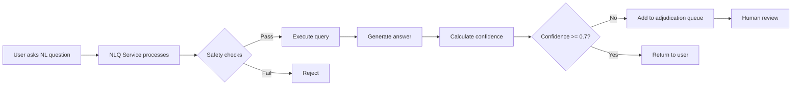
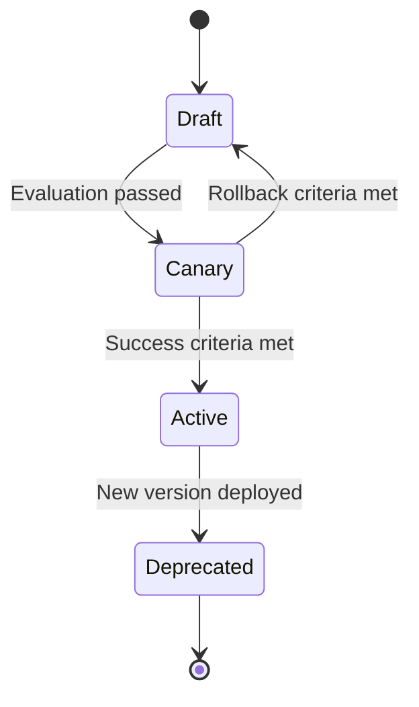

# Human-in-the-Loop (HIL) Adjudication Guide
## Insights v3.1 - Production Quality Assurance & Model Improvement

**Version:** 3.1.0
**Last Updated:** 2025-11-16
**Status:** Production Ready

---

## Table of Contents

1. [Overview](#overview)
2. [Architecture](#architecture)
3. [Workflow](#workflow)
4. [API Reference](#api-reference)
5. [UI Components](#ui-components)
6. [Fairness Operations](#fairness-operations)
7. [ClickHouse Integration](#clickhouse-integration)
8. [Canary Rollout](#canary-rollout)
9. [Metrics & Monitoring](#metrics--monitoring)
10. [Best Practices](#best-practices)
11. [Troubleshooting](#troubleshooting)

---

## Overview

### Purpose

The Human-in-the-Loop (HIL) adjudication system provides a structured workflow for reviewing, validating, and improving NLQ (Natural Language Query) outputs. It enables:

- **Quality Assurance**: Manual review of AI-generated answers before deployment
- **Model Improvement**: Feedback loop for prompt refinement and model training
- **Fairness Monitoring**: Detection and mitigation of bias across demographic groups
- **Trust Building**: Transparent review process with full audit trails

### Key Features

✅ **Approve/Revise/Reject Workflow** - Three-stage decision process with detailed feedback
✅ **Automatic Insight Routing** - Approved/revised answers flow to `copilot_insights` table
✅ **Prompt Version Tracking** - Tag revisions with prompt versions for canary rollout
✅ **Fairness Metrics** - Demographic parity, equal opportunity, and equalized odds monitoring
✅ **Cost Tracking** - Full cost attribution by query signature and decision type
✅ **Dataset Cards** - Comprehensive provenance and quality metadata for each query result

---

## Architecture

### System Components

```
┌─────────────────────────────────────────────────────────────────┐
│                     Corporate Cockpit UI                        │
│  ┌──────────────────────┐  ┌───────────────────────────────┐   │
│  │ Adjudication Queue   │  │ Fairness Metrics Dashboard   │   │
│  │ - Pending reviews    │  │ - DP, EO, EOpp tracking      │   │
│  │ - Confidence filter  │  │ - Alert thresholds (>10%)    │   │
│  │ - Intent filter      │  │ - Mitigation status          │   │
│  └──────────────────────┘  └───────────────────────────────┘   │
│           │                            │                        │
│           └────────────────┬───────────┘                        │
│                            │                                    │
└────────────────────────────┼────────────────────────────────────┘
                             │ HTTP/REST
                             │
        ┌────────────────────┴────────────────────────┐
        │         Insights NLQ Service v3.1          │
        │  ┌──────────────────────────────────────┐  │
        │  │   Adjudication Routes                │  │
        │  │   - POST /adjudicate                 │  │
        │  │   - GET /adjudication-queue          │  │
        │  │   - POST /prompt-versions            │  │
        │  └──────────────────────────────────────┘  │
        │  ┌──────────────────────────────────────┐  │
        │  │   Fairness Metrics Library           │  │
        │  │   - computeDemographicParity()       │  │
        │  │   - computeEqualOpportunity()        │  │
        │  │   - computeEqualizedOdds()           │  │
        │  │   - runFairnessAudit()               │  │
        │  └──────────────────────────────────────┘  │
        └─────────────────────┬───────────────────────┘
                              │
        ┌─────────────────────┴───────────────────────┐
        │         Reporting Service v3.1             │
        │  ┌──────────────────────────────────────┐  │
        │  │   Dataset Cards Library              │  │
        │  │   - generateDatasetCard()            │  │
        │  │   - renderDatasetCardMarkdown()      │  │
        │  └──────────────────────────────────────┘  │
        └─────────────────────┬───────────────────────┘
                              │
        ┌─────────────────────┴───────────────────────┐
        │            PostgreSQL Database              │
        │  ┌──────────────────────────────────────┐  │
        │  │   HIL Tables (NLQ Schema)            │  │
        │  │   - adjudication_reviews             │  │
        │  │   - fairness_metrics                 │  │
        │  │   - nlq_prompt_versions              │  │
        │  │   - query_performance_metrics        │  │
        │  └──────────────────────────────────────┘  │
        │  ┌──────────────────────────────────────┐  │
        │  │   Insights Tables                    │  │
        │  │   - copilot_insights                 │  │
        │  │   - nlq_queries                      │  │
        │  └──────────────────────────────────────┘  │
        └──────────────────────────────────────────────┘
```

### Database Schema

#### `adjudication_reviews`

Stores all HIL review decisions and feedback.

```typescript
{
  id: uuid,
  queryId: uuid,                    // FK to nlq_queries
  companyId: uuid,
  decision: 'approved' | 'revised' | 'rejected',
  reviewedBy: uuid,                 // User ID
  reviewedAt: timestamp,

  // Revision details (if decision = 'revised')
  originalAnswer: text,
  revisedAnswer: text,
  revisionReason: text,
  revisionType: 'factual_error' | 'tone' | 'clarity' | 'completeness',

  // Quality ratings (1-5 scale)
  confidenceRating: integer,
  accuracyRating: integer,
  clarityRating: integer,
  feedbackComments: text,

  // Routing
  routedToInsights: boolean,
  insightId: uuid,                  // FK to copilot_insights

  // Prompt versioning
  promptVersionBefore: varchar(50),
  promptVersionAfter: varchar(50),

  reviewTimeMs: integer
}
```

#### `fairness_metrics`

Tracks demographic parity and equality metrics.

```typescript
{
  id: uuid,
  companyId: uuid,
  metricDate: timestamp,
  periodType: 'daily' | 'weekly' | 'monthly',

  // Metric type
  metricType: 'demographic_parity' | 'equal_opportunity' | 'equalized_odds',
  protectedAttribute: varchar(50),  // 'gender', 'ethnicity', 'age_group'

  // Groups
  groupA: varchar(100),             // e.g., 'female'
  groupB: varchar(100),             // e.g., 'male'

  // Metric values
  groupAValue: decimal(6,4),
  groupBValue: decimal(6,4),
  disparityRatio: decimal(6,4),
  absoluteDifference: decimal(6,4),

  // Statistical significance
  sampleSizeA: integer,
  sampleSizeB: integer,
  pValue: decimal(6,4),
  confidenceInterval: jsonb,

  // Alerts
  thresholdExceeded: boolean,       // >10% disparity
  alertSeverity: 'low' | 'medium' | 'high' | 'critical',
  alertTriggered: boolean,

  // Mitigation
  mitigationRequired: boolean,
  mitigationStatus: 'pending' | 'in_progress' | 'resolved'
}
```

#### `nlq_prompt_versions`

Version control for NLQ prompts with canary rollout.

```typescript
{
  id: uuid,
  versionId: varchar(50),           // e.g., 'nlq-intent-v1.2.0'
  versionName: varchar(100),
  description: text,

  // Prompt content
  promptType: 'intent_classification' | 'query_generation' | 'answer_synthesis',
  promptTemplate: text,
  promptHash: varchar(64),          // SHA-256 for integrity

  // Model config
  modelProvider: 'anthropic' | 'openai',
  modelName: varchar(100),
  temperature: decimal(3,2),
  maxTokens: integer,

  // Rollout
  rolloutStatus: 'draft' | 'canary' | 'active' | 'deprecated',
  canaryPercentage: integer,        // 0-100

  // Performance metrics
  avgF1Score: decimal(4,3),
  avgLatencyMs: integer,
  avgCostUsd: decimal(8,6),
  acceptanceRate: decimal(4,3),     // HIL acceptance rate

  // Criteria
  promotionCriteria: jsonb,         // {minF1, maxLatency, minAcceptance}
  rollbackCriteria: jsonb           // {maxF1Drop, maxLatencyIncrease}
}
```

---

## Workflow

### 1. Query Execution → Adjudication Queue



**Triggers for Adjudication:**
- Confidence score < 0.7
- First-time intent (no template match)
- New user/company (cold start)
- Manual flag by user
- Random sampling (10% of all queries for quality checks)

### 2. Human Review Process

**Step 1: Review Queue**

Reviewers access the adjudication queue at:

```
GET /api/v1/nlq/adjudication-queue?companyId={id}&limit=20
```

Response:
```json
{
  "queries": [
    {
      "id": "550e8400-e29b-41d4-a716-446655440000",
      "question": "What was our SROI last quarter?",
      "answer": "Your Social Return on Investment for Q3 2024 was 3.2:1...",
      "answerConfidence": 0.65,
      "intent": "get_metric",
      "template": "sroi_quarterly",
      "createdAt": "2024-11-15T10:30:00Z",
      "reviewed": false
    }
  ],
  "pagination": {
    "total": 45,
    "hasMore": true
  }
}
```

**Step 2: Review Decision**

Submit decision:

```http
POST /api/v1/nlq/adjudicate
Content-Type: application/json

{
  "queryId": "550e8400-e29b-41d4-a716-446655440000",
  "decision": "revised",
  "reviewedBy": "user-123",
  "revisedAnswer": "Your Social Return on Investment for Q3 2024 was 3.2:1, meaning every $1 invested generated $3.20 in social value. This is a 15% increase from Q2.",
  "revisionReason": "Added context and comparison to previous quarter",
  "revisionType": "completeness",
  "confidenceRating": 4,
  "accuracyRating": 5,
  "clarityRating": 4,
  "feedbackComments": "Original answer was accurate but lacked actionable context",
  "routeToInsights": true,
  "insightSeverity": "medium"
}
```

**Step 3: Automatic Actions**

Based on decision:

| Decision | Actions |
|----------|---------|
| **Approved** | • Route to `copilot_insights` (if `routeToInsights=true`)<br>• Update query performance metrics<br>• Increment acceptance rate for prompt version |
| **Revised** | • Store original + revised answer<br>• Route revised answer to `copilot_insights`<br>• Tag with prompt version for retraining<br>• Create revision dataset for fine-tuning |
| **Rejected** | • Log reason and feedback<br>• Alert if high-confidence query rejected (potential model issue)<br>• Do NOT route to insights<br>• Decrement success rate |

### 3. Prompt Version Lifecycle



**Canary Rollout Process:**

1. **Create New Version**
   ```http
   POST /api/v1/nlq/prompt-versions
   {
     "versionId": "nlq-intent-v1.3.0",
     "versionName": "Improved Context Extraction",
     "promptType": "intent_classification",
     "promptTemplate": "...",
     "modelProvider": "anthropic",
     "modelName": "claude-3-5-sonnet-20241022",
     "rolloutStatus": "canary",
     "canaryPercentage": 10,
     "promotionCriteria": {
       "minF1": 0.85,
       "maxLatency": 350,
       "minAcceptance": 0.80
     },
     "rollbackCriteria": {
       "maxF1Drop": 0.05,
       "maxLatencyIncrease": 100
     }
   }
   ```

2. **Monitor Canary (24-48 hours)**
   - Track F1 score, latency, acceptance rate
   - Compare to baseline (previous version)
   - Auto-rollback if criteria breached

3. **Promote to Active**
   - If success criteria met, increase canary % to 100%
   - Mark previous version as deprecated

---

## API Reference

### POST /v1/nlq/adjudicate

Submit adjudication decision.

**Request:**
```typescript
{
  queryId: string;           // UUID of query to adjudicate
  decision: 'approved' | 'revised' | 'rejected';
  reviewedBy: string;        // UUID of reviewer

  // Optional (required if decision = 'revised')
  revisedAnswer?: string;
  revisionReason?: string;
  revisionType?: 'factual_error' | 'tone' | 'clarity' | 'completeness';

  // Optional quality ratings (1-5)
  confidenceRating?: number;
  accuracyRating?: number;
  clarityRating?: number;
  feedbackComments?: string;

  // Optional routing
  routeToInsights?: boolean; // Default: true
  insightSeverity?: 'low' | 'medium' | 'high' | 'critical';
}
```

**Response:**
```typescript
{
  success: true,
  reviewId: string,           // UUID of created review
  insightId?: string,         // UUID of copilot_insights record (if routed)
  message: string
}
```

**Errors:**
- `400` - Invalid request (e.g., decision='revised' but no revisedAnswer)
- `404` - Query not found
- `409` - Query already adjudicated

---

### GET /v1/nlq/adjudication-queue

Fetch queries pending review.

**Query Parameters:**
- `companyId` (optional) - Filter by company UUID
- `limit` (default: 20, max: 100) - Number of results
- `offset` (default: 0) - Pagination offset
- `minConfidence` (optional) - Min confidence score (0.0-1.0)
- `maxConfidence` (optional) - Max confidence score (0.0-1.0)
- `intentType` (optional) - Filter by detected intent
- `includeReviewed` (default: false) - Include already-reviewed queries

**Response:**
```typescript
{
  queries: Array<{
    id: string;
    companyId: string;
    question: string;
    normalizedQuestion: string;
    intent: string;
    intentConfidence: number;
    template: string | null;
    answer: string;
    answerConfidence: number;
    resultRowCount: number;
    executionTimeMs: number;
    createdAt: string;
    reviewed: boolean;
    reviewDecision?: 'approved' | 'revised' | 'rejected';
    reviewedAt?: string;
  }>;
  pagination: {
    total: number;
    limit: number;
    offset: number;
    hasMore: boolean;
  };
}
```

---

### POST /v1/nlq/prompt-versions

Register new prompt version for canary rollout.

**Request:**
```typescript
{
  versionId: string;                // e.g., 'nlq-intent-v1.2.0'
  versionName: string;
  description: string;
  promptType: 'intent_classification' | 'query_generation' | 'answer_synthesis';
  promptTemplate: string;
  modelProvider: 'anthropic' | 'openai';
  modelName: string;
  temperature?: number;             // Default: 0
  maxTokens?: number;               // Default: 1000
  rolloutStatus?: 'draft' | 'canary' | 'active' | 'deprecated'; // Default: draft
  canaryPercentage?: number;        // 0-100, default: 0
  promotionCriteria?: {
    minF1?: number;
    maxLatency?: number;            // ms
    minAcceptance?: number;         // 0.0-1.0
  };
  rollbackCriteria?: {
    maxF1Drop?: number;
    maxLatencyIncrease?: number;    // ms
  };
  createdBy: string;                // UUID of creator
  tags?: string[];
  changeLog?: string;
}
```

**Response:**
```typescript
{
  success: true;
  version: {
    id: string;
    versionId: string;
    versionName: string;
    promptType: string;
    rolloutStatus: string;
    canaryPercentage: number;
    createdAt: string;
  };
}
```

---

## Fairness Operations

### Fairness Metrics Explained

#### 1. Demographic Parity (DP)

**Definition**: Positive prediction rate should be similar across groups.

$$
P(\hat{Y}=1|A=0) = P(\hat{Y}=1|A=1)
$$

For NLQ:
- $\hat{Y}=1$ if `answerConfidence >= 0.7`
- $A$ = protected attribute (gender, ethnicity, age)

**Threshold**: Disparity ratio should be between 0.8 and 1.2 (80%-125% rule)

**Example**:
```
Female queries: 100 total, 65 high-confidence → 65% positive rate
Male queries: 100 total, 80 high-confidence → 80% positive rate
Disparity ratio: 0.65 / 0.80 = 0.8125 (18.75% difference)
Alert: ✓ Triggered (> 10% threshold)
```

#### 2. Equal Opportunity (EO)

**Definition**: True positive rate should be similar across groups.

$$
P(\hat{Y}=1|Y=1, A=0) = P(\hat{Y}=1|Y=1, A=1)
$$

For NLQ:
- $Y=1$ if query was `approved` or `revised` in HIL review
- $\hat{Y}=1$ if model predicted high confidence

**Use Case**: Ensures model correctly identifies good queries across all groups.

#### 3. Equalized Odds (EOpp)

**Definition**: Both TPR and FPR should be similar across groups.

$$
P(\hat{Y}=1|Y=y, A=0) = P(\hat{Y}=1|Y=y, A=1) \text{ for } y \in \{0,1\}
$$

**Use Case**: Strongest fairness criterion - ensures model performs equally well across all groups for both positive and negative cases.

### Nightly Fairness Audit Job

**Schedule**: Daily at 02:00 UTC

**Process**:
```python
# Pseudo-code
for protectedAttribute in ['gender', 'ethnicity', 'age_group']:
    for (groupA, groupB) in getPairwiseGroups(protectedAttribute):
        result = runFairnessAudit({
            protectedAttribute,
            groupA,
            groupB,
            startDate: yesterday,
            endDate: today
        })

        if result.thresholdExceeded:
            # Persist to fairness_metrics table
            persistMetrics(result)

            # Alert if severity is high/critical
            if result.alertSeverity in ['high', 'critical']:
                sendAlert({
                    channel: 'slack',
                    message: `Fairness alert: ${result.metricType} disparity of ${result.disparityRatio} detected for ${protectedAttribute}`
                })

                # Optional: Auto-mitigate
                if autoMitigationEnabled:
                    adjustConfidenceThresholds(protectedAttribute, groupA, groupB)
```

**Mitigation Playbook**:

1. **Low Severity (10-15% disparity)**:
   - Monitor for 3 days
   - If persistent, review query templates for bias

2. **Medium Severity (15-20% disparity)**:
   - Immediate review of affected queries
   - Check for data imbalance in training set
   - Adjust confidence thresholds per group

3. **High Severity (20-25% disparity)**:
   - Halt new prompt versions
   - Manual review of all queries in affected category
   - Retrain model with fairness constraints

4. **Critical Severity (>25% disparity)**:
   - Emergency rollback to previous prompt version
   - Block affected query category until resolved
   - Escalate to AI Ethics team

---

## ClickHouse Integration

### Live Query Wiring

**Before (Mock Data)**:
```typescript
// Old approach
async function executeQuery(sql: string): Promise<any[]> {
  return mockDataset;
}
```

**After (Live ClickHouse)**:
```typescript
import { createClient } from '@clickhouse/client';

const clickhouse = createClient({
  url: process.env.CLICKHOUSE_URL || 'http://localhost:8123',
  database: 'teei_csr',
  request_timeout: 5000,
});

async function executeQuery(sql: string, params: Record<string, any>): Promise<any[]> {
  const startTime = Date.now();

  const resultSet = await clickhouse.query({
    query: sql,
    query_params: params,
    format: 'JSONEachRow',
  });

  const results = await resultSet.json();
  const latencyMs = Date.now() - startTime;

  // Track metrics
  await trackQueryMetrics({
    querySignature: hashQueryPattern(sql),
    latencyMs,
    rowCount: results.length,
  });

  // Generate dataset card
  const datasetCard = await generateDatasetCard({
    queryId,
    query,
    resultData: results,
    safetyChecks,
    costUSD: estimateCost(sql, latencyMs),
  });

  return results;
}
```

### Cost & Latency Tracking

**Metrics Tracked**:
- **Query Signature**: Hash of normalized query pattern (e.g., `SELECT {metric} FROM {table} WHERE companyId = ? AND date BETWEEN ? AND ?`)
- **Latency**: p50, p95, p99, min, max, avg
- **Cost**: Compute cost (ClickHouse) + LLM cost (intent classification, answer synthesis)
- **Cache Hit Rate**: Percentage of queries served from Redis cache

**Aggregation Windows**:
- Hourly (for real-time monitoring)
- Daily (for dashboards)
- Weekly (for trend analysis)

**Alert Thresholds**:
- p95 latency > 2.5s → Warning
- p95 latency > 5.0s → Critical
- Cost per query > $0.05 → Review prompt efficiency

---

## Canary Rollout

### Success Criteria

| Metric | Baseline | Canary Threshold | Auto-Rollback Threshold |
|--------|----------|------------------|------------------------|
| **F1 Score** | 0.85 | ≥ 0.85 | < 0.80 (5% drop) |
| **p95 Latency** | 350ms | ≤ 450ms | > 450ms |
| **Acceptance Rate** | 0.82 | ≥ 0.80 | < 0.75 |
| **Cost per Query** | $0.02 | ≤ $0.03 | > $0.05 |

### Rollout Phases

1. **Draft (0% traffic)**: Development & testing
2. **Canary (10% traffic)**: Initial validation (24 hours)
3. **Canary (25% traffic)**: Expanded validation (24 hours)
4. **Canary (50% traffic)**: Majority validation (24 hours)
5. **Active (100% traffic)**: Full deployment
6. **Deprecated**: Replaced by newer version

### Automated Promotion/Rollback

```typescript
// Nightly canary evaluation job
async function evaluateCanaryVersions() {
  const canaryVersions = await getCanaryPromptVersions();

  for (const version of canaryVersions) {
    const metrics = await getCanaryMetrics(version.id, last24Hours);

    // Check success criteria
    if (meetsPromotionCriteria(metrics, version.promotionCriteria)) {
      if (version.canaryPercentage < 100) {
        // Promote to next stage
        await incrementCanaryPercentage(version.id, nextStage);
      } else {
        // Promote to active
        await promoteToActive(version.id);
      }
    }

    // Check rollback criteria
    if (meetsRollbackCriteria(metrics, version.rollbackCriteria)) {
      await rollbackCanary(version.id);
      await alert({
        severity: 'critical',
        message: `Canary version ${version.versionId} rolled back due to ${rollbackReason}`,
      });
    }
  }
}
```

---

## Metrics & Monitoring

### Acceptance Rate Dashboard

**URL**: `/cockpit/{companyId}/insights/acceptance-rate`

**Metrics Displayed**:
- Overall acceptance rate (approved + revised) / total reviewed
- Breakdown by intent type
- Breakdown by confidence tier (<0.5, 0.5-0.7, 0.7-0.9, >0.9)
- Trend over time (7d, 30d, 90d)

**Targets**:
- **Overall Acceptance**: ≥ 80%
- **High-Confidence Acceptance** (>0.9): ≥ 95%
- **Low-Confidence Acceptance** (<0.5): ≥ 50%

### Performance Dashboard

**URL**: `/cockpit/{companyId}/insights/performance`

**Metrics**:
- **p95 Latency**: Target ≤ 2.2s (was 2.5s in v3.0)
- **Cost per Query**: Target ≤ $0.02
- **Cache Hit Rate**: Target ≥ 60%
- **Error Rate**: Target ≤ 1%

### Fairness Dashboard

**URL**: `/cockpit/{companyId}/insights/fairness`

**Metrics**:
- Demographic parity by protected attribute
- Equal opportunity by protected attribute
- Alert history (last 30 days)
- Mitigation status tracker

---

## Best Practices

### For Reviewers

1. **Review Volume**: Aim for 20-50 reviews per day to maintain quality
2. **Feedback Quality**: Always provide specific, actionable feedback in `feedbackComments`
3. **Revision Discipline**: Only revise if materially improves answer - avoid minor wording changes
4. **Rating Consistency**: Calibrate ratings weekly with team to ensure consistency

### For Administrators

1. **Monitoring Cadence**: Check fairness dashboard daily, acceptance rate weekly
2. **Prompt Version Hygiene**: Deprecate old versions after 30 days of replacement
3. **Cost Optimization**: Review query signatures with highest cost monthly
4. **Canary Patience**: Wait full 24 hours per canary stage - don't rush rollouts

### For Developers

1. **Test Prompts**: Use `/prompt-versions` in draft mode for local testing
2. **Dataset Cards**: Always generate dataset cards for queries used in reports
3. **Fairness First**: Run fairness audit before deploying new prompt versions
4. **Cache Hygiene**: Invalidate cache when prompt versions change

---

## Troubleshooting

### Issue: High rejection rate (>30%)

**Symptoms**: Many queries rejected in HIL review

**Causes**:
1. Low-quality training data
2. Ambiguous query templates
3. Model overfitting to specific phrasing

**Solutions**:
```bash
# Check rejection reasons
SELECT revision_type, COUNT(*)
FROM adjudication_reviews
WHERE decision = 'rejected'
GROUP BY revision_type
ORDER BY COUNT(*) DESC;

# If "factual_error" is dominant → Retrain model
# If "clarity" is dominant → Update answer synthesis prompt
# If "completeness" is dominant → Add more context to prompts
```

### Issue: Fairness alert triggered

**Symptoms**: Disparity > 10% for a protected attribute

**Immediate Actions**:
1. Check sample sizes - small samples can cause spurious alerts
2. Review affected queries manually
3. Check if data imbalance is the root cause

**Long-term Solutions**:
```bash
# Option 1: Group-specific confidence thresholds
UPDATE nlq_prompt_versions
SET confidence_threshold_overrides = {
  "gender:female": 0.65,
  "gender:male": 0.70
}
WHERE prompt_type = 'answer_synthesis' AND rollout_status = 'active';

# Option 2: Fairness-constrained retraining
python scripts/retrain_with_fairness_constraints.py \
  --protected-attribute gender \
  --max-disparity 0.05
```

### Issue: Canary rollback

**Symptoms**: Automated rollback triggered

**Investigation Steps**:
1. Check which metric breached threshold
2. Compare sample queries between baseline and canary
3. Look for systematic errors in canary version

**Recovery**:
```bash
# Inspect rollback reason
SELECT version_id, rollback_reason, rollback_metrics
FROM prompt_version_rollbacks
WHERE version_id = 'nlq-intent-v1.3.0';

# If latency issue → Optimize prompt length
# If F1 issue → Revert problematic changes
# If cost issue → Switch to lighter model
```

---

## Appendix

### A. Confidence Score Calculation

```typescript
confidence = (
  0.4 * intentConfidence +
  0.2 * dataCompleteness +
  0.2 * sampleSizeScore +
  0.1 * recencyScore +
  0.1 * (1 - ambiguityPenalty)
);
```

### B. Query Signature Hashing

```typescript
function hashQueryPattern(sql: string): string {
  // Normalize SQL
  const normalized = sql
    .replace(/WHERE\s+companyId\s*=\s*'[^']+'/gi, 'WHERE companyId = ?')
    .replace(/BETWEEN\s+'[^']+'\s+AND\s+'[^']+'/gi, 'BETWEEN ? AND ?')
    .replace(/IN\s*\([^)]+\)/gi, 'IN (?)');

  // Hash normalized pattern
  return crypto.createHash('sha256').update(normalized).digest('hex').substring(0, 16);
}
```

### C. Dataset Card Example

See `dataset-cards.ts` for full implementation.

---

**Questions or Issues?**

- **Slack**: #insights-v3-support
- **Email**: insights-team@teei.com
- **Docs**: https://docs.teei.com/insights/hil

**Contributors**: Worker-2 AI Analytics Team
**License**: Proprietary - TEEI CSR Platform
