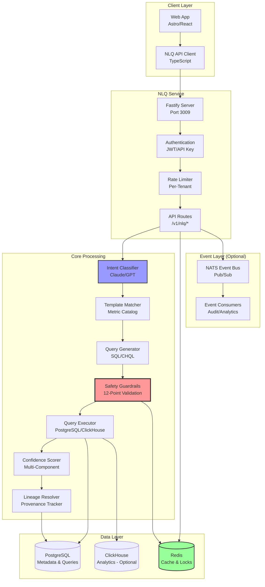
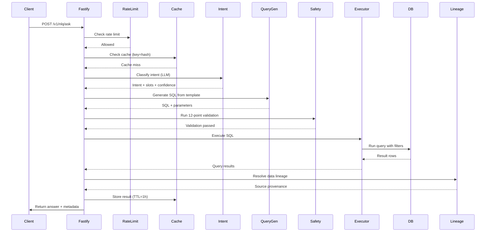
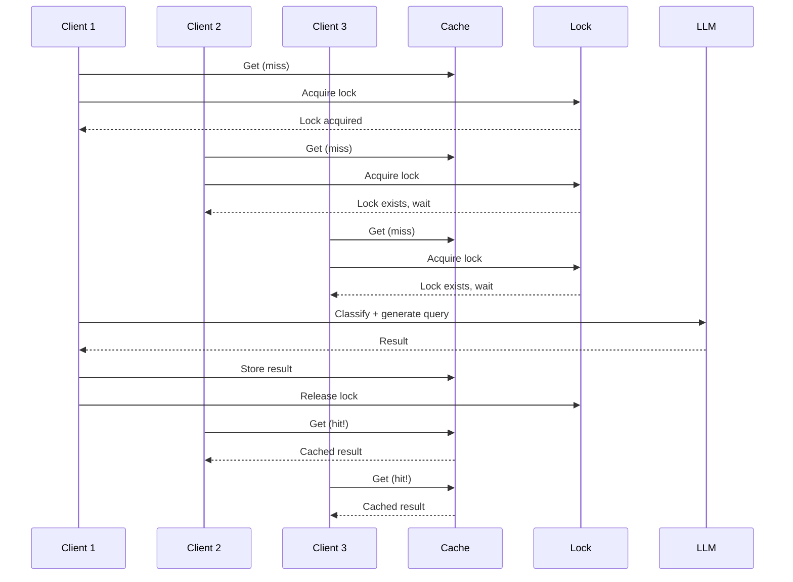
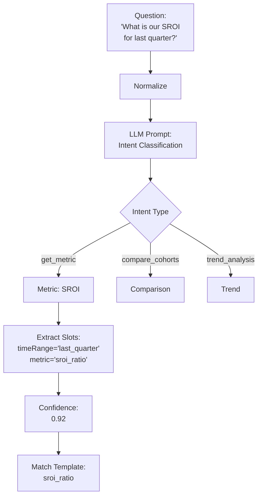
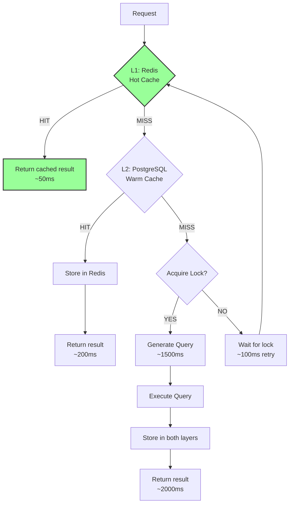
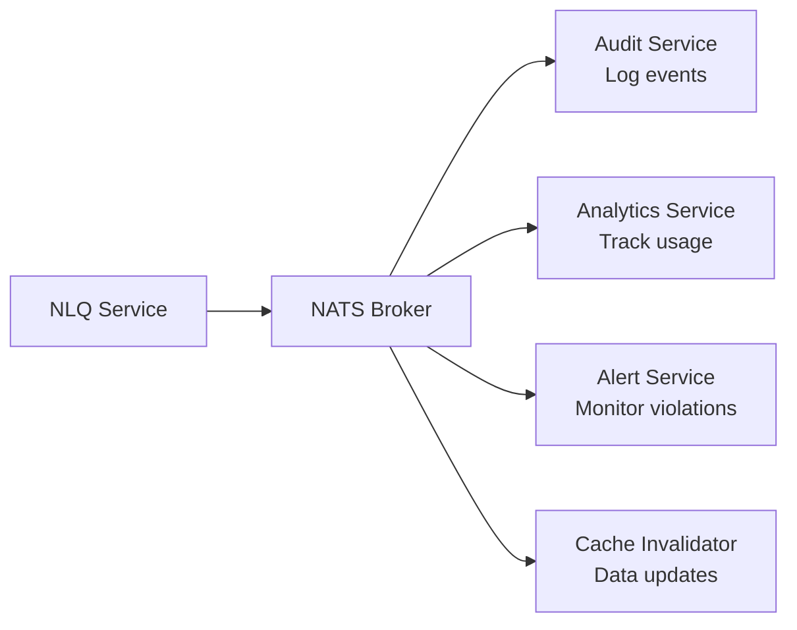
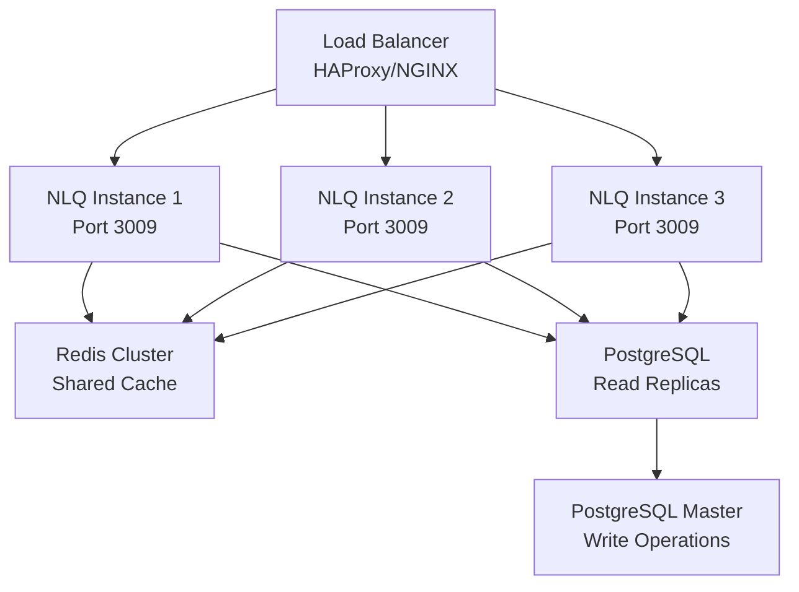

# NLQ Architecture

**System architecture, component interactions, and data flow for the Natural Language Query service**

---

## Table of Contents

- [System Overview](#system-overview)
- [High-Level Architecture](#high-level-architecture)
- [Component Interaction](#component-interaction)
- [Data Flow](#data-flow)
- [Database Schema](#database-schema)
- [Caching Strategy](#caching-strategy)
- [Event Architecture](#event-architecture)
- [Performance Considerations](#performance-considerations)

---

## System Overview

The NLQ (Natural Language Query) service is a production-grade AI-powered query engine that translates natural language questions into safe, validated SQL queries.

### Key Features

- **Natural Language Processing**: Claude/GPT-powered intent classification
- **Template-Based Query Generation**: Allow-listed metric templates
- **12-Point Safety Guardrails**: Comprehensive SQL injection and security validation
- **High-Performance Caching**: Sub-2.5s p95 latency with Redis
- **Complete Audit Trail**: Full query lineage and provenance tracking
- **Multi-Provider LLM Support**: Anthropic Claude and OpenAI GPT
- **Event-Driven Architecture**: NATS integration for real-time events

### Technology Stack

| Component | Technology | Purpose |
|-----------|----------|---------|
| **Runtime** | Node.js 18+ | JavaScript runtime |
| **Framework** | Fastify | High-performance HTTP server |
| **Database** | PostgreSQL 14+ | Primary data store and metadata |
| **Cache** | Redis 6+ | Query caching and rate limiting |
| **Analytics DB** | ClickHouse (optional) | High-performance analytics queries |
| **Event Bus** | NATS (optional) | Event streaming and pub/sub |
| **LLM** | Anthropic Claude / OpenAI GPT | Natural language understanding |
| **ORM** | Drizzle | Type-safe database queries |
| **Validation** | Zod | Runtime schema validation |

---

## High-Level Architecture



---

## Component Interaction

### 1. Request Flow



### 2. Cache Stampede Protection



---

## Data Flow

### Question → Intent → SQL → Answer

```mermaid
graph LR
    A[Natural Language<br/>Question] --> B[Normalization<br/>lowercase, trim]
    B --> C[Intent Classification<br/>LLM]
    C --> D[Slot Extraction<br/>metric, time, filters]
    D --> E[Template Matching<br/>Metric Catalog]
    E --> F[Parameter Binding<br/>{{placeholders}}]
    F --> G[SQL Generation<br/>PostgreSQL/ClickHouse]
    G --> H[Safety Validation<br/>12 Checks]
    H --> I[Query Execution<br/>Database]
    I --> J[Confidence Scoring<br/>5 Components]
    J --> K[Lineage Resolution<br/>Provenance]
    K --> L[Answer Summary<br/>Human-readable]
    L --> M[Response<br/>JSON]

    style H fill:#f99,stroke:#333,stroke-width:3px
    style C fill:#99f,stroke:#333,stroke-width:2px
    style I fill:#9f9,stroke:#333,stroke-width:2px
```

### Intent Classification Process



---

## Database Schema

### Core Tables

#### 1. nlq_queries

**Purpose**: Complete audit trail for all queries

```sql
CREATE TABLE nlq_queries (
  id UUID PRIMARY KEY DEFAULT gen_random_uuid(),
  company_id UUID NOT NULL REFERENCES companies(id),

  -- User input
  raw_question TEXT NOT NULL,
  normalized_question TEXT,
  language VARCHAR(10) DEFAULT 'en',

  -- Intent classification
  detected_intent VARCHAR(100) NOT NULL,
  extracted_slots JSONB NOT NULL,
  intent_confidence DECIMAL(4,3),

  -- Template matching
  template_id UUID REFERENCES nlq_templates(id),
  template_name VARCHAR(100),

  -- Generated query
  generated_sql TEXT,
  generated_chql TEXT,
  query_preview TEXT,

  -- Safety validation
  safety_check_id UUID REFERENCES nlq_safety_checks(id),
  safety_passed BOOLEAN NOT NULL DEFAULT false,
  safety_violations JSONB,

  -- Execution metadata
  execution_status VARCHAR(50) NOT NULL, -- pending, success, failed, rejected
  result_row_count INTEGER,
  execution_time_ms INTEGER,

  -- Answer metadata
  answer_confidence DECIMAL(4,3),
  answer_summary TEXT,
  lineage_pointers JSONB,

  -- Model information
  model_name VARCHAR(100),
  provider_name VARCHAR(50),
  tokens_used INTEGER,
  estimated_cost_usd VARCHAR(20),

  -- Rate limiting & caching
  cached BOOLEAN DEFAULT false,
  cache_key VARCHAR(64),

  -- Request tracking
  request_id VARCHAR(100),
  user_id UUID,
  session_id VARCHAR(100),

  created_at TIMESTAMPTZ NOT NULL DEFAULT NOW()
);

CREATE INDEX idx_nlq_queries_company ON nlq_queries(company_id);
CREATE INDEX idx_nlq_queries_created ON nlq_queries(created_at DESC);
CREATE INDEX idx_nlq_queries_cache_key ON nlq_queries(cache_key);
```

#### 2. nlq_templates

**Purpose**: Allow-listed metric templates for safe query generation

```sql
CREATE TABLE nlq_templates (
  id UUID PRIMARY KEY DEFAULT gen_random_uuid(),

  -- Template identification
  template_name VARCHAR(100) NOT NULL UNIQUE,
  display_name VARCHAR(200) NOT NULL,
  description TEXT NOT NULL,
  category VARCHAR(50) NOT NULL, -- impact, financial, engagement, outcomes

  -- SQL templates
  sql_template TEXT NOT NULL,
  chql_template TEXT,

  -- Allowed parameters
  allowed_time_ranges JSONB NOT NULL,
  allowed_group_by JSONB,
  allowed_filters JSONB,
  max_time_window_days INTEGER DEFAULT 365,

  -- Security constraints
  requires_tenant_filter BOOLEAN DEFAULT true,
  allowed_joins JSONB,
  denied_columns JSONB,

  -- Performance hints
  estimated_complexity VARCHAR(20),
  max_result_rows INTEGER DEFAULT 1000,
  cache_ttl_seconds INTEGER DEFAULT 3600,

  -- Metadata
  example_questions JSONB,
  related_templates JSONB,
  tags JSONB,

  -- Governance
  active BOOLEAN DEFAULT true,
  version INTEGER DEFAULT 1,
  created_by UUID,
  approved_by UUID,
  approved_at TIMESTAMPTZ,

  created_at TIMESTAMPTZ NOT NULL DEFAULT NOW(),
  updated_at TIMESTAMPTZ NOT NULL DEFAULT NOW()
);
```

#### 3. nlq_safety_checks

**Purpose**: 12-point validation audit trail

```sql
CREATE TABLE nlq_safety_checks (
  id UUID PRIMARY KEY DEFAULT gen_random_uuid(),
  query_id UUID REFERENCES nlq_queries(id),

  -- 12-point safety validation
  check_results JSONB NOT NULL,
  overall_passed BOOLEAN NOT NULL,
  violation_codes JSONB,
  violation_severity VARCHAR(20),

  -- Detection metadata
  detection_method VARCHAR(50),
  false_positive_score DECIMAL(4,3),

  -- Audit trail
  checked_at TIMESTAMPTZ NOT NULL DEFAULT NOW(),
  checked_by VARCHAR(100),
  alert_triggered BOOLEAN DEFAULT false
);
```

#### 4. nlq_cache_entries

**Purpose**: Cache metadata and statistics

```sql
CREATE TABLE nlq_cache_entries (
  id UUID PRIMARY KEY DEFAULT gen_random_uuid(),

  -- Cache key (SHA-256 hash)
  cache_key VARCHAR(64) NOT NULL UNIQUE,
  normalized_query TEXT NOT NULL,
  query_params JSONB,

  -- Cache metadata
  result_data JSONB,
  result_hash VARCHAR(64),
  hit_count INTEGER DEFAULT 0,
  last_hit_at TIMESTAMPTZ,

  -- TTL management
  ttl_seconds INTEGER DEFAULT 3600,
  expires_at TIMESTAMPTZ NOT NULL,
  invalidated BOOLEAN DEFAULT false,
  invalidated_reason VARCHAR(200),

  -- Performance tracking
  avg_execution_time_ms INTEGER,
  cache_generation_time_ms INTEGER,

  created_at TIMESTAMPTZ NOT NULL DEFAULT NOW(),
  updated_at TIMESTAMPTZ NOT NULL DEFAULT NOW()
);

CREATE INDEX idx_cache_entries_key ON nlq_cache_entries(cache_key);
CREATE INDEX idx_cache_entries_expires ON nlq_cache_entries(expires_at);
```

#### 5. nlq_rate_limits

**Purpose**: Per-tenant query rate limiting

```sql
CREATE TABLE nlq_rate_limits (
  id UUID PRIMARY KEY DEFAULT gen_random_uuid(),
  company_id UUID NOT NULL REFERENCES companies(id) UNIQUE,

  -- Quota configuration
  daily_query_limit INTEGER DEFAULT 500,
  hourly_query_limit INTEGER DEFAULT 50,
  concurrent_query_limit INTEGER DEFAULT 5,

  -- Current usage
  queries_used_today INTEGER DEFAULT 0,
  queries_used_this_hour INTEGER DEFAULT 0,
  current_concurrent INTEGER DEFAULT 0,

  -- Reset tracking
  daily_reset_at TIMESTAMPTZ NOT NULL,
  hourly_reset_at TIMESTAMPTZ NOT NULL,

  -- Violation tracking
  limit_exceeded_count INTEGER DEFAULT 0,
  last_limit_exceeded_at TIMESTAMPTZ,

  updated_at TIMESTAMPTZ NOT NULL DEFAULT NOW()
);
```

---

## Caching Strategy

### Cache Key Generation

```typescript
// SHA-256 hash of normalized query + params
const cacheKey = generateCacheKey({
  normalizedQuestion: question.toLowerCase().trim(),
  companyId: '550e8400-e29b-41d4-a716-446655440000',
  timeRange: 'last_quarter',
  filters: { program: 'education' }
});

// Result: "nlq:550e8400:abc123def456..."
```

### Cache Layers



### Cache TTL Strategy

| Template Category | TTL | Reason |
|------------------|-----|--------|
| **Real-time metrics** | 5 minutes | Volatile data |
| **Daily aggregates** | 1 hour | Updated daily |
| **Monthly metrics** | 4 hours | Stable data |
| **Quarterly/Annual** | 24 hours | Rarely changes |
| **Benchmarks** | 4 hours | Updated periodically |

### Cache Invalidation

**Event-based invalidation**:

```typescript
// When company data is updated
await nlqCache.invalidateByCompany(companyId);

// When a template is modified
await nlqCache.invalidateByTemplate(templateId);

// Manual invalidation
await nlqCache.invalidateAll();
```

**Pattern-based invalidation**:

```typescript
// Invalidate all SROI queries for a company
await nlqCache.invalidate(`nlq:${companyId}:*sroi*`);
```

---

## Event Architecture

### NATS Event Publishing



### Event Types

#### 1. nlq.query.submitted

```json
{
  "eventType": "nlq.query.submitted",
  "queryId": "123e4567-e89b-12d3-a456-426614174000",
  "companyId": "550e8400-e29b-41d4-a716-446655440000",
  "question": "What is our SROI for last quarter?",
  "timestamp": "2025-11-16T12:00:00.000Z"
}
```

#### 2. nlq.query.completed

```json
{
  "eventType": "nlq.query.completed",
  "queryId": "123e4567-e89b-12d3-a456-426614174000",
  "companyId": "550e8400-e29b-41d4-a716-446655440000",
  "intent": "get_metric",
  "templateId": "sroi_ratio",
  "executionTimeMs": 1847,
  "cached": false,
  "confidence": 0.87,
  "timestamp": "2025-11-16T12:00:02.000Z"
}
```

#### 3. nlq.query.rejected

```json
{
  "eventType": "nlq.query.rejected",
  "queryId": "123e4567-e89b-12d3-a456-426614174000",
  "companyId": "550e8400-e29b-41d4-a716-446655440000",
  "violations": ["PII_001", "TNT_001"],
  "severity": "critical",
  "timestamp": "2025-11-16T12:00:01.000Z"
}
```

---

## Performance Considerations

### Latency Targets

| Scenario | Target | Typical |
|----------|--------|---------|
| **Cache hit** | < 100ms | ~50ms |
| **Cache miss + warm DB** | < 500ms | ~300ms |
| **Full query generation** | < 3000ms | ~2000ms |
| **p95 latency** | < 2500ms | ~2100ms |
| **p99 latency** | < 4000ms | ~3500ms |

### Optimization Strategies

#### 1. Query Timeout

```typescript
const QUERY_TIMEOUT = 30000; // 30 seconds max
```

#### 2. Concurrent Query Limiting

```typescript
const MAX_CONCURRENT_QUERIES = 10; // Per service instance
```

#### 3. Result Row Limiting

```typescript
const MAX_RESULT_ROWS = 10000; // Hard cap
```

#### 4. Redis Pipelining

```typescript
// Batch cache operations
const pipeline = redis.pipeline();
keys.forEach(key => pipeline.get(key));
await pipeline.exec();
```

#### 5. Database Connection Pooling

```typescript
const pool = {
  min: 2,
  max: 10,
  timeout: 10000,
  idleTimeoutMillis: 30000,
};
```

### Scaling Strategy



**Horizontal Scaling**:
- Stateless service design (no local state)
- Shared Redis cache for consistency
- PostgreSQL read replicas for query load
- Load balancer with sticky sessions (optional)

**Vertical Scaling**:
- Increase Node.js memory limit: `--max-old-space-size=4096`
- Increase database connection pool size
- Increase Redis memory: `maxmemory 10gb`

---

**Next**: [Security](./NLQ_SECURITY.md) →
