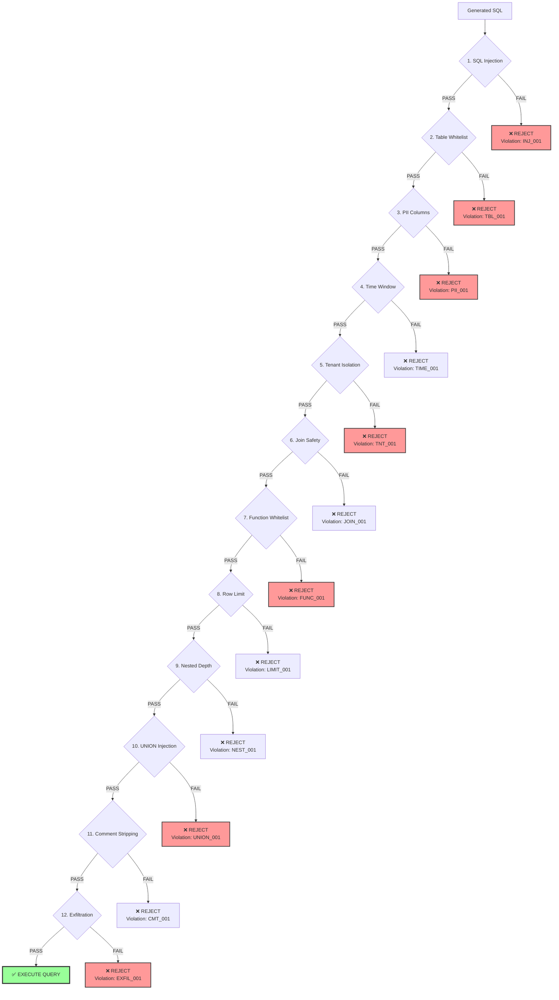
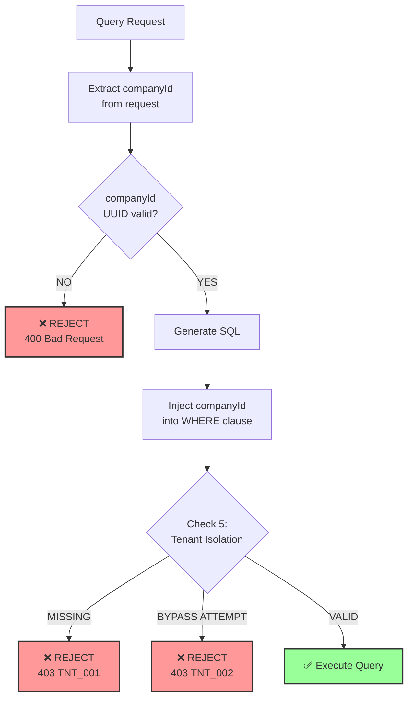

# NLQ Security

**12-Point Safety Guardrails, PII Protection, and Compliance**

---

## Table of Contents

- [Overview](#overview)
- [12-Point Safety Guardrails](#12-point-safety-guardrails)
- [SQL Injection Prevention](#sql-injection-prevention)
- [PII Protection](#pii-protection)
- [Tenant Isolation](#tenant-isolation)
- [Rate Limiting](#rate-limiting)
- [Audit Logging](#audit-logging)
- [Compliance](#compliance)
- [Security Best Practices](#security-best-practices)

---

## Overview

The NLQ service implements a defense-in-depth security model with **12 layers of validation** to prevent:

- SQL injection attacks
- Data exfiltration attempts
- PII exposure
- Tenant data leakage
- Performance degradation (query bombs)
- Unauthorized table/column access

### Security Principles

1. **Allow-list, not deny-list**: Only pre-approved templates and tables
2. **Fail-fast**: Reject queries at the earliest validation failure
3. **Complete audit trail**: Log all queries and safety violations
4. **Zero-trust**: Never trust LLM-generated SQL without validation
5. **Tenant isolation**: Enforce companyId filter on all queries
6. **PII redaction**: Block access to personally identifiable columns

---

## 12-Point Safety Guardrails

All generated SQL queries must pass **all 12 checks** before execution. A single violation rejects the query.

### Validation Flow



### Check Details

#### 1. SQL Injection Detection

**Violation Code**: `INJ_001`
**Severity**: CRITICAL

Detects common SQL injection patterns:

```typescript
const dangerousPatterns = [
  /;\s*drop\s+/i,           // DROP statements
  /;\s*delete\s+from\s+/i,  // DELETE with semicolon
  /;\s*update\s+.*\s+set\s+/i, // UPDATE with semicolon
  /;\s*insert\s+into\s+/i,  // INSERT with semicolon
  /;\s*exec(\s|\()/i,       // EXEC/EXECUTE
  /;\s*xp_\w+/i,            // Extended stored procedures
  /'\s*or\s+'1'\s*=\s*'1/i, // Classic OR 1=1
  /'\s*or\s+1\s*=\s*1/i,    // Numeric OR 1=1
  /--/,                     // SQL comments
  /;\s*$/,                  // Trailing semicolon
];
```

**Example violations**:
```sql
-- ❌ REJECT: Semicolon injection
SELECT * FROM users WHERE id = 1; DROP TABLE users;

-- ❌ REJECT: Comment injection
SELECT * FROM users WHERE id = 1 -- AND active = true

-- ❌ REJECT: OR 1=1 injection
SELECT * FROM users WHERE username = 'admin' OR '1'='1'
```

#### 2. Table Whitelist Validation

**Violation Code**: `TBL_001`
**Severity**: CRITICAL

Only allow-listed tables can be accessed:

```typescript
const allowedTables = [
  'metrics_company_period',
  'outcome_scores',
  'users',
  'evidence_snippets',
  'benchmarks_cohort_aggregates',
];
```

**Example violations**:
```sql
-- ❌ REJECT: Unauthorized table
SELECT * FROM admin_credentials WHERE ...

-- ❌ REJECT: System table
SELECT * FROM pg_shadow WHERE ...
```

#### 3. PII Column Protection

**Violation Code**: `PII_001`
**Severity**: CRITICAL

Block access to PII columns:

```typescript
const piiColumns = [
  'email', 'phone', 'phone_number',
  'address', 'street', 'city', 'postal_code', 'zip_code',
  'ssn', 'social_security', 'passport', 'driver_license',
  'date_of_birth', 'dob', 'birth_date',
  'full_name', 'first_name', 'last_name',
  'ip_address', 'credit_card', 'bank_account',
];
```

**Example violations**:
```sql
-- ❌ REJECT: Email column
SELECT email, COUNT(*) FROM users GROUP BY email

-- ❌ REJECT: Full name in WHERE clause
SELECT * FROM users WHERE full_name = 'John Doe'
```

#### 4. Time Window Limit

**Violation Code**: `TIME_001`
**Severity**: MEDIUM

Prevent queries spanning excessive time ranges (default: 730 days / 2 years):

```typescript
// Extract date literals and check span
const dates = sql.match(/\d{4}-\d{2}-\d{2}/g) || [];
const daysDiff = Math.abs((lastDate - firstDate) / (1000 * 60 * 60 * 24));

if (daysDiff > 730) {
  // REJECT
}
```

**Example violations**:
```sql
-- ❌ REJECT: 5-year time window
WHERE period_start >= '2020-01-01' AND period_end <= '2025-12-31'
```

#### 5. Tenant Isolation

**Violation Code**: `TNT_001`, `TNT_002`
**Severity**: CRITICAL

**MUST** include `company_id` filter with exact match:

```typescript
// Required pattern
const tenantFilterPattern = /company_id\s*=\s*'[0-9a-f-]{36}'/i;

// Blocked patterns (bypass attempts)
const bypassPatterns = [
  /company_id\s*=.*\bor\b/i,
  /\bor\b.*company_id\s*=/i,
];
```

**Example violations**:
```sql
-- ❌ REJECT TNT_001: Missing companyId filter
SELECT * FROM metrics_company_period WHERE period_start >= '2024-01-01'

-- ❌ REJECT TNT_002: OR bypass attempt
SELECT * FROM metrics WHERE company_id = 'abc' OR 1=1
```

**Valid**:
```sql
-- ✅ PASS: Correct tenant isolation
SELECT * FROM metrics_company_period
WHERE company_id = '550e8400-e29b-41d4-a716-446655440000'
  AND period_start >= '2024-01-01'
```

#### 6. Join Safety

**Violation Code**: `JOIN_001`
**Severity**: HIGH

Only allow-listed table joins permitted:

```typescript
// Template-specific allowed joins
const allowedJoins = ['users', 'programs', 'locations'];
```

**Example violations**:
```sql
-- ❌ REJECT: Unauthorized join
SELECT * FROM metrics
JOIN admin_users ON metrics.user_id = admin_users.id
```

#### 7. Function Whitelist

**Violation Code**: `FUNC_001`
**Severity**: CRITICAL

Block dangerous SQL functions:

```typescript
const dangerousFunctions = [
  'pg_sleep', 'pg_read_file', 'pg_ls_dir', 'pg_stat_file',
  'lo_import', 'lo_export', 'lo_unlink',
  'copy', 'dblink', 'dblink_connect', 'dblink_exec',
  'system', 'shell', 'exec', 'execute',
];
```

**Example violations**:
```sql
-- ❌ REJECT: File system access
SELECT pg_read_file('/etc/passwd')

-- ❌ REJECT: Sleep attack
SELECT pg_sleep(1000)
```

#### 8. Row Limit Enforcement

**Violation Code**: `LIMIT_001`, `LIMIT_002`
**Severity**: MEDIUM

**MUST** include `LIMIT` clause (max: 10,000 rows):

```typescript
const limitPattern = /\blimit\s+(\d+)/i;
const match = sql.match(limitPattern);

if (!match) {
  // REJECT LIMIT_001: Missing LIMIT
}

const limit = parseInt(match[1], 10);
if (limit > 10000) {
  // REJECT LIMIT_002: Limit too high
}
```

**Example violations**:
```sql
-- ❌ REJECT LIMIT_001: No LIMIT clause
SELECT * FROM metrics WHERE company_id = '...'

-- ❌ REJECT LIMIT_002: Limit too high
SELECT * FROM metrics WHERE company_id = '...' LIMIT 50000
```

#### 9. Nested Query Depth

**Violation Code**: `NEST_001`
**Severity**: MEDIUM

Limit subquery nesting to 3 levels:

```typescript
const subqueryCount = (sql.match(/\bselect\b/gi) || []).length - 1;

if (subqueryCount > 3) {
  // REJECT
}
```

**Example violations**:
```sql
-- ❌ REJECT: 4 levels of nesting
SELECT * FROM (
  SELECT * FROM (
    SELECT * FROM (
      SELECT * FROM (
        SELECT * FROM metrics
      )
    )
  )
)
```

#### 10. UNION Injection Prevention

**Violation Code**: `UNION_001`
**Severity**: HIGH

UNION is not allowed in NLQ queries:

```typescript
const unionPattern = /\bunion\b/i;

if (unionPattern.test(sql)) {
  // REJECT
}
```

**Example violations**:
```sql
-- ❌ REJECT: UNION clause
SELECT * FROM metrics WHERE company_id = '...'
UNION
SELECT * FROM admin_metrics
```

#### 11. Comment Stripping Verification

**Violation Code**: `CMT_001`
**Severity**: MEDIUM

Ensure SQL comments have been removed:

```typescript
const blockCommentPattern = /\/\*.*?\*\//s;
const lineCommentPattern = /--.*$/m;

if (blockCommentPattern.test(sql) || lineCommentPattern.test(sql)) {
  // REJECT
}
```

#### 12. Exfiltration Pattern Detection

**Violation Code**: `EXFIL_001`
**Severity**: CRITICAL

Detect data exfiltration attempts:

```typescript
const exfiltrationPatterns = [
  /\binto\s+outfile\b/i,        // SELECT INTO OUTFILE
  /\binto\s+dumpfile\b/i,       // SELECT INTO DUMPFILE
  /\bload_file\s*\(/i,          // LOAD_FILE()
  /\bcopy\s+.*\bto\b/i,         // COPY TO
  /\bpg_read_file\s*\(/i,       // pg_read_file()
  /\blo_export\s*\(/i,          // lo_export()
];
```

**Example violations**:
```sql
-- ❌ REJECT: File export
SELECT * FROM metrics INTO OUTFILE '/tmp/data.csv'

-- ❌ REJECT: COPY to file
COPY (SELECT * FROM metrics) TO '/tmp/data.csv'
```

---

## SQL Injection Prevention

### Attack Vectors & Mitigations

#### 1. Classic SQL Injection

**Attack**:
```
Question: "Show SROI'; DROP TABLE metrics; --"
```

**Generated SQL** (without protection):
```sql
SELECT * FROM metrics WHERE question = 'Show SROI'; DROP TABLE metrics; --'
```

**Mitigation**:
- Template-based query generation (no string interpolation)
- Parameterized queries with placeholders
- Check 1: SQL Injection Detection blocks semicolons

#### 2. OR 1=1 Injection

**Attack**:
```
Question: "Show SROI' OR '1'='1"
```

**Mitigation**:
- Check 1: Detects OR 1=1 patterns
- Template validation ensures proper WHERE clause structure

#### 3. UNION-Based Injection

**Attack**:
```
Question: "Show SROI' UNION SELECT password FROM admin_users --"
```

**Mitigation**:
- Check 10: UNION clause is blocked entirely
- Check 2: `admin_users` table not whitelisted

#### 4. Blind SQL Injection

**Attack**:
```
Question: "Show SROI AND pg_sleep(10) --"
```

**Mitigation**:
- Check 7: `pg_sleep` function is blacklisted
- Check 11: Comments are stripped

---

## PII Protection

### PII Column Inventory

| Category | Columns Blocked |
|----------|----------------|
| **Contact** | email, phone, phone_number |
| **Address** | address, street, city, postal_code, zip_code |
| **Identity** | ssn, social_security, passport, driver_license |
| **Dates** | date_of_birth, dob, birth_date |
| **Names** | full_name, first_name, last_name |
| **Digital** | ip_address, credit_card, bank_account |

### GDPR Compliance

The NLQ service implements GDPR Article 32 (Security of processing) by:

1. **Pseudonymization**: No direct PII access via NLQ
2. **Encryption in transit**: HTTPS/TLS for all API calls
3. **Access controls**: JWT authentication and rate limiting
4. **Audit trail**: Complete query logging for accountability
5. **Data minimization**: Only aggregate metrics, no individual records

### Example: Safe vs. Unsafe Queries

**❌ UNSAFE** (PII exposure):
```sql
SELECT full_name, email, date_of_birth
FROM users
WHERE company_id = '550e8400-e29b-41d4-a716-446655440000'
```
**Violation**: `PII_001` - Columns `full_name`, `email`, `date_of_birth` are blocked

**✅ SAFE** (Aggregate metrics):
```sql
SELECT
  COUNT(*) as total_users,
  AVG(age) as average_age
FROM users
WHERE company_id = '550e8400-e29b-41d4-a716-446655440000'
LIMIT 1
```

---

## Tenant Isolation

### Multi-Tenancy Security Model



### Enforcement Rules

1. **Mandatory filter**: Every query MUST include `WHERE company_id = '{uuid}'`
2. **Exact match**: No `IN`, `LIKE`, or range operators on `company_id`
3. **No OR bypass**: Patterns like `company_id = 'x' OR 1=1` are blocked
4. **Subquery enforcement**: Subqueries must also have tenant filter

### Example: Tenant Isolation Validation

**Template**:
```sql
SELECT
  sroi_ratio,
  participants_count
FROM metrics_company_period
WHERE company_id = {{companyId}}
  AND period_start >= {{startDate}}
  AND period_end <= {{endDate}}
ORDER BY period_start DESC
LIMIT {{limit}}
```

**After parameter binding**:
```sql
SELECT
  sroi_ratio,
  participants_count
FROM metrics_company_period
WHERE company_id = '550e8400-e29b-41d4-a716-446655440000'
  AND period_start >= '2024-10-01'
  AND period_end <= '2024-12-31'
ORDER BY period_start DESC
LIMIT 10
```

**Validation**:
- ✅ Contains `company_id = '550e8400-e29b-41d4-a716-446655440000'`
- ✅ No OR bypass attempts
- ✅ Check 5 passes

---

## Rate Limiting

### Per-Tenant Rate Limits

| Limit Type | Default | Configurable | Purpose |
|------------|---------|--------------|---------|
| **Daily** | 500 queries/day | Yes | Prevent abuse |
| **Hourly** | 50 queries/hour | Yes | Burst protection |
| **Concurrent** | 5 queries | Yes | Resource protection |

### Rate Limit Enforcement

```typescript
// Check rate limits before processing
const rateLimitCheck = await checkRateLimit(companyId);

if (!rateLimitCheck.allowed) {
  return reply.status(429).send({
    error: 'Rate limit exceeded',
    message: rateLimitCheck.message,
    limits: {
      daily: rateLimitCheck.dailyRemaining,
      hourly: rateLimitCheck.hourlyRemaining,
    },
    resetAt: rateLimitCheck.resetAt,
  });
}
```

### Custom Rate Limits

Adjust limits per company:

```sql
INSERT INTO nlq_rate_limits (
  company_id,
  daily_query_limit,
  hourly_query_limit,
  concurrent_query_limit
) VALUES (
  '550e8400-e29b-41d4-a716-446655440000',
  1000,  -- 1000 queries/day
  100,   -- 100 queries/hour
  10     -- 10 concurrent
)
ON CONFLICT (company_id) DO UPDATE
SET daily_query_limit = EXCLUDED.daily_query_limit,
    hourly_query_limit = EXCLUDED.hourly_query_limit,
    concurrent_query_limit = EXCLUDED.concurrent_query_limit;
```

---

## Audit Logging

### What We Log

Every query is logged with:

1. **User input**: Raw question, normalized question, language
2. **Intent classification**: Detected intent, slots, confidence
3. **Query generation**: SQL, template ID, parameters
4. **Safety validation**: All 12 check results, violations
5. **Execution**: Status, row count, execution time
6. **Answer metadata**: Confidence, lineage, model info
7. **Request tracking**: Request ID, user ID, session ID, IP address

### Audit Trail Schema

```sql
SELECT
  id,
  company_id,
  raw_question,
  detected_intent,
  safety_passed,
  safety_violations,
  execution_status,
  created_at
FROM nlq_queries
WHERE company_id = '550e8400-e29b-41d4-a716-446655440000'
ORDER BY created_at DESC;
```

### Safety Violation Alerts

Critical violations trigger alerts:

```typescript
if (safetyCheck.overallSeverity === 'critical') {
  await alertSecurityTeam({
    queryId,
    companyId,
    violations: safetyCheck.violations,
    severity: 'critical',
    timestamp: new Date(),
  });
}
```

---

## Compliance

### GDPR (EU General Data Protection Regulation)

| Article | Requirement | Implementation |
|---------|-------------|----------------|
| **Article 5(1)(c)** | Data minimization | Only aggregate metrics, no individual records |
| **Article 5(1)(f)** | Security of processing | 12-point safety guardrails, encryption |
| **Article 15** | Right of access | Query history available via API |
| **Article 17** | Right to erasure | Cache invalidation, query log deletion |
| **Article 25** | Data protection by design | Security built into architecture |
| **Article 32** | Security measures | Encryption, access controls, audit logging |

### SOC 2 Type II

| Control | Implementation |
|---------|----------------|
| **Access Control** | JWT authentication, rate limiting |
| **Logical Access** | Tenant isolation, PII protection |
| **Data Protection** | Encryption at rest and in transit |
| **Change Management** | Template versioning, approval workflow |
| **Monitoring** | Complete audit trail, real-time alerts |
| **Incident Response** | Automated violation detection and alerts |

### ISO 27001

| Control | Implementation |
|---------|----------------|
| **A.9.2.1** | User registration | User ID tracking in queries |
| **A.9.4.1** | Access restriction | 12-point safety validation |
| **A.12.3.1** | Information backup | PostgreSQL backups, query logs |
| **A.12.4.1** | Event logging | Complete audit trail |
| **A.14.2.1** | Secure development | Template-based queries, validation |
| **A.18.1.5** | PII protection | Column-level access controls |

---

## Security Best Practices

### For Developers

1. **Never bypass safety checks**: Even for admin users
2. **Use templates**: Never construct SQL from string concatenation
3. **Validate input**: Use Zod schemas for all API requests
4. **Log everything**: Complete audit trail for accountability
5. **Test security**: Include safety violation tests in CI/CD

### For Operators

1. **Monitor violations**: Set up alerts for critical violations
2. **Review logs**: Regularly audit query logs for anomalies
3. **Rotate secrets**: Change LLM API keys periodically
4. **Update templates**: Review and update metric templates quarterly
5. **Backup data**: Regular PostgreSQL backups

### For Security Teams

1. **Penetration testing**: Test SQL injection defenses annually
2. **Code review**: Security review for all template changes
3. **Incident response**: Define runbook for safety violations
4. **Access audit**: Review JWT tokens and API keys quarterly
5. **Compliance review**: Annual GDPR/SOC 2 audit

---

## Security Incident Response

### Severity Levels

| Level | Criteria | Response Time | Actions |
|-------|----------|---------------|---------|
| **P0 - Critical** | Data breach, SQL injection successful | Immediate | Stop service, investigate, notify |
| **P1 - High** | Repeated critical violations | < 1 hour | Alert security team, review logs |
| **P2 - Medium** | Isolated safety violations | < 4 hours | Log, monitor for patterns |
| **P3 - Low** | Rate limit violations | < 24 hours | Monitor, adjust limits if needed |

### Incident Runbook

1. **Detect**: Safety violation alert triggered
2. **Analyze**: Review query logs, identify attack vector
3. **Contain**: Block offending IP/company if necessary
4. **Remediate**: Update safety rules if new attack pattern
5. **Document**: Log incident, lessons learned
6. **Improve**: Update security controls, add tests

---

**Next**: [Troubleshooting](./NLQ_TROUBLESHOOTING.md) →
