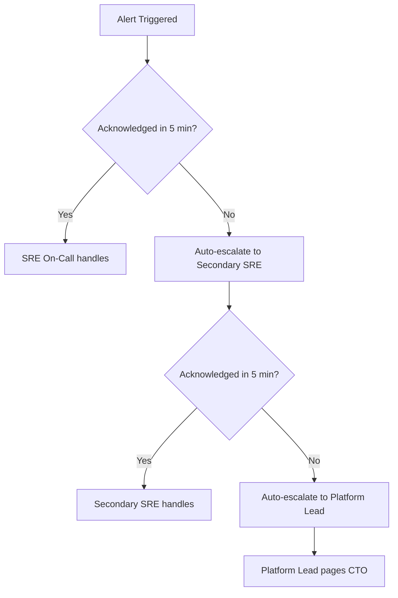
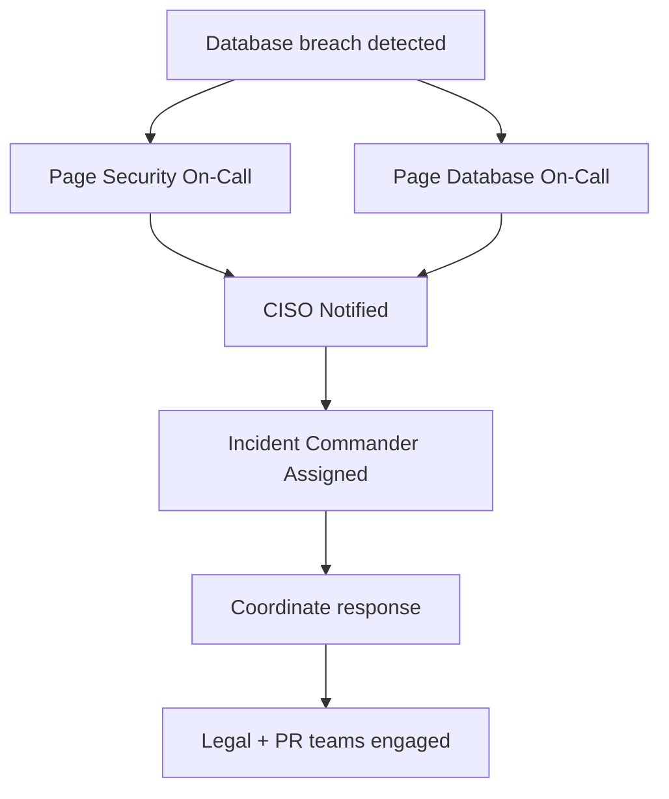

# Runbook: Incident Escalation Matrix

**Document ID**: RB-GA-005
**Version**: 1.0.0
**Last Updated**: 2025-11-15
**Owner**: SRE & On-Call Team
**Severity**: CRITICAL
**24/7 Coverage**: Yes

---

## 📋 Overview

This runbook defines the incident escalation matrix, on-call rotation, severity classification, and response procedures for the TEEI CSR Platform. It ensures rapid response to production incidents with clear ownership and accountability.

### On-Call Rotation

| Role | Primary | Secondary | Escalation |
|------|---------|-----------|------------|
| **SRE On-Call** | PagerDuty: `sre-oncall` | PagerDuty: `sre-oncall-secondary` | Platform Lead |
| **Security On-Call** | PagerDuty: `security-oncall` | PagerDuty: `security-oncall-secondary` | CISO |
| **Database On-Call** | PagerDuty: `database-oncall` | PagerDuty: `database-oncall-secondary` | Data Engineering Lead |
| **AI/ML On-Call** | PagerDuty: `ai-ml-oncall` | PagerDuty: `ai-ml-oncall-secondary` | AI/ML Lead |
| **FinOps On-Call** | PagerDuty: `finops-oncall` | Email: finops@teei.io | CFO |

**Rotation Schedule**: 1-week rotations, starting Monday 00:00 UTC

---

## 🚨 Severity Levels

### SEV-1: Critical (Red Alert)

**Definition**: Complete service outage or severe degradation affecting all users

**Examples**:
- Platform completely down (HTTP 503 for > 5 minutes)
- Database unavailable (all regions)
- Data breach / security incident
- Data loss or corruption
- Payment system failure
- Multi-region failure

**Response SLO**:
- **Acknowledgment**: < 5 minutes (24/7)
- **Triage**: < 15 minutes
- **Mitigation**: < 30 minutes
- **Resolution**: < 4 hours

**Escalation**:
- **Immediate**: SRE On-Call (auto-paged)
- **5 min**: Platform Lead (if not acknowledged)
- **15 min**: CTO (if not triaged)
- **30 min**: CEO (if not mitigated)
- **4 hours**: Board notification (if not resolved)

**Communication**:
- [ ] Update status page immediately
- [ ] Post to #incidents Slack channel
- [ ] Email to cto@teei.io, ceo@teei.io
- [ ] Customer notifications (via in-app banner)
- [ ] Post-incident review required (within 48 hours)

---

### SEV-2: High (Orange Alert)

**Definition**: Significant feature degradation affecting subset of users or single region

**Examples**:
- Single region degraded performance (p95 > 2s)
- AI/ML feature unavailable (platform still functional)
- Database replication lag > 60 seconds
- Authentication slowdowns (> 3s login time)
- Reporting exports failing
- Single critical API endpoint down

**Response SLO**:
- **Acknowledgment**: < 15 minutes (24/7)
- **Triage**: < 30 minutes
- **Mitigation**: < 2 hours
- **Resolution**: < 24 hours

**Escalation**:
- **Immediate**: SRE On-Call (auto-paged)
- **15 min**: Platform Lead (if not acknowledged)
- **2 hours**: CTO (if not mitigated)

**Communication**:
- [ ] Post to #incidents Slack channel
- [ ] Update status page (if user-visible)
- [ ] Email to engineering-leads@teei.io
- [ ] Internal incident report (within 72 hours)

---

### SEV-3: Medium (Yellow Alert)

**Definition**: Minor degradation or non-critical feature impairment, < 10% of users affected

**Examples**:
- Slow dashboard load times (p95 > 1s but < 2s)
- Non-critical API errors (< 5% error rate)
- Background job delays (< 1 hour delay)
- Monitoring alert false positives
- Single tenant reporting issues
- Non-production environment issues

**Response SLO**:
- **Acknowledgment**: < 30 minutes (business hours only)
- **Triage**: < 2 hours
- **Mitigation**: < 8 hours
- **Resolution**: < 5 business days

**Escalation**:
- **Immediate**: SRE On-Call (Slack notification)
- **2 hours**: Platform Lead (if not triaged)

**Communication**:
- [ ] Post to #incidents Slack channel
- [ ] Update internal incident log
- [ ] No customer notification unless escalated

---

### SEV-4: Low (Blue Notice)

**Definition**: Minor issues, cosmetic bugs, or proactive alerts with no user impact

**Examples**:
- Documentation updates needed
- Planned maintenance reminders
- Cost optimization opportunities
- Non-urgent security patches
- Performance improvement ideas

**Response SLO**:
- **Acknowledgment**: < 4 hours (business hours only)
- **Triage**: < 1 business day
- **Resolution**: Best effort (backlog prioritization)

**Escalation**:
- **Immediate**: Post to #engineering-backlog Slack
- **No paging** - handled during business hours

**Communication**:
- [ ] Post to relevant Slack channel
- [ ] Add to sprint planning backlog

---

## 📞 On-Call Contact Information

### Primary Contacts

**SRE On-Call**:
- **PagerDuty**: Call/SMS to `sre-oncall`
- **Slack**: Mention `@sre-oncall` in #incidents
- **Phone**: See PagerDuty roster (rotates weekly)

**Platform Lead**:
- **PagerDuty**: `platform-lead`
- **Slack**: `@platform-lead`
- **Email**: platform-lead@teei.io
- **Phone**: +1-XXX-XXX-XXXX (emergency only)

**CTO**:
- **PagerDuty**: `cto-escalation`
- **Slack**: `@cto`
- **Email**: cto@teei.io
- **Phone**: +1-XXX-XXX-XXXX (SEV-1 only)

**CISO**:
- **PagerDuty**: `ciso-escalation`
- **Slack**: `@ciso`
- **Email**: ciso@teei.io
- **Phone**: +1-XXX-XXX-XXXX (security incidents only)

---

### Vendor Contacts (24/7 Support)

| Vendor | Support Type | Contact | Use Case |
|--------|-------------|---------|----------|
| **AWS** | Enterprise Support | AWS Console → Support | Infrastructure issues |
| **Datadog** | Premium Support | support@datadoghq.com | Monitoring platform issues |
| **PagerDuty** | Business Support | support@pagerduty.com | Alerting issues |
| **OpenAI** | Priority Support | support@openai.com | AI/ML API outages |
| **Anthropic** | Email Support | support@anthropic.com | Claude API issues |

---

## 🔥 Incident Response Workflow

### Phase 1: Detection & Triage (0-15 minutes)

#### Automatic Detection

**Prometheus alerting rules**:
```yaml
# /etc/prometheus/alerts/critical-alerts.yaml
groups:
- name: critical-alerts
  rules:
  - alert: PlatformDown
    expr: up{job="platform"} == 0
    for: 5m
    labels:
      severity: sev1
      team: sre
    annotations:
      summary: "Platform is DOWN in {{ $labels.region }}"
      description: "Platform service unavailable for 5 minutes"
      runbook: "https://docs.teei.io/runbooks/platform-down"

  - alert: DatabaseReplicationLag
    expr: pg_replication_lag_seconds > 60
    for: 5m
    labels:
      severity: sev2
      team: database
    annotations:
      summary: "Database replication lag > 60s"
      description: "Replication lag: {{ $value }}s"
      runbook: "https://docs.teei.io/runbooks/database-failover"

  - alert: ErrorRateHigh
    expr: rate(http_requests_total{status=~"5.."}[5m]) > 0.05
    for: 10m
    labels:
      severity: sev2
      team: sre
    annotations:
      summary: "High error rate detected"
      description: "Error rate: {{ $value | humanizePercentage }}"
```

**AlertManager routes to PagerDuty**:
```yaml
# /etc/alertmanager/alertmanager.yml
route:
  receiver: 'pagerduty-default'
  routes:
  - match:
      severity: sev1
    receiver: 'pagerduty-critical'
    continue: true
    repeat_interval: 5m
  - match:
      severity: sev2
    receiver: 'pagerduty-high'
    repeat_interval: 15m
  - match:
      severity: sev3
    receiver: 'slack-incidents'

receivers:
- name: 'pagerduty-critical'
  pagerduty_configs:
  - routing_key: '<PAGERDUTY_SEV1_INTEGRATION_KEY>'
    severity: critical
    description: '{{ .CommonAnnotations.summary }}'
    details:
      firing: '{{ .Alerts.Firing | len }}'
      resolved: '{{ .Alerts.Resolved | len }}'
```

#### Manual Triage

**On-call receives alert**:
1. **Acknowledge** in PagerDuty (< 5 min for SEV-1)
2. **Assess severity** (upgrade/downgrade if needed)
3. **Open incident** in Slack:

```bash
# Post to #incidents channel
/incident create "Platform down in us-east-1" sev1
```

4. **Gather initial context**:
   ```bash
   # Check service status
   kubectl get pods -n teei-platform

   # Check recent deployments
   kubectl rollout history deployment/platform -n teei-platform

   # Check logs
   kubectl logs deployment/platform -n teei-platform --tail=100 | grep -i error

   # Check metrics
   open https://app.datadoghq.com/dashboard/platform-overview
   ```

---

### Phase 2: Mitigation (15-30 minutes)

**Goal**: Restore service to acceptable state (not necessarily root cause fix)

#### Common Mitigation Patterns

**1. Rollback Recent Deployment**:
```bash
# Check recent deployments
kubectl rollout history deployment/platform -n teei-platform

# Rollback to previous version
kubectl rollout undo deployment/platform -n teei-platform

# Monitor rollback
kubectl rollout status deployment/platform -n teei-platform

# Verify service restored
curl -f https://platform.teei.io/health
```

**2. Scale Up Resources**:
```bash
# Increase replica count
kubectl scale deployment platform --replicas=20 -n teei-platform

# Add more nodes (if cluster capacity reached)
eksctl scale nodegroup --cluster=teei-prod-us-east-1 --name=platform-nodes --nodes=10
```

**3. Database Failover**:
```bash
# Failover to standby (see Runbook_Database_Failover.md)
aws rds failover-db-cluster \
  --db-cluster-identifier teei-prod-db-us-east-1

# Wait for failover completion (~60 seconds)
watch aws rds describe-db-clusters \
  --db-cluster-identifier teei-prod-db-us-east-1 \
  --query 'DBClusters[0].Status'
```

**4. Circuit Breaker Activation**:
```bash
# Disable failing feature via feature flag
kubectl exec -n teei-platform deployment/platform -- \
  curl -X POST http://localhost:8080/admin/feature-flags \
  -d '{"ai_report_generation": false}'

# Verify feature disabled
curl https://platform.teei.io/api/v1/features | jq .ai_report_generation
# Expected: false
```

**5. Traffic Rerouting**:
```bash
# Route all traffic to healthy region
aws route53 change-resource-record-sets \
  --hosted-zone-id Z1234567890ABC \
  --change-batch file://failover-to-eu.json

# failover-to-eu.json
{
  "Changes": [{
    "Action": "UPSERT",
    "ResourceRecordSet": {
      "Name": "platform.teei.io",
      "Type": "A",
      "SetIdentifier": "DEFAULT",
      "AliasTarget": {
        "HostedZoneId": "Z215JYRZR1TBD5",
        "DNSName": "eu-central-1-alb-789012.eu-central-1.elb.amazonaws.com",
        "EvaluateTargetHealth": true
      }
    }
  }]
}
```

---

### Phase 3: Resolution & Recovery (30 min - 4 hours)

**Goal**: Root cause fix, full service restoration

#### Investigation

**Collect diagnostic data**:
```bash
# Export logs from incident window
kubectl logs deployment/platform -n teei-platform \
  --since-time="2025-11-15T10:00:00Z" \
  --timestamps > /tmp/incident-logs-$(date +%Y%m%d-%H%M).txt

# Export metrics
curl -s 'http://prometheus:9090/api/v1/query_range?query=up{job="platform"}&start=2025-11-15T10:00:00Z&end=2025-11-15T11:00:00Z&step=15s' \
  > /tmp/incident-metrics-$(date +%Y%m%d-%H%M).json

# Capture database state
kubectl exec -n database postgresql-primary-0 -- \
  pg_dump -U postgres -d teei_prod --schema-only > /tmp/incident-schema-$(date +%Y%m%d).sql
```

**Root cause analysis**:
- Review change log (deployments, config changes)
- Analyze error patterns in logs
- Check for external dependencies (AWS status, third-party APIs)
- Review metrics for resource exhaustion

#### Remediation

**Apply permanent fix** (examples):
- Deploy patched code
- Adjust resource limits
- Fix database schema issue
- Update configuration
- Patch security vulnerability

**Validation**:
```bash
# Run E2E tests
kubectl run e2e-validation \
  --image=teei/e2e-tests:latest \
  --env="TARGET_URL=https://platform.teei.io" \
  --env="TEST_SUITE=critical-path" \
  --restart=Never

# Monitor for 30 minutes
# No errors = incident resolved
```

---

### Phase 4: Post-Incident (< 48 hours)

#### Status Page Update

**Update status.teei.io**:
```bash
# Mark incident as resolved
curl -X PATCH https://api.statuspage.io/v1/incidents/<incident-id> \
  -H "Authorization: OAuth $STATUSPAGE_API_KEY" \
  -d '{
    "incident": {
      "status": "resolved",
      "body": "All services have been restored. Root cause: [brief description]. Permanent fix deployed."
    }
  }'
```

#### Post-Incident Review (PIR)

**Required for SEV-1 and SEV-2 incidents**

**PIR Template**:
```markdown
# Post-Incident Review: [Incident Title]

**Incident ID**: INC-2025-XXX
**Severity**: SEV-1
**Date**: 2025-11-15
**Duration**: 37 minutes (10:00 UTC - 10:37 UTC)
**Impact**: ~1,200 users affected, $15K estimated revenue loss

## Timeline

| Time (UTC) | Event |
|------------|-------|
| 10:00 | Alert: Platform down in us-east-1 |
| 10:03 | SRE on-call acknowledged |
| 10:08 | Identified root cause: OOM in platform pods |
| 10:12 | Mitigation: Increased memory limits from 1Gi to 2Gi |
| 10:18 | Pods restarted, service partially restored |
| 10:25 | Full traffic restored |
| 10:37 | Incident resolved, monitoring continued |

## Root Cause

Platform pods experienced out-of-memory (OOM) errors due to:
1. Memory leak in reporting service (introduced in v2.3.4)
2. Insufficient memory limits (1Gi, should be 2Gi)
3. No alerting on memory usage trends

## Resolution

**Immediate**:
- Increased memory limits to 2Gi
- Restarted affected pods

**Permanent**:
- Fixed memory leak (PR #1234)
- Added memory usage alerting (Prometheus rule)
- Increased memory limits in all environments

## Lessons Learned

**What Went Well**:
- Fast detection (< 5 min)
- Quick acknowledgment (3 min)
- Effective rollback process

**What Could Be Improved**:
- Memory leak not caught in staging
- No proactive memory alerting
- Deployment tested with low load only

## Action Items

- [ ] Deploy memory leak fix (v2.3.5) - Owner: Platform Team - Due: 2025-11-16
- [ ] Add memory usage alerting - Owner: SRE Team - Due: 2025-11-18
- [ ] Improve staging load tests - Owner: QA Team - Due: 2025-11-22
- [ ] Update runbook with OOM troubleshooting - Owner: SRE Lead - Due: 2025-11-20
```

#### Communication to Stakeholders

**Email template (SEV-1)**:
```
Subject: [Resolved] Platform Incident - November 15, 2025

Dear TEEI Platform Users,

We experienced a service disruption on November 15, 2025, from 10:00-10:37 UTC (37 minutes). During this time, the platform was unavailable for approximately 1,200 users in the US region.

Root Cause:
A memory leak in the reporting service caused platform pods to crash. This issue was introduced in a recent deployment.

Resolution:
Our team quickly identified and mitigated the issue by increasing memory limits and restarting affected services. We have deployed a permanent fix to prevent recurrence.

Preventive Measures:
- Enhanced monitoring for memory usage
- Improved load testing in staging environments
- Updated deployment validation procedures

We sincerely apologize for the disruption and have implemented measures to prevent similar incidents.

If you have any questions, please contact support@teei.io.

Best regards,
TEEI Platform Team
```

---

## 🔁 Escalation Paths

### Scenario 1: SRE On-Call Not Responding



### Scenario 2: Multi-Team Incident (Database + Security)



### Scenario 3: Prolonged SEV-1 (> 4 hours)

```
0 min:   SRE On-Call
5 min:   Platform Lead
30 min:  CTO
4 hours: CEO + Board notification
8 hours: External PR statement required
```

---

## 📋 Runbook Checklist

**During Incident**:
- [ ] Acknowledged alert in PagerDuty
- [ ] Posted to #incidents Slack channel
- [ ] Updated status page
- [ ] Assessed severity (SEV-1 to SEV-4)
- [ ] Escalated if needed
- [ ] Collected diagnostic data
- [ ] Applied mitigation
- [ ] Verified resolution
- [ ] Monitored for regression (30 min)

**Post-Incident**:
- [ ] Updated status page (resolved)
- [ ] Closed PagerDuty incident
- [ ] Scheduled PIR meeting (within 48 hours)
- [ ] Documented root cause
- [ ] Created action items
- [ ] Notified stakeholders
- [ ] Updated runbooks if needed

---

## 📚 Related Documentation

- [SLO & Incident Response](/docs/SLO_Incident_Response.md)
- [DR Strategy](/docs/DR_Strategy.md)
- [Database Failover Runbook](/docs/runbooks/Runbook_Database_Failover.md)
- [Region Failover Runbook](/docs/runbooks/Runbook_Region_Failover.md)
- [Rollback Runbook](/docs/runbooks/Runbook_Rollback.md)

---

## 📞 Quick Reference

| Incident Type | First Responder | Escalation (15 min) | Critical Escalation (30 min) |
|--------------|-----------------|-------------------|----------------------------|
| **Platform Down** | SRE On-Call | Platform Lead | CTO |
| **Database Issue** | Database On-Call | Data Engineering Lead | CTO |
| **Security Breach** | Security On-Call | CISO | CTO + Legal |
| **Budget Overrun** | FinOps On-Call | CFO | CEO |
| **AI/ML Outage** | AI/ML On-Call | AI/ML Lead | CTO |

**Emergency Contact (24/7)**: PagerDuty `sre-oncall` or call +1-XXX-XXX-XXXX

---

**Document History**:
- **v1.0.0** (2025-11-15): Initial incident escalation runbook
