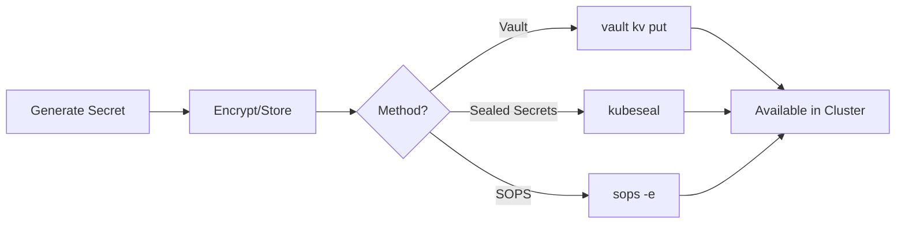

# TEEI CSR Platform - Secrets Management

This directory contains the secrets management infrastructure for the TEEI CSR Platform Kubernetes deployments.

## Overview

Secrets management is critical for securing sensitive information like API keys, database credentials, and authentication tokens. This repository supports three different approaches for managing secrets:

1. **HashiCorp Vault** - Enterprise-grade secrets management with dynamic secrets
2. **Sealed Secrets** - Kubernetes-native encrypted secrets safe for Git
3. **SOPS** - Flexible encryption tool with multiple backend support

## Directory Structure

```
k8s/base/secrets/
├── README.md                     # This file
├── SECRETS_INVENTORY.md          # Complete list of all secrets per service
├── VAULT_INTEGRATION.md          # Vault setup and integration guide
├── SEALED_SECRETS.md             # Sealed Secrets setup and usage
├── SOPS_INTEGRATION.md           # SOPS encryption guide
├── kustomization.yaml            # Kustomize config for secret templates
├── api-gateway-secret.yaml       # API Gateway secret template
├── unified-profile-secret.yaml   # Unified Profile secret template
├── q2q-ai-secret.yaml           # Q2Q AI secret template
├── analytics-secret.yaml         # Analytics secret template
├── discord-bot-secret.yaml       # Discord Bot secret template
├── corp-cockpit-secret.yaml      # Corp Cockpit secret template
├── connectors-secrets.yaml       # Connector services secrets
└── backend-services-secrets.yaml # Backend services secrets
```

## Quick Start

### Option 1: Vault (Recommended for Production)

Best for: Large deployments, dynamic secrets, enterprise compliance

```bash
# 1. Set up Vault server and bootstrap
cd scripts/infra
export VAULT_ADDR=https://vault.example.com
./bootstrap-vault.sh

# 2. Create secrets in Vault
vault kv put secret/teei/api-gateway \
  JWT_SECRET="$(openssl rand -hex 32)" \
  REDIS_URL="redis://redis-service:6379"

# 3. Vault Agent Injector automatically injects secrets into pods
# See VAULT_INTEGRATION.md for details
```

### Option 2: Sealed Secrets (Recommended for Staging)

Best for: GitOps workflows, staging environments, small teams

```bash
# 1. Install Sealed Secrets controller in cluster
kubectl apply -f https://github.com/bitnami-labs/sealed-secrets/releases/download/v0.24.0/controller.yaml

# 2. Install kubeseal CLI
brew install kubeseal  # macOS
# or see SEALED_SECRETS.md for other platforms

# 3. Create and seal secrets
cat <<EOF | kubeseal --format=yaml > api-gateway-sealed.yaml
apiVersion: v1
kind: Secret
metadata:
  name: teei-api-gateway-secrets
  namespace: teei-staging
stringData:
  JWT_SECRET: "$(openssl rand -hex 32)"
EOF

# 4. Apply sealed secret (safe to commit to Git)
kubectl apply -f api-gateway-sealed.yaml
```

### Option 3: SOPS (Alternative)

Best for: Multi-cloud environments, existing SOPS infrastructure

```bash
# 1. Install SOPS and age
brew install sops age

# 2. Generate encryption key
age-keygen -o ~/.config/sops/age/key.txt

# 3. Update .sops.yaml with your public key

# 4. Create and encrypt secret
cat > secret.yaml <<EOF
apiVersion: v1
kind: Secret
metadata:
  name: teei-api-gateway-secrets
stringData:
  JWT_SECRET: "$(openssl rand -hex 32)"
EOF

sops -e -i secret.yaml

# 5. Commit encrypted file to Git
git add secret.yaml
```

## Secrets Inventory

See [SECRETS_INVENTORY.md](./SECRETS_INVENTORY.md) for a complete list of:
- All secrets required by each service
- Secret key names and descriptions
- Vault paths
- Required vs optional secrets
- Generation commands

### Key Services and Their Secrets

| Service | Secret Name | Keys |
|---------|-------------|------|
| API Gateway | `teei-api-gateway-secrets` | `JWT_SECRET`, `REDIS_URL` |
| Q2Q AI | `teei-q2q-ai-secrets` | `ANTHROPIC_API_KEY`, `DATABASE_URL` |
| Unified Profile | `teei-unified-profile-secrets` | `DATABASE_URL`, `JWT_SECRET` |
| Analytics | `teei-analytics-secrets` | `DATABASE_URL`, `CLICKHOUSE_PASSWORD`, `REDIS_URL`, `NATS_URL` |
| Discord Bot | `teei-discord-bot-secrets` | `DISCORD_BOT_TOKEN`, `DISCORD_CLIENT_ID` |
| Corp Cockpit | `teei-corp-cockpit-secrets` | `JWT_SECRET` |

## Approach Comparison

| Feature | Vault | Sealed Secrets | SOPS |
|---------|-------|----------------|------|
| **Setup Complexity** | High | Low | Medium |
| **External Infrastructure** | Yes (Vault server) | No | No |
| **GitOps Friendly** | Partial | Yes | Yes |
| **Encrypted at Rest in Git** | No (refs only) | Yes | Yes |
| **Dynamic Secrets** | Yes | No | No |
| **Secret Rotation** | Automatic | Manual | Manual |
| **Audit Logging** | Advanced | Basic | Git-based |
| **Team Collaboration** | Medium | Easy | Easy |
| **Cloud KMS Support** | Yes | No | Yes |
| **Best For** | Production, Enterprise | Staging, GitOps | Multi-cloud, Flexibility |

## Choosing an Approach

### Use Vault if you:
- Need dynamic secrets (e.g., database credentials that rotate)
- Require advanced audit logging and compliance
- Have a large team with complex RBAC needs
- Already have Vault infrastructure
- Need integration with cloud provider IAM

### Use Sealed Secrets if you:
- Want a simple, Kubernetes-native solution
- Follow GitOps practices
- Have a small to medium-sized team
- Deploy to staging/development environments
- Don't need dynamic secrets

### Use SOPS if you:
- Already use SOPS in your organization
- Need to support multiple cloud KMS backends
- Want diff-friendly encrypted files
- Need fine-grained control over what gets encrypted
- Have existing SOPS tooling and workflows

## Security Best Practices

### General Principles

1. **Never commit plaintext secrets to Git**
   ```bash
   # Add to .gitignore
   *-secret-raw.yaml
   *.secret
   .env.production
   ```

2. **Use different secrets for each environment**
   - Staging: `secret/staging/teei/*`
   - Production: `secret/production/teei/*`

3. **Rotate secrets regularly**
   - Critical secrets (API keys, tokens): Every 90 days
   - Passwords: Every 180 days
   - Certificates: Based on expiration

4. **Principle of least privilege**
   - Each service only gets its own secrets
   - Use Vault policies or RBAC to enforce

5. **Enable audit logging**
   - Track who accesses secrets and when
   - Alert on suspicious access patterns

6. **Use strong encryption**
   - Minimum 256-bit keys
   - Use cloud KMS when available

7. **Backup secret keys**
   - Sealed Secrets controller private key
   - SOPS age private keys
   - Vault unseal keys
   - Store in secure offline location

### Kubernetes-Specific

1. **Use namespaces for isolation**
   ```yaml
   metadata:
     namespace: teei-production
   ```

2. **Enable RBAC for secrets**
   ```yaml
   apiVersion: rbac.authorization.k8s.io/v1
   kind: Role
   metadata:
     name: secret-reader
   rules:
   - apiGroups: [""]
     resources: ["secrets"]
     resourceNames: ["teei-api-gateway-secrets"]
     verbs: ["get"]
   ```

3. **Use read-only volume mounts**
   ```yaml
   volumeMounts:
   - name: secrets
     mountPath: /etc/secrets
     readOnly: true
   ```

4. **Don't log secret values**
   ```bash
   # BAD
   echo "JWT_SECRET=${JWT_SECRET}"

   # GOOD
   echo "JWT_SECRET is set"
   ```

## Creating Secrets for Each Environment

### Development

```bash
# Use base templates with development values
kubectl create secret generic teei-api-gateway-secrets \
  --from-literal=JWT_SECRET="dev-secret-key" \
  --from-literal=REDIS_URL="redis://localhost:6379" \
  --namespace=teei-development
```

### Staging

Use Sealed Secrets (recommended):

```bash
# See k8s/overlays/staging/sealed-secrets/README.md
cd k8s/overlays/staging/sealed-secrets
./create-all-secrets.sh  # Create all sealed secrets
```

### Production

Use Vault (recommended):

```bash
# See infra/vault/README.md and VAULT_INTEGRATION.md
cd scripts/infra
./bootstrap-vault.sh
./create-production-secrets.sh
```

## Secret Lifecycle

### 1. Creation



### 2. Rotation

```bash
# Example: Rotate API Gateway JWT secret

# Vault
vault kv put secret/teei/api-gateway JWT_SECRET="$(openssl rand -hex 32)"
kubectl rollout restart deployment/teei-api-gateway

# Sealed Secrets
cat <<EOF | kubeseal --format=yaml > new-secret.yaml
apiVersion: v1
kind: Secret
metadata:
  name: teei-api-gateway-secrets
  namespace: teei-production
stringData:
  JWT_SECRET: "$(openssl rand -hex 32)"
EOF
kubectl apply -f new-secret.yaml
kubectl rollout restart deployment/teei-api-gateway

# SOPS
sops k8s/overlays/production/secrets/api-gateway.yaml
# Edit JWT_SECRET in your editor
kubectl apply -f k8s/overlays/production/secrets/api-gateway.yaml
kubectl rollout restart deployment/teei-api-gateway
```

### 3. Revocation

```bash
# Delete secret from cluster
kubectl delete secret teei-api-gateway-secrets -n teei-production

# Vault: Delete or update to remove access
vault kv delete secret/teei/api-gateway

# Remove from Git (Sealed Secrets/SOPS)
git rm k8s/overlays/production/secrets/api-gateway.yaml
```

## Troubleshooting

### Pods not starting - "secret not found"

```bash
# Check if secret exists
kubectl get secrets -n teei-staging | grep teei

# Describe deployment to see secret references
kubectl describe deployment teei-api-gateway -n teei-staging

# Check secret data (be careful not to expose)
kubectl get secret teei-api-gateway-secrets -n teei-staging -o yaml
```

### Sealed secret not decrypting

```bash
# Check controller logs
kubectl logs -n kube-system -l name=sealed-secrets-controller

# Verify controller is running
kubectl get pods -n kube-system -l name=sealed-secrets-controller

# Check sealed secret status
kubectl describe sealedsecret teei-api-gateway-secrets -n teei-staging
```

### Vault injection not working

```bash
# Check Vault agent injector
kubectl get pods -n vault -l app.kubernetes.io/name=vault-agent-injector

# Check pod annotations
kubectl describe pod <pod-name> -n teei-staging | grep vault

# Check service account
kubectl get serviceaccount teei-api-gateway -n teei-staging
```

### SOPS decryption fails

```bash
# Verify age key is set
echo $SOPS_AGE_KEY_FILE

# Test decryption
sops -d k8s/overlays/staging/secrets/api-gateway.yaml

# Check .sops.yaml configuration
cat .sops.yaml
```

## Migration Guide

### From Manual Secrets to Sealed Secrets

```bash
# 1. Export existing secret
kubectl get secret teei-api-gateway-secrets -n teei-staging -o yaml > secret-raw.yaml

# 2. Clean up metadata
# Edit secret-raw.yaml to remove: resourceVersion, uid, creationTimestamp, etc.

# 3. Seal it
kubeseal --format=yaml < secret-raw.yaml > secret-sealed.yaml

# 4. Apply sealed secret
kubectl apply -f secret-sealed.yaml

# 5. Verify
kubectl get sealedsecret,secret -n teei-staging

# 6. Delete raw file
rm secret-raw.yaml
```

### From Sealed Secrets to Vault

```bash
# 1. Decrypt sealed secret
kubectl get secret teei-api-gateway-secrets -n teei-staging -o json | \
  jq -r '.data.JWT_SECRET' | base64 -d

# 2. Store in Vault
vault kv put secret/teei/api-gateway \
  JWT_SECRET="<decrypted-value>"

# 3. Update deployment with Vault annotations
# See VAULT_INTEGRATION.md

# 4. Delete sealed secret
kubectl delete sealedsecret teei-api-gateway-secrets -n teei-staging
```

## CI/CD Integration

### GitHub Actions

The deployment workflow (`.github/workflows/deploy-staging.yml`) includes:

1. **Secret verification** - Check if required secrets exist
2. **Sealed secrets application** - Automatically apply sealed secrets
3. **Secret status reporting** - Include secrets in deployment summary

See the workflow file for implementation details.

### GitOps (ArgoCD/Flux)

#### Sealed Secrets

Works out of the box - commit sealed secrets to Git:

```yaml
# argocd-application.yaml
apiVersion: argoproj.io/v1alpha1
kind: Application
spec:
  source:
    repoURL: https://github.com/your-org/teei-platform
    targetRevision: HEAD
    path: k8s/overlays/production
```

#### Vault

Use External Secrets Operator:

```yaml
apiVersion: external-secrets.io/v1beta1
kind: ExternalSecret
metadata:
  name: teei-api-gateway
spec:
  secretStoreRef:
    name: vault-backend
    kind: SecretStore
  target:
    name: teei-api-gateway-secrets
  data:
  - secretKey: JWT_SECRET
    remoteRef:
      key: secret/teei/api-gateway
      property: JWT_SECRET
```

## Additional Resources

### Documentation
- [SECRETS_INVENTORY.md](./SECRETS_INVENTORY.md) - Complete secrets inventory
- [VAULT_INTEGRATION.md](./VAULT_INTEGRATION.md) - Vault setup guide
- [SEALED_SECRETS.md](./SEALED_SECRETS.md) - Sealed Secrets guide
- [SOPS_INTEGRATION.md](./SOPS_INTEGRATION.md) - SOPS encryption guide

### External Links
- [Kubernetes Secrets](https://kubernetes.io/docs/concepts/configuration/secret/)
- [HashiCorp Vault](https://www.vaultproject.io/)
- [Sealed Secrets](https://sealed-secrets.netlify.app/)
- [Mozilla SOPS](https://github.com/getsops/sops)
- [External Secrets Operator](https://external-secrets.io/)

### Related Files
- [.sops.yaml](../../../.sops.yaml) - SOPS configuration
- [infra/vault/](../../../infra/vault/) - Vault policies and setup
- [k8s/overlays/staging/sealed-secrets/](../../overlays/staging/sealed-secrets/) - Staging sealed secrets

## Support and Questions

For questions or issues with secrets management:

1. Check the troubleshooting section above
2. Review the relevant integration guide
3. Check the secrets inventory for your service
4. Consult the Kubernetes secret logs: `kubectl describe secret <name>`
5. Contact the platform team for assistance

## Security Contact

For security-related issues with secrets:
- Do NOT create public GitHub issues
- Contact the security team directly
- Follow responsible disclosure practices
