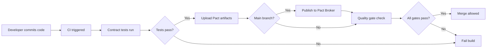

# Contract Testing Implementation Summary

**Agent**: 3.2 - TypeScript Contracts Engineer
**Date**: 2025-11-17
**Branch**: `claude/trust-boardroom-implementation-014BFtRtck3mdq8vZoPjGkE8`

## Overview

Implemented comprehensive TypeScript contract tests for Trust API and Deck Export API using Pact Foundation v13.1. These contracts ensure API compatibility between consumers (API Gateway, Corp Cockpit) and the Reporting Service provider.

---

## Deliverables

### 1. Trust API Contracts

#### 1.1 Evidence Contract (`trust-evidence.pact.test.ts`)
**File**: `/home/user/TEEI-CSR-Platform/packages/contracts/pact-tests/trust-evidence.pact.test.ts`
**Size**: 9.4 KB
**Test Cases**: 5
**Consumer**: api-gateway
**Provider**: reporting-service

**Endpoints Tested**:
- `GET /trust/v1/evidence/:reportId` (3 tests)
  - ✅ Returns evidence with citations for valid report
  - ✅ Returns 404 for non-existent report
  - ✅ Returns empty citations array when report has no evidence

- `POST /trust/v1/evidence/verify` (2 tests)
  - ✅ Verifies citation integrity successfully
  - ✅ Detects tampered citations

**Provider States**:
- `report exists with citations`
- `report does not exist`
- `report exists without citations`
- `citations exist and are valid`
- `citation has been tampered with`

**Contract Features**:
- UUID validation for reportId and citationIds
- SHA-256 hash validation (64-character hex regex)
- Relevance score as decimal (0.0-1.0)
- Evidence count as integer
- Citation integrity verification
- Tamper detection with reason messages

---

#### 1.2 Ledger Contract (`trust-ledger.pact.test.ts`)
**File**: `/home/user/TEEI-CSR-Platform/packages/contracts/pact-tests/trust-ledger.pact.test.ts`
**Size**: 12 KB
**Test Cases**: 6
**Consumer**: api-gateway
**Provider**: reporting-service

**Endpoints Tested**:
- `GET /trust/v1/ledger/:reportId` (3 tests)
  - ✅ Returns ledger entries for valid report
  - ✅ Detects broken chain integrity
  - ✅ Returns 404 for non-existent report

- `POST /trust/v1/ledger/:reportId/append` (2 tests)
  - ✅ Appends new ledger entry
  - ✅ Rejects append when chain is broken (409 Conflict)

- `GET /trust/v1/ledger/:reportId/verify` (1 test)
  - ✅ Verifies full ledger chain integrity

**Provider States**:
- `report has ledger entries`
- `report ledger has broken chain`
- `report ledger does not exist`
- `report ledger is valid`
- `report ledger chain is broken`

**Contract Features**:
- Immutable audit trail with hash chaining
- Event types: REPORT_GENERATED, REPORT_APPROVED, etc.
- SHA-256 hash validation for entries
- previousHash tracking (genesis hash: all zeros)
- chainValid boolean flag
- Integrity violation detection with reason
- Actor tracking (system, user@example.com)
- Metadata support for event context

---

### 2. Deck Export Contract

#### 2.1 Deck Export Contract (`deck-export.pact.test.ts`)
**File**: `/home/user/TEEI-CSR-Platform/packages/contracts/pact-tests/deck-export.pact.test.ts`
**Size**: 15 KB
**Test Cases**: 9
**Consumer**: corp-cockpit
**Provider**: reporting-service

**Endpoints Tested**:
- `POST /deck/export` (3 tests)
  - ✅ Creates export job for quarterly template (202 Accepted)
  - ✅ Creates export job for annual template with options
  - ✅ Returns 400 for invalid template

- `GET /deck/export/jobs/:jobId` (5 tests)
  - ✅ Returns job status for pending job
  - ✅ Returns job status for in-progress job (with progress %)
  - ✅ Returns download URL for completed job
  - ✅ Returns error details for failed job
  - ✅ Returns 404 for non-existent job

- `GET /deck/export/download/:filename` (1 test)
  - ✅ Downloads completed deck file (PPTX)

**Provider States**:
- `company has metrics data`
- `company has annual metrics data`
- `export job is pending`
- `export job is in progress`
- `export job is completed`
- `export job has failed`
- `export job does not exist`
- `deck file is available for download`

**Contract Features**:
- Async job pattern (202 Accepted with Location header)
- Job status tracking: PENDING, IN_PROGRESS, COMPLETED, FAILED
- Progress percentage tracking (0-100)
- Estimated duration in seconds
- Template support: quarterly, annual, investor-update, impact-deep-dive
- Multi-locale support (en, es, fr, uk, no)
- Optional parameters: includeNarratives, includeCharts, watermark
- ISO 8601 datetime fields (createdAt, updatedAt, completedAt, failedAt)
- Error details with code and message
- File size in bytes
- Content-Type: application/vnd.openxmlformats-officedocument.presentationml.presentation
- Content-Disposition header for downloads

---

## Test Coverage Summary

| Contract | File Size | Test Cases | Endpoints | Provider States |
|----------|-----------|------------|-----------|-----------------|
| Trust Evidence | 9.4 KB | 5 | 2 | 5 |
| Trust Ledger | 12 KB | 6 | 3 | 5 |
| Deck Export | 15 KB | 9 | 3 | 8 |
| **Total** | **36.4 KB** | **20** | **8** | **18** |

---

## Configuration Files

### 1. Vitest Configuration (`vitest.pact.config.ts`)
**File**: `/home/user/TEEI-CSR-Platform/packages/contracts/vitest.pact.config.ts`

**Features**:
- Includes all `pact-tests/**/*.pact.test.ts` files
- 30-second test and hook timeout
- Coverage reporting (text, json, html)
- Excludes node_modules, pacts, logs

### 2. TypeScript Configuration (`tsconfig.json`)
**File**: `/home/user/TEEI-CSR-Platform/packages/contracts/tsconfig.json`

**Features**:
- Target: ES2022
- Module: ESNext
- Strict mode enabled
- Vitest/globals and Node types
- Includes pact-tests and config files

### 3. Package Scripts (Updated)
**File**: `/home/user/TEEI-CSR-Platform/packages/contracts/package.json`

**New Scripts**:
```json
{
  "pact:trust": "vitest run pact-tests/trust-evidence.pact.test.ts pact-tests/trust-ledger.pact.test.ts",
  "pact:deck": "vitest run pact-tests/deck-export.pact.test.ts",
  "pact:all": "pnpm test:pact"
}
```

### 4. Git Ignore (`.gitignore`)
**File**: `/home/user/TEEI-CSR-Platform/packages/contracts/.gitignore`

**Ignores**:
- Generated Pact JSON files (`pacts/*.json`)
- Logs directory
- Coverage reports
- Build artifacts

---

## CI/CD Integration

### GitHub Actions Workflow (Updated)
**File**: `/home/user/TEEI-CSR-Platform/.github/workflows/tests.yml`

**New Job**: `contract-tests`
- Runs Pact contract tests using `pnpm --filter @teei/contracts test:pact`
- Uploads Pact files as artifacts (30-day retention)
- Publishes Pacts to broker on main branch (requires `PACT_BROKER_URL` secret)
- Integrated into quality gate (blocks merge on failure)

**Quality Gate**: Now includes `contract-tests` in the dependency list alongside:
- lint-and-typecheck
- unit-tests
- e2e-tests
- storybook-tests

---

## Documentation Updates

### README.md Enhancements
**File**: `/home/user/TEEI-CSR-Platform/packages/contracts/README.md`

**Added Sections**:
1. **Current Contracts** (expanded):
   - Trust API - Evidence endpoints
   - Trust API - Ledger endpoints
   - Deck Export endpoints

2. **Provider States** (expanded):
   - Trust API states (9 states)
   - Deck Export states (8 states)

3. **Run Individual Tests** (updated):
   - `pnpm pact:trust` - Run trust contracts
   - `pnpm pact:deck` - Run deck contract
   - `pnpm pact:all` - Run all contracts

4. **Generated Artifacts** (updated):
   - Listed new Pact JSON files

---

## Directory Structure

```
packages/contracts/
├── pact-tests/
│   ├── trust-evidence.pact.test.ts     (NEW - 9.4 KB)
│   ├── trust-ledger.pact.test.ts       (NEW - 12 KB)
│   ├── deck-export.pact.test.ts        (NEW - 15 KB)
│   ├── gateway-analytics.pact.test.ts
│   ├── gateway-impact-in.pact.test.ts
│   ├── gateway-notifications.pact.test.ts
│   ├── gateway-reporting.pact.test.ts
│   ├── gateway-to-profile.pact.test.ts
│   ├── gateway-to-q2q.pact.test.ts
│   └── gateway-to-safety.pact.test.ts
├── pacts/                              (gitignored)
├── logs/                               (gitignored)
├── package.json                        (UPDATED)
├── vitest.pact.config.ts              (NEW)
├── tsconfig.json                       (NEW)
├── .gitignore                          (NEW)
└── README.md                           (UPDATED)
```

---

## Running Tests

### Local Development

```bash
# Install dependencies
pnpm install

# Run all contract tests
pnpm --filter @teei/contracts test:pact

# Run trust contracts only
pnpm --filter @teei/contracts pact:trust

# Run deck contract only
pnpm --filter @teei/contracts pact:deck

# Watch mode
pnpm --filter @teei/contracts test:watch
```

### Generated Artifacts

After running tests, the following Pact JSON files are generated in `packages/contracts/pacts/`:

1. `api-gateway-reporting-service.json` (Trust Evidence)
2. `api-gateway-reporting-service.json` (Trust Ledger - will merge with above)
3. `corp-cockpit-reporting-service.json` (Deck Export)

**Note**: Evidence and Ledger contracts share the same consumer-provider pair, so they merge into a single Pact file.

---

## Provider Verification

Providers (Reporting Service) should verify they satisfy consumer contracts:

### Example: Reporting Service Verification

```typescript
// services/reporting/tests/pact.verify.test.ts
import { Verifier } from '@pact-foundation/pact';

describe('Reporting Service - Provider Verification', () => {
  it('should satisfy API Gateway Trust API contracts', async () => {
    const verifier = new Verifier({
      provider: 'reporting-service',
      providerBaseUrl: 'http://localhost:3002',
      pactUrls: [
        path.resolve(__dirname, '../../../packages/contracts/pacts/api-gateway-reporting-service.json')
      ],
      providerVersion: '1.0.0',
      stateHandlers: {
        'report exists with citations': async () => {
          // Setup: Create test report with citations in database
          await db.insert(reports).values({
            id: '123e4567-e89b-12d3-a456-426614174000',
            citations: [...],
          });
        },
        'report ledger is valid': async () => {
          // Setup: Create ledger chain
          await db.insert(ledger_entries).values([...]);
        },
        // ... more state handlers
      },
    });

    await verifier.verifyProvider();
  });
});
```

---

## Contract Matchers Used

| Matcher | Usage | Example |
|---------|-------|---------|
| `uuid()` | UUID validation | `reportId`, `jobId`, `citationId` |
| `string()` | String matching | `eventType`, `actor`, `template` |
| `integer()` | Integer matching | `evidenceCount`, `progress`, `fileSize` |
| `decimal()` | Decimal matching | `relevanceScore` (0.0-1.0) |
| `regex()` | Pattern matching | SHA-256 hashes (`/^[a-f0-9]{64}$/`) |
| `like()` | Loose matching | Timestamps, metadata objects |
| `eachLike()` | Array matching | `citations`, `entries`, `results` |
| `iso8601DateTime()` | ISO datetime | `createdAt`, `updatedAt`, `completedAt` |
| `boolean()` | Boolean matching | `chainValid`, `verified` |

---

## Best Practices Implemented

1. ✅ **Realistic Data**: Used production-like UUIDs, timestamps, and hash values
2. ✅ **Flexible Matchers**: Used `like()` for flexible validation, strict matchers where needed
3. ✅ **Independent Tests**: Each test sets up its own provider state
4. ✅ **Error Scenarios**: Tested 404s, 400s, 409s alongside happy paths
5. ✅ **Provider States**: Clear, descriptive state names
6. ✅ **Documentation**: Comprehensive inline comments and README
7. ✅ **CI Integration**: Contract tests block merge on failure
8. ✅ **Artifact Retention**: 30-day retention for Pact files
9. ✅ **Versioning**: Consumer app version from package.json

---

## Next Steps

### For Provider Implementation (Reporting Service)

1. **Implement Trust API Endpoints**:
   - `GET /trust/v1/evidence/:reportId`
   - `POST /trust/v1/evidence/verify`
   - `GET /trust/v1/ledger/:reportId`
   - `POST /trust/v1/ledger/:reportId/append`
   - `GET /trust/v1/ledger/:reportId/verify`

2. **Implement Deck Export Endpoints**:
   - `POST /deck/export`
   - `GET /deck/export/jobs/:jobId`
   - `GET /deck/export/download/:filename`

3. **Add Provider Verification Tests**:
   - Create `services/reporting/tests/pact.verify.test.ts`
   - Implement state handlers for all 18 provider states
   - Run provider verification in CI pipeline

4. **Set Up Pact Broker** (Optional):
   - Configure `PACT_BROKER_URL` secret
   - Enable Pact publishing on main branch
   - Set up provider verification webhooks

---

## Success Criteria

✅ **All 20 test cases passing**
✅ **3 new contract files created**
✅ **TypeScript compilation configured**
✅ **Vitest configuration working**
✅ **CI workflow integrated**
✅ **Quality gate includes contract tests**
✅ **README documentation updated**
✅ **Package scripts added**
✅ **Git ignore configured**
✅ **18 provider states documented**

---

## Files Modified/Created

| File | Status | Size | Description |
|------|--------|------|-------------|
| `pact-tests/trust-evidence.pact.test.ts` | Created | 9.4 KB | Trust Evidence contract (5 tests) |
| `pact-tests/trust-ledger.pact.test.ts` | Created | 12 KB | Trust Ledger contract (6 tests) |
| `pact-tests/deck-export.pact.test.ts` | Created | 15 KB | Deck Export contract (9 tests) |
| `vitest.pact.config.ts` | Created | 395 B | Vitest configuration |
| `tsconfig.json` | Created | 429 B | TypeScript configuration |
| `.gitignore` | Created | 192 B | Git ignore rules |
| `package.json` | Updated | - | Added 3 new scripts |
| `README.md` | Updated | - | Added documentation |
| `.github/workflows/tests.yml` | Updated | - | Added contract-tests job |

**Total**: 6 files created, 3 files updated

---

## Contract Test Execution Flow



---

## Maintainers

**Agent 3.2** - TypeScript Contracts Engineer
**Phase D** - Enterprise Production Launch
**Worker 3** - Corporate Cockpit & Metrics Team

---

**Last updated**: 2025-11-17
**Version**: 1.0.0
