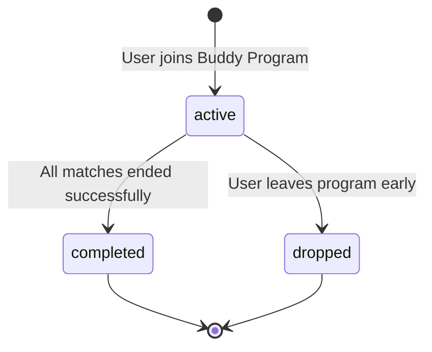

# Buddy Program Template & Instance Design

**Agent**: Agent 6 (program-instance-architect)
**Generated**: 2025-11-22
**Dependencies**: Agent 2 (csr-db-schema.md), Agent 3 (buddy-csr-mapping.md)
**Status**: ✅ Complete

---

## Executive Summary

This document defines how the **Buddy Program** integrates into the CSR Platform's **Program Template** system, enabling unified program management across Buddy, Mentors for Ukraine, Language for Ukraine, and Upskilling programs.

**Core Concept**: Each external program (Buddy, Mentors, Language, Upskilling) is a **program type** with standardized enrollments, lifecycle states, and metrics aggregation.

**Key Tables**:
- `program_enrollments` - User participation tracking
- `buddy_matches` - Buddy-specific match relationships
- `users.journeyFlags` - Cross-program flags and counters

---

## Program Template Concept

### Multi-Program Architecture

```
CSR Platform (Unified Layer)
├── Program: Buddy
│   ├── Enrollments (participants, buddies)
│   ├── Matches (1:1 pairings)
│   └── Activities (events, check-ins, feedback)
├── Program: Mentors for Ukraine
│   ├── Enrollments (mentees, mentors)
│   ├── Matches (1:1 pairings)
│   └── Activities (sessions, feedback)
├── Program: Language for Ukraine
│   ├── Enrollments (learners, tutors)
│   ├── Sessions (language practice)
│   └── Assessments (CEFR levels)
└── Program: Upskilling
    ├── Enrollments (learners)
    ├── Courses (eCornell, itslearning)
    └── Progress (completion, credentials)
```

**Unified Schema**: All programs use common tables (`users`, `program_enrollments`) with program-specific extensions (e.g., `buddy_matches` for Buddy, `kintell_sessions` for Language/Mentors).

---

## Buddy Program Template

### Program Configuration

```typescript
const BUDDY_PROGRAM_TEMPLATE = {
  programType: 'buddy',
  displayName: 'Buddy Program',
  description: 'Peer support program connecting participants with buddies for social integration',

  // Roles
  roles: [
    { role: 'participant', csrRole: 'beneficiary' },
    { role: 'buddy', csrRole: 'volunteer' },
  ],

  // Lifecycle States
  enrollmentStates: [
    'active',      // User actively participating
    'completed',   // User completed program successfully
    'dropped',     // User left program before completion
  ],

  // Match-Based Program
  supportsMatching: true,
  matchTable: 'buddy_matches',

  // Activities
  activityTypes: [
    'event',           // Social events, workshops
    'skill_session',   // Skill exchanges
    'checkin',         // Wellness check-ins
    'feedback',        // Match feedback
  ],

  // Metrics
  metricsTracked: [
    'match_count',            // Number of buddy matches
    'events_attended',        // Events participated in
    'checkins_completed',     // Check-ins completed
    'skills_shared',          // Skill exchanges
    'milestones_reached',     // Achievements
  ],

  // VIS Integration
  contributesToVIS: true,
  visComponents: {
    weighted_hours: true,       // Events, sessions, check-ins
    quality_score: true,         // Feedback ratings
    outcome_lift: true,          // Milestones, mood improvements
    placement_impact: false,     // Not tracked directly
  },

  // SROI Integration
  contributesToSROI: true,
  sroiDimensions: {
    integration_score: true,     // Community milestones
    language_proficiency: true,  // Language skill sessions
    job_readiness: true,         // Professional skill sessions
  },
};
```

---

## Program Enrollment Lifecycle

### State Diagram



### State Transitions

| Current State | Event | Next State | Trigger |
|--------------|-------|------------|---------|
| - (none) | User imported from Buddy export | `active` | First import with `status = active` |
| `active` | All matches ended with `reason = 'completed'` | `completed` | Last match ends successfully |
| `active` | User requests to leave | `dropped` | Manual intervention or flag in export |
| `active` | No activity for 6 months | `dropped` | Automated cleanup (future) |

### Enrollment Record Structure

**Schema** (`program_enrollments`):
```typescript
{
  id: UUID,
  userId: UUID,                    // FK to users.id
  programType: 'buddy',
  enrolledAt: TIMESTAMP,           // Buddy user joined_at
  status: 'active' | 'completed' | 'dropped',
  completedAt: TIMESTAMP | null,   // When completed or dropped
}
```

**Creation on Import**:
```typescript
// When importing Buddy user
await db.insert(programEnrollments).values({
  userId: csrUserId,
  programType: 'buddy',
  enrolledAt: new Date(buddyUser.joined_at),
  status: 'active',  // Default for new imports
  completedAt: null,
});
```

---

## Cross-Program Enrollment

### Multi-Program Participation

**Scenario**: User participates in both Mentors for Ukraine AND Buddy Program

**Database State**:
```sql
-- One user record
users:
  { id: 'csr-123', email: 'user@example.com', role: 'beneficiary', ... }

-- Two external ID mappings
user_external_ids:
  { profile_id: 'csr-123', provider: 'mentors', external_id: 'mentor-456', ... }
  { profile_id: 'csr-123', provider: 'buddy', external_id: 'buddy-789', ... }

-- Two program enrollments
program_enrollments:
  { user_id: 'csr-123', program_type: 'mentorship', status: 'active', ... }
  { user_id: 'csr-123', program_type: 'buddy', status: 'active', ... }
```

**Journey Flags** (merged):
```json
{
  "is_mentorship_mentee": true,
  "is_buddy_participant": true,
  "mentorship_joined_at": "2024-01-10",
  "buddy_joined_at": "2024-06-15",
  "programs_count": 2
}
```

**Metrics Aggregation**: VIS and SROI calculations aggregate activities across ALL programs.

---

## Buddy Program Instance Management

### Instance Creation Strategy

**Option 1: Global Singleton Instance** (Recommended)
- Single "Buddy Program" instance across all companies
- `program_enrollments.programType = 'buddy'` for all Buddy users
- Company filtering via `company_users` join

**Option 2: Per-Company Instances**
- Separate Buddy Program instance per company
- `program_enrollments.programType = 'buddy:acme-corp'`
- More complex, not needed unless multi-company isolation required

**Recommendation**: Use **Option 1** (Global Singleton) for simplicity and cross-company analytics.

### Enrollment Management

**Automatic Enrollment Creation**:
```typescript
// During Buddy user import
if (buddyUser.role === 'participant' || buddyUser.role === 'buddy') {
  // Check if enrollment already exists
  const existingEnrollment = await db
    .select()
    .from(programEnrollments)
    .where(
      and(
        eq(programEnrollments.userId, csrUserId),
        eq(programEnrollments.programType, 'buddy')
      )
    )
    .limit(1);

  if (!existingEnrollment[0]) {
    // Create new enrollment
    await db.insert(programEnrollments).values({
      userId: csrUserId,
      programType: 'buddy',
      enrolledAt: new Date(buddyUser.joined_at),
      status: 'active',
    });
  }
}
```

**Enrollment Completion**:
```typescript
// When importing buddy.match.ended event
if (endReason === 'completed') {
  // Check if user has any other active matches
  const activeMatches = await db
    .select()
    .from(buddyMatches)
    .where(
      and(
        or(
          eq(buddyMatches.participantId, userId),
          eq(buddyMatches.buddyId, userId)
        ),
        eq(buddyMatches.status, 'active')
      )
    );

  if (activeMatches.length === 0) {
    // No more active matches → mark enrollment as completed
    await db
      .update(programEnrollments)
      .set({
        status: 'completed',
        completedAt: new Date(matchEndedAt),
      })
      .where(
        and(
          eq(programEnrollments.userId, userId),
          eq(programEnrollments.programType, 'buddy')
        )
      );
  }
}
```

---

## Program Metrics & Analytics

### Per-Program Metrics

**Query**: Get Buddy Program participants count
```sql
SELECT COUNT(DISTINCT user_id)
FROM program_enrollments
WHERE program_type = 'buddy'
  AND status = 'active';
```

**Query**: Get Buddy Program completion rate
```sql
SELECT
  SUM(CASE WHEN status = 'completed' THEN 1 ELSE 0 END)::float / COUNT(*) AS completion_rate
FROM program_enrollments
WHERE program_type = 'buddy';
```

### Cross-Program Analytics

**Query**: Users participating in multiple programs
```sql
SELECT
  user_id,
  COUNT(*) AS programs_count,
  ARRAY_AGG(program_type) AS programs
FROM program_enrollments
WHERE status = 'active'
GROUP BY user_id
HAVING COUNT(*) > 1;
```

**Result**:
```
user_id      | programs_count | programs
-------------|----------------|------------------
csr-123      | 2              | {mentorship, buddy}
csr-456      | 3              | {buddy, language, upskilling}
```

---

## Integration with Metrics Calculation

### VIS Calculation (Per Program)

**Buddy Program VIS**:
```sql
-- Get all Buddy activities for a volunteer
WITH buddy_hours AS (
  SELECT
    SUM(duration_minutes) / 60.0 AS total_hours
  FROM buddy_events
  WHERE match_id IN (
    SELECT id FROM buddy_matches WHERE buddy_id = :volunteer_id
  )
),
buddy_quality AS (
  SELECT AVG(rating) AS avg_rating
  FROM buddy_feedback
  WHERE match_id IN (
    SELECT id FROM buddy_matches WHERE buddy_id = :volunteer_id
  )
)
SELECT
  buddy_hours.total_hours,
  buddy_quality.avg_rating
FROM buddy_hours, buddy_quality;
```

**Cross-Program VIS** (aggregate):
```sql
-- Combine Buddy + Mentors + Language hours for a single volunteer
SELECT
  SUM(hours) AS total_hours_all_programs
FROM (
  SELECT SUM(duration_minutes) / 60.0 AS hours FROM buddy_events WHERE ...
  UNION ALL
  SELECT SUM(duration_minutes) / 60.0 AS hours FROM kintell_sessions WHERE session_type = 'mentorship' ...
  UNION ALL
  SELECT SUM(duration_minutes) / 60.0 AS hours FROM kintell_sessions WHERE session_type = 'language' ...
) AS all_hours;
```

### SROI Calculation (Per Program)

**Buddy Program Social Value**:
```sql
-- Language sessions → Language Proficiency dimension
SELECT
  COUNT(*) * 0.1 AS language_level_increase,  -- +0.1 per 10 sessions
  COUNT(*) * 0.1 * 500 AS language_value      -- $500 per 0.1 level
FROM kintell_sessions
WHERE session_type = 'skill_share'
  AND metadata->>'skill_category' = 'language'
  AND volunteer_id = :volunteer_id;
```

---

## Journey Orchestration Integration

### Journey Flags for Buddy Program

**Flags Set During Import**:
```typescript
const journeyFlags = {
  // Program participation
  is_buddy_participant: buddyUser.role === 'participant',
  is_buddy_volunteer: buddyUser.role === 'buddy',

  // Timestamps
  buddy_joined_at: buddyUser.joined_at,
  buddy_last_synced: new Date().toISOString(),

  // Counters
  buddy_match_count: 0,              // Incremented on match creation
  buddy_events_count: 0,             // Incremented on event attendance
  buddy_checkins_count: 0,           // Incremented on check-in
  buddy_milestones_count: 0,         // Incremented on milestone

  // Status flags (for journey rules)
  buddy_match_active: false,         // Set when active match exists
  buddy_checkin_due: false,          // Set if >7 days since last check-in
  buddy_feedback_pending: false,     // Set if feedback due
};
```

**Journey Rules Integration** (future):
```typescript
// Example: Trigger follow-up if no check-in for 7 days
{
  ruleId: 'buddy_checkin_reminder',
  condition: {
    programType: 'buddy',
    flag: 'buddy_match_active = true',
    lastActivity: '> 7 days ago'
  },
  action: {
    setFlag: 'buddy_checkin_due = true',
    sendNotification: 'Reminder: Check in with your buddy this week'
  }
}
```

---

## Data Migration & Import Strategy

### Initial Import (Historical Data)

**Steps**:
1. **Import Users** → Create `users` + `program_enrollments` (status: based on match status)
2. **Import Matches** → Create `buddy_matches` + update enrollment status
3. **Import Activities** → Create `buddy_events`, `buddy_checkins`, `buddy_feedback`
4. **Import Milestones** → Create `journey_milestones`
5. **Recalculate Metrics** → Trigger VIS/SROI for all affected companies

**Enrollment Status Logic** (historical import):
```typescript
// Determine enrollment status based on match state
if (allMatchesEnded && lastMatchReason === 'completed') {
  enrollment.status = 'completed';
  enrollment.completedAt = lastMatchEndedAt;
} else if (allMatchesEnded && lastMatchReason !== 'completed') {
  enrollment.status = 'dropped';
  enrollment.completedAt = lastMatchEndedAt;
} else {
  enrollment.status = 'active';  // Has active match(es)
}
```

### Incremental Import (Ongoing Sync)

**Strategy**: Real-time webhook ingestion (existing `buddy-connector` service) + periodic batch imports

**Webhook Events** (already handled):
- `buddy.match.created` → Update enrollment (ensure `status = 'active'`)
- `buddy.match.ended` → Check if last match → potentially mark `completed`
- `buddy.event.attended` → Increment counters
- `buddy.checkin.completed` → Update flags
- `buddy.feedback.submitted` → Track for VIS quality
- `buddy.milestone.reached` → Increment counters

**Batch Import** (this design):
- Monthly/quarterly full export → reconcile with webhook data
- Fill gaps (missed webhooks, network failures)
- Validate data consistency

---

## Program Template Standardization

### Common Interface (All Programs)

```typescript
interface ProgramTemplate {
  programType: string;
  displayName: string;
  description: string;
  roles: Array<{ role: string; csrRole: string }>;
  enrollmentStates: string[];
  supportsMatching: boolean;
  matchTable?: string;
  activityTypes: string[];
  metricsTracked: string[];
  contributesToVIS: boolean;
  contributesToSROI: boolean;
}
```

### Buddy vs. Mentors vs. Language Comparison

| Aspect | Buddy | Mentors | Language | Upskilling |
|--------|-------|---------|----------|------------|
| **Program Type** | `buddy` | `mentorship` | `language` | `upskilling` |
| **Supports Matching** | ✅ Yes | ✅ Yes | ✅ Yes | ❌ No (courses) |
| **Match Table** | `buddy_matches` | `mentor_matches` | `kintell_sessions` | N/A |
| **Activity Types** | Events, Check-ins, Skills | Sessions, Feedback | Sessions, Assessments | Courses, Progress |
| **VIS Contribution** | ✅ Yes | ✅ Yes | ✅ Yes | ⚠️ Partial (learning hours) |
| **SROI Contribution** | ✅ Yes | ✅ Yes | ✅ Yes (language) | ✅ Yes (job readiness) |

**Design Consistency**: All programs follow same enrollment lifecycle, use same `users` and `program_enrollments` tables.

---

## Success Metrics

**Program Enrollment Quality**:
- **Enrollment Accuracy**: 100% of Buddy users have corresponding enrollment record
- **Status Accuracy**: >95% correct enrollment status (active/completed/dropped)
- **Cross-Program Deduplication**: 0% duplicate users across programs

**Operational Metrics**:
- **Import Success Rate**: >99% of Buddy users successfully enrolled
- **Metrics Calculation Performance**: <5s to recalculate VIS for 1000 users

---

## Next Steps

**For Agent 10** (buddy-transformer-users):
- Create `program_enrollments` records during user import
- Use enrollment status logic defined here

**For Agent 27** (csr-integration-coordinator):
- Implement cross-program VIS/SROI aggregation
- Use journey flags for program-specific rules

---

**Document Status**: ✅ Complete
**Next Agent**: Agent 7 (buddy-export-spec-writer)
