# Multi-Region Architecture Diagram

**Document ID**: ARCH-DIAGRAM-001
**Version**: 1.0.0
**Last Updated**: 2025-11-15
**Purpose**: Visual representation of TEEI Platform multi-region deployment

---

## High-Level Multi-Region Architecture

```mermaid
graph TB
    subgraph Internet["🌐 Internet"]
        Users["👥 Users<br/>(Global)"]
    end

    subgraph DNS["Route53 GeoDNS"]
        R53["Route53<br/>platform.teei.io"]
        HC_US["Health Check<br/>US-EAST-1"]
        HC_EU["Health Check<br/>EU-CENTRAL-1"]
    end

    subgraph US["🇺🇸 US-EAST-1 Region"]
        direction TB
        WAF_US["AWS WAF"]
        ALB_US["Application<br/>Load Balancer"]

        subgraph EKS_US["EKS Cluster (12 nodes)"]
            direction LR
            Platform_US["Platform<br/>Pods (18)"]
            Reporting_US["Reporting<br/>Pods (12)"]
            Analytics_US["Analytics<br/>Pods (8)"]
        end

        subgraph Data_US["Data Layer"]
            Postgres_US["PostgreSQL<br/>Primary"]
            Postgres_US_Standby["PostgreSQL<br/>Standby"]
            ClickHouse_US["ClickHouse<br/>Cluster (3 nodes)"]
            NATS_US["NATS JetStream<br/>Cluster (3 nodes)"]
            S3_US["S3 Buckets<br/>(Encrypted)"]
        end
    end

    subgraph EU["🇪🇺 EU-CENTRAL-1 Region"]
        direction TB
        WAF_EU["AWS WAF"]
        ALB_EU["Application<br/>Load Balancer"]

        subgraph EKS_EU["EKS Cluster (10 nodes)"]
            direction LR
            Platform_EU["Platform<br/>Pods (15)"]
            Reporting_EU["Reporting<br/>Pods (10)"]
            Analytics_EU["Analytics<br/>Pods (6)"]
        end

        subgraph Data_EU["Data Layer"]
            Postgres_EU["PostgreSQL<br/>Primary"]
            Postgres_EU_Standby["PostgreSQL<br/>Standby"]
            ClickHouse_EU["ClickHouse<br/>Cluster (3 nodes)"]
            NATS_EU["NATS JetStream<br/>Cluster (3 nodes)"]
            S3_EU["S3 Buckets<br/>(Encrypted)"]
        end
    end

    subgraph Monitoring["🔍 Monitoring (Multi-Region)"]
        Datadog["Datadog<br/>(Global)"]
        Prometheus["Prometheus<br/>(Per Region)"]
        PagerDuty["PagerDuty<br/>(24/7 Alerts)"]
    end

    %% User Traffic Flow
    Users -->|HTTPS| R53
    R53 -->|"NA Traffic<br/>(GeoDNS)"| HC_US
    R53 -->|"EU Traffic<br/>(GeoDNS)"| HC_EU

    HC_US -->|"Health Check OK"| WAF_US
    HC_EU -->|"Health Check OK"| WAF_EU

    WAF_US --> ALB_US
    WAF_EU --> ALB_EU

    ALB_US --> Platform_US
    ALB_US --> Reporting_US
    ALB_US --> Analytics_US

    ALB_EU --> Platform_EU
    ALB_EU --> Reporting_EU
    ALB_EU --> Analytics_EU

    %% Data Layer Connections
    Platform_US --> Postgres_US
    Reporting_US --> Postgres_US
    Analytics_US --> ClickHouse_US
    Platform_US --> NATS_US
    Platform_US --> S3_US

    Platform_EU --> Postgres_EU
    Reporting_EU --> Postgres_EU
    Analytics_EU --> ClickHouse_EU
    Platform_EU --> NATS_EU
    Platform_EU --> S3_EU

    %% Database Replication
    Postgres_US -.->|"Streaming<br/>Replication<br/>(Async)"| Postgres_EU
    Postgres_EU -.->|"Read Replica"| Postgres_US
    ClickHouse_US -.->|"Async<br/>Replication"| ClickHouse_EU
    NATS_US -.->|"JetStream<br/>Mirroring"| NATS_EU

    %% High Availability
    Postgres_US -->|"Sync Replication"| Postgres_US_Standby
    Postgres_EU -->|"Sync Replication"| Postgres_EU_Standby

    %% Monitoring
    EKS_US --> Prometheus
    EKS_EU --> Prometheus
    Prometheus --> Datadog
    Datadog --> PagerDuty

    %% Styling
    classDef awsService fill:#FF9900,stroke:#232F3E,stroke-width:2px,color:#fff
    classDef k8sService fill:#326CE5,stroke:#fff,stroke-width:2px,color:#fff
    classDef dataService fill:#527FFF,stroke:#fff,stroke-width:2px,color:#fff
    classDef monitoring fill:#632CA6,stroke:#fff,stroke-width:2px,color:#fff

    class WAF_US,WAF_EU,ALB_US,ALB_EU,S3_US,S3_EU awsService
    class Platform_US,Reporting_US,Analytics_US,Platform_EU,Reporting_EU,Analytics_EU k8sService
    class Postgres_US,Postgres_EU,ClickHouse_US,ClickHouse_EU,NATS_US,NATS_EU dataService
    class Datadog,Prometheus,PagerDuty monitoring
```

---

## Detailed Component Breakdown

### Regional Components

#### US-EAST-1 (Primary - North America)

| Component | Configuration | HA Strategy |
|-----------|--------------|-------------|
| **EKS Cluster** | 12 nodes (t3.xlarge) | Multi-AZ (3 zones) |
| **Platform Pods** | 18 replicas (HPA: 5-50) | Rolling updates |
| **Reporting Pods** | 12 replicas (HPA: 5-30) | Rolling updates |
| **Analytics Pods** | 8 replicas (HPA: 3-20) | Rolling updates |
| **PostgreSQL** | Primary + Standby | Streaming replication |
| **ClickHouse** | 3-node cluster | ReplicatedMergeTree |
| **NATS** | 3-node cluster | JetStream mirroring |
| **S3** | Versioned, encrypted | Cross-region backup |

#### EU-CENTRAL-1 (Primary - Europe)

| Component | Configuration | HA Strategy |
|-----------|--------------|-------------|
| **EKS Cluster** | 10 nodes (t3.xlarge) | Multi-AZ (3 zones) |
| **Platform Pods** | 15 replicas (HPA: 5-40) | Rolling updates |
| **Reporting Pods** | 10 replicas (HPA: 5-25) | Rolling updates |
| **Analytics Pods** | 6 replicas (HPA: 3-15) | Rolling updates |
| **PostgreSQL** | Primary + Standby | Streaming replication |
| **ClickHouse** | 3-node cluster | ReplicatedMergeTree |
| **NATS** | 3-node cluster | JetStream mirroring |
| **S3** | Versioned, encrypted | Cross-region backup |

### Cross-Region Replication

**PostgreSQL**:
- **Mode**: Asynchronous streaming replication
- **Lag**: 2.3s (p50), 4.1s (p95)
- **Purpose**: DR failover, read scaling

**ClickHouse**:
- **Mode**: Asynchronous replication (ReplicatedMergeTree)
- **Lag**: 8.2s (p50), 15.7s (p95)
- **Purpose**: Analytics redundancy

**NATS JetStream**:
- **Mode**: Stream mirroring
- **Lag**: 234 messages (p50), 890 messages (p95)
- **Purpose**: Event sourcing redundancy

---

## Traffic Routing

### GeoDNS Routing Policy

### Data Residency Enforcement

```mermaid
graph LR
    Request["API Request"]

    Request -->|"Extract Tenant ID"| Validate["Validate Tenant"]
    Validate -->|"Lookup Tenant Config"| DB["Tenant Database"]

    DB -->|"tenant.data_residency_region"| Decision{"Region Match?"}

    Decision -->|"US Tenant → US Region"| Allowed_US["✅ Allowed<br/>(US Data)"]
    Decision -->|"EU Tenant → EU Region"| Allowed_EU["✅ Allowed<br/>(EU Data)"]
    Decision -->|"EU Tenant → US Region"| Denied["❌ 403 Forbidden<br/>(Residency Violation)"]
    Decision -->|"US Tenant → EU Region"| Denied

    Denied --> AuditLog["Log Violation<br/>(SIEM Alert)"]
```

---

## Failover Scenarios

### Scenario 1: Region Failure (US-EAST-1 Down)

```mermaid
sequenceDiagram
    participant User
    participant Route53
    participant US as US-EAST-1<br/>(DOWN)
    participant EU as EU-CENTRAL-1<br/>(HEALTHY)

    Note over US: ⚠️ Region Outage

    User->>Route53: platform.teei.io
    Route53->>US: Health Check
    US--xRoute53: ❌ FAIL (timeout)

    Note over Route53: Auto-Failover<br/>(TTL: 60s)

    Route53->>EU: Health Check
    EU-->>Route53: ✅ OK

    Route53->>User: Redirect to EU ALB
    User->>EU: HTTPS Request
    EU-->>User: 200 OK (Success)

    Note over User,EU: Traffic now 100% on EU<br/>RTO: ~2 minutes
```

### Scenario 2: Database Failover (PostgreSQL)

---

## Capacity Planning

### Resource Allocation

**Current Capacity** (as of 2025-11-15):

| Resource | US-EAST-1 | EU-CENTRAL-1 | Total |
|----------|-----------|--------------|-------|
| **vCPUs** | 48 (12 nodes × 4 vCPU) | 40 (10 nodes × 4 vCPU) | 88 vCPUs |
| **Memory** | 192 GB | 160 GB | 352 GB |
| **Pods** | 47 | 42 | 89 |
| **Database Storage** | 500 GB | 500 GB | 1 TB |
| **Analytics Storage** | 2 TB | 2 TB | 4 TB |

**Peak Capacity** (with autoscaling):

| Resource | US-EAST-1 | EU-CENTRAL-1 | Total |
|----------|-----------|--------------|-------|
| **Nodes** | 20 (max) | 18 (max) | 38 nodes |
| **Pods** | 80 (HPA max) | 70 (HPA max) | 150 pods |
| **Concurrent Users** | 7,000 | 5,000 | 12,000 |

### Load Distribution

**Geographic Distribution** (based on tenant data):
- **North America**: 67% (US-EAST-1)
- **Europe**: 33% (EU-CENTRAL-1)
- **Asia**: 0% (fallback to US, APAC region planned Q2 2026)

---

## Security Architecture

### Network Security Layers

---

## Monitoring & Observability

### Monitoring Stack

---

## Cost Breakdown (Monthly)

### US-EAST-1

| Service | Cost | % of Total |
|---------|------|-----------|
| EKS Cluster | $8,234 | 21% |
| RDS PostgreSQL | $4,023 | 10% |
| ClickHouse (EC2) | $1,823 | 5% |
| Data Transfer | $1,234 | 3% |
| **Total** | **$20,145** | **52%** |

### EU-CENTRAL-1

| Service | Cost | % of Total |
|---------|------|-----------|
| EKS Cluster | $7,011 | 18% |
| RDS PostgreSQL | $1,678 | 4% |
| ClickHouse (EC2) | $1,589 | 4% |
| Data Transfer | $953 | 2% |
| **Total** | **$18,423** | **48%** |

**Multi-Region Total**: $38,568/month (82% of $47,000 budget) ✅

---

## Future Expansion: AP-SOUTHEAST-1 (Q2 2026)

**Planned APAC Region**:
- Location: Singapore (ap-southeast-1)
- Capacity: 8 nodes, ~35 pods
- Target: 3,000 concurrent users
- Launch: Q2 2026

---

**END OF ARCHITECTURE DIAGRAM**

**Version**: 1.0.0
**Last Updated**: 2025-11-15
**Maintained By**: Platform Engineering Team
